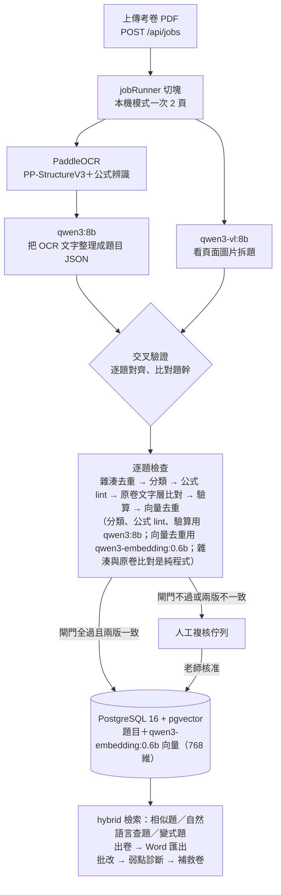

# tutor-exam-bank · 家教專用數理題庫系統（多 Agent × RAG）

[](https://github.com/Tom-Yang-Ben/tutor-exam-bank/actions/workflows/ci.yml)

## 📌 現在是什麼

〔2026-09-26〕高中數理家教（作者本人）自用的出題與教學系統，一人開發，可執行的本體在 [`exam_pro/`](./exam_pro)。由四塊組成：

- **題庫**：數學、物理（化學已接上管線，品質還沒量測）；章節白名單對齊 108 課綱龍騰版目錄。題目與學生資料只存在本機的 PostgreSQL。
- **多代理 PDF 拆題管線**：上傳考卷 PDF → 程式碼寫的狀態機逐題推進（拆題、分類、公式檢查、原卷文字層比對、獨立驗算、兩段去重），節點之間是伺服器端硬閘門。合格的題入庫，有疑慮的題附上機器寫的原因停在人工複核（部分入庫）。
- **RAG 檢索**：pgvector 向量＋jieba 全文，以 RRF 融合成同一段 SQL，服務相似題、自然語言查題、變式題的「先檢索再生成」與 kNN few-shot 分類。
- **出卷、批改與弱點診斷**：出卷時排除學生寫過的題，匯出 Word 原生方程式；批改記錯因與部分給分；依知識點掌握度（Wilson 下界）出補救卷。

**本機模式（預設，2026-09-25 起）**：全部 AI 步驟在一台 16 GB RAM、沒有獨立顯卡的筆電（Intel i5-8265U，只用 CPU）上跑，**執行期不連外、零 API 費用**。

| 工作 | 本機模式用什麼 |
|---|---|
| PDF 拆題 | PaddleOCR（PP-StructureV3＋公式辨識）與視覺模型 `qwen3-vl:8b` **各拆一次，再逐題交叉比對**；兩版不一致（或只有一版拆到）的題照樣跑完後續檢查，但一律停在人工複核（`extract_disagree`），不自動入庫 |
| 文字工作：OCR 結果整理、分類、公式 lint、驗算、出變式、助教 | `qwen3:8b`。16 GB 同時只放得下一個 8B 模型，所以拆題之後的逐題節點全用它，不必來回換載（`MODEL_TEXT`，LM-15） |
| 向量 | `qwen3-embedding:0.6b`，輸出 768 維，資料表的 `vector(768)` 不改 |
| 切回雲端 | Gemini 保留：改 `.env` 幾行即可整個切回，也可以只切某一個節點 |

代價：CPU 上很慢（一份考卷粗估要數小時，尚未實測）、品質預期低於 Gemini（已重錄的 classify 與 nlq 中，classify 的 accuracy 與 macro-F1、nlq LLM 輔路徑的 filters_exact 與 recall@10 都未達門檻，nlq 規則路徑全數達標；見[怎麼驗證品質](#-怎麼驗證品質)）、語音提問關閉、AI 家教不做程式驗算。CI 不裝任何模型，只讀錄好的回放檔（cassette）。



> **分支狀態**：階段 5（教學診斷平台）已於 2026-09-25 併入 main（PR #38）；章節重整與本機模式在 `local/integration` 分支，尚未併入 main。
> 本機模式的契約、裁決（LM-1～LM-16）與使用說明：[`docs/local-mode.md`](./docs/local-mode.md)；決策紀錄：[ADR-017](./engineering_docs/03_architecture/adr/ADR-017-local-first-inference.md)；架構與取捨：[`sad.md` §7.1](./engineering_docs/03_architecture/sad.md#71-本機模式預設的部署視圖與取捨)。

本儲存庫保留完整的開發歷程：早期原型（`exam/`）、重構後的系統本體與各階段的演進（`exam_pro/`），以及全部設計文件與決策紀錄（`docs/`、`engineering_docs/`）。階段 5「教學診斷平台」（錯因診斷、知識點、補救卷、化學、AI 家教）的功能與旗標見[下方專節](#階段-5教學診斷平台功能旗標與給老師的快速開始)。

> ⚖️ 本儲存庫為作者的個人工具與技術作品集：**保留所有權利，僅供瀏覽與技術評估，不授權使用**（見 [`LICENSE`](./LICENSE)）。儲存庫不含任何題庫或考卷內容，示範題與 eval 素材均為作者自行編寫（見 [`NOTICE`](./NOTICE)）。

---

## 🖥️ 操作介面


---

## 🎯 問題背景與設計目標

**使用者**：一對一數理家教老師（高中數學／物理），手上有大量歷屆考卷 PDF，需要為每位學生客製特訓卷。

**痛點**：出卷的行政損耗遠大於教學本身。複雜公式（直式分數、根式、幾何圖）在 Word 手動排版容易跑位；題目散在各份考卷裡，哪個學生寫過哪題無從追蹤，重複出題傷害練習效果。一份特訓卷常花 **2 小時以上**。

**目標**：出一份卷從 2 小時縮短到幾分鐘，把心力留給一對一指導本身。

**第二個目標（階段 2 起）**：在同一個實際運作的產品上，將**多 Agent 協作**與 **RAG 檢索**落實為可檢視、可量測、可逐行驗證的工程實作。本 README 的兩章技術選型即為此目標的完整說明。

**關鍵約束**：

- 交付物必須是 **Word 原生方程式**的 `.docx`——學生端用紙本，公式得是直式分數而非斜線，因此自製 LaTeX → OOXML 轉換而非貼圖。
- AI 拆題的輸出格式必須可控（章節名、LaTeX 語法不能自由發揮），以白名單驗證收斂。
- AI 呼叫需限流以控制成本。

**成功標準**：上傳 PDF → 自動拆題入庫 → 選學生一鍵組卷 → 匯出可直接列印的 Word，全程零手動排版；同一學生保證不會拿到寫過的題目。

---

## 📈 系統演進：原型 → 四個階段

| 階段 | 主題 | 內容 | 狀態 |
|---|---|---|---|
| 原型 | `exam/` | 單檔 `server.js` 驗證「AI 拆題＋組卷＋匯出」核心流程 | ARCHIVED（保留當重構對照） |
| 重構 | `exam_pro/` v1 | MVC 分層、白名單硬驗證、LaTeX→OOXML 公式引擎、防 SSRF、限流、交易 | ✅ |
| 階段 1 資料層 | MySQL → **PostgreSQL 16 + pgvector** | `students`/`attempts` 正規化、embedding 回填、hybrid 檢索、eval 體系與 CI integration job；2026-08-21 切換上線 | ✅ |
| 階段 2 Agent 管線 | `jobs` 狀態機 + 六個 sub-agent | 拆題／分類／公式修復／獨立驗答／兩段去重，硬閘門、重試預算、**部分入庫**、人工複核佇列、cassette record/replay | ✅ |
| 階段 3 產品面（RAG 三落點） | 相似題、變式題生成、學生弱點面板、自然語言查題 | 檢索優先、九道閘門、kNN few-shot 分類、四級回退階梯 | ✅ |
| 階段 4 產品收斂 | 日常流程矯正＋主控 agent | 選學生出卷（草稿→確認）、批改輕量化、學生管理、**對話式助教**（主控 LLM 調度五個只讀工具） | ✅ |
| 階段 5 教學診斷平台〔修訂 2026-09-24〕 | 從出卷工具到診斷與教學（DEC-014～019） | 批改記錯因與部分給分、學生檔案、文字詳解與 Word 詳解版；**化學**入庫（卷別分流，數學／物理 cassette 一個都不重錄）；**知識點**與口語版；依弱點出**補救卷**、跨章配額、題庫覆蓋率；**AI 家教**（code execution 驗算）與按住說話 | ✅ 2026-09-25 併入 main（PR #38）〔修訂 2026-09-26〕 |
| 章節重整〔2026-09-25〕 | 白名單對齊 108 課綱龍騰版 | 數學 34→52 章、物理 32→34 章；舊題以「規則提議＋老師確認」搬章；數學／物理 cassette 刻意失效、一次重錄（ADR-016、[`docs/chapter-restructure.md`](./docs/chapter-restructure.md)） | `local/integration`，未併入 main |
| 本機模式〔2026-09-25〕 | 全部推論改到本機、執行期不連外 | Ollama（Qwen3 系列）＋PaddleOCR；拆題 OCR／視覺雙路交叉驗證；前端資產離線化；Gemini 保留可切回；CI 照舊 replay（ADR-017、[`docs/local-mode.md`](./docs/local-mode.md)） | `local/integration`，未併入 main；本機模型的回放檔尚未進版控 |

四個階段由四條平行 workstream（git worktree）同步施工，以「介面凍結＋裁決」制度整合：介面於開工前凍結為契約，開發期間的疑義以編號裁決回覆並記入文件。全部裁決見 [`docs/interfaces*.md`](./docs)，交接紀錄見 [`docs/HANDOFF.md`](./docs/HANDOFF.md)。階段 5 沿用同一制度，由五條程式 workstream 與三組知識點內容平行施工（契約 [`docs/interfaces-stage5.md`](./docs/interfaces-stage5.md)，裁決 S5-1～S5-39）〔修訂 2026-09-24〕。

---

## 🗂 資料夾與檔案地圖（完整版）

### repo 根目錄

| 位置 | 內容 |
|---|---|
| **[`exam_pro/`](./exam_pro)** | 🌟 **主要成品**——可執行的系統本體（下表展開） |
| [`exam/`](./exam) | 早期原型（ARCHIVED）：單檔 `server.js`，保留當重構前後對照與 A-T16 基準 |
| [`docs/`](./docs) | 全部設計文件：規劃、凍結介面與裁決、技術選型、交接檔；已結案的協調文件歸檔於 `docs/archive/`（下表展開） |
| [`screenshots/`](./screenshots) | README 用截圖 |
| [`.github/workflows/ci.yml`](./.github/workflows/ci.yml) | CI：unit（Node 22/24 矩陣）＋ integration（起 pgvector service → migrations → 整合測試 → e2e → 五個 eval suite） |
| [`LICENSE`](./LICENSE) / [`NOTICE`](./NOTICE) | 版權所有、僅供瀏覽評估（不授權使用）／題目內容權利聲明 |

### `exam_pro/`（系統本體）

```
exam_pro/
├─ server.js / app.js         # 進入點／Express 設定（CORS、旗標注入、全域錯誤中樞）
├─ routes/index.js            # API 路由表（核心區 + 各階段 append-only 區塊，旗標控制掛載）
│
├─ config/                    # 單一真相們
│   ├─ db.js                  #   PG 連線池（只認 DATABASE_URL；型別轉換集中於此）
│   ├─ models.js              #   模型 ID 單一真相（MODEL_EXTRACT/VERIFY/TEXT/VARIANT/ASSISTANT…；`gemini:`／`ollama:` 前綴選供應商）
│   ├─ pricing.js             #   每模型單價（官方頁面查證）與成本估算（thinking 同價計；ollama 一律 0）
│   ├─ features.js            #   FEATURE_* 旗標（預設全關；掛載與渲染的總開關）
│   ├─ chapters.js            #   章節白名單 + 驗證（prompt 不是保證，這裡才是）；階段 5 起三科、LEGACY_*（餵既有 LLM 的兩科）
│   ├─ chemistryChapters.js / errorTypes.js / studentProfile.js  # 階段 5：化學 44 章、錯因白名單、學生檔案選項
│   ├─ kc/                    #   階段 5：知識點種子檔（數學／物理／化學 .json，AI 草擬待審）
│   └─ chapterAliases.js / chapterExamples.js  # NLQ 別名、分類 few-shot 素材
│
├─ agents/                    # 六個 sub-agent（純函式合約：不碰 DB、不讀 env、依賴 ctx 注入）
│   ├─ extract.js             #   PDF 拆題（Gemini：flash 直接讀 PDF；本機：OCR 版＋視覺版各拆一次）
│   ├─ extractCrossCheck.js   #   本機拆題的交叉驗證（逐題對齊、題幹相似度、選版；純函式）
│   ├─ classify.js            #   章節分類（零成本閘門 → kNN 投票短路 → 才叫 LLM）
│   ├─ lint.js                #   公式修復
│   ├─ verify.js              #   獨立解題驗證（Gemini：pro，與拆題不同模型；本機：qwen3:8b）
│   ├─ dedup.js (dedup0/1)    #   兩段去重：正規化雜湊 → 向量餘弦
│   ├─ generateVariant.js     #   變式生成（藍本＋5 鄰居錨點；跑題餘弦閘門）
│   ├─ tagKc.js               #   階段 5：知識點自動標註（agent kc_tag）；各 agent 另有化學分支 *_chem
│   └─ schemas/               #   各 agent 輸出的 JSON Schema（ajv 硬驗證）
│
├─ workers/jobRunner.js       # 編排者＝程式碼：認領（SKIP LOCKED＋租約）、重試預算、RPM 節流、成本上限
├─ pipeline/stateMachine.js   # jobs / job_questions 兩張狀態表的合法轉移
│
├─ services/                  # 業務邏輯
│   ├─ llm/                   #   LLM 唯一出入口：gemini／ollama（本機）／fake(replay)／throttle；record/replay cassette
│   ├─ ocr/                   #   本機 OCR 出入口：呼叫 ocr_service/ocr_pdf.py，同樣走 record/replay（CI 不需要 Python）
│   ├─ retrievalService.js    #   相似題（hybrid 檢索）
│   ├─ nlqService.js          #   自然語言查題（規則主、LLM 輔、四級回退）
│   ├─ variantService.js      #   變式題（檢索優先，池不足才生成）
│   ├─ weaknessService.js     #   弱點面板五條 SQL（純函式）
│   ├─ assistantService.js    #   對話式助教：主控 agent + 五個只讀工具（階段 4）
│   ├─ embedService.js        #   embedding 寫入
│   ├─ figureService.js       #   附圖裁切（extract bbox → mupdf 渲染＋sharp 裁圖；詳 docs/figures.md）
│   ├─ kcService.js / kcTagService.js / kcWeaknessService.js      # 階段 5：知識點、自動標註、知識點弱點
│   ├─ remedialService.js / coverageService.js                    # 階段 5：補救卷、題庫覆蓋率
│   ├─ tutorService.js / voiceService.js                          # 階段 5：AI 家教、語音轉寫（llm/ 新增 generateText）
│   └─ wordService.js / aiService.js  # Word 匯出（防 SSRF）／舊版單呼叫拆題（保留對照）
│
├─ controllers/               # HTTP 薄殼：question / exam（草稿→確認）/ studentAdmin / student /
│                             # paper（批改）/ review（複核佇列）/ job / assistant / word / ai；階段 5：kc / remedial / tutor
├─ middleware/                # x-api-key（timing-safe）、記憶體限流
├─ queries/hybrid.js          # hybrid 檢索 SQL（RRF 融合）——API 與 eval 共用同一段
│
├─ utils/                     # 純函式工具
│   ├─ textFormatter.js       #   LaTeX → OOXML 解析器（自製 tokenizer+遞迴下降）
│   ├─ tokenize.js            #   全案唯一中文分詞（jieba + 章節自訂詞）
│   ├─ embedText.js           #   送 embed 的文本組法（單一真相）
│   ├─ shuffle.js / pickOnePerFamily.js  # Fisher-Yates／組卷家族互斥
│   ├─ normalizeStem.js / answerCompare.js / variantTextGate.js / nlqHeuristics.js
│   └─ formulaFix.js / formulaLint.js / questionValidation.js
│
├─ public/                    # 前端（無打包器）
│   ├─ index.html             #   單頁殼＋題庫/組卷 inline script＋hash 路由視圖（階段 5 起 7 個；分頁錨點折入視圖）
│   └─ js/                    #   ES modules：review / students / nlq / variants / assistant；階段 5：kc / remedial / tutor
│
├─ migrations/ + migrate.js   # 只增不改的 SQL（0001 init → 0015 extract_disagree）＋極簡執行器
├─ eval/                      # 量測體系
│   ├─ run.js                 #   五個 suite：retrieval / classify / pipeline / nlq / variant
│   ├─ lib/                   #   指標、golden loader、pg engine、pipeline driver、門檻 ratchet
│   ├─ golden/                #   人工定案的答案卷（自製內容）
│   ├─ cassettes/             #   LLM 回應錄放帶（只存摘要與雜湊，不存 PDF 原文）
│   ├─ fixtures/              #   60 題自製 fixture、樣卷 PDF、embedding 向量
│   └─ thresholds.json        #   門檻（首測 −0.03、只升不降）
│
├─ test/                      # 項數為 2026-09-26 在 local/integration 實跑，是 7b7065c 當時的數字（合併後由整合者更新）〔整合 2026-09-26〕延後到錯題重練合入後統一更新，見「技術棧」的測試列
│   ├─ unit/                  #   2,716 項：不連網、不連庫、零 secrets
│   ├─ integration/           #   503 項：對 tmpfs 測試庫（_test 後綴強制）
│   └─ e2e/                   #   11 項：HTTP 全路徑（上傳→部分入庫；組卷→Word 公式）
│
├─ ocr_service/               # 本機 OCR（Python）：ocr_pdf.py（PP-StructureV3）、requirements.txt（版本全部釘死）
├─ scripts/                   # 維運：備份、向量回填、成本報表、公式健檢；windows/ 本機模式一鍵安裝與重錄
├─ docs/                      # README 介面截圖（題目為自編示範內容，不含真實考卷）
├─ seed_questions.js          # 30 題自製種子（4 章 × 7~8 題，含單章密度自檢）
├─ docker-compose.yml         # PG16+pgvector：5442 開發（volume）／5433 測試（tmpfs）
└─ *.bat                      # Windows 雙擊工具（啟動資料庫／備份／公式健檢…）
```

### `docs/`（設計文件）

| 檔案 | 內容 |
|---|---|
| [`roadmap-plan.md`](./docs/roadmap-plan.md) | 六章總規劃：排程、資料層、Agent 管線、產品面、橫切、階段 4 產品收斂（作法／理由／替代方案／驗收；§6 含 S4-1～S4-4 與對話式助教） |
| [`interfaces-stage1.md`](./docs/interfaces-stage1.md) ／ [`-stage2`](./docs/interfaces-stage2.md) ／ [`-stage3`](./docs/interfaces-stage3.md) | 三份**凍結介面**與全部裁決（階段 1 裁決 1–27、S2-1～30、S3-1～R29）——平行開發的契約 |
| [`rag-and-agents.md`](./docs/rag-and-agents.md) | RAG 與多 Agent 技術決策全紀錄（本 README 技術選型章的完整版） |
| [`variants.md`](./docs/variants.md) ／ [`retrieval.md`](./docs/retrieval.md) ／ [`llm.md`](./docs/llm.md) ／ [`formulas.md`](./docs/formulas.md) | 變式題九道閘門與閾值校準／檢索設計／LLM 層 |
| [`HANDOFF.md`](./docs/HANDOFF.md) | 交接檔：角色、狀態、標準流程、踩過的坑；階段 5 交接〔修訂 2026-09-24〕 |
| [`local-mode.md`](./docs/local-mode.md)〔2026-09-25〕 | 本機模式的凍結契約、裁決 LM-1～LM-16 與給 Owner 的使用說明（安裝、`.env`、切回 Gemini、速度與品質、疑難排解） |
| [`chapter-restructure.md`](./docs/chapter-restructure.md)〔2026-09-25〕 | 數學／物理章節重整的契約、裁決 CR-1～~~CR-8~~ CR-9〔整合 2026-09-26〕與舊題搬章步驟 |
| [`interfaces-stage5.md`](./docs/interfaces-stage5.md)〔修訂 2026-09-24〕 | 階段 5 凍結介面與裁決 S5-1～S5-39 |
| [`grading-and-profile.md`](./docs/grading-and-profile.md) ／ [`chemistry.md`](./docs/chemistry.md) ／ [`knowledge-components.md`](./docs/knowledge-components.md) ／ [`remedial.md`](./docs/remedial.md) ／ [`tutor.md`](./docs/tutor.md)〔修訂 2026-09-24〕 | 階段 5 五份功能文件（API、設計取捨、給老師的操作說明）；知識點內容抽查紀錄 `kc-review-*.md` |
| [`archive/`](./docs/archive) | 已結案的歷史紀錄：`cutover-runbook.md`（MySQL→PG 切換之夜，2026-08-21 已執行）、`stage*-parallel-prompts.md` ／ `questions*-ws*.md`（四條平行 workstream 的分工提示詞與提問裁決）——**多人（多 agent）協作制度的完整紀錄**，索引見該資料夾 README |

---

## 🔄 兩個子專案的關係

```
exam/  ──（重構）──▶  exam_pro/
原型：邏輯全在              企業級版：MVC 分層、
單一 server.js            白名單驗證、API 認證、
                         防 SSRF、LaTeX→Word 公式引擎
```

- **`exam`**：最初的可運作原型，驗證「AI 拆題 + 組卷 + 匯出」的核心流程。
- **`exam_pro`**：以 `exam` 為基礎重構，拆分為 `config / controllers / services / middleware / routes / utils`，並補強安全性與正確性。**若要實際執行，請使用 `exam_pro`。**

---

## 🔍 技術選型 ①：RAG——採用的技術、選型理由與替代方案評估

> 詳細版本（含檔案對照與延伸問答）見 [`docs/rag-and-agents.md`](./docs/rag-and-agents.md)。本節為可獨立閱讀的摘要；所有數據均出自 `eval/` 的實際量測。

### RAG 的落點：四個功能、同一個檢索層

檢索層為單一 SQL 模組（`exam_pro/queries/hybrid.js`），由以下四個功能共用：

| 落點 | 檢索內容 | 用途 |
|---|---|---|
| **相似題** | 與指定題目同科、餘弦相似度最高的題目 | 不經生成，檢索結果即為產品功能（錯題 →「找相似」） |
| **變式題的檢索優先策略** | 先於題庫檢索相似度 ≥ 0.80 的同難度題目，數量足夠即直接推薦，不產生生成費用；不足時才進入生成，並以藍本與前 5 題鄰居作為 prompt 錨點；生成後再以相似度 ≥ 0.90 驗證是否偏離原題主題 | 生成結果貼近題庫風格，多數請求無 LLM 費用 |
| **檢索式 few-shot 分類** | 自題庫取 k=8 最近鄰作為分類範例；最近 5 鄰中有 4 題以上為人工確認的同一章節、且最近鄰相似度 ≥ 0.90 時，直接採用該結果而不呼叫 LLM | 分類範例隨題庫成長更新；高信心情境以檢索取代 LLM 呼叫 |
| **自然語言查題** | 規則層先解析章節、難度、學生等條件，餘下的概念文字經 embedding 進入 hybrid 檢索；設有四級回退階梯 | 將口語查詢轉為結構化查詢；解析結果回寫至篩選介面，供使用者檢視與修正 |

### 採用的技術

PostgreSQL 16 + pgvector（`gemini-embedding-001`，768 維，L2 正規化後餘弦相似度等值於內積）；全文檢索於應用層以 jieba 分詞建立；兩路結果以 **RRF（Reciprocal Rank Fusion，k=60）** 融合。

〔2026-09-26〕本機模式改用 `qwen3-embedding:0.6b`，以自訂維度輸出同樣的 768 維，資料表與 SQL 都不改；換模型後全部題目要重算向量（`embed:backfill`）。本節下方的數字是 `gemini-embedding-001` 時期（2026-08）的量測，本機向量的量測見[怎麼驗證品質](#-怎麼驗證品質)。

### 選型理由

1. **資料規模**：題庫為數百至數千題。此規模下 pgvector 的精確搜尋已足夠快，尚無建立 ANN 索引的必要。
2. **關聯條件與向量檢索必須位於同一查詢**（本選型的決定性因素）。「排除該學生已作答的題目（`NOT EXISTS attempts`）」「排除同一變式家族」「限定難度」「排除已封存」皆為關聯式條件。向量庫若為獨立服務，須先超額撈取再於應用層過濾，並維護兩份需同步的資料；置於同一個 PostgreSQL 中，單一查詢即可完成，且自然取得交易一致性。
3. **hybrid 的效益經量測驗證**：Recall@5 由純 `LIKE` 的 0.875 提升至 1.000。向量側可召回「僅數值不同的同型題」，全文側可精確匹配專有名詞與符號，兩者互補。
4. **RRF 無需分數校準**：餘弦相似度與全文檢索排名分數的量綱不可直接比較，加權融合須先正規化再調整權重；RRF 僅依名次融合，對分數分佈不敏感。
5. **維運前提**：本專案由單人維護，不引入額外服務。PostgreSQL 為既有相依，向量能力僅需啟用 extension。

### 已知限制

- **規模上限**：向量數達千萬級時需建立 HNSW／IVFFlat 索引並調參；更大規模應重新評估專用向量庫。
- **RRF 對強信號的稀釋**：實測 MRR 純向量為 0.9575，高於 hybrid 的 0.824——名次融合使正確結果偶爾自第 1 名移至第 2–3 名。本系統的使用情境（出卷前產生候選清單、由使用者挑選）以 recall 為優先，此代價可接受；若情境改為僅取第一名，此決策應重新評估。
- **中文分詞位於應用層**：PostgreSQL 缺乏成熟的內建中文分詞，`zhparser`／`pg_jieba` 為 C extension，於 Windows／Docker 環境維運成本高。代價是更換分詞器時全文索引須整批重建，因此 `utils/tokenize.js` 被凍結為全案唯一分詞器。
- **embedding 模型升級**需重灌全部向量欄位並重錄 cassette（`scripts/backfill_embeddings.js` 即為此準備）。cassette 鍵包含模型 ID 為刻意設計，避免以舊模型量測的數據混入報表。

### 替代方案評估

| 方案 | 優勢 | 限制 | 未採用的原因 |
|---|---|---|---|
| **專用向量庫**（Pinecone／Milvus／Qdrant／Weaviate） | 支撐億級向量、ANN 成熟、可託管 | 增加一項服務或訂閱成本；關聯過濾依賴 metadata filter 或超額撈取；與 PostgreSQL 形成兩份需同步的資料 | 資料規模相差三個數量級；「排除已作答題目」等 join 條件為核心需求，分離儲存顯著增加複雜度 |
| **FAISS／記憶體內索引** | 速度最快、無外部服務 | 無持久化、無過濾語意、行程重啟需重建、與資料庫脫節 | 單人專案要求開機即用；過濾需求同上 |
| **Elasticsearch／OpenSearch** | 全文檢索能力最強、亦支援 kNN | JVM 資源需求高、維運負擔重、中文仍需另裝分詞插件 | 引入成本與本專案的全文檢索需求不成比例 |
| **純向量檢索** | 架構較簡 | 專有名詞與符號的精確匹配易有遺漏 | 量測顯示 hybrid 的 recall 較佳（0.97 → 1.000），而增加一路 SQL 的成本極低 |
| **Cross-encoder 重排** | 精度上限更高 | 每組 query-document 需一次模型呼叫，增加延遲與費用 | Recall@5 已達 1.000，重排無改善空間；檢索層為獨立 SQL 模組，規模擴大時可直接加入 |
| **微調（fine-tuning）** | 知識內化、推論時無需檢索 | 訓練資料量不足；新增題目需重訓；無法解釋推薦依據 | 題庫持續成長，RAG 使新題入庫後立即可檢索，且回傳相似度與命中來源，具可解釋性 |
| **LangChain／LlamaIndex 的 retriever 抽象** | 上手快、組件可替換 | 抽象層遮蔽 SQL 與錯誤細節；版本演進快；行為難以被測試固定 | 專案原則為「協調層是程式碼」：同一段 SQL 同時服務 API 與 eval，其行為可被 CI 固定 |

### 量測結果（`npm run eval -- --suite retrieval`；golden 40 筆，人工定案；`gemini-embedding-001`，2026-08）

| 指標 | LIKE（改造前基準） | 純向量 | hybrid（RRF） |
|---|---:|---:|---:|
| Recall@5 | 0.875 | 0.97 | **1.000** |
| Recall@10 | 0.92 | 0.97 | **1.000** |
| MRR | 0.738 | **0.9575** | 0.824 |

NLQ（50 句 golden）：規則路徑 coverage 0.84、filters_exact 1.000、recall@10 1.000；LLM 路徑 filters_exact 0.75、recall@10 0.875。門檻取首次量測值減 0.03 寫入 `eval/thresholds.json`，此後僅升不降（ratchet）；任何改動使指標低於門檻時 CI 即失敗。

---

## 🤖 技術選型 ②：多 Agent 協作——採用的架構、設計理由與替代方案評估

### 改造前的狀態（本儲存庫的實際歷史版本）

改造前的拆題功能為單一大型 prompt 處理整份 PDF：無 schema 驗證、無重試機制，`JSON.parse` 成功即回傳——曾實際發生單一題目格式錯誤導致整批請求以 400 失敗的事故。章節白名單在 prompt 與程式中各維護一份，兩處逐漸不一致；答案由拆題模型自行抄錄，抄錄錯誤時缺乏第二來源可供比對。

### 採用的架構：程式碼編排的管線式多 Agent

```
POST /api/jobs (PDF)
   ▼
jobs 狀態機（PostgreSQL）：queued → extracting → processing → done/failed
每題一列 job_questions：extracted → hashed → classified → linted → verified → deduped
                        → saved ／ needs_review ／ rejected
   ▲ 認領：FOR UPDATE SKIP LOCKED + 租約（可斷點續跑）；各節點設逾時、退避重試、RPM 節流、成本上限
workers/jobRunner.js
   ├─ extract   拆題（flash，成本較低的模型）
   ├─ classify  章節分類（零成本閘門 → kNN 投票短路 → 必要時才呼叫 LLM）
   ├─ lint      公式修復
   ├─ verify    獨立解題驗證（pro，與拆題不同的模型）
   └─ dedup     兩段去重（正規化雜湊 → 向量相似度）
   ▼ 節點之間均為伺服器端硬閘門（ajv schema、白名單、正規化、答案比對）
未通過 → 逐題重試（將機器產生的 feedback 併回 prompt）→ 預算用盡 → needs_review（八種原因之一）
結果：部分入庫——一批 90 題中若 3 題有疑慮，其餘 87 題照常入庫，3 題附具體原因進入人工複核佇列
```

〔2026-09-26〕上圖的模型分工是 Gemini 時期。本機模式下 extract 改為 OCR 版與視覺版各拆一次、交叉比對（見[頂部的圖](#-現在是什麼)），classify／lint／verify 都用 `qwen3:8b`。拆題與驗算仍是不同步驟、不同輸入（抄題 vs. 重新解題），但不再是「兩個不同等級的雲端模型互相制衡」；分類與驗算也變成同一個模型（LM-15 的代價）。狀態機、閘門、部分入庫與複核的設計不變。

每個 agent 均為純函式合約：不存取資料庫、不讀取環境變數、LLM 呼叫僅透過注入的 `ctx.llm`、輸出以 JSON Schema 驗證。此合約使單元測試無需 mock 資料庫、cassette 回放鍵可重現，且更換編排方式時無需修改 agent 本身。

### 設計理由

1. **prompt 不構成保證，伺服器端驗證才是**：每道閘門均為一般程式碼，其行為由 1,613 項單元測試固定。
2. **將不確定性限制在單一步驟內**：流程（節點順序、重試、預算、逾時）為確定性狀態機——可重跑、可觀測（`job_events` 逐步記錄，含成本），租約到期後由其他 worker 接手續跑。
3. **協作的形式是相互驗證，而非模型間的自由對話**：verify 節點以不同模型獨立重解題目並比對答案——單一模型抄錯答案時，錯誤內容往往格式正確、無從自行察覺；kNN 投票僅採計人工確認的標籤——若允許自動產生的標籤參與投票，錯誤分類將經由迴圈自我強化。
4. **成本控制內建於架構**：閘門依成本由低至高排序（文字比對 → embedding → LLM）；檢索命中即不進入生成；kNN 信心足夠時跳過 LLM 呼叫；模型路由（拆題用 flash、驗答用 pro）；並輔以單一 job 與每日成本上限、逐 token 計費紀錄。
5. **可測試性**：CI 以 record/replay cassette 在零費用、零網路的條件下確定性地重播完整管線；replay miss 於 main 分支視為錯誤。

### 已知限制

- 前期建置成本高：狀態機、閘門、eval 基礎設施皆為手寫，初期投入高於採用現成框架。
- 擴充彈性較低：新增節點需同步修改 DDL 的 CHECK 約束、契約、閘門與測試。
- 題目依節點順序逐步推進，吞吐量依賴 job 並行數；處理量增加十倍以上時，PostgreSQL 佇列方案應重新評估。
- 更換模型需重錄全部 cassette（cassette 鍵包含模型 ID，為刻意設計）。

### 替代方案評估

| 方案 | 優勢 | 限制 | 未採用的原因 |
|---|---|---|---|
| **單一大型 prompt**（改造前） | 實作最簡、單次呼叫 | 無部分成功、錯誤無法歸因至個別步驟、無法做模型路由、受 context 上限約束；曾實際造成整批失敗 | 此即本次改造要解決的問題 |
| **以 LLM 擔任編排者**（自主代理迴圈） | 彈性高，可處理未預先設計的流程 | 控制流不確定、難以測試；成本無上界；失敗情境不可重現 | 拆題流程已知且固定，無需以不確定性換取彈性（流程未知的情境見下方「對話式助教」） |
| **框架**（LangChain／LangGraph／CrewAI／AutoGen） | 上手快、生態系完整；LangGraph 亦提供圖狀態機 | 抽象層遮蔽 prompt 與錯誤細節；版本演進快；圖狀態需另行持久化方能斷點續跑；行為難以被測試固定 | 自行實作的狀態機以 PostgreSQL 為後盾，持久化與並行認領（`FOR UPDATE SKIP LOCKED`）為原生能力；輕量的自有 LLM 層則是 cassette replay CI 的前提 |
| **專用佇列**（BullMQ + Redis／Celery／Kafka） | 吞吐與重試機制成熟 | 需維運額外的 broker；與業務資料分屬不同交易 | 單人 Windows 環境；`FOR UPDATE SKIP LOCKED` 為同規模的標準解法，且認領與寫回同屬一個交易 |
| **多模型辯論／委員會** | 可進一步提升精度 | 成本隨模型數倍增 | 僅於價值最高的環節（答案驗證）採用雙模型比對，其餘以確定性閘門把關，成本效益較佳 |
| **雲端託管 agent 平台** | 免維運 | 題庫屬私有資產，不宜外流至第三方平台；存在平台綁定 | 資料與驗證邏輯保留於本地，僅 LLM 呼叫對外（本機模式下連 LLM 呼叫也不對外） |

### 兩種編排模式並存：對話式助教（階段 4）

前述架構的立場是「流程已知時，編排交由程式碼」。階段 4 補上對照案例——**對話式助教**（`services/assistantService.js`）：使用者問題的形態無法預先設計（「小明最弱的章節為何」「為小華預覽一張考卷」），此處編排交由主控 LLM，由其自行決定呼叫哪個工具、呼叫幾次、何時作結（ReAct 迴圈），工具調用軌跡完整呈現於介面。

| | 拆題管線 | 對話式助教 |
|---|---|---|
| 流程 | 已知且固定 | 未知，由問題決定 |
| 編排者 | 程式碼狀態機 | 主控 LLM |
| 每步輸出 | 各 agent 的 JSON Schema | 受限 JSON `{action, tool, args_json, reply}` |
| 寫入權限 | 有（通過閘門後寫入、部分入庫） | 無——五個工具均為唯讀；出卷僅能以 dry-run 預覽，實際出卷仍由使用者確認 |
| 失敗語意 | 重試預算用盡 → needs_review | 工具錯誤回饋給主控自行修正；達步數上限即截斷 |

三項實作決策：

1. **不採用供應商原生 function calling**——以 responseJsonSchema 約束的決策迴圈實作工具調用，使 record/replay、節流與未來的跨供應商 adapter 均可直接沿用；原生 function calling 則綁定單一供應商的請求格式。
2. **參數以 `args_json` 字串傳遞**——實測 Gemini 的 structured output 對未定義 properties 的自由物件會回傳空物件，故參數改以 JSON 字串傳遞，由伺服器端解析並逐一驗證。
3. **「空結果亦為答案」明訂於系統提示**——初版主控會將步數配額耗費於同義詞重試；明訂「至多換一次措辭，仍為空即如實回報」後行為即符合預期。三項底線與全案一致：受限 JSON、工具唯讀、執行前伺服器端驗證。

### 量測結果（Agent 側；replay 對 golden；Gemini 時期，2026-08-24，章節重整前）

本機模型的量測現況見[怎麼驗證品質](#-怎麼驗證品質)。

| 指標 | 數值 | 門檻（ratchet） |
|---|---:|---:|
| pipeline saved_rate（部分入庫成功率） | 0.90 | ≥0.87 |
| pipeline gate_pass_rate | 1.00 | ≥0.97 |
| answer_agree_rate（雙模型驗答一致率） | 0.90 | ≥0.87 |
| classify accuracy / macro-F1 | 0.9000 / 0.9256 | 已建立 |
| variant retrieved_coverage / gate_pass_rate | 0.8667 / 0.25 | ≥0.8367 / ≥0.22 |

> 變式的 gate_pass_rate 為 0.25，其背景值得說明：偏題閾值最初以既有題目的配對校準為 0.92；第一次實際錄製後發現，校準所用的正樣本（僅替換數值的題目配對）正是文字閘門（裁決 S3-R8）設計上要退回的類型——兩道閘門對「合格」的定義相互矛盾。其後依實測分佈將閾值下修為 0.90 並重新錄製（裁決 S3-R29）。此例說明量測體系的價值：**判準本身有誤時能夠被觀察到**，而非僅產出表面良好的數據。

---

## 🧭 設計決策（為什麼這樣做）

以下三個決策決定了專案的形狀。共同主線是：**先確認這個系統的硬約束是什麼，再看現成工具剛好不滿足哪一條。**

### 1️⃣ 為什麼自己刻 LaTeX → OOXML，而不用 pandoc？

pandoc 是文件轉換的業界標準，一行指令就能把 LaTeX 轉成 `.docx`。本專案仍在 [`exam_pro/utils/textFormatter.js`](./exam_pro/utils/textFormatter.js) 自製了 tokenizer + 遞迴下降解析器，理由是：

- **輸入不是一份 LaTeX 文件**。資料是 DB 裡一列列的題目，內容為「中文敘述混雜行內 `$...$` 片段」；`buildParagraphComponents` / `renderMixedInto` 處理的正是中英數混排，而 pandoc 的單位是整份文件。
- **交付物需要程式化組裝**。[`wordService.js`](./exam_pro/services/wordService.js) 要控制標題階層、藍色題號、`★` 難度、換頁、答案區紅字與遠端圖片插入——這些由 `docx` 的物件模型逐段建構，交給 pandoc 產檔後就無法再回頭插入。
- **pandoc 是外部二進位相依**。Node 伺服器需每次請求 `spawn` 一次，部署環境還得額外安裝執行檔；現行方案零外部相依。
- **中介方案試過並淘汰**。原型 `exam/server.js` 走 `temml`：LaTeX → MathML → 以字串包上 `<m:oMathPara>` 命名空間灌進 `MathXml`，本質是「MathML 標籤穿 OOXML 外衣」，Word 不保證接受。重構版改為直接建構 `docx` 原生數學物件（`MathFraction`、`MathRadical`、`MathSum`、`MathSubSuperScript` …），產出**可用 Word 方程式編輯器開啟編輯的真・直式分數**，正對應本專案的核心約束。
- **輸入域是受控的**。AI prompt 已將可用語法限縮為高中數理子集，因此無須覆蓋完整 LaTeX；未知指令會退化為純文字（`parseCommand` 末段），單一公式失敗不會導致整份考卷打包失敗。

> **權衡**：pandoc 的 LaTeX 覆蓋率遠勝本解析器。此處換得的是「部署零相依 + 版面完全可控 + 失敗可局部降級」，代價是僅支援語法子集。

### 2️⃣ 為什麼 AI 輸出要做白名單約束？

Gemini 已回傳 JSON，為何不直接入庫？

- **LLM 輸出是自然語言，不是型別化的 API**。同一份考卷，模型可能寫 `圓方程式`、`圓的方程式` 或 `圓與直線`。章節名一旦漂移，**組卷功能即失效**——[`examController.js`](./exam_pro/controllers/examController.js) 是以 `WHERE subject = ? AND chapter = ?` 精確比對抽題的，名稱不統一等同題庫變成撈不出來的資料。
- **兩層防線，職責不同**：

  | 層 | 位置 | 性質 |
  |---|---|---|
  | 軟約束 | [`aiService.js`](./exam_pro/services/aiService.js) prompt 內列出完整章節白名單 | 是「請求」，模型可以不照做 |
  | 硬約束 | [`config/chapters.js`](./exam_pro/config/chapters.js) + `questionController.batchSaveQuestions` 逐題驗證 | 是入庫的門，不合格即擋下 |

  關鍵論點：**prompt 不是保證，只有伺服器端驗證才是。**
- **約束不只章節**。`question_type` 限五種、`difficulty` 經 `normalizeDifficulty` 收斂為 1–5 整數、LaTeX 強制 `\frac{}{}` 而非斜線——最後這條是為了餵給第 1 點的解析器，**兩個模組的約束刻意互相對齊**。
- **安全視角**：AI 輸出屬不可信輸入，且會落地為 DB 資料、再流入 XML 產生流程，不能當受信任來源處理。

> **權衡（已於階段 2 解決）**：早期版本一題不合格即整批退回；現在是**部分入庫**——合格的照樣寫入，不合格的帶著具體原因進人工複核佇列（見下方技術選型 ②）。

### 3️⃣ exam → exam_pro 重構到底改了什麼？

兩個資料夾功能相近，差異在**行為**而非目錄長相（375 行單檔 → 約 1,400 行分層）：

| 面向 | `exam`（原型） | `exam_pro`（重構版） |
|---|---|---|
| 架構 | 全部集中於 `server.js` | `app.js`/`server.js` 分離 + `config`/`controllers`/`services`/`middleware`/`routes`/`utils` |
| 公式引擎 | temml → MathML → 字串包裝的 OMML | 自製 tokenizer + 遞迴解析器 → `docx` 原生 Math 物件 |
| 靜態檔 | `express.static(__dirname)`，**整個專案目錄對外**（含 `server.js`、`schema.sql`、`.env`） | 只公開 `public/`，且 `index: false`，由路由注入前端設定 |
| 認證 | 無 | `x-api-key` + `crypto.timingSafeEqual`（防時序攻擊） |
| CORS | 無 | `ALLOWED_ORIGINS` 白名單 |
| 資料驗證 | 僅在 prompt 中要求 | 伺服器端白名單硬驗證 |
| SSRF | 直接 fetch 題目圖片 URL | `isSafeImageUrl` 阻擋 localhost／內網／保留 IP，並限 5 MB 與 content-type |
| 成本控制 | 無 | `/analyze-pdf` 每來源每分鐘 10 次限流 |
| 交易一致性 | 無 | 組卷與作答歷史更新包於 transaction，失敗全數回滾 |
| 錯誤處理 | 無 | 全域錯誤中樞；正式環境不回傳錯誤細節 |
| 其他修正 | — | 組卷日期時區（`toISOString()` 為 UTC，台灣早上 8 點前會差一天）、題庫列表分頁、`uploads` 開機清理、選擇題答案帶選項代號 |

> **最具體的一例**：原型的 `app.use(express.static(__dirname))` 會把含 `GEMINI_API_KEY` 的 `.env` 一併當靜態檔案對外提供。
> 重構的價值不在目錄變好看，而在於把一個「會外洩金鑰、AI 額度可被無限刷、章節名各寫各的」原型，變成可以真的對外部署的系統。
> （2026-09-15 起 `exam/` 的 `npm start` 改為直接拒絕啟動並印出這段說明，原型只留作對照，不再能被誤跑。）

---

## 🧰 技術棧

- **後端**：Node.js 24 · Express 5 · PostgreSQL 16 + pgvector（Docker；2026-08-21 由 MySQL 切換，runbook 見 [`docs/archive/cutover-runbook.md`](./docs/archive/cutover-runbook.md)）
- **AI（預設：本機模式）**〔修訂 2026-09-26〕：Ollama 上的 `qwen3-vl:8b`（看頁面拆題）、`qwen3:8b`（其餘文字工作）、`qwen3-embedding:0.6b`（768 維）＋ PaddleOCR 3.7（PP-StructureV3，PaddlePaddle 釘在 3.2.2），全部只用 CPU；Ollama 走 `node:http`，不新增依賴。
- **AI（可切回：Gemini）**：`@google/genai`——拆題／分類／變式 `gemini-3.5-flash`、獨立驗答 `gemini-3.1-pro-preview`、embedding `gemini-embedding-001`（768 維）；階段 5 另用 code execution（AI 家教驗算）與音訊輸入（語音轉寫），這兩項只在 Gemini 模式可用。模型 ID 單一真相在 [`exam_pro/config/models.js`](./exam_pro/config/models.js)（`vendor:model-id`）。
- **文件**：`docx`（自製 LaTeX → OOXML 數學公式轉換）
- **前端**：單頁 HTML + Tailwind + MathJax（〔修訂 2026-09-25 本機模式〕兩者與字型、GSAP 都改從本機 `/vendor/` 載入，見 `docs/local-mode.md`） + 五個 ES module 分頁（零打包器）；階段 5 另加三個 module（知識點、補救卷與覆蓋率、AI 家教），MathJax 載入 mhchem〔修訂 2026-09-24〕
- **測試／量測**：`node:test`（unit 2,716／integration 503／e2e 11，2026-09-26 於 `local/integration` 實跑，是 `7b7065c` 當時的數字，合併後由整合者更新。〔整合 2026-09-26〕全域測試數等錯題重練合入後統一更新；`dec/integration-r23`（`c65909e`）實跑：unit 2,929（2,927 過、2 略過）／integration 528／e2e 11）＋五個 eval suite（golden＋ratchet 門檻）＋ LLM 與 OCR 的 record/replay cassette——CI 全程零金鑰、零網路、零成本

---

## 🧪 怎麼驗證品質

LLM 的輸出每次都可能不同，所以品質靠三層固定下來。CI 全程不需要金鑰、不連網、不呼叫任何模型：

1. **合約層單元測試**：agent 是純函式（依賴全數注入），單元測試不連網、不連庫，clone 後 `npm test` 即可重現。
2. **record／replay cassette**：真實的模型回應只在 Owner 的電腦上錄一次，存成 cassette（鍵含模型 ID、模板版本與輸入雜湊；本機 OCR 也走同一套，鍵含 PaddleOCR 版本）。CI 以 `LLM_MODE=replay`、`EMBED_MODE=fixture` 重播，**找不到 cassette 就失敗**，不會改打模型，也不會回假資料。換模型等於換鍵、必須重錄，所以舊模型量到的數字不會混進新報表。CI 讀哪一組 cassette，由 [`ci.yml`](./.github/workflows/ci.yml) 裡明寫的模型名決定。
3. **五個 eval suite＋ratchet 門檻**：對人工定案的 golden 量指標，門檻寫在 [`exam_pro/eval/thresholds.json`](./exam_pro/eval/thresholds.json)（第一次量測 −0.03，之後只升不降），低於門檻 CI 轉紅。

| suite | 量什麼 | 門檻（`thresholds.json`） | Gemini 時期（2026-08-22～24，章節重整前） | 本機模型重錄（2026-09-25，`ollama:qwen3:8b`） |
|---|---|---|---|---|
| `retrieval` | 相似題檢索（golden 40 筆） | hybrid Recall@5 ≥ 0.97 | hybrid Recall@5 1.000（2026-08-22，`a02f7e4`） | 待補 |
| `classify` | 章節分類 | accuracy ≥ 0.87、macro-F1 ≥ 0.8956 | 0.9000／0.9256 | accuracy **0.8370**（77/92，未達）、macro-F1 **0.7419**（未達） |
| `pipeline` | 自製樣卷走完整條拆題管線 | saved_rate ≥ 0.87、gate_pass_rate ≥ 0.97、answer_agree_rate ≥ 0.87 | 0.90／1.00／0.90 | 待補 |
| `nlq` | 50 句自然語言查題（規則路徑與 LLM 輔路徑分開算） | 規則：coverage ≥ 0.81、filters_exact ≥ 0.97、recall@10 ≥ 0.97；LLM：filters_exact ≥ 0.72、recall@10 ≥ 0.845 | 規則 0.84／1.000／1.000；LLM 0.75／0.875 | 規則 0.84／1.000／1.000（達標）；LLM filters_exact **0.6250**（未達）、recall@10 **0.7500**（未達） |
| `variant` | 30 個藍本的變式題（先檢索、再生成） | retrieved_coverage ≥ 0.8367、gate_pass_rate ≥ 0.22 | 0.8667／0.25 | 待補 |

**目前狀態**：

- Gemini 欄：retrieval 是 2026-08-22（`a02f7e4`）量的，其餘四個 suite 是 2026-08-24（`f4a15ca`）。
- 本機欄是 2026-09-25 在 Owner 電腦上以本機模型（`ollama:qwen3:8b`）重錄 classify 與 nlq 後的實測，報表是 `eval/reports/classify-2026-09-25-7b7065c.json` 與 `eval/reports/nlq-2026-09-25-7b7065c.json`（留在 Owner 電腦，不在 repo）。其他三個 suite 還在錄或待重錄，一律寫「待補」。
- 低於門檻的有四項：classify 的 accuracy 與 macro-F1，以及 nlq LLM 輔路徑的 filters_exact 與 recall@10。nlq 規則路徑的三項都達標。Owner 的決定是**門檻不放寬**，之後改善再量。
- 之後會依 CR-9（classify 的分冊界線修正，裁決表在 [`docs/chapter-restructure.md`](./docs/chapter-restructure.md#8-裁決紀錄) 第 8 條；〔整合 2026-09-26〕CR-9 已隨 `dec/r2-classify-explog3` 合入 `dec/integration-r23`）與 NLQ LLM 輔路徑的改善重錄，本欄數字屆時更新。
- 兩欄的條件不同：中間同時換了模型（Gemini → 本機 8B）與章節白名單（數學 34→52 章、物理 32→34 章，golden 隨之改標，ADR-016；classify golden 由 90 筆變為 92 筆），所以差距不能全算在模型上。
- 本機模型的 cassette 與向量檔還沒進版控，CI 目前重現不了本機欄的數字。2026-09-26 在 `local/integration`（`7b7065c`）上實跑（以下是 `7b7065c` 當時的數字，合併後由整合者更新；〔整合 2026-09-26〕全域測試數等錯題重練合入後統一更新，`dec/integration-r23`（`c65909e`）實跑是 unit 2,929 項（2,927 過、2 略過）、integration 528 項，其餘狀態與下文相同）：unit 2,716 項（2,714 過、2 略過）、`check:html`、migrate、integration 503 項全綠；e2e 11 項中 3 項與五個 eval 紅燈，原因全是缺本機回放檔或向量檔（[`docs/local-mode.md`](./docs/local-mode.md) 第 8 條的預期）。等回放檔進版控後，上面未達門檻的四項會讓 CI 的 eval 步驟維持紅燈，直到改善為止。
- Gemini 時期每個功能的「問題 → 決策 → 數字」逐條對照（含量測日期、模型 ID、commit、重跑指令）在 [`exam_pro/README.md`](./exam_pro/README.md) 的「問題 → 決策 → 數字」章。

---

## 🚀 快速開始（exam_pro）

```bash
cd exam_pro
npm install
cp .env.example .env      # 預設是本機模式，不需要金鑰（DATABASE_URL 預設值即可用）
npm run db:up             # Docker 起 PostgreSQL 16 + pgvector（開發 5442 / 測試 5433）
npm run migrate           # 套用 migrations/
npm start                 # http://localhost:3000
```

完整安裝步驟、環境變數表、API 一覽與維運工具說明，請見 **[`exam_pro/README.md`](./exam_pro/README.md)**。

### 本機模式（預設）：不連外、不花錢〔2026-09-25〕

所有 AI 步驟預設跑在自己的電腦上：Ollama 的 Qwen3 系列模型（拆題看圖、驗算、向量）＋ PaddleOCR，PDF 拆題由 OCR 與視覺模型**交叉驗證**，兩版不一致的題一律停在人工複核。執行期不連外、零費用；代價是只用 CPU 時**很慢**（一份考卷數小時）、品質低於 Gemini，語音提問關閉。Gemini 保留，改 `.env` 五行即可切回。

- Windows 第一次使用：安裝 [Ollama](https://ollama.com/download) 與 Python 3.11／3.12，然後雙擊 `exam_pro\scripts\windows\setup_local_ai.bat`（下載三個模型、安裝 PaddleOCR、自我檢查，log 在 `exam_pro\data\local_ai\`）。
- 要讓伺服器真的呼叫模型：`.env` 設 `LLM_MODE=live`、`EMBED_MODE=live`（範本預設只回放）。
- CI 照舊零金鑰、不連網（只讀回放檔）；回放檔改以本機模型錄製，雙擊 `exam_pro\scripts\windows\record_local.bat`。
- 使用說明、`.env` 範例、切回 Gemini、預期速度與品質、疑難排解：[`docs/local-mode.md`](./docs/local-mode.md) 第 10 條；決策紀錄：ADR-017。

## 階段 5：教學診斷平台——功能、旗標與給老師的快速開始

> 〔修訂 2026-09-26〕狀態：五條程式 workstream 與三組知識點內容經整合分支 `stage5/integration`（當時完整 CI 全綠）於 2026-09-25 併入 main（PR #38）。需求決策 DEC-014～019 已在 main 登錄為核准（`7184f53`）。本機模式下語音提問關閉、AI 家教不做程式驗算（見上方[現在是什麼](#-現在是什麼)）。

從「出卷工具」轉成「教學診斷平台」（DEC-014）：不只出卷，還要看懂學生為什麼錯、把弱點直接變成下一份卷，並能用說的問三科問題。所有新功能預設關閉，逐一打開。

| 功能 | 老師看到什麼 | 旗標 | 權威文件 |
|---|---|---|---|
| 批改細節與錯因分布 | 批改時按「錯」可點錯因（觀念不清、計算錯誤…可複選）、計算／證明題可給部分分數、記學生答案與註記；弱點面板多一張「錯因分布」 | 既有 `FEATURE_STUDENTS` | [`docs/grading-and-profile.md`](./docs/grading-and-profile.md) |
| 學生檔案 | 年級、類組、目標考試、學校、教材版本、備註 | 無（核心） | 同上 |
| 文字詳解與 Word 版本 | 新拆題自動存驗算摘要當詳解、老師可改寫；Word 可匯出學生版（不附答案）與詳解版 | 無（核心） | 同上 |
| 化學 | 上傳時選「化學」卷別；44 章白名單；化學式與反應式匯出成 Word 原生方程式；答案比對會看單位與化學式 | 既有 `FEATURE_PIPELINE`（上傳） | [`docs/chemistry.md`](./docs/chemistry.md) |
| 知識點 | 三科 686 個知識點（AI 草擬；章節重整後數學 254、物理 196、化學 236，種子檔 `exam_pro/config/kc/*.json`），每個有一段上課講給學生聽的「口語版」；可朗讀、就地修改、審定；可替題目標知識點 | `FEATURE_KC`；自動標新題 `FEATURE_KC_TAGGING` | [`docs/knowledge-components.md`](./docs/knowledge-components.md) |
| 補救卷與題庫覆蓋率 | 依弱點一鍵產生補救卷草稿（補救／先備／延伸配比，說得出為什麼選這些題）；章 × 難度熱度表看哪裡沒題 | `FEATURE_REMEDIAL`（補救卷另需 `FEATURE_STUDENTS`） | [`docs/remedial.md`](./docs/remedial.md) |
| AI 家教 | 問三科題目與觀念；直接講解或引導式；數值由程式驗算並攤開程式與輸出（只在 Gemini 模式；本機模式不做程式驗算、回答也不宣稱驗算過）；每日花費上限 | `FEATURE_TUTOR` | [`docs/tutor.md`](./docs/tutor.md) |
| 按住說話 | 按住說話、放開後看逐字稿與公式，改好按確認才送給家教（桌機、localhost 或 HTTPS；只在 Gemini 模式，本機模式不掛載） | `FEATURE_VOICE`（需同時開 `FEATURE_TUTOR`） | 同上 |

**給老師的快速開始**（升級一次；完整步驟與每一步要確認什麼見 [`engineering_docs/06_ops/deployment_and_operations.md`](./engineering_docs/06_ops/deployment_and_operations.md) §3.4）：

```bash
cd exam_pro
npm run db:backup                               # 1. 先備份
npm run migrate                                 # 2. 套用 0010 之後的 migration（local/integration 到 0015；章節重整另有 chapters:migrate，見 docs/chapter-restructure.md 第 6.1 節；本機模式另要 embed:backfill，見 deployment_and_operations.md §3.5）
npm run kc:load -- --dry-run                    # 3. 先看知識點會新增幾個（數學的章節切法要在第一次載入前決定）
npm run kc:load                                 #    數字合理再真的載入
npm run search:reindex -- --dry-run             # 4. 必跑：化學詞彙改變了分詞
npm run search:reindex
npm run solution:backfill -- --dry-run          # 5. 看會補幾題詳解、略過幾題，確認後再去掉 --dry-run
npm start
```

之後在 `exam_pro/.env` 一次開一個旗標、重啟、實際用一次：`FEATURE_KC` → `FEATURE_REMEDIAL` → `FEATURE_TUTOR`（需 `LLM_MODE=live`；本機模式不需金鑰，走 Gemini 時要金鑰並確認 `TUTOR_DAILY_BUDGET_USD`）→ `FEATURE_VOICE`（只在 Gemini 模式）→ 最後才 `FEATURE_KC_TAGGING`。步驟 1–5 都不呼叫 AI、不花錢。

**尚未做到**（依 DEC 列管）：錯題重練與間隔複習、訂正卷、學習路徑與學習報告、學生端；AI 家教與知識點標註都還沒有對真的模型（Gemini 或本機）量測過品質，化學的拆題與分類品質也還沒量測。交接與 Owner 待辦見 [`docs/HANDOFF.md`](./docs/HANDOFF.md)，裁決見 [`docs/interfaces-stage5.md`](./docs/interfaces-stage5.md) 第 9 條。

---

## 🔐 安全注意事項

- 對外部署 `exam_pro` 時務必設定 `ALLOWED_ORIGINS` 並將 `NODE_ENV=production`。
  ⚠️ `API_KEY` 會被注入前端頁面，**不等同存取控制**，詳見 [`exam_pro/README.md`](./exam_pro/README.md#-安全注意事項)。
- 金鑰請妥善保管；若曾外流，請至 [Google AI Studio](https://aistudio.google.com/apikey) 重新產生。

---

## 📄 授權與著作權

### 程式碼：保留所有權利
本儲存庫為作者的個人工具與技術作品集，公開之目的僅在於供閱讀與技術評估。
程式碼**保留所有權利**：允許於 GitHub 線上瀏覽，但不授權執行、複製、修改、散布，
亦不得納入資料集或用於模型訓練。完整條款見 [`LICENSE`](./LICENSE)。
（2026-08-24 之前的歷史版本曾以 Apache-2.0 釋出，該授權僅及於該等歷史版本。）

### ⚖️ 題目內容（重要）

| | 說明 |
|---|---|
| **本 repo 不含題庫資料** | 沒有任何考卷、試題或其掃描檔。開發期間用於測試的實體考卷 PDF、題庫備份 JSON、維運報告產物與含逐字試題的一次性腳本，**均未收錄、已自版本歷史完全移除，並由 `.gitignore` 持續排除**（同時排除 `.env`、`node_modules/`、`uploads/` 與大型二進位素材）。 |
| **示範題為自製** | `exam_pro/seed_questions.js` 的 30 題係為展示流程自行編寫的常見教科書型例題，不取自任何特定考卷或出版品。 |
| **使用者自負責任** | 本系統用於管理**使用者自身合法擁有或有權使用**的題目。經 PDF 解析匯入的內容，著作權仍屬原著作權人，不因匯入而移轉。匯入前請自行確認已取得合法權源（自行創作、取得授權，或符合著作權法合理使用要件）。 |

完整聲明見 **[`NOTICE`](./NOTICE)**。

© 2026 Ben Yang (楊本顥)
