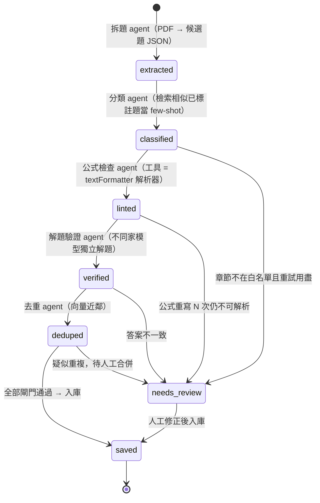

# 期中專案 · 家教專用數學物理題庫系統

> AIPE 課程期中專題。以 AI 協助家教老師「上傳考卷 → 自動拆題入庫 → 智慧組卷 → 匯出 Word 考卷」，減少人工出題與重複出題的負擔。

本 repo 收錄專題的**完整開發歷程**:從早期原型、企業級重構版，到開發紀實簡報。

> ⚖️ 本 repo 不含任何題庫或考卷內容；程式碼採 Apache-2.0，示範題為自行編寫。詳見 [`NOTICE`](./NOTICE)。
>
> 🛣 下一階段（Agent 管線 × RAG × 資料層）的設計規格、建議順序與驗收指標見 [Roadmap](#-roadmap)。

---

## 🖥️ 操作介面


---

## 🎯 問題背景與設計目標

**使用者**：一對一數理家教老師（高中數學／物理），手上有大量歷屆考卷 PDF，需要為每位學生客製特訓卷。

**痛點**：出卷的行政損耗遠大於教學本身。複雜公式（直式分數、根式、幾何圖）在 Word 手動排版容易跑位；題目散在各份考卷裡，哪個學生寫過哪題無從追蹤，重複出題傷害練習效果。一份特訓卷常花 **2 小時以上**。

**目標**：出一份卷從 2 小時縮短到幾分鐘，把心力留給一對一指導本身。

**關鍵約束**：

- 交付物必須是 **Word 原生方程式**的 `.docx`——學生端用紙本，公式得是直式分數而非斜線，因此自製 LaTeX → OOXML 轉換而非貼圖。
- AI 拆題的輸出格式必須可控（章節名、LaTeX 語法不能自由發揮），以白名單驗證收斂。
- AI 呼叫需限流以控制成本。

**成功標準**：上傳 PDF → 自動拆題入庫 → 選學生一鍵組卷 → 匯出可直接列印的 Word，全程零手動排版；同一學生保證不會拿到寫過的題目。

---

## 🗂 目錄總覽

| 目錄 / 檔案 | 內容 | 說明 |
|------------|------|------|
| **[`exam_pro/`](./exam_pro)** | 🌟 **主要成品**（企業級重構版） | `app.js` / `server.js` + `config` `controllers` `services` `middleware` `routes` `utils` 分層，前端為 `public/index.html`，資料表定義於 `migrations/`（PostgreSQL）。詳見 [`exam_pro/README.md`](./exam_pro/README.md) |
| [`exam/`](./exam) | 早期原型（ARCHIVED） | 功能相同但邏輯集中於單一 `server.js`，保留以呈現重構前後對照 |
| [`期中專題報告/`](./期中專題報告) | 開發紀實簡報 | [`tutor_presentation.html`](./期中專題報告/tutor_presentation.html)：GitHub 只會顯示原始碼，請下載後用瀏覽器開啟（大型 pptx/pdf/mp4 素材未進版控）|
| [`LICENSE`](./LICENSE) | Apache License 2.0 | 程式碼授權 |
| [`NOTICE`](./NOTICE) | 內容與著作權聲明 | 題目內容的權利範圍與使用者責任 |

---

## 🔄 兩個子專案的關係

```
exam/  ──（重構）──▶  exam_pro/
原型：邏輯全在              企業級版：MVC 分層、
單一 server.js            白名單驗證、API 認證、
                         防 SSRF、LaTeX→Word 公式引擎
```

- **`exam`**：最初的可運作原型，驗證「AI 拆題 + 組卷 + 匯出」的核心流程。
- **`exam_pro`**：以 `exam` 為基礎重構，拆分為 `config / controllers / services / middleware / routes / utils`，並補強安全性與正確性。**若要實際執行，請使用 `exam_pro`。**

---

## 🧭 設計決策（為什麼這樣做）

以下三個決策決定了專案的形狀。共同主線是：**先確認這個系統的硬約束是什麼，再看現成工具剛好不滿足哪一條。**

### 1️⃣ 為什麼自己刻 LaTeX → OOXML，而不用 pandoc？

pandoc 是文件轉換的業界標準，一行指令就能把 LaTeX 轉成 `.docx`。本專案仍在 [`exam_pro/utils/textFormatter.js`](./exam_pro/utils/textFormatter.js) 自製了 tokenizer + 遞迴下降解析器，理由是：

- **輸入不是一份 LaTeX 文件**。資料是 DB 裡一列列的題目，內容為「中文敘述混雜行內 `$...$` 片段」；`buildParagraphComponents` / `renderMixedInto` 處理的正是中英數混排，而 pandoc 的單位是整份文件。
- **交付物需要程式化組裝**。[`wordService.js`](./exam_pro/services/wordService.js) 要控制標題階層、藍色題號、`★` 難度、換頁、答案區紅字與遠端圖片插入——這些由 `docx` 的物件模型逐段建構，交給 pandoc 產檔後就無法再回頭插入。
- **pandoc 是外部二進位相依**。Node 伺服器需每次請求 `spawn` 一次，部署環境還得額外安裝執行檔；現行方案零外部相依。
- **中介方案試過並淘汰**。原型 `exam/server.js` 走 `temml`：LaTeX → MathML → 以字串包上 `<m:oMathPara>` 命名空間灌進 `MathXml`，本質是「MathML 標籤穿 OOXML 外衣」，Word 不保證接受。重構版改為直接建構 `docx` 原生數學物件（`MathFraction`、`MathRadical`、`MathSum`、`MathSubSuperScript` …），產出**可用 Word 方程式編輯器開啟編輯的真・直式分數**，正對應本專案的核心約束。
- **輸入域是受控的**。AI prompt 已將可用語法限縮為高中數理子集，因此無須覆蓋完整 LaTeX；未知指令會退化為純文字（`parseCommand` 末段），單一公式失敗不會導致整份考卷打包失敗。

> **權衡**：pandoc 的 LaTeX 覆蓋率遠勝本解析器。此處換得的是「部署零相依 + 版面完全可控 + 失敗可局部降級」，代價是僅支援語法子集。

### 2️⃣ 為什麼 AI 輸出要做白名單約束？

Gemini 已回傳 JSON，為何不直接入庫？

- **LLM 輸出是自然語言，不是型別化的 API**。同一份考卷，模型可能寫 `圓方程式`、`圓的方程式` 或 `圓與直線`。章節名一旦漂移，**組卷功能即失效**——[`examController.js`](./exam_pro/controllers/examController.js) 是以 `WHERE subject = ? AND chapter = ?` 精確比對抽題的，名稱不統一等同題庫變成撈不出來的資料。
- **兩層防線，職責不同**：

  | 層 | 位置 | 性質 |
  |---|---|---|
  | 軟約束 | [`aiService.js`](./exam_pro/services/aiService.js) prompt 內列出完整章節白名單 | 是「請求」，模型可以不照做 |
  | 硬約束 | [`config/chapters.js`](./exam_pro/config/chapters.js) + `questionController.batchSaveQuestions` 逐題驗證 | 是入庫的門，不合格即擋下 |

  關鍵論點：**prompt 不是保證，只有伺服器端驗證才是。**
- **約束不只章節**。`question_type` 限五種、`difficulty` 經 `normalizeDifficulty` 收斂為 1–5 整數、LaTeX 強制 `\frac{}{}` 而非斜線——最後這條是為了餵給第 1 點的解析器，**兩個模組的約束刻意互相對齊**。
- **安全視角**：AI 輸出屬不可信輸入，且會落地為 DB 資料、再流入 XML 產生流程，不能當受信任來源處理。

> **權衡**：目前一題不合格即整批退回（`batchSaveQuestions`），對使用者不夠友善；改為部分入庫並標記待修會更好。

### 3️⃣ exam → exam_pro 重構到底改了什麼？

兩個資料夾功能相近，差異在**行為**而非目錄長相（375 行單檔 → 約 1,400 行分層）：

| 面向 | `exam`（原型） | `exam_pro`（重構版） |
|---|---|---|
| 架構 | 全部集中於 `server.js` | `app.js`/`server.js` 分離 + `config`/`controllers`/`services`/`middleware`/`routes`/`utils` |
| 公式引擎 | temml → MathML → 字串包裝的 OMML | 自製 tokenizer + 遞迴解析器 → `docx` 原生 Math 物件 |
| 靜態檔 | `express.static(__dirname)`，**整個專案目錄對外**（含 `server.js`、`schema.sql`、`.env`） | 只公開 `public/`，且 `index: false`，由路由注入前端設定 |
| 認證 | 無 | `x-api-key` + `crypto.timingSafeEqual`（防時序攻擊） |
| CORS | 無 | `ALLOWED_ORIGINS` 白名單 |
| 資料驗證 | 僅在 prompt 中要求 | 伺服器端白名單硬驗證 |
| SSRF | 直接 fetch 題目圖片 URL | `isSafeImageUrl` 阻擋 localhost／內網／保留 IP，並限 5 MB 與 content-type |
| 成本控制 | 無 | `/analyze-pdf` 每來源每分鐘 10 次限流 |
| 交易一致性 | 無 | 組卷與作答歷史更新包於 transaction，失敗全數回滾 |
| 錯誤處理 | 無 | 全域錯誤中樞；正式環境不回傳錯誤細節 |
| 其他修正 | — | 組卷日期時區（`toISOString()` 為 UTC，台灣早上 8 點前會差一天）、題庫列表分頁、`uploads` 開機清理、選擇題答案帶選項代號 |

> **最具體的一例**：原型的 `app.use(express.static(__dirname))` 會把含 `GEMINI_API_KEY` 的 `.env` 一併當靜態檔案對外提供。
> 重構的價值不在目錄變好看，而在於把一個「會外洩金鑰、AI 額度可被無限刷、章節名各寫各的」原型，變成可以真的對外部署的系統。

---

## 🚀 快速開始（exam_pro）

```bash
cd exam_pro
npm install
cp .env.example .env      # 填入 GEMINI_API_KEY（DATABASE_URL 預設值即可用）
npm run db:up             # Docker 起 PostgreSQL 16 + pgvector（開發 5442 / 測試 5433）
npm run migrate           # 套用 migrations/
npm start                 # http://localhost:3000
```

完整安裝步驟、環境變數表、API 一覽與維運工具說明，請見 **[`exam_pro/README.md`](./exam_pro/README.md)**。

---

## 🧰 技術棧

- **後端**：Node.js · Express · PostgreSQL 16 + pgvector（`pg`；2026-08-21 由 MySQL 切換，見 `docs/cutover-runbook.md`）
- **AI**：Google Gemini 2.5 Flash（`@google/genai`）— PDF 考卷解析
- **文件**：`docx`（自製 LaTeX → OOXML 數學公式轉換）
- **前端**：單頁 HTML + Tailwind（CDN）+ MathJax

---

## 🛣 Roadmap

> **下一階段：Agent 管線 × RAG × 資料層**（規劃中，尚未實作；本節是設計規格與驗收標準，不是功能清單）

### 現況診斷

目前系統的 AI 部分是「**一次 Gemini 呼叫 → JSON → 白名單驗證**」，檢索則是 `WHERE subject = ? AND chapter = ?` 的精確比對加 `LIKE` 關鍵字搜尋。工程紀律（分層、硬驗證、交易、防 SSRF、解析器測試、CI）已經到位，但有三個缺口：

| 缺口 | 具體症狀（現有程式碼） |
|---|---|
| **沒有 agent 迴圈** | `aiService.analyzePdfContent` 一個巨型 prompt 一次到位；`batchSaveQuestions` 一題不合格**整批退回**；LaTeX 不合解析器時靜默降級；答案由模型自算、無人驗證 |
| **沒有語意檢索** | 「不重複出題」只靠題目 ID，不同 PDF 裡「換個數字的同一題」會被當成新題；無法做「找同概念、難度 +1 的題」 |
| **沒有對 AI 輸出品質的量測** | 章節分類正確率、公式解析成功率、重複題檢出率都沒有數字，改 prompt 或換模型無從比較 |

設計原則沿用本 repo 既有哲學——**prompt 不是保證，伺服器端驗證才是**——把它接上「迴圈」與「檢索」：每個 sub-agent 後面都有一道不可繞過的硬閘門，每一項交付都附量測指標。

### 建議順序

| 階段 | 交付物 | 量測 / 驗收 |
|---|---|---|
| **1. 資料層** | MySQL → PostgreSQL 遷移；`students` / `attempts` 表取代 `history_json`；pgvector 欄位與 HNSW 索引；embedding 回填腳本；`GET /api/questions/:id/similar`；`npm run eval:retrieval` | golden set 上的 **Recall@5、MRR**；`LIKE` vs 純向量 vs hybrid 三欄對照；eval 以固定小題庫 + 預先算好的 embedding fixture 跑，**不連外部服務**即可進 CI |
| **2. Agent 管線** | `jobs` / `job_questions` 表與狀態機；五個 sub-agent（拆題、分類、公式檢查、解題驗證、去重）；部分入庫取代整批退回；人工複核佇列 | **章節分類正確率、公式解析成功率、答案驗證不一致率、重複題檢出數、每份 PDF 的 token 成本與延遲**，全部前後對照 |
| **3. 產品面** | 相似題／變式題生成（走同一組閘門）；學生弱點面板（`attempts` 的 SQL 聚合）；自然語言查題；README 改寫成「問題 → 決策 → 數字」 | 變式題通過閘門的比例；弱點面板查詢延遲；自然語言查題在 golden set 上的命中率 |

---

### 規格 1：資料層 — 為什麼改用 PostgreSQL

| 考量 | MySQL 8 / 9（現況） | PostgreSQL 16 + pgvector（規劃） |
|---|---|---|
| 向量搜尋 | MySQL 9 有 `VECTOR` 型別，但 **`DISTANCE()` 只在 HeatWave（Oracle 雲端版）提供，社群版沒有**，實際做不了近鄰搜尋 | `pgvector` 提供 `<=>` 餘弦距離與 HNSW / IVFFlat 索引，生產環境成熟 |
| 全文檢索（中文） | `FULLTEXT` 對中文需 ngram parser，功能有限 | `tsvector` + `zhparser` / `pg_jieba` 分詞，或 `pg_trgm` 作退路 |
| 一條 SQL 做 hybrid | 需在應用層自行算距離再合併 | 關聯篩選 + 全文 + 向量 **同一個查詢、同一個交易** |
| 遷移成本 | — | 只有兩張表，`schema.sql` 與 `mysql2` 查詢改寫為 `pg` 即可 |

**規模判斷**：題庫量級是數千到數萬題，`pgvector` 綽綽有餘；**不引入專用向量資料庫**（Pinecone / Milvus / Qdrant），理由是多一套系統要同步、metadata 篩選 + 語意檢索要兩次往返，而且量級遠未到需要獨立擴展。

**Schema 變更草案**

```sql
-- 學生與作答歷史：取代以「姓名」當 key 的 history_json（重名無法區分、做不了逐生分析）
CREATE TABLE students (id SERIAL PRIMARY KEY, name TEXT NOT NULL UNIQUE);
CREATE TABLE attempts (
    id          BIGSERIAL PRIMARY KEY,
    student_id  INT  NOT NULL REFERENCES students(id),
    question_id INT  NOT NULL REFERENCES questions(id),
    paper_id    INT  REFERENCES exam_papers(id),
    assigned_at DATE NOT NULL DEFAULT CURRENT_DATE,
    result      SMALLINT,                       -- NULL=未批改, 1=對, 0=錯
    UNIQUE (student_id, question_id)
);

-- 題目：加上檢索用欄位
ALTER TABLE questions
    ADD COLUMN concept_summary TEXT,            -- LLM 產生的一句概念摘要（embedding 用）
    ADD COLUMN embed_text      TEXT,            -- 實際送去 embedding 的文本（可重現）
    ADD COLUMN embedding       vector(768),     -- 維度依所選模型，MRL 模型可降維
    ADD COLUMN search_tsv      tsvector;
CREATE INDEX idx_questions_embedding ON questions USING hnsw (embedding vector_cosine_ops);
CREATE INDEX idx_questions_tsv       ON questions USING gin  (search_tsv);
```

**Embedding 文本規則**：不要直接 embed 原始 LaTeX——embedding 模型對 `\frac{16}{3}` 這類 token 不敏感。`embed_text` = 學科 + 章節 + 題型 + 中文題幹（去掉 `$...$` 內容或換成口語）+ `concept_summary`；原始 LaTeX 留在 `question_text` 供排版。

**Hybrid 查詢草案**（metadata 篩選 → 向量 + 全文融合）

```sql
WITH cand AS (
    SELECT id FROM questions
    WHERE subject = $1 AND chapter = $2
      AND difficulty BETWEEN $3 AND $4
      AND id NOT IN (SELECT question_id FROM attempts WHERE student_id = $5)
)
SELECT q.id,
       1 - (q.embedding <=> $6::vector)                        AS vec_score,
       ts_rank(q.search_tsv, plainto_tsquery('chinese', $7))   AS kw_score
FROM questions q JOIN cand USING (id)
ORDER BY 0.7 * (1 - (q.embedding <=> $6::vector)) + 0.3 * ts_rank(q.search_tsv, plainto_tsquery('chinese', $7)) DESC
LIMIT 20;   -- 權重為起點；亦可改用 Reciprocal Rank Fusion（RRF）避免分數尺度不一
```

候選池內的最終抽題仍沿用 `utils/shuffle.js` 的 Fisher-Yates，維持「同條件下每題被抽中機率相同」的既有保證。

**檢索評估**：`eval/retrieval_golden.json` 手工標註 50–100 筆「查詢（題目 ID 或自然語言）→ 相關題目 ID 清單」；`npm run eval:retrieval` 對 `LIKE`、純向量、hybrid 三種方法輸出 Recall@5 / Recall@10 / MRR。這份對照表是整個階段的驗收物。

---

### 規格 2：Agent 管線 — 協調層是程式碼，LLM 只在判斷節點



**四條設計原則**

1. **協調層是確定性狀態機，不是 LLM。** 每份 PDF 是一個 `jobs` 列，每一題是一個 `job_questions` 列，狀態逐步推進並落地；LLM 只出現在需要「判斷」的節點。好處是可測試、可重跑、可觀測、費用可控。對應 Anthropic《Building effective agents》中的 *orchestrator-workers* 與 *evaluator-optimizer* 模式——能用 workflow 就不用 agent。
2. **sub-agent 之間以型別化合約溝通**（JSON schema / structured output），每一步的輸入輸出都存進 `job_questions.payload`，任一步失敗只重跑那一步，不重跑整份 PDF。
3. **重試有預算。** 每題每節點最多 N 次、每份 PDF 有 token 上限；超過就進 `needs_review`，不會無限迴圈、不會費用失控。
4. **部分成功取代整批退回。** 通過的題先入庫，有問題的題進人工佇列並附原因；修掉 README「設計決策 2」自承的缺點。

**Sub-agent 規格**

| Sub-agent | 對應的現有失敗模式 | 工具 | 硬閘門（不是 prompt） | 模型等級 |
|---|---|---|---|---|
| **拆題** | — | PDF 原生輸入 | JSON schema 驗證 | 便宜、多模態（Gemini Flash 系列） |
| **分類** | 章節名漂移（「圓方程式」vs「圓的方程式」），組卷撈不到 | 向量檢索「已標好章節的相似題」作 few-shot | `isValidChapter`；輸出限定白名單 enum | 便宜 |
| **公式檢查** | LaTeX 不合解析器 → 靜默降級成純文字 | 直接呼叫 `utils/textFormatter` 解析；失敗的公式連同錯誤訊息退回重寫 | 解析成功且無降級 token | 便宜 |
| **解題驗證** | 答案由 Gemini 自算，無人驗 | 以**不同家**模型獨立解題、比對答案（錯誤才不相關） | 不一致 → `needs_review`，不自動入庫 | 推理強 |
| **去重** | 「不重複出題」只看 ID；跨 PDF 近似題被當新題 | 向量近鄰（與 RAG 共用 `embedding`） | 相似度超過閾值 → 合併為 variants 或標記 | 不需 LLM（純檢索 + 閾值） |

**`jobs` 表草案**

```sql
CREATE TABLE jobs (
    id          BIGSERIAL PRIMARY KEY,
    pdf_sha256  CHAR(64) NOT NULL,
    state       TEXT NOT NULL,                  -- extracted / classified / ... / saved / failed
    token_in    INT NOT NULL DEFAULT 0,
    token_out   INT NOT NULL DEFAULT 0,
    cost_usd    NUMERIC(10,6) NOT NULL DEFAULT 0,
    error       TEXT,
    created_at  TIMESTAMPTZ NOT NULL DEFAULT now(),
    updated_at  TIMESTAMPTZ NOT NULL DEFAULT now()
);
CREATE TABLE job_questions (
    id            BIGSERIAL PRIMARY KEY,
    job_id        BIGINT NOT NULL REFERENCES jobs(id),
    idx           INT    NOT NULL,
    state         TEXT   NOT NULL,
    payload       JSONB  NOT NULL,              -- 各節點的輸入輸出（可重放）
    retries       JSONB  NOT NULL DEFAULT '{}', -- 每節點已重試次數
    review_reason TEXT,
    question_id   INT REFERENCES questions(id)  -- 入庫後回填
);
```

**設計取捨 FAQ**

- *為什麼不一個大 prompt 全做？* 成本不可切分、失敗不可局部重試、沒有可觀測性；拆開後每個節點都有自己的指標與閘門。
- *為什麼協調層不用 LLM？* 流程是固定的，用 LLM 協調只會引入不確定性；狀態機可以寫單元測試。
- *怎麼避免無限迴圈與費用失控？* 每節點重試上限 + 每份 PDF token 預算 + `jobs.cost_usd` 即時累計，超線即停。
- *怎麼證明有效？* 用同一批 PDF 跑「舊單次呼叫」與「新管線」，對照上表的量測指標。

---

### 規格 3：RAG 在題庫裡的三個落點

RAG 在這裡**不是聊天機器人**，而是三個有業務意義的檢索應用（依價值排序）：

| 落點 | 檢索什麼 | 生成什麼 | 為什麼重要 |
|---|---|---|---|
| **1. 相似題／變式題** | 學生錯的那題 → 同概念、不同數字、難度 +1 的題 | 以檢索到的題為藍本產生變式題，**再走同一組硬閘門** | 家教的真正痛點：針對弱點練習；檢索本身就是產品 |
| **2. 檢索式 few-shot 分類** | 與待分類題最相似的已標註題 | 限定白名單的章節標籤 | 用 RAG 提升結構化輸出的正確率，而不是寫文章 |
| **3. 自然語言查題** | 「牛頓第二定律＋摩擦力、計算題、難度 4 以上、小明沒寫過」 | 先轉成 metadata 篩選條件，再語意檢索 | 老師不必記章節白名單 |

本專案做 RAG 的先天優勢：**chunk 天然就是一題**，沒有一般 RAG 最痛的切塊問題；要做的是把 embedding 文本整理好（規格 1）與把評估做出來。

---

### 規格 4：模型路由 — 依工作負載選模型，用 eval 證明

| 工作負載 | 主選 | 次選 | 取捨 |
|---|---|---|---|
| **PDF 拆題**（多模態、量大、要便宜） | Gemini Flash 系列（現用 `gemini-2.5-flash`；原生吃 PDF、長上下文、最便宜） | Claude Sonnet / GPT 系列 | 都能讀 PDF，但大批量成本明顯高於 Gemini Flash；多接一家供應商 |
| **解題驗證、變式題生成**（推理要強） | 高階模型，且**刻意選與拆題不同家**（Claude Sonnet / Opus、GPT、Gemini Pro 皆可） | 用同一個 Flash 自驗 | 便宜，但自己驗自己，錯誤高度相關，驗證價值低 |
| **Embedding** | Gemini Embedding（同一個 SDK、多語、MRL 可降維） | Qwen3-Embedding / BGE-M3（開源、中文強、生產常用） | 開源零 API 費、資料不出門，但要自架推理服務、維運與版本管理；Anthropic 沒有 embedding 產品 |

- 模型 ID 全部改為環境變數（`MODEL_EXTRACT`、`MODEL_VERIFY`、`MODEL_EMBED`、`EMBED_DIM`），換模型不改程式碼，由 eval 決定。
- 具體版本號與價格變動很快（2026-08 查證時 Gemini 已有 3.x Flash / Pro 系列），**採購前以各家官方定價頁為準**。
- 現有的 `/analyze-pdf` 每分鐘 10 次限流保留；新增每份 PDF 的 token 與成本記帳（`jobs.cost_usd`）。

---

### 明確不做（Non-goals）

- 不用 LLM 當 orchestrator。
- 不引入專用向量資料庫。
- 不把「聊天介面」當主功能；RAG 的落點是相似題、分類與查題。
- 第一版不自架 embedding 模型。

### 技術棧變動預告

| 現在 | 規劃 |
|---|---|
| MySQL 8（`mysql2`） | PostgreSQL 16 + `pgvector`（+ `zhparser` / `pg_trgm`），`pg` |
| 單次 Gemini 呼叫 | `jobs` 狀態機 + 五個 sub-agent，多模型路由 |
| `LIKE` 關鍵字搜尋 | hybrid：metadata 篩選 + 全文 + 向量 |
| `history_json`（以姓名為 key） | `students` / `attempts` 正規化表，可做逐生弱點分析 |
| 無 AI 品質量測 | golden set + `eval/` 腳本，進 CI |

---

## 🔐 安全注意事項

- 對外部署 `exam_pro` 時務必設定 `ALLOWED_ORIGINS` 並將 `NODE_ENV=production`。
  ⚠️ `API_KEY` 會被注入前端頁面，**不等同存取控制**，詳見 [`exam_pro/README.md`](./exam_pro/README.md#-安全注意事項)。
- 金鑰請妥善保管；若曾外流，請至 [Google AI Studio](https://aistudio.google.com/apikey) 重新產生。

---

## 📄 授權與著作權

### 程式碼
本專案**程式碼**採 **[Apache License 2.0](./LICENSE)** 釋出。
你可自由使用、修改與散布（含商用），惟須保留版權與授權聲明。

### ⚖️ 題目內容（重要）

| | 說明 |
|---|---|
| **本 repo 不含題庫資料** | 沒有任何考卷、試題或其掃描檔。開發期間用於測試的實體考卷 PDF、題庫備份 JSON、維運報告產物與含逐字試題的一次性腳本，**均未收錄、已自版本歷史完全移除，並由 `.gitignore` 持續排除**（同時排除 `.env`、`node_modules/`、`uploads/` 與大型二進位素材）。 |
| **示範題為自製** | `exam_pro/seed_questions.js` 的 30 題係為展示流程自行編寫的常見教科書型例題，不取自任何特定考卷或出版品。 |
| **使用者自負責任** | 本系統用於管理**使用者自身合法擁有或有權使用**的題目。經 PDF 解析匯入的內容，著作權仍屬原著作權人，不因匯入而移轉。匯入前請自行確認已取得合法權源（自行創作、取得授權，或符合著作權法合理使用要件）。 |

完整聲明見 **[`NOTICE`](./NOTICE)**。

© 2026 Ben Yang (楊本顥)
