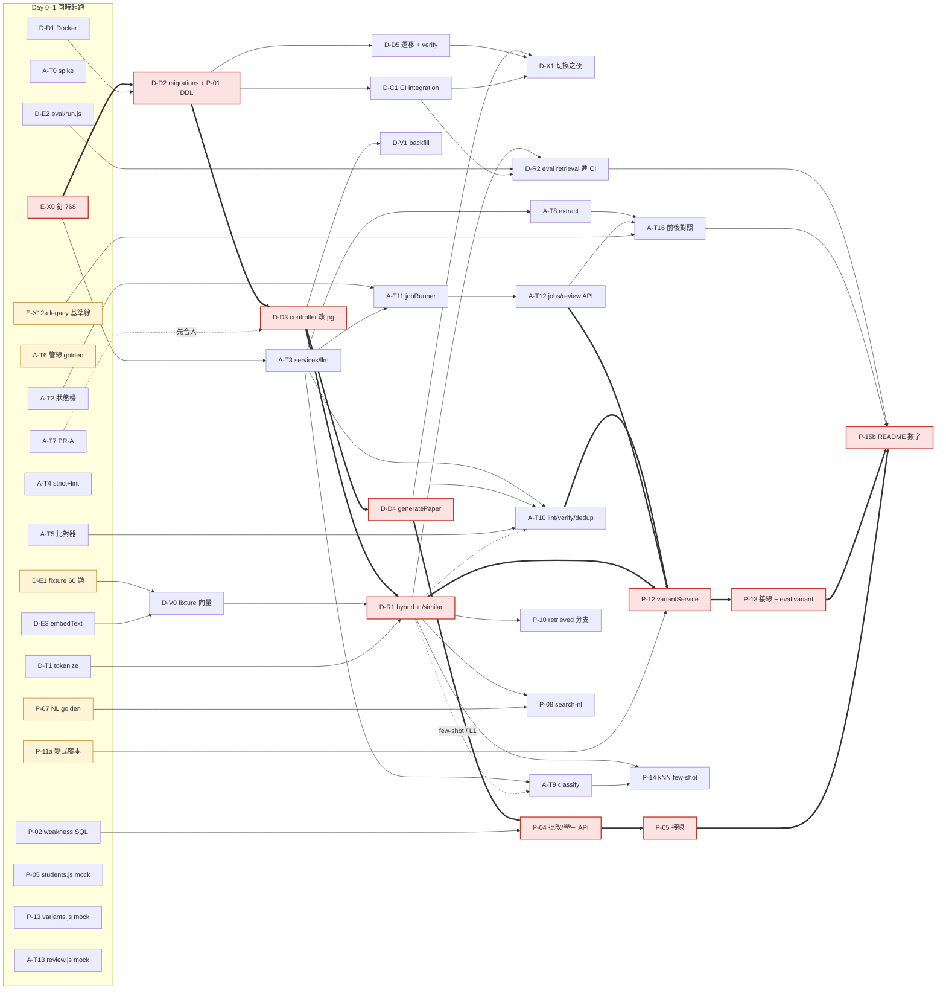

# 題庫系統整體規劃（階段 1–4）

> 對應根目錄 `README.md` Roadmap 的三個階段（資料層 → Agent 管線 → 產品面）與一條橫切工作流（評估／測試／CI／遷移／Windows 環境）。每一章都回答同樣五個問題：**怎麼做、為什麼這樣做、優點是什麼、有哪些替代方案與它們的優點、為什麼不選它們與它們的缺點**；§1 把四章的任務合併成一張相依圖、關鍵路徑、可最大化平行的 workstream 與決策速查表。[§6](#sec-stage4) 是三階段結案後追加的**階段 4 產品收斂**計畫（2026-08-24 凍結；2026-08-26 併自 `docs/stage4-plan.md`，該檔已移除）。
>
> 基準：§1–§5 凍結於 repo `main` @ `2c31bd1`（2026-08-21），文中所有 `檔案:行號` 都對過這個版本的程式碼；§6 凍結於 2026-08-24。
>
> **⚠️ 本檔是凍結的規劃，不滾動記錄完成狀態**——各章開頭的一行狀態註記僅供導覽。實際進度以 [`HANDOFF.md`](HANDOFF.md) §2 為準；規劃與實作的落差以裁決檔（`interfaces*.md`）與 ADR 為準。

## 導讀

### 這份文件怎麼來的

四條工作流（資料層、Agent 管線、產品面＋RAG、橫切評估）各由一個代理讀 repo 與 Roadmap 後獨立設計，再由一個對抗式審查者逐條核對程式碼事實、挑替代方案的稻草人、檢查 Windows 一人開發的可行性與假相依，設計者依審查修訂；最後一個代理把四章的任務表合併、裁決章節間的分歧、排出平行 workstream。四份審查總共開出 40 條必修項（例如：弱點 SQL 在 PostgreSQL 會報錯、`textFormatter` 解析器根本不會丟例外所以「嚴格模式」要改成事件計數、eval fixture 不能用真題庫、thinking tokens 漏算會讓預算閘門失效），修訂版已全部處理。

§6（階段 4 產品收斂）不是這個四代理流程的產物：它是階段 1–3 結案後、針對日常主流程被三個設計反噬的問題，由使用者逐項核准的單線收斂計畫，2026-08-26 自獨立檔 `docs/stage4-plan.md` 併入本檔。

### 怎麼讀

| 你想知道 | 看哪裡 |
|---|---|
| 到底該做哪些事、什麼順序、哪些能同時開始 | [§1 跨階段排程](#sec-schedule)：任務總表、相依圖、4 條 workstream、Day 1 可起跑的 20 項、里程碑 |
| 為什麼不選別的（速查） | [§1.6 決策總表](#sec-schedule)：每個決策的最終選擇、最強替代方案、**改選條件** |
| 每個階段的具體設計（DDL、API、函式、環境變數） | 各章 **§3 作法** |
| 每個決策的理由與替代方案的完整取捨 | 各章 **§4 為什麼這樣做**、**§5 優點**、**§6 替代方案與取捨** |
| §1 任務 ID 的前綴 D-／A-／P-／E- 分別對應 | §2 資料層／§3 管線／§4 產品面／§5 橫切（§1 內文的「D §3.2」即「§2 資料層的 3.2 小節」）；階段 4 的 W1-*／S4-* 見 §6 |
| 怎麼驗收、怎麼進 CI | 各章 **§8**，加上 [§5 橫切](#sec-eval) 的 eval 體系 |
| 階段 4 產品收斂的範圍、API 契約、測試計畫與擱置區 | [§6 階段 4](#sec-stage4)（W1-1～W1-4、裁決 S4-1～S4-4、對話式助教） |

### 一頁摘要

**三階段 + 一條橫切，核心約 70 人日。** 一人序列做約 14 週（全職）／28 週（兼職）；開 4 條 workstream（4 個代理各守一條，開發者本人做標註與審查）約 5–6 週（全職）／10–12 週（兼職）。並行帶來的是約 2.5 倍而非 4 倍——瓶頸會從「寫程式」移到「標註 golden、審查代理輸出、整合」，所以人工標註要從 Day 1 排進行事曆。

| 工作流 | 一句話 | 最重要的決策 |
|---|---|---|
| **階段 1 資料層** | MySQL → PostgreSQL 16 + pgvector；`students`/`attempts` 取代 `history_json`；embedding 回填；hybrid 檢索與 `/similar` | 不引入專用向量 DB、不用 ORM；中文分詞放 Node（jieba）而非 PG 擴充，讓本機／CI／prod 用同一個官方映像；一次切換不雙寫 |
| **階段 2 Agent 管線** | `jobs` 狀態機（純函式）+ DB-polling worker + 五個節點各有硬閘門、重試預算、成本記帳；部分入庫取代整批退回 | 協調層是程式碼不是 LLM；便宜的閘門（雜湊去重、白名單）排在 LLM 前；驗證用確定性比對器，異家模型等 eval 數字再接 |
| **階段 3 產品面** | 先純檢索相似題、再生成變式題（走同一組閘門、首輪人工核准）；弱點面板即時 SQL 聚合；NL 查題規則為主 LLM 為輔 | 3A（不碰 LLM）可先交付；變式題「只改字」用文字比對而非 embedding；前端維持 vanilla + ES module，不引框架 |
| **橫切 評估與上線** | 公開／私有兩層 golden、record/replay 讓 CI 零 secrets、門檻從基準線長出來（ratchet）、遷移 export→import→verify、Windows 用 Docker Desktop | 「prompt 不是保證，伺服器端驗證才是」延伸到 eval：golden 由人定、門檻由 CI 執行 |
| **階段 4 產品收斂**（§6 追加） | 學生改成選的、出卷草稿→確認、批改輕量化、對話式助教（主控 LLM 調度五個只讀工具） | 單線施工不開 worktree；`generate-paper` 不再自動建學生（垃圾人名的根因）；助教只讀、寫入永遠由人按確認 |

**Day 1 就能同時開始、不需要 DB 也不需要金鑰的工作有 20 項、約 25 人日**（釘 `EMBED_DIM`、`@google/genai` structured output spike、Docker compose、PR-A 部分入庫、fixture 60 題、管線 golden、legacy 基準線、NL golden、狀態機純函式、`parseLatexStrict`、答案比對器、eval 腳手架、弱點 SQL 純函式、三個前端分頁的 mock 版……）。全案最早的「所有人都在等」節點是 **D-D3（controller 改 `pg`）**，必須在第一週內合入。

### 章節間的裁決

四章獨立寫成，少數地方彼此不同；**以 §1.5「跨章節衝突與整合風險」的裁決為準**（`attempts` 外鍵採 `RESTRICT` + 軟刪、`exam_papers.student_id NOT NULL`、分詞器統一 `@node-rs/jieba`、LLM 抽象層採管線的簽名＋橫切的 record/replay 模式、CI 矩陣 22/24、migration 路徑採 `migrations/` 目錄）。另外兩處補充裁決：`exam_papers.question_ids` 採階段 1 的 `INT[]`（橫切章寫 `JSONB`，以 `INT[]` 為準，保留順序且 `unnest` 方便）；橫切章 §3.3 的 `LIKE` 基準欄分詞改呼叫同一支 `utils/tokenize.js`（§1.5 第 3 條）。

### 使用須知

- 人日為估計，用於排序與相依判斷，不是承諾。
- 模型 ID 與價格變動快（文中 `gemini-2.5-flash` 等以 2026-08 查證為準），採購前以官方定價頁為準；這也是為什麼所有模型 ID 都改成環境變數。
- Roadmap 的 Non-goals（不用 LLM 當 orchestrator、不引入專用向量 DB、不做聊天介面、第一版不自架 embedding）全部維持；各章替代方案小節說明了「在什麼條件下才值得重評」。


---

<a id="sec-schedule"></a>

## §1 跨階段相依圖、關鍵路徑與最大化平行的 workstream 排程

> **狀態（2026-08-26 註）**：階段 1–3 已依本章排程以四條 workstream 完成；本章保留為排程與相依分析的紀錄。現況以 [HANDOFF §2](HANDOFF.md) 為準。

### 1. 跨階段任務總表

ID 前綴：`D-` 資料層、`A-` Agent 管線、`P-` 產品面、`E-` 橫切。四章各自獨立估工，有十處在做同一件事（例如 `D-E1` 與 `E-X1a` 都是「自製 60 題 fixture」、`D-D3/D4` 與 `E-X8` 都是「controller 改 `pg`」）；「合併」欄標出以誰為準，估工只算一次。四章名目合計約 91 人日，合併後**核心約 70 人日**，另有條件觸發／擴充約 7 人日（`P-16`、`A-T17`、`E-X1b`、`E-X15`）。

| ID | 任務 | 章節 | 相依於 | 人日 | 合併／備註 |
|---|---|---|---|---|---|
| E-X0 | 釘 `MODEL_EMBED`/`EMBED_DIM=768`，錄一次 fixture embedding | 橫切 | — | 0.5 | 全案第一個決策點 |
| A-T0 | Spike：`responseJsonSchema` 中文 enum、inlineData 上限、當日模型 ID | 管線 | — | 0.5 | 第 0 天 |
| D-D1 | `docker-compose.yml`（含 `postgres_test` 5433）、`.env.example`、`.bat`、中文路徑 bind mount | 資料層 | — | 0.5 | 吸收 `E-X6` 的 compose 部分 |
| D-D2 | `migrations/0001_init.sql`/`0002_vector.sql` + `migrate.js`（§3.2 DDL，含 `P-01` 欄位） | 資料層 | E-X0 | 2 | ＝`E-X6`；以 E 的 migrations 目錄為準，內容用 D §3.2 |
| P-01 | `origin/variant_of/chapter_src/archived_at`、`attempts` FK 改 `RESTRICT`、軟刪、`chapter_src='human'` | 產品 | 與 D-D2 同時寫 | 1 | DDL 併入 D-D2，程式碼（軟刪）等 D-D3 |
| A-T1 | `0003_jobs.sql`（含 `P-3.1` 的 `kind`/`source_question_id`）+ `backfill_text_hash.js` | 管線 | — | 0.5 | MySQL 版只在階段 1 延後時才寫 |
| D-D3 | `config/db.js` + question/word controller + seed + audit/fix 改 `pg` | 資料層 | D-D1, D-D2 | 2 | ＝`E-X8` 前半 |
| D-D4 | `generatePaper` 重寫為 `students/attempts`（§3.4）+ `config/features.js` | 資料層 | D-D3 | 1 | ＝`E-X8` 後半 |
| D-D5a | 遷移腳本姓名合併／校驗邏輯 + 單測 | 資料層 | — | 1 | ＝`E-X7a` export + 校驗檔 |
| D-D5 | 遷移正式版（PG 端 SQL 展開）+ `verify.js` + dry-run + 回滾演練 | 資料層 | D-D2, D-D5a | 2 | ＝`E-X7b`；取 E 的 export→import→verify 骨架、D 的 PG 端展開 |
| D-E1 | 公開 fixture 60 題（≥6 章、配對／干擾／壞 LaTeX） | 資料層 | — | 3 | ＝`E-X1a`；老師親寫 |
| E-X1b | fixture 擴到 120 題 | 橫切 | D-E1 | 3 | 擴充，非核心 |
| D-E1b | 私有 golden：真題庫 50–100 筆（pooling 建池） | 資料層 | D-D5, E-X2 | 1.5 | `eval/private/golden/retrieval.json` |
| E-X2 | 三份 golden schema + loader + 公開檢索 golden 40 筆 | 橫切 | E-X0, D-E1 | 1.5 | |
| D-E2 | `eval/run.js` + `metrics/report/pooling` + `thresholds.json` + `trend.js` | 資料層 | — | 1.5 | ＝`E-X3` |
| D-E3 | `utils/embedText.js` + `textFormatter` 匯出對照表 + 單測 | 資料層 | — | 1 | |
| D-E4 | `summaryService.js`（預設關閉）+ 硬閘門 + 單測 | 資料層 | — | 1 | 低優先 |
| D-T1 | `utils/tokenize.js`（`@node-rs/jieba` + `dict.txt.big` + 章節自訂詞） | 資料層 | — | 0.5 | 全案唯一分詞器（見 §5 衝突 3） |
| A-T3 | `services/llm/`：`generateJson`/`embed` + gemini／fake(replay)／throttle + `models.js`/`pricing.js` + record/replay + `FixtureEmbedProvider` | 管線 | E-X0 | 3 | ＝`E-X4`；簽名用 A §3.8，`LLM_MODE`/`EMBED_MODE` 用 E §3.3 |
| A-T4 | `parseLatexStrict` 事件 + `formulaFix.js`/`formulaLint.js` + 公式 golden 150 筆 | 管線 | — | 2 | ＝`E-X5` |
| A-T5 | `answerCompare.js` + `normalizeStem` + `questionValidation.js` 抽出 | 管線 | — | 0.5 | |
| A-T2 | `stateMachine.js` + 窮舉測試 | 管線 | — | 1 | |
| A-T6 | 管線 golden：章節 100、公式 50、答案 50、重複 30 組 | 管線 | — | 1.5 | 老師親標 |
| A-T7 | PR-A `batchSaveQuestions` 部分入庫 + 前端標紅 | 管線 | — | 0.5 | 第 1 天，**在 D-D3 之前合入** |
| A-T8 | `agents/extract.js`（PR-B） | 管線 | A-T0, A-T3 | 1 | |
| A-T9 | `agents/classify.js`（閘門 + 題庫取例；檢索版 +0.5） | 管線 | A-T3（檢索版：D-R1） | 1.5 | |
| A-T10a/b/c | `lint.js`／`verify.js`／`dedup.js` L0（L1 +0.5 等 D-R1） | 管線 | A-T3, A-T4, A-T5, A-T1 | 2 | |
| A-T11 | `jobRunner.js`：認領、續租、預算、節流、事件 | 管線 | A-T1, A-T2, A-T3 | 1.5 | |
| A-T12 | jobs／review API（含 `GET /api/jobs/:id`、approve） | 管線 | A-T1 | 1 | 階段 3 的同步點 |
| A-T13 | 前端輪詢、複核分頁、原因列（mock 先行） | 管線 | 介面凍結 | 1.5 | 寫成 `public/js/review.js` |
| A-T14 | `eval:pipeline` fixtures 回放 + `compare_pipeline` 新管線欄 | 管線 | A-T3, A-T6 | 1.5 | ＝`E-X12b` |
| A-T15 | `report:jobs` + JSON 行日誌 | 管線 | A-T1 | 0.5 | |
| A-T16 | 前後對照：同 10 份 PDF 舊／新 | 管線 | A-T8–T13, A-T14, E-X12a | 1 | 連外、手動 |
| A-T17 | `anthropic.js` 異家驗證 adapter | 管線 | A-T14 結果 | 0.5 | 條件觸發 |
| E-X12a | legacy 基準線 `compare_pipeline --method legacy` + 私有 PDF 答案卷 | 橫切 | — | 1.5 | 第 1 天即可跑 |
| D-V0 | 對 fixture 呼叫一次 `embedContent`，向量進版控 | 資料層 | D-E1, D-E3 | 0.5 | |
| D-V1 | `embedService.js` + `backfill_embeddings.js` | 資料層 | D-D3, D-E3, D-T1, A-T3 | 1.5 | 走 A-T3 的 `embed()` |
| D-R1 | `queries/hybrid.js` + `retrievalService.js` + `/similar` | 資料層 | D-D3, D-V0, D-T1 | 1.5 | 階段 2、3 共用的同步點 |
| D-C1 | CI `integration` job（pgvector service、矩陣 22/24、`_test` 防呆） | 資料層 | D-D2 | 1 | ＝`E-X9a`＝`P-03` |
| E-X9b | `generatePaper` 交易回滾 + hybrid 整合測試 | 橫切 | D-D4, D-R1 | 1 | |
| D-R2 | `eval --suite retrieval` 三欄進 CI + SQL 對齊 Jaccard | 資料層 | D-E2, D-V0, D-R1, D-C1 | 2 | ＝`E-X10` |
| E-X11 | `eval --suite classify` + cassette + 量現況正確率 | 橫切 | E-X2, A-T3 | 2 | |
| E-X13a | `啟動資料庫.bat`、`備份資料庫.bat`、`backup.js` + 工作排程器 | 橫切 | D-D1 | 0.5 | |
| E-X13b | `scripts/formulas.js` 改 `pg` + 三支 `.bat` 換殼 | 橫切 | D-D3, A-T4 | 0.5 | |
| D-X1 | 切換之夜 + 回填正式資料 + 兩層 eval + README + 移除 `mysql2` + tag `v1-mysql` + `export_pg_delta.js` | 資料層 | D-D5, D-D4, D-C1, E-X13a, D-V1 | 1.5 | ＝`E-X14` |
| P-02 | `weaknessService.js` SQL 純函式 + 參數單測 | 產品 | — | 1.5 | |
| P-04 | `PATCH /papers/:id/results`、`GET /students*`、`GET /papers/:id` | 產品 | P-01, D-D4 | 1.5 | |
| P-05 | 前端 `students.js`：試卷批改 + 面板 + SVG（mock 先行） | 產品 | 介面凍結；接線等 P-04 | 3 | |
| P-06 | `pickOnePerFamily` + 單測，接進 `generatePaper` | 產品 | D-D4 | 0.5 | |
| P-07 | NL golden 50 句 + `chapterAliases.js` + `nlqHeuristics.js` | 產品 | — | 2 | |
| P-08 | `search-nl` 端點：規則主、LLM 輔、回退階梯、LRU | 產品 | D-R1（level 3 可先接 `listQuestions`） | 2 | |
| P-09 | 前端 NL 查題框 + filters 回寫（mock 先行） | 產品 | 介面凍結 | 1 | |
| P-10 | `/similar` 加 `student_id`；`POST /variants` 的 200 retrieved 分支 | 產品 | D-R1 | 0.5 | |
| P-11a | 變式 prompt、schema、只改字文字比對、30 藍本 | 產品 | — | 1.5 | |
| P-11b | `VARIANT_SIM_MIN` 校準、去重排除家族 | 產品 | D-V1 | 0.5 | |
| P-12 | `variantService.js` 接 `jobs(kind='variant')` + 三閘門 + 核准 | 產品 | A-T10a/b/c, A-T11, A-T12, D-R1 | 3 | 3B 關鍵節點 |
| P-13 | 前端 `variants.js`：202 輪詢、狀態 chip、`cost_usd`（mock 先行） | 產品 | 介面凍結；接線等 P-12 | 1 | |
| P-14 | 分類 agent kNN few-shot（human-only 投票） | 產品 | D-R1, A-T9 | 1.5 | |
| P-15a | README 三欄表骨架 | 產品 | — | 0.5 | |
| P-15b | README 填數字（`eval:* --md`） | 產品 | 全部 eval | 1 | 末期 |
| P-16 | 高頻章節參數化模板 | 產品 | `eval:variant` 結果 | 2 | 條件觸發 |
| E-X15 | `test/e2e/` 2 條 | 橫切 | A-T11, D-X1 | 1 | 階段 2 後 |

### 2. 相依圖與關鍵路徑



**關鍵路徑（粗線）**：`E-X0 → D-D2 → D-D3 → D-R1 → … → P-12 → P-13 接線 → P-15b`，以及另一條等長的 `D-D3 → D-D4 → P-04 → P-05 接線`。兩條都卡在 `D-D3`（controller 改 `pg`）——它是全案最早的「所有人都在等」節點，所以 `D-D1/D-D2` 必須在 Day 1–2 完成、`D-D3` 在第一週內合入。`P-12` 是第二個匯流點：同時要階段 2 的閘門（`A-T10`）、jobs API（`A-T12`）與 `/similar`（`D-R1`）三方到齊。純相依鏈長度約 **12 人日**；實際曆時由 workstream 負載與人工標註決定（§3）。

### 3. 平行 workstream 設計

假設一人開發、同時開 4 個 Claude Code 代理各守一條，加上開發者本人的「人工 lane」。每條 workstream 擁有一組檔案（§5），跨條只透過凍結的介面溝通。

| WS | 範圍與擁有檔案 | 任務序列（→ 為相依順序，`‖` 為可同時） | 負載 |
|---|---|---|---|
| **WS-A 資料層** | `migrations/`、`config/db.js`、`controllers/*`、`queries/hybrid.js`、`services/{retrieval,embed}Service.js`、`scripts/migrate*`、`docker-compose.yml` | D-D1 ‖ D-D2 → D-D3 → D-D4 ‖ D-V1 ‖ D-R1 → P-06、P-10 → D-D5（D-D5a 可提前）→ D-X1 | ≈17 |
| **WS-B 管線** | `services/llm/`、`pipeline/`、`agents/`、`workers/`、`routes` 的 jobs 區塊、`public/js/review.js` | A-T0 ‖ A-T7（Day 1 上午合入）‖ A-T1 ‖ A-T2 ‖ A-T3 ‖ A-T5 → A-T8 ‖ A-T9 ‖ A-T10 → A-T11 → A-T12 → A-T15 → A-T16；A-T13 全程用 mock | ≈16 |
| **WS-C 評估與品質** | `eval/`、`test/`、`utils/{textFormatter,embedText,tokenize,formulaLint}.js`、`.github/workflows/ci.yml` | E-X0（半天內）‖ D-E3 ‖ D-T1 ‖ D-E2 ‖ A-T4 → E-X2 → D-V0 → D-C1 → D-R2 ‖ E-X11 ‖ A-T14 → E-X9b → E-X13b → E-X15 | ≈19 |
| **WS-D 產品面** | `public/index.html`、`public/js/{students,nlq,variants}.js`、`services/{weakness,variant,nlq}Service.js`、`routes` 的 students/papers/nl 區塊 | P-02 ‖ P-05（mock）‖ P-09（mock）‖ P-13（mock）‖ P-15a ‖ P-07 骨架 → P-08（level 3 先接 LIKE）→ P-04 → P-05 接線 → P-11b → P-12 → P-13 接線 → P-14 → P-15b | ≈18 |
| **人工 lane（開發者本人）** | 標註與判斷，不寫程式碼 | Day 1 起：D-E1 fixture 60 題（3）、A-T6 golden（1.5）、E-X12a 答案卷（1.5）、P-07 50 句（與 WS-D 同時）、P-11a 藍本挑選、D-E1b 私有 golden（D-D5 後）、公式 `expect` Word 目視、遷移姓名合併確認、變式人工品質 50 題、每個 PR 的 code review | ≈12 + 審查 |

**Day 1 就能同時開始的（不需要 DB、不需要金鑰）**：E-X0、A-T0、D-D1、A-T7、D-E1、A-T6、E-X12a、P-07、P-11a、D-E3、D-T1、A-T2、A-T4、A-T5、D-E2、P-02、P-05/P-09/P-13/A-T13 的 mock 版、P-15a——共 20 項，約 25 人日，占核心量三分之一以上。

**同步點（integration point）**：

| 點 | 時機 | 內容 | 誰等誰 |
|---|---|---|---|
| I0 介面凍結 | Day 1 | 見 §5 清單：DDL、LLM 簽名、`/similar` 與 `GET /api/jobs/:id` 回應形狀、`window.ExamApp`、`tokenize()`、`buildEmbedText()`、`EMBED_DIM` | 全部 |
| I1 DB 就緒 | 第 1 週末 | `docker compose up` + migrations 套用；CI integration job 綠 | WS-A→WS-C（D-C1）、WS-D（P-02 可跑真 SQL） |
| I2 controller 在 PG | 第 2 週 | D-D3/D-D4 合入；`generatePaper` 寫 `attempts` | WS-A→WS-D（P-04、P-06）、WS-B（L0 `text_hash` 回填） |
| I3 切換之夜 | 第 2–3 週 | D-X1；之後真資料可回填向量、標私有 golden | WS-A→人工 lane（D-E1b） |
| I4 檢索可用 | 第 3 週 | D-R1 `/similar` + `queries/hybrid.js` 合入 | WS-A→WS-B（A-T9 檢索版、dedup L1）、WS-D（P-08/P-10/P-11b/P-14）、WS-C（D-R2） |
| I5 jobs API 可用 | 第 3–4 週 | A-T11/A-T12 合入 | WS-B→WS-D（P-12/P-13 接線）、A-T13 接線 |
| I6 eval 全綠 | 第 5 週起 | 三個 suite + `eval:variant` 有基準線，`thresholds.json` 初值寫入 | WS-C→P-15b、決策表各「改選條件」 |

**工期對照**（核心 70 人日；兼職以每週 2.5 人日、全職以每週 5 人日計）：

| 情境 | 受限因素 | 兼職曆時 | 全職曆時 |
|---|---|---|---|
| 1 人序列做 | 總量 70 人日 | 約 28 週（6–7 個月） | 約 14 週 |
| 4 條 workstream 並行 | 最重的 WS-C ≈19 人日、關鍵路徑 ≈12 人日，但**人工 lane 約 12 人日標註 + 每日審查代理輸出（約總量 25%，≈15 人日）變成瓶頸** | 約 10–12 週（2.5–3 個月） | 約 5–6 週 |

並行帶來的不是 4 倍，而是約 2.5 倍：瓶頸從「寫程式」移到「標註、審查、整合」，所以人工 lane 的標註工作要從 Day 1 排進行事曆，不是等代理寫完才開始。

### 4. 里程碑與 Go/No-Go

| 里程碑 | 時機 | 可量測驗收（引各章指標） | No-Go 時的動作 |
|---|---|---|---|
| **M0 環境與介面** | Day 2 | Docker 起得來且中文路徑 bind mount 成功（D §9）；A-T0 spike 結論寫入 `.env.example`（enum 支援、inlineData 門檻、模型 ID）；`EMBED_DIM=768` 定案；I0 清單全部寫進 `docs/interfaces-stage1.md` | Docker 失敗→改 PGlite 或原生 PG（D §6.3）；enum 不支援→`ajv` 為最終閘門、prompt 列舉（A §9） |
| **M1 資料層切換** | 第 3 週 | `verify.js` 0 差異、`COUNT(attempts)` = Σ `history_json` 鍵數、20 題逐位元 diff（D §8、E §8）；`npm test` 40 項全過；integration job 綠，supertest 打 `/api/generate-paper` 兩次不重疊、`total` 為 number；姓名合併報告已人工確認 | 任一不等即 `ROLLBACK`，MySQL 唯讀保留 14 天、tag `v1-mysql`（E §3.6） |
| **M2 檢索上線** | 第 4 週 | 回填 `embedding IS NULL` = 0；CI 層 hybrid Recall@5 ≥ 基準 − 0.03 且 hybrid ≥ LIKE；SQL 與記憶體排序器前 10 名 Jaccard ≥ 0.9；`/similar` p95 < 100 ms；私有 golden 三欄數字進 README | hybrid 不優於 LIKE→先查 `embed_text` 規則與分詞，不開 `concept_summary`；trgm 與 jieba 差 ≤ 2 點→砍 D-T1（D §6.4） |
| **M3 管線上線（PR-C）** | 第 5 週 | 狀態機 100% 分支覆蓋、任意序列 `Σ maxRetries + 6` 步達終態；公式 golden `ok` 全過、`degrade` 100% 產事件；預算測試「超線不再呼叫」；A-T16 對照表：新管線 `saved > 0` 而 legacy 整批 400 記 `saved=0`、chapter_acc ≥ 現況、strict 率與每份 PDF `cost_usd` 有數字；classify 零成本閘門通過率有數字 | `answer_mismatch` > 15% 先查 prompt；Pro 驗 Flash 檢出率比異家低 ≥ 10 點→啟動 A-T17 |
| **M4 產品 3A** | 第 6 週 | db-test 1,000 筆 fixture 聚合全對、`EXPLAIN` 含 `idx_attempts_student_date`；`PATCH /papers/:id/results` 交易正確；弱點 p95 < 50 ms（記錄不擋）；NL 規則覆蓋率 ≥ 70%、filters 正確率 ≥ 85%；`pickOnePerFamily` 單測綠；`npm run check:html` 綠 | 規則覆蓋率 < 60%→LLM 升主路徑（P §6.4） |
| **M5 產品 3B 與 README** | 第 8–10 週 | 錯題純檢索覆蓋率有數字；變式閘門通過率 ≥ 60%、人工品質三項 ≥ 90% 才可開 `VARIANT_AUTO_APPROVE`；kNN 短路正確率 ≥ LLM 路徑；README 每功能「問題→決策→數字」三欄齊全，數字附日期與模型 ID | 純檢索覆蓋 ≥ 80%→變式降低優先；某章通過率低需求高→P-16 模板 |

### 5. 跨章節衝突與整合風險

**四章之間的實質分歧（必須在 I0 拍板）**：

1. **`attempts.question_id` 的 `ON DELETE`**：資料層寫 `CASCADE`（為了 `deleteQuestion` 不失敗），產品面寫 `RESTRICT` + 軟刪。**採 RESTRICT**——作答紀錄是弱點面板的基底，不能隨題目消失；`deleteQuestion` 改為「有紀錄就 `archived_at`」在 D-D3 時一併做，P-01 的 DDL 直接寫進 D-D2。
2. **`exam_papers.student_id`**：資料層 `NOT NULL` 取代 `student_name`，產品面加 nullable。兩者同一支 migration 動工，**採 NOT NULL**，P-01 的回填句併入 D-D5。
3. **中文分詞**：資料層與產品面選 `@node-rs/jieba` + `dict.txt.big`，橫切選內建 `Intl.Segmenter`。**採 jieba**（繁體詞典與章節自訂詞是實際召回差異），`utils/tokenize.js` 是全案唯一分詞器；橫切的 LIKE 基準欄關鍵字規則（`eval/lib/pooling.js`）改呼叫同一支 `tokenize()`，寫入、查詢、eval 三處一致由單測釘住。
4. **LLM 抽象層**：管線的 `generateJson/embed` + `fake.js` 與橫切的 `LlmProvider/EmbedProvider` + `LLM_MODE=record|replay`。**採管線的簽名、橫切的模式**：`fake.js` 就是 replay adapter，cassette 鍵依 E §3.3（模板、模型、schema、few-shot id），`D-V1` 與 `P-12` 都只走這一層。
5. **CI 測試入口與 Node 矩陣**：`npm test` 改為 `node --test test/unit/`、矩陣 22/24（橫切為準）；資料層文件的 20/22 作廢。既有 `test/*.test.js` 搬到 `test/unit/`，是 WS-C 第一個 PR。
6. **測試的 DB 注入**：管線要 `ctx.db` 注入 + `DB_DRIVER=stub`，橫切說不注入、整合層打真 PG。**折衷**：新管線程式碼一律 `ctx.db`（純函式測試用記憶體實作）；舊 controller 不加 stub 分支，相容性測試放 `test/integration/` 打 `postgres_test`。
7. **遷移路徑與 golden 路徑**：`eval/retrieval_golden.json` → `eval/golden/retrieval.json`；資料層的單支遷移腳本改為橫切的 `export → import → verify` 三支，但 `import_pg.js` 內用 PG 端 `jsonb_each_text` 展開（D §3.5 步驟 3），不在 Node 迴圈。
8. **`GET /api/jobs/:id` 與 approve 路由**：產品面明說「階段 2 需提供」，管線的 A-T12 已列；回應形狀 `{state, counts, cost_usd, elapsed_ms}` 在 I0 凍結，WS-D 的 P-13 mock 直接照它寫。

**共用資源的協調規則（誰擁有哪個檔案）**：

| 資源 | 擁有者 | 其他 WS 的規則 |
|---|---|---|
| `migrations/*.sql`、`schema.sql` | WS-A | 只能在 I0 前提交 DDL 片段（P-01、A-T1 的 `kind` 欄）；之後任何欄位變更走新 migration 檔，不改舊檔 |
| `controllers/questionController.js` | WS-A（D-D3） | A-T7 PR-A **Day 1 上午先合入**，D-D3 在它之上 rebase；A-T5 抽出 `validateQuestionFields` 只加 `module.exports`，不動函式體 |
| `controllers/examController.js` | WS-A（D-D4） | P-06 `pickOnePerFamily` 先以純函式進 `utils/`，接線由 WS-A 在 D-D4 合入後做；`paper_id` 回傳欄位在 I0 凍結 |
| `public/index.html` | WS-D | 其他 WS **不得直接編輯**；A-T13 寫成 `public/js/review.js` ES module，由 WS-D 在指定錨點插入一個 `<section>` 與一行 `<script type="module">`；`window.ExamApp` 橋接物件 Day 1 凍結，任何新增鍵走 WS-D；每次合併後跑 `npm run check:html` |
| `utils/textFormatter.js` | WS-C（A-T4/E-X5 合併） | 只加匯出、加事件收集，不改既有輸出；`test/textFormatter.test.js` 29 項是契約 |
| `services/llm/` | WS-B | WS-C 以 issue 提 record/replay 需求，不直接改；WS-A 的 `embedService` 只呼叫 `embed()` |
| `questions.embedding` | 寫入只經 `embedService.embedByIds()`（WS-A） | `/similar`、dedup L1、kNN few-shot、變式跑題檢查全部唯讀；`embed_hash`/`embedding_model` 是唯一的「該不該重算」依據 |
| `attempts` | 列的建立只在 `generatePaper`（WS-A）；`result/graded_at` 只在 `PATCH /papers/:id/results`（WS-D） | 欄位集在 I0 凍結；弱點 SQL 只讀 |
| `routes/index.js` | 共用，**append-only** | 每個 WS 一個以註解分隔的區塊；不重排既有路由 |
| `package.json` | deps 由 WS-A（`pg`、`pgvector`、`@node-rs/jieba`）、WS-B（`ajv`、`pdf-lib`）；scripts 由 WS-C | 新增 script 一律 `eval:*`／`test:*` 前綴，避免撞名 |
| `.env.example` | WS-C 彙整 | 各 WS 只在 PR 描述列新變數，由 WS-C 一次合入 |

### 6. 決策總表

| 領域 | 最終選擇 | 最強替代方案 | 改選條件 |
|---|---|---|---|
| 資料庫 | PostgreSQL 16 + pgvector（官方映像） | SQLite + `sqlite-vec`；Supabase/Neon 託管 | 題庫永遠 < 5,000 題且單機自用→SQLite；對外多人部署且接受資料出門→託管 PG，SQL 不變 |
| 本機 DB 環境 | Docker Desktop（WSL2） | PGlite；原生 PG + 預編譯 pgvector | D1 驗出 Docker 跑不起來或持續摩擦→PGlite 當本機 DB，只留交易測試給真 PG |
| 資料存取層 | `pg` 原生 SQL | Drizzle | 出現第二個要管 migration 歷史的環境→Drizzle 只管 migration |
| Migration 工具 | 自寫 `migrate.js`（60 行） | `node-pg-migrate`/`dbmate` | 超過十幾支或需要 down 腳本 |
| 作答歷史 | `students`/`attempts` 正規化 + `UNIQUE(student_id, question_id)` | 保留 `history_json` 為 JSONB | 無；階段 3 面板做不出來 |
| 刪題 | 有 `attempts` 即軟刪 `archived_at`，FK `RESTRICT` | `CASCADE` | 無；會刪掉學生歷史 |
| 遷移方式 | 凍結一晚一次切換，export→import（PG 端 SQL 展開）→verify，MySQL 保留 14 天 | 雙寫；`pgloader` | 多人同時寫入、不能停寫→雙寫；願跑一次性容器→`pgloader` 省一人日 |
| Embedding | Gemini Embedding 768 維、`RETRIEVAL_DOCUMENT` | `halfvec(3072)`；BGE-M3/Qwen3 自架 | 768 比 3072 Recall 低 > 3 點→`halfvec`；內容不可外送或回填 > 50 萬次→自架，只換 `embedService` |
| `concept_summary` | 預設關閉 | 開啟（每題一次 LLM） | 私有 golden 證明 Recall 有提升 |
| 中文全文檢索 | 應用層 jieba + `'simple'` 字典 | `pg_trgm`；zhparser/pg_jieba；ParadeDB | trgm 與 jieba Recall@5 差 ≤ 2 點→砍 jieba；題庫達十萬且分詞成瓶頸→自建映像 |
| 融合方式 | RRF | 加權 0.7/0.3 | 加權優於 RRF > 3 點 Recall@5，`mode` 已預留 |
| 管線執行模型 | 同程序 DB-polling worker + `SKIP LOCKED` + 租約 | pg-boss | 階段 1 先完成且要加排程類任務→pg-boss 承載排程 |
| 協調層 | 自寫純函式狀態機 | LangGraph/ADK | 節點多到十幾個且依題型走不同路徑 |
| 拆節點 vs 大 prompt | 拆節點，但 extract 本身就是「大 prompt + schema」 | 只加 schema | 零成本閘門通過率 > 95%→classify LLM 層降為抽樣 |
| 解題驗證模型 | 確定性比對器；第一版同家 Pro | 異家 Claude/GPT（`anthropic.js`） | golden 50 題上 Pro 檢出率比異家低 ≥ 10 點 |
| 驗證成本 | 即時呼叫 | Batch API（約半價） | 每月驗證成本成主要支出且接受隔天複核 |
| 去重 | L0 正規化雜湊前置 + L1 向量後置 | SimHash 當 L0.5；LLM 兩兩判斷 | 階段 1 延後超過一個月→SimHash；L1 灰區複核量大→便宜模型分流 |
| 複核 UI | `index.html` 內分頁（ES module） | 獨立 `review.html` | 每週複核 > 30 題或 `index.html` > 1,500 行 |
| PDF 存放 | 檔案系統 `data/jobs/` | DB blob | 多機部署或 DB 已託管 |
| LLM SDK 抽象 | 自寫 `generateJson/embed` + adapter + record/replay | Vercel AI SDK | adapter 寫到第三家或要 streaming UI |
| 錯題之後 | 第 0 步純檢索；第 1 步生成 + 同組閘門 + 人工核准 | 參數化模板；直接生成 | 某章通過率低需求高→模板前置；純檢索覆蓋 ≥ 80%→生成降優先 |
| 變式入庫 | `VARIANT_AUTO_APPROVE=false` | 閘門通過即入庫 | 連續兩輪人工品質 ≥ 90% |
| 弱點面板 | 即時 SQL 聚合（db-test 保證） | 物化檢視 | 跨生比較且 `attempts` 破十萬 |
| NL 查題 | 規則主、LLM 輔、受限 JSON、SQL 固定 | LLM 主；text-to-SQL | 規則覆蓋 < 60%→LLM 主；使用者會寫 SQL→text-to-SQL + 唯讀複本 |
| 批改輸入 | 手動三態、入口在試卷列表 | 掃描辨識 | 回填率 < 50%，且結果進「待確認」 |
| 前端形態 | vanilla + ES module 新檔 + `window.ExamApp` 橋接 | Alpine；Vue | 再加兩個以上分頁且出現跨分頁共享狀態→Alpine |
| 階段 3 欄位 | 併入階段 1／2 migration | 獨立 `003_stage3.sql` | 階段 1 已跑過才補 |
| Golden 標註 | 人工定案、LLM 只預排序與挑不一致；隔週自我一致率 | 全自動 LLM-as-judge | 私有題庫 > 5,000 題→LLM 預標 + 人工覆核 20% |
| CI 中的 LLM | record/replay，miss 在 main 為錯、fork PR 為 warning | 真呼叫 | 要做每週模型漂移監測→`schedule` 獨立 job 只上傳報表 |
| 整合測試 DB | Actions `services:` pgvector 映像 + `_test` 後綴防呆 | PGlite；testcontainers | Docker 持續摩擦→PGlite；多服務→testcontainers |
| Eval 門檻 | 第一次量測 − 0.03 起算、只升不降（ratchet） | 憑空寫固定值 | 無 |
| Eval 報表 | artifact + step summary，README 手動貼私有彙總 | CI 自動 commit README；dashboard | 漂移排程累積數十次→靜態趨勢頁 |
| Windows 備份 | `docker compose exec pg_dump` + 工作排程器 + 雲端副本，失敗彈窗 | 靜默失敗 | 無 |


---

<a id="sec-data"></a>

## §2 階段 1 資料層：PostgreSQL + pgvector 遷移、students/attempts 正規化、embedding 與 hybrid 檢索

> **狀態（2026-08-26 註）：已完成並上線**——2026-08-21 切換 PostgreSQL（開發庫埠 5442），D-X1 收尾完成。實際凍結介面與裁決 1–27 見 [`interfaces-stage1.md`](interfaces-stage1.md)。

### 1. 目標與範圍

**交付**（對應根目錄 README Roadmap「1. 資料層」那一列）：

| 項目 | 具體產出 |
|---|---|
| DB 換底 | `schema.sql` 改寫為 PostgreSQL 16 + pgvector；`config/db.js`、3 個有碰資料庫的 controller（`questionController.js:1`、`examController.js:1`、`wordController.js:1`；`aiController.js` 不碰 DB）、`seed_questions.js`、2 支維運腳本由 `mysql2` 改為 `pg`；`setup_index_views.js` 併入 `schema.sql` 後刪除 |
| 資料模型 | 新增 `students`、`attempts`，移除 `questions.history_json`；`exam_papers` 以 `student_id` 取代 `student_name` |
| 遷移 | `scripts/migrate_mysql_to_pg.js`（一次性搬資料 + 在 PG 端以 SQL 展開 `history_json` + 校驗）與回滾程序 |
| 檢索欄位 | `questions` 加 `concept_summary`、`keywords`、`embed_text`、`embed_hash`、`embedding vector(EMBED_DIM)`、`embedding_model`、`embedded_at`、`search_tsv`，HNSW + GIN 索引 |
| 回填 | `scripts/backfill_embeddings.js`（限速、斷點續跑、模型版本追蹤）與 `services/embedService.js`、`utils/tokenize.js` |
| API | `GET /api/questions/:id/similar`；`POST /api/generate-paper` 改走 `attempts` |
| 評估 | 兩層：**CI 層** `eval/fixtures/self_authored.json`（自製題 + 預算向量，進版控）與 `eval/retrieval.test.js`；**本機層** `eval/retrieval_golden.json`（真題庫標註，`.gitignore` 排除）與 `npm run eval:retrieval`，輸出 LIKE / 純向量 / hybrid 三欄 Recall@5、Recall@10、MRR |

**不交付**：`jobs` 狀態機與五個 sub-agent（階段 2）；`attempts.result` 的批改 UI 與弱點面板（階段 3，本階段只保留欄位）；自然語言查題——Roadmap 規格 1 的 golden set 允許「題目 ID 或自然語言」，**階段 1 只評 ID→ID**，自然語言查詢需要 `RETRIEVAL_QUERY` 向量與「查詢 → metadata 條件」轉換，留階段 3；前端 `public/index.html` 除了組卷回應格式不變外不改版。

### 2. 現況診斷

- **作答歷史存在題目列裡，以姓名為 key**：`schema.sql:15` 的 `history_json JSON NOT NULL`；組卷時 `controllers/examController.js:30` 先把整章 `SELECT id, history_json` 撈回 Node，`examController.js:32-39` 逐列 `JSON.parse` 後用 `hasOwnProperty(safeStudentName)` 過濾；寫回時 `examController.js:79-85` 對每一題執行一次 `JSON_SET`（N 題 = N 條 UPDATE）。後果：(1) 重名學生共用歷史；(2) 姓名裡的 `"` 與 `\` 要先在 `examController.js:23` 削掉才能當 JSON 路徑，而 `exam_papers.student_name`（`examController.js:75`）存的是未削的 `trimmedName`，兩邊 key 不一致；(3) 「某生寫過哪些題」要掃全表 JSON，做不了逐生聚合。
- **檢索只有精確比對與 LIKE**：`examController.js:30` 的 `WHERE subject = ? AND chapter = ?`；`questionController.js:108` 的 `question_text LIKE '%q%'`。找不到「同概念、不同數字」的題，也是 Roadmap 現況診斷「去重只看 ID」的根源。
- **MySQL 專屬語法散落各處**：以 `\.(query|execute)\(` 計數，`controllers/*.js`、`seed_questions.js`、`setup_index_views.js`、`audit_formulas.js`、`fix_formulas.js` 共 24 個呼叫點（question 7、exam 4、word 1、seed 2、setup 7、audit 1、fix 2），外加 `result.insertId`（`questionController.js:49`、`seed_questions.js:249`）、`result.affectedRows`（`questionController.js:135,146`）、`VALUES ?` 批次插入（`questionController.js:82-83`）、`ENUM`/`TINYINT`/`AUTO_INCREMENT`（`schema.sql:6-10`）、`information_schema.statistics`（`setup_index_views.js:13-15`）。`audit_formulas.js:53`、`fix_formulas.js:76`、`setup_index_views.js:7` 各自 `mysql.createConnection`，沒走 `config/db.js`；`config/db.js:5` 預設帳號 `root`。
- **測試與 CI 的既有保證**：`package.json:10` 的 `npm test` = `node --test`，`test/shuffle.test.js` 11 個 test、`test/textFormatter.test.js` 29 個，合計 40（`exam_pro/README.md:175`）；`.github/workflows/ci.yml:29` 明寫「不連資料庫、不呼叫 Gemini」。本階段必須維持。
- **Windows 開發機**：`建立索引與檢視表.bat` 等四支 `.bat` 以 `chcp 65001` 起手，代表慣用 cmd 雙擊執行；`psql` 在 cmd 下預設 client encoding 不是 UTF-8，是遷移時要先踩平的坑。專案路徑含中文（`…/期中專案/exam_pro`），bind mount 要在 D1 實測。
- **repo 政策**：根目錄 README「本 repo 不含題庫資料」，`seed_questions.js` 只有 30 題自製、集中 4 章（`exam_pro/README.md:237`）。任何進版控的 eval fixture 都必須是自製題。

### 3. 作法（怎麼做）

#### 3.1 本機環境：Docker Desktop + 固定映像

新增 `exam_pro/docker-compose.yml`：

```yaml
services:
  db:
    image: pgvector/pgvector:pg16        # 官方 pgvector 維護，含 contrib（pg_trgm）
    command: postgres -c maintenance_work_mem=256MB
    environment: { POSTGRES_USER: exam, POSTGRES_PASSWORD: exam, POSTGRES_DB: tutor_exam_bank }
    ports: ["5432:5432"]
    volumes: ["pgdata:/var/lib/postgresql/data", "./schema.sql:/docker-entrypoint-initdb.d/01_schema.sql:ro"]
volumes: { pgdata: {} }
```

中文路徑的 bind mount 在 D1 第一件事就驗證；失敗退路是拿掉該行、改 `docker exec -i db psql -U exam -d tutor_exam_bank < schema.sql`。

`.env.example`：`DB_HOST/DB_USER/DB_PASSWORD/DB_NAME` 註解改為 PostgreSQL、預設值同 compose（`exam/exam`），新增 `DB_PORT=5432`、`EMBED_MODEL=gemini-embedding-001`、`EMBED_DIM=768`、`EMBED_RPM=60`、`EMBED_BATCH=32`、`MODEL_SUMMARY=gemini-2.5-flash`、`SUMMARY_RPM=10`。`config/db.js` 預設 `user` 同步改為 `exam`（不再是 `root`）。新增 `啟動資料庫.bat`（先 `docker info >nul 2>&1 || echo 請先啟動 Docker Desktop` 再 `docker compose up -d`）與 `回填向量.bat`。

#### 3.2 `schema.sql` 改寫（PostgreSQL 版）

```sql
CREATE EXTENSION IF NOT EXISTS vector;
CREATE EXTENSION IF NOT EXISTS pg_trgm;

CREATE TABLE questions (
    id              INT GENERATED ALWAYS AS IDENTITY PRIMARY KEY,
    subject         TEXT NOT NULL CHECK (subject IN ('數學','物理')),
    chapter         TEXT NOT NULL,                      -- 白名單仍在 config/chapters.js 後端驗證
    question_type   TEXT NOT NULL DEFAULT '填空'
                    CHECK (question_type IN ('單選','多選','填空','計算','證明')),
    difficulty      SMALLINT NOT NULL DEFAULT 3 CHECK (difficulty BETWEEN 1 AND 5),
    question_text   TEXT,
    question_img    TEXT,
    answer_text     TEXT NOT NULL,
    solution_img    TEXT,
    created_at      TIMESTAMPTZ NOT NULL DEFAULT now(),
    -- 檢索欄位
    concept_summary TEXT,
    keywords        TEXT[],                             -- LLM 給的 3~8 個關鍵詞（可選）
    embed_text      TEXT,                               -- 實際送去 embedding 的文本（可重現）
    embed_hash      CHAR(64),                           -- sha256(embed_text)；內容變了就重算
    embedding       vector(768),                        -- 維度 = EMBED_DIM
    embedding_model TEXT,                               -- 產生該向量的模型 ID
    embedded_at     TIMESTAMPTZ,
    search_tsv      TSVECTOR
);
CREATE INDEX idx_questions_subject_chapter ON questions (subject, chapter);
CREATE INDEX idx_questions_embedding ON questions USING hnsw (embedding vector_cosine_ops) WITH (m = 16, ef_construction = 64);
CREATE INDEX idx_questions_tsv ON questions USING gin (search_tsv);
CREATE INDEX idx_questions_text_trgm ON questions USING gin (question_text gin_trgm_ops);

CREATE TABLE students (
    id   INT GENERATED ALWAYS AS IDENTITY PRIMARY KEY,
    name TEXT NOT NULL UNIQUE,
    note TEXT                                           -- 階段 3 用來區分同名學生（年級/學校）
);
CREATE TABLE exam_papers (
    id           INT GENERATED ALWAYS AS IDENTITY PRIMARY KEY,
    title        TEXT NOT NULL,
    student_id   INT NOT NULL REFERENCES students(id),
    question_ids INT[] NOT NULL,                        -- 保留出題順序，與前端/Word 下載相容
    created_at   TIMESTAMPTZ NOT NULL DEFAULT now()
);
CREATE TABLE attempts (
    id          BIGINT GENERATED ALWAYS AS IDENTITY PRIMARY KEY,
    student_id  INT NOT NULL REFERENCES students(id),
    question_id INT NOT NULL REFERENCES questions(id) ON DELETE CASCADE,
    paper_id    INT REFERENCES exam_papers(id),
    assigned_at DATE NOT NULL DEFAULT CURRENT_DATE,
    result      SMALLINT CHECK (result IN (0,1)),       -- NULL=未批改；階段 3 才寫入
    UNIQUE (student_id, question_id)
);
CREATE INDEX idx_attempts_student ON attempts (student_id);

CREATE OR REPLACE VIEW questions_math    AS SELECT id, subject, chapter, question_type, difficulty, question_text, answer_text, created_at FROM questions WHERE subject='數學' ORDER BY chapter, id;
CREATE OR REPLACE VIEW questions_physics AS SELECT id, subject, chapter, question_type, difficulty, question_text, answer_text, created_at FROM questions WHERE subject='物理' ORDER BY chapter, id;
```

對照：`ENUM` → `TEXT + CHECK`（ENUM 加值要 `ALTER TYPE`、刪值做不到）；`TINYINT` → `SMALLINT`；`AUTO_INCREMENT` → `IDENTITY`；`JSON` → 拆表，`question_ids` 改 `INT[]`；`TIMESTAMP` → `TIMESTAMPTZ`；`ON DELETE CASCADE` 讓 `deleteQuestion`（`questionController.js:145`）不會因外鍵失敗。HNSW 索引**就建在 `schema.sql`**（空表建索引、萬題內逐筆插入成本可忽略），不另做「回填後才建」。`setup_index_views.js` 的索引與兩個 VIEW 都已在 schema，該腳本與 `建立索引與檢視表.bat` 一併刪除。

#### 3.3 `mysql2` → `pg` 逐點改寫

`config/db.js`：

```js
const { Pool, types } = require('pg');
types.setTypeParser(20, v => parseInt(v, 10));   // BIGINT 與 COUNT(*) 預設回字串；listQuestions 的 total 會變 "30"
types.setTypeParser(1082, v => v);               // DATE 回 'YYYY-MM-DD' 字串，不變成本地午夜的 Date（呼應 examController.js:67 的時區註解）
const pool = new Pool({ host, port, user: process.env.DB_USER || 'exam', password, database, max: 10 });
module.exports = pool;
```

| 呼叫點 | 現在 | 改成 |
|---|---|---|
| 占位符 | `?` | `$1, $2…`；`IN (${placeholders})`（`examController.js:49`、`wordController.js:11-12`）改 `WHERE id = ANY($1::int[])` |
| 回傳 | `const [rows] = await pool.execute()` | `const { rows } = await pool.query()` |
| 新增取 ID | `result.insertId`（`questionController.js:49`） | `INSERT … RETURNING id` |
| 影響筆數 | `result.affectedRows`（`questionController.js:135,146`） | `rowCount` |
| 批次插入 | `VALUES ?` + 二維陣列（`questionController.js:82`） | `INSERT … SELECT * FROM unnest($1::text[], $2::text[], …)`；每欄一個陣列參數 |
| 連線/交易 | `pool.getConnection()` / `beginTransaction()` | `pool.connect()` / `client.query('BEGIN')` / `COMMIT` / `ROLLBACK` / `client.release()` |
| LIKE | `LIKE '%q%'`（`questionController.js:108`） | `ILIKE`（PG 預設區分大小寫）；trgm 索引只對 ≥ 3 字元的查詢詞有效，2 字中文詞（「浮力」）仍是 seq scan，萬題內可接受 |
| 空字串比較 | `chapter != ""`（`questionController.js:90`） | `chapter <> ''`——PG 的雙引號是識別字引號，`""` 會報 `zero-length delimited identifier` |
| COUNT | `listQuestions`/`getChapters` 的 `COUNT(*)` | 由上面 `setTypeParser(20)` 統一轉數字，controller 不改 |
| 維運腳本 | `audit_formulas.js:53`、`fix_formulas.js:76` 各自建連線 | 一律 `require('./config/db')`；兩支只讀 `questions`，改完即可 |

`embedding` 參數用 `pgvector` npm 套件的 `pgvector.toSql(arr)`，不把 JS 陣列直接丟給 `pg`。`examController.generatePaper` **不做一對一移植**，直接依 §3.4 重寫（避免先移植 `JSON_SET` 再改寫一次）。

#### 3.4 `generatePaper` 改寫（`controllers/examController.js`）

```js
const student = (await client.query(
  `INSERT INTO students (name) VALUES ($1)
   ON CONFLICT (name) DO UPDATE SET name = EXCLUDED.name RETURNING id`, [trimmedName])).rows[0];

const { rows: cand } = await client.query(
  `SELECT q.id FROM questions q
    WHERE q.subject = $1 AND q.chapter = $2
      AND NOT EXISTS (SELECT 1 FROM attempts a WHERE a.question_id = q.id AND a.student_id = $3)`,
  [subject, chapter, student.id]);
if (cand.length < limitCount) return res.status(400).json({ message: `新題目庫存不足…僅剩 ${cand.length} 題。` });

const selectedIds = shuffle(cand).slice(0, limitCount).map(r => r.id);   // utils/shuffle.js 原樣沿用
// …取全文、依 typeWeights 排序（examController.js:55-63 不動）…
await client.query('BEGIN');
const paper = (await client.query(
  `INSERT INTO exam_papers (title, student_id, question_ids) VALUES ($1,$2,$3) RETURNING id`,
  [paperTitle, student.id, finalSortedIds])).rows[0];
const ins = await client.query(
  `INSERT INTO attempts (student_id, question_id, paper_id, assigned_at)
   SELECT $1::int, unnest($2::int[]), $3::int, $4::date
   ON CONFLICT (student_id, question_id) DO NOTHING`,
  [student.id, finalSortedIds, paper.id, todayStr]);
if (ins.rowCount !== finalSortedIds.length) { await client.query('ROLLBACK'); return res.status(409).json({ message: '部分題目已被同時指派給該學生，請重試。' }); }
await client.query('COMMIT');
```

變動點：`examController.js:21-26` 削除 `"` `\` 的邏輯刪掉（姓名只 `trim`）；N 條 `JSON_SET` 變 1 條 `INSERT … unnest`；`UNIQUE (student_id, question_id)` 是伺服器端硬閘門。回應 JSON（`paper_title`、`question_ids`、`questions`）不變，`public/index.html:993-1008` 不必改。**誠實說明**：`students.name UNIQUE` 只擋完全相同字串，同名即同人、全形空白或異體字仍靠人工；新設計的進步是「歷史可以逐生聚合、可以加 `note` 區分」，不是自動解決重名，階段 3 的選人 UI 才真正處理。

#### 3.5 資料搬移與回滾：`scripts/migrate_mysql_to_pg.js`

1. 從 MySQL 讀 `questions`、`exam_papers`（`mysql2` 降為 devDependency 直到遷移結束）。
2. 寫 `questions`：`OVERRIDING SYSTEM VALUE` 保留原 `id`，`history_json` 原樣搬進暫存欄 `history_json_tmp JSONB`；結束後 `setval(pg_get_serial_sequence('questions','id'), max(id))`。`exam_papers.student_name` 先搬進暫存欄 `student_name_tmp`。
3. **在 PG 端以 SQL 展開**：`INSERT INTO students(name) SELECT DISTINCT trim(k) FROM questions, jsonb_object_keys(history_json_tmp) k UNION SELECT DISTINCT trim(student_name_tmp) FROM exam_papers ON CONFLICT DO NOTHING`；再 `INSERT INTO attempts (student_id, question_id, assigned_at) SELECT s.id, q.id, (e.value)::date FROM questions q, jsonb_each_text(q.history_json_tmp) e JOIN students s ON s.name = trim(e.key)`。`paper_id` 以「同學生、`created_at::date = assigned_at`、`question_ids @> ARRAY[q.id]`」回填，對不上留 NULL。比 Node 迴圈少寫一半程式，校驗也可在同一交易用 SQL 重跑。
4. 姓名合併：`history_json` 的 key 是削過 `"` `\` 的（`examController.js:23`），`exam_papers.student_name` 是未削的；腳本對每個 `student_name_tmp` 算削字版，若兩者不同且都存在就合併到未削的那筆並列入報告，由老師人工確認。
5. 校驗：`questions`/`exam_papers` 筆數相等；`SUM(jsonb 鍵數) = COUNT(*) FROM attempts`；隨機 20 題逐欄 diff；全過才 `DROP COLUMN history_json_tmp, student_name_tmp` 並 `COMMIT`，否則 `ROLLBACK`（整支腳本單一交易）。
6. **切換日 = D5 正式搬移日**，不是 X1：當天起新增題目與組卷只進 PG；MySQL 唯讀保留兩週、不動不刪，以 `.env` 與 git tag（`v1-mysql-last`）切換。若退回 MySQL，用 `pg_dump` + 反向腳本把新增的 `questions` 匯回、`attempts` 反向展開成 `history_json`。一人維運不做雙寫。D5 完成當天就用真資料跑第一次 dry-run（`--dry-run` 只印報告不 COMMIT），姓名髒值越早看到越好。

#### 3.6 `embed_text` 規則、`concept_summary` 與寫入路徑

新增 `utils/embedText.js`（純函式、可單元測試）：

```js
// buildEmbedText(q) → string
// 行 1：`${subject}｜${chapter}｜${question_type}｜難度${difficulty}`
// 行 2：latexToPlain(question_text)   — $...$ 內 \frac{a}{b}→a/b、\sqrt{x}→√x、\theta→θ、\times→×，
//        去掉 {}、^、_，保留數字與字母；「[附圖描述：…]」保留；選項代號保留
// 行 3：concept_summary（若有）
// 行 4：keywords.join(' ')（若有）
```

`latexToPlain` 重用 `utils/textFormatter.js:8-45` 的 `GREEK`、`SYMBOLS`、`FUNCTIONS` 對照表——`textFormatter.js:356` 目前只匯出 `buildParagraphComponents, xmlSafeClean, parseLatexToMath`，需加匯出。

`concept_summary`／`keywords`（**可選，第一版預設關閉**）：`services/summaryService.js` 用 `MODEL_SUMMARY` + `responseSchema {concept_summary, keywords}`，硬閘門：`concept_summary` ≤ 60 字、不含 `$`；`keywords` 3~8 個、每個 ≤ 12 字、不重複；不合格重試 1 次後留 NULL。每題一次 LLM 呼叫，數千題在免費層可能要跑數天，因此用獨立的 `SUMMARY_RPM` 限速；回填腳本預設 `--no-summary`，由本機 eval 證明 Recall 有提升再開。

**寫入路徑清單**（`search_tsv` 與 `embedding` 必須在每條路徑都補齊，否則新題在回填前 hybrid 查不到）：

| 路徑 | `search_tsv` | `embedding` |
|---|---|---|
| `createQuestion` / `updateQuestion` | 同一 INSERT/UPDATE 內由 `tokenize.toTsvSql()` 產生 | 成功後 fire-and-forget `embedService.embedByIds([id]).catch(log)` |
| `batchSaveQuestions` | 同上（`unnest` 時多一個 `$n::tsvector[]` 欄位） | 同上（整批 id） |
| `seed_questions.js` | 同上 | 同上 |
| `migrate_mysql_to_pg.js` | 搬完後一條 `UPDATE … SET search_tsv = …` | 不做，交給回填 |
| `backfill_embeddings.js` | 同批覆寫（對帳） | 主要來源 |

`scripts/backfill_embeddings.js`：選取條件 `embedding IS NULL OR embed_hash <> sha256(buildEmbedText(q)) OR embedding_model <> $EMBED_MODEL`，`ORDER BY id`，每批 `EMBED_BATCH` 筆、每批一個交易（天然斷點續跑）；呼叫 `ai.models.embedContent({ model: EMBED_MODEL, contents: [texts], config: { taskType: 'RETRIEVAL_DOCUMENT', outputDimensionality: EMBED_DIM } })`（同一個 `@google/genai`，`package.json:24`），L2 正規化後寫入；令牌桶 `EMBED_RPM`，429/503 指數退避（1s→60s，最多 6 次），仍失敗記 id 到 `eval/local/backfill_failed.json`；結尾印 `embedding IS NULL` 筆數並以非零碼退出。

`taskType` 取捨：每題只存一個向量，用 `RETRIEVAL_DOCUMENT`，讓階段 3 的自然語言查詢（`RETRIEVAL_QUERY`）可直接對上；`/similar` 的題對題是 doc–doc 比對，理論上 `SEMANTIC_SIMILARITY` 更對稱，但要多存一套向量；eval 的 `mode=vector` 欄位若明顯偏低再考慮。

`EMBED_DIM = 768`：pgvector 的 `vector` 型別 HNSW 上限 2000 維，Gemini Embedding 預設 3072 維要靠 MRL 截斷；另一條路是 `halfvec(3072)`（HNSW 可到 4000 維、儲存減半，見 §6.6）。改維度等同換模型，要 `ALTER TABLE … TYPE vector(N)`、重建索引、全量重算，因此與 `embedding_model` 一起追蹤。

#### 3.7 中文全文檢索與 hybrid SQL

**分詞在應用層，PG 用 `'simple'` 字典**：`utils/tokenize.js` 包 `@node-rs/jieba`（napi 預編譯二進位，免編譯工具鏈），**載入 `dict.txt.big`（繁體詞典）** 再加由 `config/chapters.js` 產生的自訂詞（「向心力」「克拉瑪公式」「正弦定理」），輸出 token 陣列。入庫時 `search_tsv = setweight(to_tsvector('simple', $chapter_tokens), 'A') || setweight(to_tsvector('simple', $keyword_tokens), 'A') || setweight(to_tsvector('simple', $stem_tokens), 'B')`。查詢端 token 以 `text[]` 傳入、在 SQL 端安全組裝：`SELECT to_tsquery('simple', string_agg(quote_literal(t), ' | ')) FROM unnest($8::text[]) t`——jieba 吐出的 `f(x)`、`a:b`、`x2` 殘留符號若直接拼字串會讓 `to_tsquery` 報 syntax error。PG 端零額外擴充，`pgvector/pgvector:pg16` 原生映像即可；`pg_trgm` 只替代 `listQuestions` 的 `ILIKE`，以及做 eval 的 `LIKE` 基準欄。

**hybrid（RRF）**，`services/retrievalService.js`：

```sql
WITH cand AS (
  SELECT id FROM questions
   WHERE subject = $1 AND ($2::text IS NULL OR chapter = $2)
     AND difficulty BETWEEN $3 AND $4 AND id <> $5
     AND ($6::int IS NULL OR NOT EXISTS (SELECT 1 FROM attempts a WHERE a.question_id = questions.id AND a.student_id = $6))
),
tq AS (SELECT to_tsquery('simple', string_agg(quote_literal(t), ' | ')) AS q FROM unnest($8::text[]) t),
vec AS (
  SELECT q.id, row_number() OVER (ORDER BY q.embedding <=> $7::vector) AS r
    FROM questions q JOIN cand USING (id) WHERE q.embedding IS NOT NULL
   ORDER BY r LIMIT 50
),
kw AS (
  SELECT q.id, row_number() OVER (ORDER BY ts_rank_cd(q.search_tsv, tq.q) DESC) AS r
    FROM questions q JOIN cand USING (id), tq
   WHERE q.search_tsv @@ tq.q
   ORDER BY r LIMIT 50
)
SELECT COALESCE(vec.id, kw.id) AS id,
       COALESCE(1.0/(60+vec.r),0) + COALESCE(1.0/(60+kw.r),0) AS rrf, vec.r AS vec_rank, kw.r AS kw_rank
  FROM vec FULL OUTER JOIN kw USING (id)
 ORDER BY rrf DESC LIMIT $9;
```

`vec`/`kw` 都要 `ORDER BY r` 再 `LIMIT`，否則 LIMIT 不保證取到排名前 50。`hnsw.ef_search` 由 `SET LOCAL` 在交易內設 100；題庫萬級以下、`cand` 篩完很小時規劃器常走 seq scan，屬正常；若日後題庫上萬且篩選很嚴（某章 + 排除某生），改開 pgvector 0.8 的 `SET LOCAL hnsw.iterative_scan = relaxed_order`，比單純拉高 `ef_search` 有效。

#### 3.8 `GET /api/questions/:id/similar`

`routes/index.js` 加一行、套用與 `/analyze-pdf` 同款的 `createRateLimiter`（`middleware/rateLimit.js`，每分鐘 60 次）；`questionController.similarQuestions`：

| 參數 | 說明 |
|---|---|
| `limit` | 1~20，預設 10 |
| `scope` | `chapter`（預設）/ `subject` / `all` |
| `difficulty_delta` | 例 `+1`：目標難度 = 來源難度 + 1（夾在 1~5）；未給則 ±1 |
| `exclude_student` | 學生姓名；查無此人回**空排除集**（正常回結果），不回 404 |
| `mode` | `hybrid`（預設）/ `vector` / `keyword`，供 eval 與除錯 |

回應：`{ source: {id, subject, chapter, difficulty}, mode, results: [{id, subject, chapter, question_type, difficulty, question_text, rrf, vec_rank, kw_rank}] }`。查詢向量直接取來源題 `embedding`（**不呼叫 Gemini**，可離線）；關鍵字側用來源題 `keywords`，無則取 `search_tsv` 權重 A 的詞。來源題 `embedding IS NULL` → `409 {message:'該題尚未建立向量，請執行 npm run embed:backfill'}`；`:id` 不存在 → 404。

### 4. 為什麼這樣做

- **硬閘門在資料庫，不在程式**：`UNIQUE (student_id, question_id)`、`CHECK`、外鍵取代「用 JS 過濾 JSON」，與 repo「prompt 不是保證，伺服器端驗證才是」同一條線——「不重複出題」由 DB 約束保證，不靠 controller 記得先查。
- **一條 SQL、一個交易**：候選篩選 + 排除已寫過 + 向量 + 全文同一查詢（Roadmap 規格 1 第三列），避免專用向量庫的兩次往返與兩套資料同步。
- **一人可維運**：PG 端只靠官方 pgvector 映像 + contrib，不編譯 `zhparser`/`pg_jieba`；分詞在 Node，`npm install` 就有；回填可中斷重跑、不需排程器；`setup_index_views.js` 直接併入 schema 少一支腳本。
- **量測驅動**：`concept_summary` 開不開、RRF 或加權、768 或 `halfvec(3072)`、jieba 或 trgm，都由 eval 三欄對照說話；`embedding_model`/`embed_hash` 讓「該重算哪些」是一條 SQL。
- **不破壞既有保證**：`utils/shuffle.js` 與分佈測試原樣沿用；`npm test` 仍不連 DB；前端組卷與 Word 下載格式不變。

### 5. 優點

- 去重、相似題、few-shot 分類（階段 2）、弱點面板（階段 3）都建立在同一個 `embedding` 與 `attempts` 上，後續不必再動 schema。
- 組卷從「撈整章 JSON + N 條 UPDATE」變兩條 SQL；萬題章節也不把整章文字拉回 Node。
- `/similar` 不依賴外部 API，可離線、可進 CI。
- 回滾成本低：MySQL 原封不動、`schema.sql` 只有四張表兩個 VIEW。

### 6. 替代方案與取捨

**6.1 資料庫選型**

- 留在 MySQL 9 `VECTOR`：做法—欄位存 `VECTOR`，距離在應用層算。優點—零遷移。為什麼不選—社群版沒有 `DISTANCE()` 與向量索引（2026-08 依官方 9.x 文件查證；若之後補上，重新評估），等同下面「應用層算距離」；也沒有 `INT[]`/`unnest`/`ON CONFLICT … RETURNING`/`tsvector`，§3.4 與 §3.7 的寫法都做不到。缺點—向量與關聯篩選要兩段。
- SQLite + `sqlite-vec`：做法—單檔 DB、`sqlite-vec` 做 KNN。優點—零服務、Windows 友善、備份就是複製檔，單一 Node 行程 + WAL 下寫入量對家教自用綽綽有餘。為什麼不選—`sqlite-vec` 暫無 HNSW（暴力掃描）、FTS5 中文仍須自帶分詞、沒有 `INT[]`/`unnest`/`ON CONFLICT DO UPDATE RETURNING`/同一 SQL 做 RRF 的表達力，且 Roadmap 已定案 PG；**若題庫永遠 < 5,000 題且確定單機自用，它反而更省事，可改選**。
- PostgreSQL 不用 pgvector、應用層算餘弦：做法—`REAL[]`，`SELECT` 候選後 Node 算。優點—不需擴充。為什麼不選—失去索引與同一 SQL 融合，每次拉候選向量回 Node；pgvector 映像唾手可得。
- PGlite（`@electric-sql/pglite`，PG 編成 WASM、可載入 `vector` 與 `pg_trgm`、單檔落地）：做法—(a) CI `db-integration` 以 PGlite 執行，不需 service container；(b) Windows 無虛擬化時的本機替代。優點—免 Docker、免服務、`npm install` 就有。為什麼不當主選—單行程存取、`pglite-socket` 讓 `pg` 驅動直連的穩定性待驗證，否則查詢層要抽介面；**若 D1 驗出 Docker 跑不起來，改選它當本機 DB，SQL 完全不變**。
- Qdrant/Milvus：Non-goal。多一套服務要備份與同步，metadata 篩選 + 向量跨系統；量級差兩個數量級。
- Supabase/Neon 託管 PG：優點—免維運、自動備份、不用 Docker。為什麼不選—題庫內容有著作權敏感性（README 授權段落），資料出境與費用是額外決策；**若對外部署多人使用，改選它，本章 SQL 不變**。

**6.2 資料存取層**

- `pg` 原生 SQL（選）：對照 `mysql2` 幾乎一對一，`<=>`、`unnest`、`ON CONFLICT` 直接寫；查詢只有十來條，不值得 builder。
- Prisma：優點—型別、migration 工具。為什麼不選—`Unsupported("vector")` 要退回 raw，hybrid 全 raw，等於養兩套。
- Drizzle：優點—輕量、原生 pgvector 型別與 `cosineDistance()`、migration 用 SQL 檔。為什麼不選—學一套 DSL 的收益小於成本；**若出現第二個需要 migration 歷史的環境（CI + 正式、或雲端 PG），改用 Drizzle 管 migration**。
- Knex：優點—builder + migration。為什麼不選—同 Drizzle 的理由（查詢太少），且型別比 Drizzle 弱。

**6.3 本機環境**

- Docker Desktop（選）：映像固定、`down -v` 即重建、與 CI 一致。缺點—需 WSL2/Hyper-V，筆電記憶體吃緊；`.bat` 要先檢查 `docker info`。
- 原生 Windows 安裝 PostgreSQL 16 + 預編譯 pgvector：優點—無 Docker。為什麼不選—pgvector Windows 官方路徑要 Build Tools 與 `nmake`；社群有預編譯 zip 但版本升級要跟著重抓（2026-08 再查一次可得性）。分詞本來就在應用層，此路**不需降級**，jieba + `'simple'` 照用；**若機器無法開虛擬化，PGlite 或此路二選一**。

**6.4 中文全文檢索**

| 方案 | 做法 | 優點 | 為什麼不選 | 缺點 |
|---|---|---|---|---|
| 應用層 jieba + `'simple'`（選） | Node 分詞後寫 tsvector | 任何 PG 映像能跑、CI 友善、詞典可自訂 | — | 查詢端也要分詞；要換繁體詞典 |
| `pg_trgm similarity()` 當關鍵字側 | 同一個 GIN trgm 索引服務 `ILIKE` 與 hybrid | 零分詞器、天然就是 `LIKE` 基準欄 | 對中文是字元 n-gram、無詞義、2 字詞走不到索引 | **若 eval 顯示 trgm 與 jieba 的 Recall@5 差距 ≤ 2 點，T1 整支砍掉**；反之保留 jieba |
| `zhparser` / `pg_jieba` | PG 內分詞 | 一行 `to_tsvector('chinese', …)` | 官方 pgvector 映像沒有，要自建映像跟著 PG 升級；Windows 無二進位 | — |
| ParadeDB `pg_search`（BM25） | 換 ParadeDB 映像（本身內建 pgvector + pg_search） | BM25 + 內建中文 tokenizer，正好解本章最麻煩的部分 | 可行，但多一個第三方供應商映像與升級節奏，一人維運先不選 | 生態較新 |

**6.5 融合方式**：RRF（選）—免調權、尺度無關。加權（Roadmap 草案 0.7/0.3）—可解釋；為什麼不先選—`ts_rank_cd` 與餘弦尺度不同，要靠 eval 反覆調；**eval 顯示加權優於 RRF > 3 點 Recall@5 則切換，`mode` 已預留**。向量 + LLM 重排—精度最高，但每查一次多一次 LLM，階段 3 再考慮。

**6.6 Embedding 模型與維度**：Gemini Embedding 768 維（選）—同一 SDK、MRL 可降維、`taskType` 區分文件/查詢；缺點—供應商鎖定，靠 `embedding_model` 欄位可換。`halfvec(3072)` 不截斷—儲存減半、維持全維度、可建 HNSW；**若本機 eval 顯示 768 維 Recall 明顯低於 3072（> 3 點），改 `halfvec`**，代價同樣是全量重算。OpenAI `text-embedding-3`—成熟、也有維度參數；多一家金鑰。BGE-M3 / Qwen3-Embedding 自架—中文強、資料不出門；Non-goal「第一版不自架」；**若題庫含不可外送內容或回填量 > 50 萬次，改自架並只換 `embedService.js`**。Gemini Batch API 做初次回填—非同步、約半價；**若題庫 > 數千題且不急著當天完成，初次回填走 Batch（embedding 是否在支援清單以當期文件為準），增量仍走即時**。

**6.7 遷移工具**：自寫腳本 + PG 端 SQL 展開（選）。`pgloader`（Docker 內跑）搬原始列、只留 `history_json` 展開給 SQL—**若老師願意多跑一個一次性容器，D5 可從 2 人日壓到 1**。保留 `history_json` 為 JSONB + GIN—零遷移，但重名、逐生聚合、`UNIQUE` 全做不到，階段 3 會再遷一次。

### 7. 工作拆解與可平行的 workstream

| ID | 任務 | 相依 | 人日 | 可平行 |
|---|---|---|---|---|
| D1 | `docker-compose.yml`、`.env.example`、`.bat`、中文路徑 bind mount 驗證 | — | 0.5 | D2, E1–E4, T1 |
| D2 | `schema.sql` PG 版（§3.2，含 VIEW） | — | 1 | D1, E1–E4, T1 |
| D3 | `config/db.js` + `questionController` + `wordController` + `seed_questions.js` 改 `pg`；`audit/fix_formulas` 改走 `config/db`（§3.3） | D1, D2 | 2 | D5a, E*, T1 |
| D4 | `examController.generatePaper` 一次重寫成 `students/attempts`（§3.4） | D3 | 1 | D5, V1, R1 |
| D5a | 遷移腳本的姓名合併與校驗邏輯 + 單元測試（用現有 MySQL 資料樣本） | — | 1 | 全部 |
| D5 | `migrate_mysql_to_pg.js` 正式版 + dry-run 真資料 + 回滾演練；**切換日** | D2, D5a | 1 | D4, V1, R1 |
| E1 | CI fixture：自製題 ≥ 4 章、每章 ≥ 7 題、含「同概念不同數字」與跨章對照組，約 60 題 + 標註（擴充 `seed_questions.js` 風格） | — | 3 | 全部 |
| E1b | 本機 golden set：真題庫標註 50–100 筆（不進版控） | D5 | 1.5 | V1, R1 |
| E2 | `eval/` 腳手架：純 JS 的 LIKE/cosine/RRF 排序器、Recall/MRR 計算 | T1, E3（hybrid 部分） | 1.5 | D* |
| E3 | `utils/embedText.js` + `textFormatter` 匯出對照表 + 單元測試 | — | 1 | 全部 |
| E4 | `summaryService.js` prompt、schema、硬閘門、單元測試（錄製回應） | — | 1 | 全部 |
| T1 | `utils/tokenize.js`（`@node-rs/jieba` + `dict.txt.big` + 自訂詞）+ 測試 | — | 0.5 | 全部 |
| V0 | 20 行小腳本：對 E1 fixture 呼叫一次 `embedContent`，產生向量進版控 | E1, E3 | 0.5 | D3, D4 |
| C1 | CI `db-integration` job：service container 套 `schema.sql` + smoke 查詢（中文 CHECK 值在 Linux 驗證） | D2 | 0.5 | D3 |
| V1 | `embedService.js` + `backfill_embeddings.js`（§3.6） | D3, E3, T1 | 1.5 | D4, D5, R1 |
| R1 | `retrievalService.js` hybrid SQL + `/similar`（§3.7–3.8），用 V0 向量手動 INSERT 測 | D3, V0, T1 | 1.5 | D4, D5, V1 |
| R2 | `eval/retrieval.test.js` 進 `npm test`；`db-integration` 加 SQL 對齊與 supertest | E2, V0, R1, C1 | 1 | — |
| X1 | 驗收：回填正式資料、跑兩層 eval、更新 `exam_pro/README.md:134,152,160,236,237` 與根 README、移除 `mysql2` | 全部 | 1 | — |

關鍵路徑：D2 → D3 → R1 → R2 → X1（約 6.5 人日，D1 與 D2 同日並行）。**不需等資料庫**就能開工的：E1、E2、E3、E4、T1、D5a、V0（合計 8.5 人日，E1/E3/T1 也是階段 2 few-shot 分類與去重直接重用的部分）。總計約 21 人日；對兼職一人開發約 1.5–2 個月曆時間，期間 D5 切換日後系統已在 PG 上可用，不必等 X1。

### 8. 驗收指標與測試策略

| 指標 | 量法 | 進 CI 的方式 |
|---|---|---|
| 遷移正確性 | `questions`/`exam_papers` 筆數相等；`attempts` 筆數 = 所有 `history_json` 鍵數；20 題抽樣 diff | 不進 CI（一次性），報告存 `eval/local/migration_report.md`（`.gitignore`） |
| Recall@5 / Recall@10 / MRR（CI 層） | E1 自製 fixture（約 60 題 + 768 維向量，base64 Float32 約 246 KB，加文字與標註約 300 KB）在記憶體跑 E2 排序器，三種 `mode` 各一欄 | `npm test` 內 `eval/retrieval.test.js`，斷言 hybrid ≥ `eval/baseline.json` 基準 − 2 點；改 prompt/模型要更新基準並在 PR 說明 |
| Recall@5 / MRR（本機層） | E1b 真題庫 golden set，`npm run eval:retrieval` 連本機 PG | 不進 CI；數字寫進 README「問題 → 決策 → 數字」 |
| SQL 與記憶體排序器一致 | 同一 fixture 在真 PG 跑 §3.7 SQL，前 10 名集合 Jaccard ≥ 0.9 | `db-integration` job：`services: pgvector/pgvector:pg16`，不需 secrets、不呼叫任何外部 API；`npm test` 本身維持無 DB |
| `concept_summary` 是否值得 | 本機 golden set，`--no-summary` vs 有 summary | 跑一次記 README，決定預設值 |
| jieba vs trgm、768 vs `halfvec(3072)`、RRF vs 加權 | 同上三欄對照 | 同上，依 §6.4–6.6 的門檻決策 |
| 回填完整度 | `count(*) WHERE embedding IS NULL` = 0；失敗清單為空 | 腳本結尾輸出，非零回傳碼 |
| 組卷行為不變 | 回應 JSON 結構、400/409 訊息；`npm test` 40 項全過（含 `shuffle.test.js` 11 項） | `db-integration` 用 supertest 打 `/api/generate-paper` 兩次，斷言第二次不含第一次的題；`listQuestions` 的 `total` 型別為 number |
| `/similar` 延遲 | 萬題 fixture 下 p95 < 100 ms（本機） | 手動量測記 README |

### 9. 風險與緩解

| 風險 | 緩解 |
|---|---|
| Windows 無法跑 Docker Desktop（虛擬化關閉、記憶體）或 Docker 未啟動就雙擊 `.bat` | 退路 = PGlite 或原生 PG 16 + 預編譯 pgvector，`schema.sql` 與分詞層對兩者相同；`.bat` 先 `docker info` 檢查並給中文提示 |
| 中文路徑 bind mount 失敗 | D1 第一件事驗證；退路 `docker exec … psql -f` |
| cmd 下 `psql` 編碼不是 UTF-8，中文 `CHECK` 值寫錯 | `.bat` 先 `chcp 65001` 並 `set PGCLIENTENCODING=UTF8`；schema 由 `initdb.d` 自動套用；C1 在 Linux 上早期驗證 |
| `pg` 的 BIGINT/COUNT/DATE 型別與 `mysql2` 不同，前端 `total` 變字串、日期差一天 | `config/db.js` 集中 type parser；`db-integration` 斷言型別 |
| `to_tsquery` 因 token 含符號報錯 | SQL 端 `quote_literal` 組裝（§3.7）；`tokenize` 單元測試涵蓋 `f(x)`、`a:b` |
| Gemini embedding 配額、429、模型下架；summary 呼叫量大 | 兩套限速（`EMBED_RPM`/`SUMMARY_RPM`）+ 退避 + 失敗清單；summary 預設關閉；換模型 = 改 `.env` + 跑回填；fixture 進版控讓 CI 不受影響 |
| 遷移中途失敗或資料對不上 | 單一交易 + 校驗不過即回滾；先 dry-run；MySQL 唯讀保留兩週 |
| 切換日後兩套 DB 並存期混亂 | 切換日明定為 D5；`mysql2` 降 devDependency 只被遷移腳本引用；X1 移除並更新 `package.json:12-19` keywords |
| 姓名含 `"`/`\` 的舊資料兩邊 key 不同；同名學生 | 遷移腳本合併並列報告；`students.note` 預留人工區分，階段 3 加選人 UI |
| 題目內容變更後向量/tsv 過期 | `embed_hash` 比對；`updateQuestion` 同步寫 tsv 並觸發重算；回填腳本對帳 |
| CI fixture 與真題庫分佈不同，CI 通過不代表真實效果 | 明確兩層 eval；本機層數字進 README；CI 層只守「不退步」 |


---

<a id="sec-agent"></a>

## §3 階段 2 Agent 管線：jobs 狀態機、五個 sub-agent、硬閘門、重試預算、人工複核、模型路由

> **狀態（2026-08-26 註）：已完成**——三輪合併、cassette 錄齊、CI 綠；A-T16 前後對照經使用者裁決先跳過。實際介面與裁決 S0-1～6、S2-1～30 見 [`interfaces-stage2.md`](interfaces-stage2.md)。

### 1. 目標與範圍

**交付**：把現在「一次 Gemini 呼叫 → 前端預覽 → 整批入庫或整批退回」改成「每份 PDF 一個 `jobs` 列、每一題一個 `job_questions` 列、由確定性狀態機逐節點推進」的管線。節點順序：拆題 → 去重 L0（雜湊）→ 分類 → 公式檢查 → 解題驗證 → 去重 L1（向量）→ 入庫。每個節點有 JSON 合約、硬閘門、重試上限；通過的題直接入庫，沒通過的進 `needs_review` 佇列並附機器產生的具體原因，老師在現有 `index.html` 裡複核。模型 ID 全部改成環境變數，LLM 呼叫統一經過一層薄抽象，每次呼叫的 token（含 thinking）、成本、延遲、失敗原因都落地到 `job_events`。

**不交付**：不自架 embedding、不引入向量資料庫、不用 LLM 做協調、不做聊天介面（Non-goals）。不改組卷（`controllers/examController.js`）與 Word 匯出。分類的「檢索式 few-shot」與去重 L1 依賴階段 1 的 `embedding` 欄位與 `GET /api/questions/:id/similar`；本章為兩者設計**不依賴階段 1 也能上線的退路**（從 `questions` 表取各章範例、正規化雜湊），並明講 MySQL 8 期與 PostgreSQL 期是兩份 migration，讓階段 2 大部分工作能和階段 1 平行。

### 2. 現況診斷

| 位置 | 現況 | 問題 |
|---|---|---|
| `services/aiService.js:4-49` | `analyzePdfContent` 一個函式、一個巨型 prompt、`model: 'gemini-2.5-flash'` 寫死（:6），只設 `responseMimeType: "application/json"`（:42），沒有 schema；結尾 `JSON.parse(rawText)`（:49） | 成本不可切分、失敗不可局部重試；章節白名單在 prompt 裡手抄一份（:14-27），與 `config/chapters.js:4-31` 是兩份真相；prompt 的題型只列四種（:34），而 `config/chapters.js:34` 的 `QUESTION_TYPES` 有五種（含「證明」） |
| `controllers/aiController.js:9-10` | 直接把陣列回給前端；`SyntaxError` 統一回 500（:12-14） | 請求同步等待整份 PDF 解析完；沒有 job id、不能重跑、不能查進度 |
| `controllers/questionController.js:53-86` | `batchSaveQuestions` 逐題驗證，`errors.length > 0` 就整批 400（:77-79）；`answer_text` 缺就填 `'略'`（:74）；`validateQuestionFields`（:10-25）是模組私有函式，未匯出 | 根目錄 README「設計決策 2」自承的「整批退回」；一題章節漂移，其他 29 題也進不了庫；驗證函式沒辦法被管線重用 |
| `utils/textFormatter.js:265-266、273-281、284-286` | 未知指令 `return mr(name)`、`parseLatexToMath` 的 `catch` 退成純文字、`renderMixedInto` 的 tokenize 失敗退成 `TextRun` | 解析器**沒有任何診斷輸出**，壞公式只在 Word 打開時看得到（`exam_pro/README.md:188`）。`audit_formulas.js:14-48` 有事後健檢規則、`fix_formulas.js:18-40` 有確定性修復規則，但兩者都只對庫內資料跑，沒接在入庫前 |
| `public/index.html:885、895、919` | 前端 `apiFetch('/api/analyze-pdf')` 後用 `createQuestionEditor(q)`（:895）就地編輯，再 `batch-save-questions`（:919） | 「人工複核」已存在，但是**全人工、無差別**：老師要逐題看 30 題，系統沒告訴她哪一題有疑慮、疑慮是什麼 |
| `routes/index.js:13-17` | `/analyze-pdf` 每分鐘 10 次限流（`middleware/rateLimit.js` 為固定時間窗、單機記憶體） | 限的是呼叫次數，不是 token／金額；一份 80 頁 PDF 一次就可能吃掉一天預算 |
| `.github/workflows/ci.yml:29-30`、`package.json:10` | `npm test` = `node --test`，Node 20/22 矩陣，不連 DB、不連 Gemini | 好的約束，新管線的測試必須維持；注意 Node 20 沒有 `mock.module`，DB 必須靠注入而非模組攔截 |

### 3. 作法（怎麼做）

#### 3.1 執行模型：同一個 Express 程序裡的 DB-polling worker

- `POST /api/jobs`（multipart `pdf`）：算 `sha256`，PDF 寫到 `data/jobs/<job_id>.pdf`（不在 `uploads/`，避開 `app.js:13-27` 的一小時清理；`.gitignore` 加 `data/`），`jobs(state='queued', pdf_path=...)`，回 `202 {job_id}`。同一 `pdf_sha256` 且未 `failed` 的 job 存在時回既有 job（冪等），除非 `?force=1`。
- `workers/jobRunner.js`：`setInterval(tick, JOB_POLL_MS)`；認領在**一個交易內兩句**，MySQL 8 與 PG 都能跑：

```sql
BEGIN;
SELECT id FROM job_questions
 WHERE state IN (...可推進狀態...) AND (locked_until IS NULL OR locked_until < ?)
 ORDER BY id LIMIT 1 FOR UPDATE SKIP LOCKED;
UPDATE job_questions SET locked_until = ? WHERE id = ?;
COMMIT;
```

  （`jobs` 表整份拆題同理。）MySQL 沒有 `UPDATE ... RETURNING`，也不能在 `UPDATE` 的子查詢引用同一張表（error 1093），所以不寫單句版。租約 `JOB_LEASE_MS` 必須 ≥ `JOB_NODE_TIMEOUT_MS` + 該節點的退避總和；此外 LLM 呼叫進行中每 30 秒 `UPDATE locked_until` 續租，避免另一個並行槽重新認領仍在付費的列。程序崩潰或 `nodemon` 重啟後，租約過期的列被重新認領——這就是重跑保證。並行上限 `JOB_CONCURRENCY`（預設 2）。
- `server.js` 在 `JOB_RUNNER=inline`（預設）時啟動 runner；`JOB_RUNNER=off` 供測試與純 API 部署；`node worker.js` 可獨立跑。環境變數一律寫在 `.env`（PowerShell／cmd 不支援行內 `VAR=x node ...`）。不引入 Redis、不引入第二個常駐服務。
- `services/llm/throttle.js`：每供應商一個 token bucket（RPM 與併發兩個桶），所有 adapter 呼叫前 `await acquire(vendor)`。`middleware/rateLimit.js` 是固定時間窗、保護的是入口；這裡保護的是出口配額，不能共用。

#### 3.2 資料表：`migrations/002_jobs.mysql.sql` 與 `002_jobs.pg.sql` 兩份

下面是 PG 版；MySQL 版的差異：`JSONB→JSON`、`BIGSERIAL→BIGINT AUTO_INCREMENT`、`TIMESTAMPTZ DEFAULT now()→DATETIME(3) DEFAULT CURRENT_TIMESTAMP(3)`、`NUMERIC→DECIMAL`、唯一索引不能帶 `WHERE`（MySQL 的 UNIQUE 允許多個 NULL，直接去掉即可）。

```sql
CREATE TABLE jobs (
    id          BIGSERIAL PRIMARY KEY,
    pdf_sha256  CHAR(64) NOT NULL,
    pdf_path    TEXT NOT NULL,                  -- data/jobs/<id>.pdf；拆題完成後可刪檔並清空
    page_count  INT,
    state       TEXT NOT NULL,                  -- queued / extracting / processing / done / failed
    token_in    INT NOT NULL DEFAULT 0,
    token_out   INT NOT NULL DEFAULT 0,         -- 含 thinking tokens
    cost_usd    NUMERIC(10,6) NOT NULL DEFAULT 0,
    budget_usd  NUMERIC(10,6) NOT NULL,         -- 建立時從 JOB_COST_BUDGET_USD 複製
    error       TEXT,
    locked_until TIMESTAMPTZ,
    created_at  TIMESTAMPTZ NOT NULL DEFAULT now(),
    updated_at  TIMESTAMPTZ NOT NULL DEFAULT now()
);
CREATE INDEX idx_jobs_state ON jobs(state, locked_until);

CREATE TABLE job_questions (
    id            BIGSERIAL PRIMARY KEY,
    job_id        BIGINT NOT NULL REFERENCES jobs(id) ON DELETE CASCADE,
    idx           INT    NOT NULL,              -- chunk_no * 1000 + 題序
    state         TEXT   NOT NULL,              -- extracted/hashed/classified/linted/verified/deduped/saved/needs_review/rejected
    payload       JSONB  NOT NULL,              -- {extract, dedup0, classify, lint, verify, dedup1}
    retries       JSONB  NOT NULL DEFAULT '{}',
    review_reason TEXT,                         -- chapter_invalid / formula_unparsable / answer_mismatch / duplicate / budget_exceeded / provider_error
    question_id   INT REFERENCES questions(id),
    locked_until  TIMESTAMPTZ,
    UNIQUE (job_id, idx)
);
CREATE INDEX idx_jq_state ON job_questions(state, locked_until);

CREATE TABLE job_events (                       -- 每次 LLM／檢索／閘門呼叫一列，只追加
    id          BIGSERIAL PRIMARY KEY,
    job_id      BIGINT NOT NULL, jq_id BIGINT,
    node        TEXT NOT NULL, attempt INT NOT NULL,
    model       TEXT,                           -- 'gemini:gemini-2.5-flash'；純程式節點為 NULL
    token_in INT, token_out INT, token_thinking INT, token_cached INT,
    cost_usd NUMERIC(10,6), cost_estimated BOOLEAN NOT NULL DEFAULT true,
    latency_ms  INT NOT NULL,
    outcome     TEXT NOT NULL,                  -- pass / fail / error / skipped
    error_class TEXT,                           -- schema_invalid / chapter_invalid / formula_unparsable / answer_mismatch / duplicate / provider_error / rate_limited / timeout / budget_exceeded
    detail      JSONB,
    created_at  TIMESTAMPTZ NOT NULL DEFAULT now()
);
ALTER TABLE questions ADD COLUMN text_hash CHAR(64);
CREATE INDEX idx_questions_text_hash ON questions(text_hash);   -- 先非唯一
```

`text_hash` 先建**非唯一**索引：`scripts/backfill_text_hash.js` 回填時印出碰撞清單（手動錄入的題目從未做過去重，`seed_questions.js` 也只對自己跳過重複），由人決定合併後再改成 UNIQUE。

#### 3.3 狀態機是一個純函式

`pipeline/stateMachine.js` 沒有 I/O，`node --test` 可以窮舉：

```js
const NODE_FOR_STATE = { extracted:'dedup0', hashed:'classify', classified:'lint', linted:'verify', verified:'dedup1', deduped:'save' };
// outcome: {kind:'pass', data} | {kind:'skipped'} | {kind:'fail', reason, feedback} | {kind:'error', errorClass}
// limits:  {maxRetries:{classify:2, lint:2, verify:1}, budgetLeft}
function transition({ state, retries, outcome, limits }) → { state, retries, review_reason }
```

`pass`／`skipped` → 下一狀態；`fail` 且 `retries[node] < maxRetries[node]` → 留在原狀態、`retries[node]++`、`feedback` 寫回 payload 供下次 prompt；否則 → `needs_review` + 對應 `review_reason`。`error`（5xx、逾時、限流）→ 指數退避重試，連續 3 次 → `needs_review('provider_error')`，不拖垮整份 job。`budgetLeft <= 0` → 未完成列全部 `needs_review('budget_exceeded')`。job `done` = 所有列在 `saved / needs_review / rejected`。

#### 3.4 節點合約

每個 agent 是 `agents/<name>.js`，簽名 `run(ctx, input) → Promise<outcome>`，`ctx` 含 `llm`、`db`、`job`、`logger`。JSON schema 放 `agents/schemas/*.json`，**同一份 schema 同時餵給模型的 structured output 與伺服器端 `ajv`**；`chapter` 的 enum 由 `config/chapters.js` 的 `CHAPTERS` 注入、`question_type` 的 enum 由 `QUESTION_TYPES`（:34）注入，啟動時組裝，沒有第二份真相。

| 節點 | 輸入 | 輸出 / 閘門 | 模型 | 重試 |
|---|---|---|---|---|
| **extract** | PDF 超過 `JOB_PDF_CHUNK_PAGES`（預設 20）頁時先用 `pdf-lib`（純 JS）切塊，每塊一次呼叫、`idx` 帶 chunk 偏移；單塊仍走 inlineData，超過 `GEMINI_INLINE_MAX_BYTES` 改走 Files API（由 T0 spike 決定門檻） | `{questions:[{idx, subject, chapter, chapter_confidence, question_type, difficulty, question_text, answer_text, figure_desc}]}`，enum 來自 config；`ajv` **逐元素**驗證：合格元素建 `job_questions`，不合格只丟該元素記 `schema_invalid`；整包都不合格才重跑 | `MODEL_EXTRACT` | 整包 1 |
| **dedup0** | `normalizeStem(question_text)`：剝掉 `[附圖描述：...]`、所有 `$`、所有空白與換行、全半形統一、選項代號統一成 `(A)` 格式、小寫 | `sha256` → `text_hash`；命中庫內或同 job 內先出現者 → `fail('duplicate')` 直接進複核，**任何 LLM 呼叫前就攔掉** | 無 | 0 |
| **classify** | 第一層零成本：extract 的 `chapter` 通過 `isValidChapter`（`chapters.js:40-42`）且 `chapter_confidence ≥ CLASSIFY_MIN_CONF` → 直接 `pass`，不呼叫 LLM。第二層：few-shot 候選＝階段 1 就緒時 `/similar` 取 5 題；否則 `SELECT question_text FROM questions WHERE subject=? AND chapter=? LIMIT 2` 各章取例，題庫沒有的章用 `config/chapterExamples.js` 手寫一句 | `{chapter:enum, confidence, rationale≤200字}`；閘門同上；失敗 feedback＝「X 不在白名單，最接近的是 …」 | `MODEL_EXTRACT` | 2 → `chapter_invalid` |
| **lint** | `question_text, answer_text` | 三層：① `utils/formulaFix.js`（搬 `fix_formulas.js:18-40` 的確定性規則）② `utils/formulaLint.js`（搬 `audit_formulas.js:14-48` 規則 + `textFormatter` 新匯出的 `lintLatex`）③ 仍有 `sev:'error'` 才 LLM 重寫（輸入原文 + issues）。閘門＝無 error | ③ 用 `MODEL_EXTRACT` | 2 → `formula_unparsable` |
| **verify** | prompt 只含 `question_text（含 figure_desc）, question_type`；**`claimed_answer` 只交給比對器，不進 prompt** | `證明` → `skipped`（記 `verify.skipped`）。其餘輸出 `{final_answer, answer_form:'option'|'number'|'expression'|'text', steps_summary≤400字}`；`utils/answerCompare.js`：單選／多選比選項代號集合；填空／計算先從 claimed 抽 `final_answer`（第一個 `$...$` 或 `=` 之後）再比，數值型比正規化有理數、`\frac`、負號、單位；比不出來回 `uncertain`（再採樣 1 次，仍 uncertain 才複核），`disagree` → `answer_mismatch`，payload 存兩個答案 | `MODEL_VERIFY` | 1 |
| **dedup1** | 階段 1 就緒後 | 餘弦 ≥ `DEDUP_DUP_THRESHOLD`(0.97) → `duplicate`；≥ `DEDUP_VARIANT_THRESHOLD`(0.90) → `variant`（照常入庫，payload 記候選）。未就緒 → `skipped` | 無 LLM | 0 |
| **save** | payload 彙整；`figure_desc` 以「[附圖描述：…]」併回 `question_text` 末端（與 `aiService.js:40` 現行格式一致，`wordService` 與前端不用改） | `utils/questionValidation.js`（從 `questionController.js:10-25` 抽出並匯出的 `validateQuestionFields`）最後一道；`INSERT questions` + 回填 `question_id`、`text_hash`，同一交易 | — | — |

`textFormatter.js` 的改動是**加不是改**：`createParser(tokens, stopCJK, diag)` 多一個可選診斷收集器，在 :265-266、:279、:286 處 `diag?.push(...)`；新匯出 `lintLatex(str) → {ok, issues}`；既有 `buildParagraphComponents` 與 `test/textFormatter.test.js:171` 的「未知指令降級」契約不變。

#### 3.5 預算：三層 + 全域止血

1. 每節點重試上限（3.4 表）。
2. 每份 PDF 成本上限 `jobs.budget_usd`：呼叫前檢查 `cost_usd + 估計 ≤ budget_usd`；呼叫後用供應商 `usage` 累加。Gemini 取 `usageMetadata.promptTokenCount / candidatesTokenCount / thoughtsTokenCount / cachedContentTokenCount`（`@google/genai` 2.4.0 皆有；2.5 Flash 預設開 thinking，漏算會系統性低估）。`config/pricing.js` 每個模型三欄：`input / output（thinking 同價）/ cached`，標註查證日期；查不到的模型成本記 0 且 `cost_estimated=false`。
3. 每節點逾時 `JOB_NODE_TIMEOUT_MS`（預設 120 秒），`AbortController` 傳進 SDK。

`POST /api/jobs` 沿用 `aiRateLimit`；另加 `DAILY_COST_BUDGET_USD`，超過就不再認領新 job（API 仍可排隊）。

#### 3.6 API 與人工複核

| 方法 | 路徑 | 說明 |
|---|---|---|
| POST | `/api/jobs` | 上傳 PDF → 202 `{job_id, existing}` |
| GET | `/api/jobs/:id` | `{state, counts:{saved, needs_review, pending}, token_in, token_out, cost_usd, elapsed_ms}`，前端每 3 秒輪詢 |
| GET | `/api/jobs/:id/questions?page=` | 每列只回 `state / review_reason / 題幹前 80 字 / question_id`；完整 payload 走 `/api/review/:jqId` |
| GET | `/api/review?reason=&limit=` | 跨 job 的 `needs_review` 佇列 |
| POST | `/api/review/:jqId/approve` | body 為修正後欄位；**重跑** `validateQuestionFields` + `formulaLint`（人也過閘門；可帶 `accept_plain_text:true` 明示接受降級），通過才 `save`；`duplicate` 可帶 `merge_into:question_id` 只記 variant |
| POST | `/api/review/:jqId/reject` | 標 `rejected` |
| POST | `/api/jobs/:id/retry` | `provider_error / budget_exceeded` 的列退回前一狀態重跑（可附新 `budget_usd`） |

前端：`index.html:885` 的同步呼叫換成 `POST /api/jobs` + 輪詢；預覽區分「已入庫 N 題」與「待複核 M 題」，後者每張卡片沿用 `createQuestionEditor(q)`（`:895`），頂端多一條原因列（「驗證模型算出 (B)，拆題模型說 (C)」「公式 `\frac{1}{2` 缺右括號」「與 #128 重複」），按鈕「修正入庫／略過」。`globalAnalyzedQuestions` 與 `batch-save-questions`（`:919`）保留給舊流程。

#### 3.7 從現有程式碼的改寫路徑（三個獨立 PR）

1. **PR-A `batchSaveQuestions` 部分入庫**（`questionController.js:77-79`）：有效列 `INSERT`，回 `{message, saved_count, rejected:[{idx, reason}]}`；`?strict=1` 保留舊行為。前端依 `rejected` 標紅。**第 1 天第一件事**，半天。
2. **PR-B LLM 抽象層 + extract agent**：`aiService.analyzePdfContent` 瘦成 `agents/extract.js` 的相容包裝，prompt 白名單改由 `CHAPTERS` 產生，改 schema 模式。`/analyze-pdf` 不動。
3. **PR-C 狀態機、worker、jobs API、複核 UI**：前端切到 jobs；`/analyze-pdf` 保留一版後標 deprecated。

#### 3.8 模型路由與供應商抽象（刻意做薄）

環境變數：`MODEL_EXTRACT=gemini:gemini-2.5-flash`（具體 ID 以 T0 spike 當日可用者為準，根目錄 README:323 已註記 Gemini 有 3.x 系列）、`MODEL_VERIFY=gemini:<pro 系列>` 為第一版預設，`MODEL_EMBED`、`EMBED_DIM`、各家 API key。`config/models.js` 解析 `vendor:model-id`，啟動時若 `MODEL_VERIFY` 與 `MODEL_EXTRACT` **同一個模型 ID** 印警告（同模型自驗幾乎無效）；同家不同模型允許，`report:jobs` 會標示「同家驗證」。是否接第二家由 eval 的 `answer_mismatch` 檢出率決定（見第 8 節）。

`services/llm/index.js` 只暴露：

```js
generateJson({ model, system, parts /* [{text}|{pdfBase64}|{fileUri}] */, schema, maxOutputTokens, signal })
  → { data, usage:{tokenIn, tokenOut, tokenThinking, tokenCached}, latencyMs, raw }
embed({ model, texts, dim }) → { vectors, usage }
```

第一版 adapter 只有 `gemini.js`（現有 `@google/genai`）與 `fake.js`（從 `test/fixtures/llm/*.json` 依 `(model, prompt hash)` 回放，CI 全靠它）；`anthropic.js`／`openai.js` 各約 50 行，eval 顯示需要異家時再加。不做 streaming、對話歷史、function-calling 迴圈。

#### 3.9 可觀測性

- `job_events` 是事實來源；`npm run report:jobs -- --since=7d` 印每節點 p50/p95 延遲、token、成本、`error_class` 與 `needs_review` 原因分佈、每份 PDF 平均成本、classify 零成本閘門通過率、verify 同家／異家標示。
- 程序日誌一行一個 JSON，`console.log` 即可。Windows 上 PowerShell 5.1 的 `>` 會寫成 UTF-16LE，README 註明用 `npm start | Out-File -Encoding utf8 logs\app.log` 或 cmd.exe。

### 4. 為什麼這樣做

- **協調層是程式碼**：流程是固定 DAG，純函式 `transition()` 可被 `node --test` 窮舉；LLM 只在需要判斷的地方出現（Roadmap 規格 2 原則 1）。
- **閘門都是既有程式**：`isValidChapter`、`validateQuestionFields`、`textFormatter` 解析器、`audit_formulas`／`fix_formulas` 規則——不是另建標準，而是把散落在入庫、健檢、匯出三處的驗證拉到入庫前同一條線上。
- **便宜的先跑**：dedup0 與 classify 零成本閘門放在 LLM 前面，因為 extract 用 enum 約束後漂移本來就會大減，每題多一次 LLM 呼叫要用數字證明（第 8 節的 classify 二層觸發率）。
- **DB 當佇列、PDF 放檔案系統**：一人維運，多一個 Redis 就多一個要裝、要備份的東西；15MB 二進位進 InnoDB 只會讓 `mysqldump` 變胖。`SKIP LOCKED` + 租約續租 + 事件表足夠做到崩潰續跑、每步可重放。
- **驗證用確定性比對器而非模型自評**：不一致成為可量測的數字；同家 Pro 先上、異家再評估，是承認「沒有數字前不該為一人開發者多加一張帳單」。
- **部分入庫**：通過的題立即產生價值，老師的注意力只花在有疑慮的題上。

### 5. 優點

- 失敗局部化：一題章節漂移只重跑那一題的 classify；重複題在付費前就攔掉；供應商抖動只影響當下節點。
- 費用可控且可解釋：thinking tokens 入帳、三層預算 + 每筆記帳，「這份 PDF 花了 0.18 美元、其中 60% 在驗證」是一條 SQL。
- 測試不需要網路：狀態機、閘門、比對器、lint、正規化全是純函式，LLM 走 `fake.js`，`ci.yml` 不需 secrets。
- 漸進上線：PR-A 單獨修掉整批退回；階段 1 未完成時 classify 用題庫取例、dedup 用 L0，MySQL 8 上就能跑。
- 複核有焦點：原因是機器產生的具體事實。

### 6. 替代方案與取捨

**6.1 執行模型（選：同程序 DB-polling worker）**

- *同步在 request 內跑完*｜做法：`/analyze-pdf` 裡串五個節點｜優點：零新基礎設施｜為什麼不選：一份 PDF 動輒 3-5 分鐘，超過代理與瀏覽器逾時；重啟全丟｜缺點：不可恢復｜**若**只處理 1-3 頁小 PDF 且不在代理後，最省事。
- *in-memory queue*｜做法：`p-queue` + Map｜優點：實作最少｜為什麼不選：重啟即遺失正在付費的工作｜缺點：不可跨程序。
- *pg-boss*｜做法：Postgres 作佇列，內建重試、排程｜優點：成熟、無 Redis、與階段 1 同庫；重試可設 0、語意重試留給自寫狀態機，兩者不衝突｜為什麼不選：只有一條理由——階段 2 會早於 PG 遷移開工｜**若**階段 1 先完成、且之後要加排程類任務（每夜回填 embedding、週報），用 pg-boss 承載排程、狀態機維持自寫。
- *BullMQ + Redis*｜優點：功能最全｜為什麼不選：Windows 開發機要裝 Redis（或 WSL/Docker），一人維運不成比例。

**6.2 協調層（選：自寫純函式狀態機）**

- *LLM 當 orchestrator*｜優點：例外路徑「看起來」更聰明｜為什麼不選：Non-goal；固定 DAG 用 LLM 只引入不確定性與多一輪 token，無法窮舉測試｜**若**節點多到十幾個且依題型走完全不同路徑，才值得讓 LLM 選路徑、程式執行。
- *LangGraph / Google ADK / Vercel AI SDK agent 迴圈*｜優點：內建 checkpoint、追蹤 UI｜為什麼不選：狀態要落在自己的 `job_questions`（複核 UI、報表、重放用），框架 checkpoint 變第二份狀態；抽象層級對「幾個 JSON 轉換」多餘｜**若**階段 3 要做多輪 tool use 的查題功能，拿它當那個功能的執行層合理。

**6.3 拆節點 vs 單一大 prompt + structured output**

- *維持單一 prompt，只加 schema*｜做法：`aiService.js:42` 加 `responseJsonSchema`，`chapter`／`question_type` 設 enum｜優點：改動最小就消滅大部分漂移與壞 JSON｜為什麼不選（作為唯一做法）：公式檢查與答案驗證不是 schema 能保證的；沒有分節點指標｜**實際上它就是 PR-B 的 extract 節點**——也是為什麼 classify 改成「閘門先、LLM 後」：若 eval 顯示零成本閘門通過率 > 95%，classify 的 LLM 層幾乎不會被觸發，保留它的成本接近零。

**6.4 解題驗證（選：確定性比對器；模型第一版同家 Pro，eval 後決定是否異家）**

- *異家模型（Claude / GPT）*｜優點：錯誤相關性最低，根目錄 README:262 的首選｜為什麼不是第一版預設：第二把金鑰、第二張帳單、第二個 adapter；沒有數字前不該先付運維成本｜**若** eval 顯示 Pro 驗 Flash 的 mismatch 檢出率明顯低於異家（golden 50 題上差 ≥ 10 個百分點），就接 `anthropic.js`，環境變數一改即切換。
- *同模型多次採樣投票*｜優點：一把金鑰｜為什麼不選：同模型系統性錯誤會一致投出同一個錯答案｜**若**只有 Flash 可用，用它並在 report 標示弱驗證。
- *程式化求解（mathjs 數值代入）*｜優點：確定性、零 token｜為什麼不選（第一版）：只覆蓋純數值題｜**若** `answer_mismatch` 集中在數值題，在 verify 前加一層便宜預篩。
- *Batch API*｜做法：Gemini Batch Mode／Anthropic Message Batches 約半價，verify（最貴節點）與 classify 走批次端點，`job_questions` 加 `batch_id`，runner 輪詢批次狀態｜優點：直接砍半驗證成本；管線本來就是非同步｜為什麼不是第一版：多一種狀態（submitted/polling）、延遲數小時、fake adapter 也要模擬｜**若**每月驗證成本成為主要支出、且老師接受「隔天看複核」，第二版改走批次，狀態機只多一個 `verify_pending`。

**6.5 去重（選：L0 正規化雜湊前置 + L1 向量後置）**

- *LLM 兩兩判斷*｜優點：懂「換數字的同一題」｜為什麼不選：O(n·k) 次呼叫、不可重現｜**若** L1 灰區複核量太大，只對灰區用便宜模型分流。
- *純向量閾值*｜優點：與 RAG 共用 `embedding`｜為什麼不單用：依賴階段 1；對「只差一個係數」區分力不夠，所以保留 L0 與灰區人工。
- *MinHash / SimHash*｜優點：純程式、MySQL 可做、對「幾乎逐字」很準｜為什麼不做主力：對語意改寫無感；且 L0 的價值主要來自正規化規則（剝附圖描述、`$`、空白、全半形、選項格式），規則對了 L0 就能命中同卷重複與重傳｜**若**階段 1 延後超過一個月，把 SimHash 當 L0.5 加進 `dedup.js`，半天。

**6.6 人工複核 UI（選：`index.html` 內加分頁）**

- *獨立 `review.html`*｜優點：不再膨脹 1,062 行單檔；可做鍵盤快捷、批次操作｜為什麼不選（第一版）：`createQuestionEditor` 要先抽成共用模組；`app.js:52-58` 的 `serveIndex` 泛化成 `serveHtml(name)` 只是三行，不是理由｜**門檻**：複核佇列每週穩定超過 30 題，或 `index.html` 超過 1,500 行，就抽出。
- *CLI 複核腳本*｜優點：零前端｜為什麼不選：老師不是工程師；LaTeX 在終端機無法預覽。

**6.7 PDF 存放（選：檔案系統 `data/jobs/`）**

- *DB blob（MySQL `LONGBLOB` / PG `BYTEA`）*｜優點：單一備份來源、交易一致｜為什麼不選：15MB 二進位進備份、`max_allowed_packet` 多一個要記的設定｜**若**未來多機部署或 DB 已在雲端託管，改存 blob 或物件儲存。

**6.8 SDK 抽象層（選：自寫兩個函式 + adapter）**

- *Vercel AI SDK provider*｜優點：`generateObject` 已對齊 structured output 與 usage｜為什麼不選：只用到 5% 的面，多一組版本節奏｜**若** adapter 寫到第三家或要 streaming UI，換它。
- *LiteLLM / OpenRouter*｜優點：一把金鑰｜為什麼不選：多一個中間人，PDF 多模態與 usage 透傳不一定完整｜**若**短期要試十種模型做 eval，合理。

**6.9 schema 驗證（選：`ajv`）**：手寫驗證器對五個合約會變五份散落的 if；`zod` 要再轉 JSON schema 才能餵模型。`ajv` 讓餵模型與驗回來是同一個檔案。

### 7. 工作拆解與可平行的 workstream

| ID | 任務 | 相依 | 人日 | 備註 |
|---|---|---|---|---|
| T0 | **Spike**：`@google/genai` 2.4.0 `responseJsonSchema` 對 34/32 個中文 enum + `additionalProperties:false` 的支援、inlineData 15MB 上限、當日可用模型 ID | — | 0.5 | **第 0 天**；決定 T8 的 schema 與是否走 Files API／切塊 |
| T7 | PR-A 部分入庫 + 前端標紅 | — | 0.5 | **第 1 天第一件事** |
| T1 | `002_jobs.mysql.sql`／`.pg.sql`、`backfill_text_hash.js`（含碰撞報告） | — | 0.5 | |
| T2 | `stateMachine.js` + 窮舉測試 | — | 1 | 不等任何東西 |
| T3 | `services/llm/`（gemini / fake / throttle）+ `models.js` + `pricing.js` | — | 1.5 | 不等任何東西 |
| T4 | `textFormatter` 診斷模式 + `formulaFix.js` + `formulaLint.js` + 測試 | — | 1 | 不等任何東西 |
| T5 | `answerCompare.js` + `normalizeStem` + `questionValidation.js` 抽出 + 測試 | — | 0.5 | 不等任何東西 |
| T6 | golden set：章節 100 題、公式 50 句、答案 50 題、重複對 30 組 | — | 1.5 | 老師本人最適合 |
| T8 | `agents/extract.js`（PR-B）：schema、切塊、相容包裝 | T0, T3 | 1 | |
| T9 | `agents/classify.js`（閘門 + 題庫取例 few-shot） | T3 | 1 | 檢索版等階段 1，再 0.5 |
| T10a | `agents/lint.js` | T3, T4 | 0.5 | |
| T10b | `agents/verify.js` | T3, T5 | 0.5 | |
| T10c | `agents/dedup.js` L0 | T1, T5 | 0.5 | 第一天就能開工；L1 等階段 1，再 0.5 |
| T11 | `jobRunner.js`：認領、續租、預算、節流、事件 | T1, T2, T3 | 1.5 | |
| T12 | jobs / review API | T1 | 1 | 與 T11 平行；僅 `retry` 需 T11 |
| T13 | 前端：輪詢、複核分頁、原因列 | — | 1.5 | 對手寫假 JSON 先做，最後 0.5 天接 T12 |
| T14 | eval 腳手架：fixtures 回放、`eval:pipeline` | T3, T6 | 1 | |
| T15 | `report:jobs` + JSON 行日誌 | T1 | 0.5 | |
| T16 | 前後對照：同 10 份 PDF 跑舊／新，數字進 README | T8-T13, T14 | 1 | 需連外，手動 |
| T17 | `anthropic.js` adapter（異家驗證） | T14 的 eval 結果 | 0.5 | 條件觸發 |

**關鍵路徑**：max(T1, T2, T3)=1.5 → T11 1.5 → 接線 0.5 → T16 1，約 4.5 人日；總量約 17 人日。**第一週可同時開工且不依賴階段 1**：T0、T7、T1-T6、T10c、T13（假資料）——確定性零件與 eval 先就位，剩下的是接線。

### 8. 驗收指標與測試策略

| 指標 | 怎麼量 | 目標／用途 | 進 CI？ |
|---|---|---|---|
| 狀態機正確性 | 窮舉 `(state × outcome × retries)`；性質測試：任何序列在 `Σ maxRetries + 6` 步內達終態 | 100% 分支覆蓋、無迴圈 | 是 |
| 公式閘門 | golden 50 句：壞句偵測 100%、好句誤報 0；`formulaFix` 後再 lint 的「規則修復率」；`lintLatex` 不改變 `buildParagraphComponents` 既有輸出 | 量「規則修好／LLM 才修好／修不好」三段比例 | 是 |
| 章節分類 | classify 零成本閘門通過率；二層 LLM 用 fixtures 回放 vs golden 100 題 | 若閘門通過率 > 95% 且正確率 ≥ 現況，二層可降為抽樣 | 是（回放） |
| 答案驗證 | `answerCompare` 單元測試（選項、分數、小數、`\frac`、負號、單位、證明跳過）；golden 50 題上 Pro 驗 Flash vs 異家的 mismatch 檢出率 | 決定是否接 T17；線上 `answer_mismatch` 比例 > 15% 先查 prompt | 比對器是；檢出率否 |
| 重複檢出 | golden 30 組：L0 對逐字／重傳 recall 100%；`normalizeStem` 對附圖描述、全半形、選項換行的不變性 | 調閾值依據 | L0 是 |
| 預算 | `fake.js` 回報假 usage（含 thinking）：超過 `budget_usd` 剩餘列全 `budget_exceeded`、不再呼叫 | 費用失控 = 0 | 是 |
| 節流 / 租約 | 假時鐘測 token bucket 不超 RPM；租約續租期間不被重認領 | 重複付費 = 0 | 是 |
| token／成本／延遲 | `job_events` 聚合、`report:jobs` | 前後對照主表 | 否 |
| 相容性 | `/analyze-pdf` 與 `batch-save-questions` 回傳形狀；以 `fetch` 打 `app` 實例 | 舊前端不壞 | 是 |

CI 維持 `npm test`、無 secrets：LLM 全走 `fake.js`；新管線程式碼一律經 `ctx.db` 注入，測試用記憶體實作；舊 controller 在模組頂層 `require('../config/db')`（`questionController.js:1`），Node 20 無 `mock.module`，所以 `config/db.js` 增加 `DB_DRIVER=stub` 分支回傳記憶體 pool，相容性測試才能進 CI。真正連 DB 的整合測試留在本機 `npm run test:integration`。

### 9. 風險與緩解

| 風險 | 影響 | 緩解 |
|---|---|---|
| `nodemon` 熱重載殺掉跑到一半的 job | 付費節點中斷 | 租約過期自動重認領；已記的 usage 不遺失；開發時 `.env` 設 `JOB_RUNNER=off`，另開視窗 `node worker.js` |
| 並行槽重認領仍在跑的列 | 重複付費 | `JOB_LEASE_MS ≥ JOB_NODE_TIMEOUT_MS + 退避總和`，呼叫中每 30 秒續租 |
| Gemini 低階配額 RPM 不足、30 題 PDF 可達 100+ 次呼叫 | 整排 `rate_limited` | 每供應商 token bucket；classify 零成本閘門與 dedup0 前置直接減少呼叫數 |
| `uploads/` 一小時清理刪掉排隊中的 PDF | 拆不了題 | PDF 存 `data/jobs/`，拆題完成即刪 |
| 15MB PDF 的 base64 撞 inlineData 上限；80 頁輸出撞 token 上限被截斷 | extract 永遠 `schema_invalid` | T0 spike 定門檻；切塊 + Files API 退路 |
| thinking tokens 漏算 | 預算閘門形同虛設 | `thoughtsTokenCount` 入帳、`pricing.js` 三欄 |
| 模型 ID 下線、定價變動 | 4xx 或成本跳升 | 模型只在 `.env`；`pricing.js` 標註查證日期；換模型前跑 `eval:pipeline` |
| structured output 對長 enum 支援不一 | classify 合約失效 | `ajv` 伺服器端是最終閘門；adapter 退成「schema 不含 enum + prompt 列舉」 |
| `text_hash` 回填撞現有重複題 | 遷移失敗 | 先非唯一索引、碰撞報告、人決定後再 UNIQUE |
| `needs_review` 堆積 | 題進不了庫 | 首頁顯示待複核數；`report:jobs` 報滯留天數；原因列具體到 30 秒內能決定 |
| 階段 1 延後 | 檢索 few-shot、L1 沒得用 | 題庫取例、L0 雜湊、介面已預留 |
| PowerShell 重導向寫成 UTF-16LE | JSON 日誌讀不了 | README 明寫 `Out-File -Encoding utf8` 或 cmd.exe |
| `index.html` 繼續長大 | 可維護性 | 超過 6.6 的門檻即抽成獨立頁面 |
| 同 PDF 重複上傳 | 重複付費 | `pdf_sha256` 冪等，`?force=1` 才重跑 |


---

<a id="sec-product"></a>

## §4 階段 3：產品面與 RAG 三落點——相似題／變式題生成、學生弱點面板、自然語言查題、前端整合

> **狀態（2026-08-26 註）：已結案（2026-08-24）**——四旗標開啟、使用者試用通過。實際介面與裁決 S3-1～R29 見 [`interfaces-stage3.md`](interfaces-stage3.md) §15。

### 1. 目標與範圍

這條工作流把階段 1（`students`/`attempts`、pgvector、hybrid 檢索）與階段 2（`jobs` 狀態機、五個 sub-agent 與硬閘門）接成老師實際會按的功能，並把 README 改寫成可被量測的文件。為了讓一人開發者能分批交付，切成兩個子集：

- **3A（不依賴 LLM，可與階段 2 施工期間平行交付）**：批改回填、學生弱點面板、錯題的「純檢索相似題」推薦、前端學生分頁。
- **3B（依賴階段 2 閘門）**：變式題生成、檢索式 few-shot 分類、自然語言查題的 LLM 路徑。

| 項目 | 一句話定義 | 子集 |
|---|---|---|
| 相似題推薦（第 0 步） | 學生錯的那題 → `GET /api/questions/:id/similar` 取同概念、該生沒寫過的庫內題；零 LLM 費 | 3A |
| 變式題生成 | 相似題池不足時，以錯題為藍本、鄰居為風格錨點生成 → 走階段 2 **同一組**閘門 → 首輪一律進 `needs_review`，老師核准後入庫並標 `variant_of` | 3B |
| 檢索式 few-shot 分類 | 階段 2 分類 agent 的範例改從向量最近鄰取；只有**人工確認過**的標籤有投票權 | 3B |
| 自然語言查題 | 「牛頓第二定律＋摩擦力、計算題、難度 4 以上、小明沒寫過」→ **規則解析為主、LLM 為輔** → 受限 JSON → hybrid 檢索；任一層失敗都有回退 | 3A（規則）／3B（LLM） |
| 學生弱點面板 | `attempts` 的即時 SQL 聚合（章節／題型／難度錯誤率、週趨勢）＋試卷列表批改入口 | 3A |
| 前端整合 | `public/index.html` 新增「學生」分頁、試卷批改、NL 查題框、變式題進度；仍無框架、無建置 | 3A/3B |
| README 改寫 | 每個功能「問題 → 決策 → 數字」三欄，數字只能來自 `eval/` 腳本輸出 | 末期 |

**不交付：** 聊天介面（Non-goal）；學生端登入與自助作答；圖表函式庫；OCR 自動批改；題庫之外的知識檢索。變式題**不開專用通道**——入庫後是一般題，`generatePaper` 照章節抽得到；唯一額外規則是「同一 `variant_of` 家族在同一張卷只取一題」。

### 2. 現況診斷

- **作答歷史無法聚合。** `schema.sql:15` 以 `history_json JSON` 把「姓名 → 日期」塞進每一題；`controllers/examController.js:30-39` 先撈整章再在 Node 端逐題 `JSON.parse` 過濾，`examController.js:80-85` 用 `JSON_SET` 逐題更新。只記「出過」不記「對錯」，姓名就是主鍵（`examController.js:22-23` 還得先剝掉雙引號與反斜線）。弱點面板需要的 `GROUP BY chapter` 錯誤率，在這個結構上做不出來。
- **試卷沒有批改回填路徑。** `exam_papers`（`schema.sql:22-29`）只存 `question_ids` JSON；`routes/index.js:26-36` 十支路由沒有任何一支能把「第 3 題答錯」寫回去，也沒有「列出某生試卷」的端點。
- **查題只有精確比對與 `LIKE`。** `questionController.js:105-108` 的 `listQuestions` 以 `subject/chapter/question_type` 等值篩選加 `question_text LIKE '%q%'`；老師必須記得白名單裡「摩擦力與向心力」這種精確名稱（`config/chapters.js:21`）。
- **AI 輸出沒有 schema 約束。** `services/aiService.js:42` 只設 `responseMimeType: "application/json"`，章節白名單用 prompt 文字（`aiService.js:14-27`）而非 `responseSchema` enum；合法性全靠 `questionController.js:68-71` 事後驗證——哲學是對的，但階段 3 的變式題與 NL 查題應在呼叫端先鎖 enum，再由伺服器驗第二次。
- **公式檢查目前是「靜默降級」。** `utils/textFormatter.js:273-281` 的 `parseLatexToMath` 在 `catch` 裡把 LaTeX 剝成純文字；`textFormatter.js:265` 對未知指令只是去掉反斜線。作為 Word 匯出韌性是對的，作為閘門它永遠回「成功」——階段 2 要提供 strict 版本，變式題沿用。
- **刪題沒有考慮作答紀錄。** `routes/index.js:29` 的 `DELETE /questions/:id` 是硬刪；階段 1 的 `attempts.question_id REFERENCES questions(id)` 沒有 `ON DELETE` 規則，任何出過的題一刪就是 FK 500。階段 3 的變式清除腳本會撞同一個問題。
- **前端是 1,062 行、58 KB 的單檔**（`public/index.html`），Tailwind 與 MathJax 走 CDN（`index.html:9`、`:249`），狀態是三個全域變數（`index.html:575-577`），API 以 `apiFetch` 包裝（`index.html:581-585`），`public/` 下沒有任何 JS 檔。曾因截斷出過事故（commit `6ada1ce`，`exam_pro/README.md:257` 的截斷自檢）。再塞 400 行面板與批改 UI，同類事故會重演。
- **CI 不連 DB、不連 Gemini**（`.github/workflows/ci.yml:29-30`），測試只有 `test/textFormatter.test.js` 與 `test/shuffle.test.js`。弱點面板 SQL 若只用「純文字比對」單測，Postgres 特有的語法錯誤（例如 ORDER BY 不能在運算式中用輸出欄位別名）到上線才會爆。

### 3. 作法（怎麼做）

#### 3.1 資料表增量：併入階段 1／2 的 migration，不另開一支

階段 1、2 都還沒動工，所以下列欄位直接寫進對應階段的 migration 檔，少一次回填與驗證；只有「階段 1 已跑過才補」時才用 `migrations/003_stage3.sql`。

**併入階段 1（`questions`/`exam_papers`/`attempts`）：**

```sql
ALTER TABLE questions
    ADD COLUMN origin      TEXT NOT NULL DEFAULT 'pdf'
        CHECK (origin IN ('pdf','manual','seed','variant')),
    ADD COLUMN variant_of  INT REFERENCES questions(id) ON DELETE SET NULL,  -- 永遠指向家族根節點
    ADD COLUMN chapter_src TEXT NOT NULL DEFAULT 'ai'
        CHECK (chapter_src IN ('ai','human','knn')),
    ADD COLUMN archived_at TIMESTAMPTZ;                                       -- 軟刪除
CREATE INDEX idx_questions_variant_of ON questions(variant_of);
CREATE INDEX idx_questions_active     ON questions(subject, chapter) WHERE archived_at IS NULL;

ALTER TABLE exam_papers ADD COLUMN student_id INT REFERENCES students(id);

-- attempts：明示 RESTRICT（出過的題不可硬刪，只能封存）
ALTER TABLE attempts
    ADD COLUMN graded_at TIMESTAMPTZ,
    DROP CONSTRAINT attempts_question_id_fkey,
    ADD CONSTRAINT attempts_question_id_fkey
        FOREIGN KEY (question_id) REFERENCES questions(id) ON DELETE RESTRICT;
CREATE INDEX idx_attempts_student_date ON attempts(student_id, assigned_at);
CREATE INDEX idx_attempts_question     ON attempts(question_id);
```

**併入階段 2（`jobs`）：**

```sql
ALTER TABLE jobs
    ADD COLUMN kind TEXT NOT NULL DEFAULT 'pdf' CHECK (kind IN ('pdf','variant')),
    ADD COLUMN source_question_id INT REFERENCES questions(id),
    ALTER COLUMN pdf_sha256 DROP NOT NULL,
    ADD CONSTRAINT jobs_kind_payload CHECK (
        (kind = 'pdf'     AND pdf_sha256 IS NOT NULL) OR
        (kind = 'variant' AND source_question_id IS NOT NULL));
```

回填規則：`origin`——題幹與 `seed_questions.js` 內容完全相同者設 `seed` 且 `chapter_src='human'`（30 題是作者手寫、章節已對齊白名單），其餘 `pdf`/`ai`；之後經 `POST /questions` 手動新增者寫 `manual`/`human`。`exam_papers.student_name` → `INSERT INTO students(name) ... ON CONFLICT DO NOTHING`，再 `UPDATE exam_papers SET student_id = s.id FROM students s WHERE ...`；`SELECT COUNT(*) FROM exam_papers WHERE student_id IS NULL` 為 0 才繼續。

**刪題語意改為：** `deleteQuestion`（`questionController.js` 末段）先 `SELECT 1 FROM attempts WHERE question_id=$1 LIMIT 1`——沒有紀錄才硬刪；有紀錄就 `UPDATE questions SET archived_at=now()` 並回 `{archived:true}`。所有候選池（`generatePaper`、`similar`、hybrid、few-shot）一律加 `archived_at IS NULL`。變式清除腳本同樣是封存而非 `DELETE`。

#### 3.2 相似題推薦與變式題生成

**第 0 步：純檢索。** 弱點面板的「最近錯題」每列一顆「找相似／出變式」按鈕，呼叫：

```
POST /api/questions/:id/variants
body: { count: 1..3 (預設 1), difficulty_delta: -1|0|+1, student_id?: int, force_generate?: false }
→ 200 { mode: 'retrieved', questions: [...] }        -- 相似題池夠用，直接回庫內題，零費用
→ 202 { mode: 'generating', job_id, state: 'queued' } -- 池不足（或 force_generate）才生成
```

伺服器先以階段 1 的 `similar` 查「同 subject、`archived_at IS NULL`、該生 `attempts` 無紀錄、排除藍本整個 `variant_of` 家族、cosine ≥ `VARIANT_SIM_MIN`」的題；數量 ≥ `count` 就回 200。這一步先量出「多少比例的錯題根本不需要生成」（見 §8），是最便宜的 RAG 落點。

**生成路徑（`services/variantService.js`，協調層是程式碼）：**

| 步 | 做什麼 | 閘門 |
|---|---|---|
| 建 job | `jobs(kind='variant', source_question_id)`，每題一列 `job_questions` | — |
| 檢索錨點 | 藍本 + 前 5 題鄰居（排除同家族，避免近親繁殖） | — |
| 生成 | `MODEL_VARIANT`（推理強、與拆題不同家）；`responseSchema`：`chapter` enum = `CHAPTERS[subject]`、`question_type` enum = `QUESTION_TYPES`（`config/chapters.js:4-34`）、`difficulty` 整數 1–5 | JSON schema |
| 分類閘 | `chapter` 預設繼承藍本；模型回不同章節時 `isValidChapter`（`chapters.js:40`）通過才接受，否則用藍本章節並記 `payload.chapter_overridden` | 白名單 |
| 公式檢查 | 階段 2 strict 版 `lintLatex(str) → {ok, errors[]}`；失敗把錯誤餵回重寫，最多 `VARIANT_LINT_RETRIES` 次 | 解析成功且無降級 |
| 解題驗證 | 不同家模型獨立解，比對 `answer_text`（數值容差、選項代號正規化） | 不一致 → `needs_review` |
| 跑題檢查 | `cos(embed(variant), embed(藍本)) ≥ VARIANT_SIM_MIN`（`embed_text` 已去公式、加概念摘要，量的是「概念是否相同」） | 單閾值下限 |
| 只改字檢查 | **不用 embedding**（規格 1 的 `embed_text` 刻意讓「換數字的同一題」碰撞，合格變式在向量空間本來就 ≈ 藍本）。改用題幹文字：`normalize(question_text)`（去空白、標點）完全相同 → 退回；數字集合相同且數字遮罩後文字相同 → 退回；Levenshtein ratio < `VARIANT_MIN_EDIT`（起始 0.08）→ 退回 | 文字比對 |
| 全庫去重 | 階段 2 dedup agent，但**排除藍本整個家族**（`COALESCE(variant_of,id)` 相同者）；其他題 `< DEDUP_THRESHOLD` | 向量 |
| 核准 | `VARIANT_AUTO_APPROVE=false`（首輪預設）：全部閘門通過仍停在 `needs_review`，`review_reason='awaiting_approval'`；老師在階段 2 的複核佇列一鍵核准才 `INSERT INTO questions(origin='variant', variant_of=根節點, chapter_src='ai')`。`true` 時自動入庫 | 人工 |

`variant_of` 永遠寫家族根節點（藍本若本身是變式，取它的 `variant_of`），避免鏈狀關係讓「同家族排除」要遞迴。

**組卷的家族互斥（`examController.js:30-47` 改動）：** 候選池撈回後在 Node 端以 `COALESCE(variant_of,id)` 分組，每組用 `shuffle`（`utils/shuffle.js`）取一題，再對「家族代表」做 Fisher-Yates。保證從「每題等機率」變成「每家族等機率」，文件與測試明講這一點；純函式 `pickOnePerFamily(rows)` 進 `test/`。

**前端進度：** 收到 202 後每 2 秒輪詢 `GET /api/jobs/:id`（**階段 2 需提供此端點**；規格 2 只定義了表與狀態機，沒有定義 HTTP 路由），最多 60 秒；每題一顆狀態 chip（生成中／檢查中／待核准／已入庫／失敗＋原因），按鈕輪詢期間停用；完成後顯示 `jobs.cost_usd` **實際值**（不做事前預估——維護各模型價格表對一人專案是多餘維運）。關頁面不影響 job，待核准項目在複核佇列看得到。

環境變數：`MODEL_VARIANT`（未設退回 `MODEL_VERIFY`）、`VARIANT_MAX_PER_REQUEST=3`、`VARIANT_SIM_MIN=0.80`、`VARIANT_MIN_EDIT=0.08`、`VARIANT_LINT_RETRIES=2`、`VARIANT_TOKEN_BUDGET`、`VARIANT_AUTO_APPROVE=false`。路由套 `createRateLimiter`（`middleware/rateLimit.js:5`）同 `/analyze-pdf` 的 10 次/分鐘。

#### 3.3 檢索式 few-shot 分類（接進階段 2 分類 agent）

簽名維持 `classify({ subject, question_text, examples }) → { chapter }`，只改 `examples` 來源與短路規則：

1. 以待分類題的 `embed_text` 查 `k=8` 最近鄰：`subject` 相同、`archived_at IS NULL`，`chapter_src='human'` 優先，不足再補 `'ai'`/`'knn'`（**同一層級**）。排除同一份 PDF 的題，join 路徑是 `questions q LEFT JOIN job_questions jq ON jq.question_id=q.id LEFT JOIN jobs j ON j.id=jq.job_id WHERE j.pdf_sha256 IS DISTINCT FROM $current_sha`——用 `LEFT JOIN` + `IS DISTINCT FROM`，seed／manual／variant 這些沒有 job 列的題才不會被整批排掉。
2. **kNN 投票短路只看人工標籤**：前 5 鄰居中 ≥ 4 題 `chapter_src='human'` 且同章節、最近鄰 cosine ≥ `KNN_VOTE_SIM`（起始 0.90）→ 直接採用，寫 `chapter_src='knn'`，不呼叫 LLM。`'knn'` 標籤沒有任何人驗過，**不得**再當投票來源或優先範例，否則錯一題會自我強化成一串同錯題。題庫初期沒有人工標籤時短路率就是 0，這是誠實的起點。
3. 否則鄰居以「題幹 → 章節」塞進 prompt，`responseSchema.chapter.enum = CHAPTERS[subject]`，輸出再過 `isValidChapter`，寫 `chapter_src='ai'`。
4. 老師在題庫管理改章節（`PUT /api/questions/:id`，`questionController.js:124-138`）時 `chapter_src='human'`——免費的人工標註，短路率會隨日常使用上升。

#### 3.4 自然語言查題：`POST /api/questions/search-nl`

```
body:  { query: string (≤200 字), student_id?: int, limit?: 1..50 }
→ 200 { filters: {...}, parse_path: 'rules'|'llm'|'llm_failed', fallback_level: 0|1|2|3,
        warnings: [], results: [{id, subject, chapter, question_type, difficulty, question_text, score}] }
```

這個查詢語言的詞彙極小：兩個學科、`CHAPTERS` 白名單（`chapters.js:4-31`）、五種題型、1–5 難度、學生名。所以**規則解析是主路徑**：

1. **規則解析（`utils/nlqHeuristics.js`，純函式）**：章節名與 `config/chapterAliases.js`（「牛頓第二定律」→「牛頓運動定律」、「摩擦力」→「摩擦力與向心力」；別名表由 golden set 標註時順手累積）做子字串比對；正規表達式抓「難度 N 以上／以下／N～M」「計算題／單選」「X 沒寫過／沒做過」；剩餘文字進 `semantic_text`。有命中 ≥ 1 個章節即視為「有信心」。
2. **LLM 只在規則沒抓到章節、且剩餘文字仍有實詞時才呼叫**（`MODEL_NLQ` 便宜模型，`NLQ_TIMEOUT_MS=4000`），`responseSchema` 全部 enum／整數：`subject`、`chapters[]`、`question_types[]`、`difficulty_min/max`、`exclude_student_name`、`semantic_text`、`keywords[]`。
3. **伺服器再驗一次**：`chapters` 逐一過 `isValidChapter`，不合法的丟掉而非整包退回；難度過 `normalizeDifficulty`（`chapters.js:48`）；`exclude_student_name` 查 `students.name`，查不到就忽略並進 `warnings`，不自動建學生。
4. **hybrid 檢索**：套規格 1 的 SQL，但全文檢索 config 用 `'simple'`——`search_tsv` 與查詢字串都先在 Node 端用 `@node-rs/jieba`（有 win32 預編譯 napi 二進位，不需 node-gyp）斷詞、空白連接，再 `to_tsvector('simple', ...)`／`plainto_tsquery('simple', ...)`。這樣本機與 CI 都只需 `pgvector/pgvector:pg16` 官方 image，不裝 zhparser。（若階段 1 文件最終選了 zhparser，這裡改回對應 config 即可，其餘不變。）
5. **回退階梯（`fallback_level` 回給前端顯示）**：0 正常；1 需要 LLM 但逾時／schema 不合 → 只用規則結果；2 hybrid 為 0 筆 → 先丟 `chapters` 只留 `subject`，再丟難度，純向量；3 無 embedding 服務（`EMBED_PROVIDER` 未設或失敗）→ 退回 `listQuestions` 的 `LIKE`（`questionController.js:108`）。
6. 解析結果以 `sha1(query)` 做 100 筆 LRU 快取。

#### 3.5 學生弱點面板與批改回填

**主要批改入口是試卷列表**（老師出卷與批改通常隔一週）：

```
GET   /api/students                       → [{id, name, papers, graded_ratio}]
GET   /api/students/:id/papers            → [{paper_id, title, created_at, total, graded}]
GET   /api/papers/:id                     → {title, questions:[{question_id, question_text, result}]}
PATCH /api/papers/:id/results
      body: { results: [ { question_id, result: 0|1|null } ] }   -- null = 取消批改
      → 200 { updated: n }
```
單一交易 `UPDATE attempts SET result=$1, graded_at=now() WHERE paper_id=$2 AND question_id=$3`；`question_id` 不在該卷 `question_ids` 內回 400。組卷結果區只放一顆「立即批改」連結跳到該卷（`generatePaper` 回應多帶 `paper_id`，`examController.js:89-94`），是次要入口。

**聚合 API：**

```
GET /api/students/:id/weakness?subject=物理&days=90
→ { by_chapter: [{chapter, assigned, graded, wrong, wrong_rate, low_sample}],
    by_type: [...], by_difficulty: [...],
    trend_weekly: [{week_start, graded, wrong}],
    recent_wrong: [{question_id, chapter, question_text, assigned_at}] }
```

核心 SQL（`services/weaknessService.js`，建查詢的函式回傳 `{text, values}`）：

```sql
WITH agg AS (
  SELECT q.subject, q.chapter,
         COUNT(*)                                     AS assigned,
         COUNT(*) FILTER (WHERE a.result IS NOT NULL) AS graded,
         COUNT(*) FILTER (WHERE a.result = 0)         AS wrong
  FROM attempts a JOIN questions q ON q.id = a.question_id
  WHERE a.student_id = $1
    AND a.assigned_at >= CURRENT_DATE - $2::int
    AND ($3::text IS NULL OR q.subject = $3)
  GROUP BY q.subject, q.chapter
)
SELECT *, wrong::float / NULLIF(graded, 0) AS wrong_rate
FROM agg
ORDER BY wrong_rate DESC NULLS LAST, graded DESC;
```
用 CTE 外包一層是必要的：Postgres 只允許輸出欄位別名在 `ORDER BY` 中**單獨出現**，`ORDER BY wrong::float / NULLIF(graded,0)` 會報 `column "wrong" does not exist`。這也是為什麼這組查詢的正確性必須由 db-test（§8）保證，純文字單測只能擋參數順序。題型、難度各一條同形查詢；趨勢用 `date_trunc('week', assigned_at)`。`graded < WEAKNESS_MIN_N`（預設 5）標 `low_sample=true`，前端顯示「樣本不足」。

**前端（`public/index.html`，維持 vanilla）：**

| 改動 | 位置 | 內容 |
|---|---|---|
| 共用函式橋接 | 既有 inline script 尾端 | 加一行 `window.ExamApp = { apiFetch, showToast, renderMath, escapeHtml }`（`index.html:581`、`:635-644`），舊程式不動 |
| 新功能以 ES module 載入 | `</body>` 前 | `<script type="module" src="/js/students.js">`、`/js/nlq.js`、`/js/variants.js`——`public/js/` 目前不存在，全部是**新建**檔；module 自帶作用域，不與 `index.html:575-577` 的三個全域變數打架；`express.static`（`app.js:49`）已能服務，金鑰注入只動 `index.html`（`app.js:52-58`）不受影響；無建置 |
| 導覽列加「學生」 | `index.html:262-266` | `<a href="#students">` |
| `#students` 區段 | 插在 `#library`（`index.html:506`）之前 | 學生下拉 → 試卷列表（每張可展開三態按鈕「對／錯／未批」＋「儲存批改」）→ 弱點三張表（純 CSS 橫條）→ ≤ 60 行 inline SVG 週趨勢 → 最近錯題（每列「找相似／出變式」＋進度 chip） |
| NL 查題框 | `index.html:539-541` 搜尋框旁 | 送 `search-nl`；回傳 `filters` 回寫到 `mgr_subject/mgr_chapter/mgr_type`（`index.html:520-530`），老師看得見「系統理解成什麼」並可手動修正；`parse_path='llm_failed'` 或 `fallback_level ≥ 1` 顯示淡黃提示 |
| 組卷結果區 | `index.html:992-1019` | 加「立即批改」連結；`currentPaperCache` 多存 `paper_id` |
| 可選第二步 | 獨立 commit | 把 inline script 整段抽到 `public/js/app.js` 也改成 module；`grep -c 'onclick=' public/index.html` 目前只有 2 處要改成 `addEventListener` |

所有插入題幹的地方統一走既有 `renderMath(node)`（`index.html:638`），新檔不直接碰 MathJax。

#### 3.6 API 總表與 README 結構

| 方法 | 路徑 | 限流 | 來源 |
|---|---|---|---|
| POST | `/api/questions/:id/variants` | 10/min | 本階段 |
| POST | `/api/questions/search-nl` | 30/min | 本階段 |
| GET | `/api/students`、`/api/students/:id/papers`、`/api/students/:id/weakness`、`/api/papers/:id` | — | 本階段 |
| PATCH | `/api/papers/:id/results` | — | 本階段 |
| GET | `/api/questions/:id/similar?student_id=` | — | 階段 1 既有端點，本階段加 `student_id` 排除參數 |
| GET | `/api/jobs/:id`；POST `/api/jobs/:id/approve` | — | **階段 2 需提供**（複核佇列）；若階段 2 沒做 HTTP 層，本階段補 |

全部掛在 `apiKeyAuth` 之後。README（`exam_pro/README.md`）每功能改為「問題（引行號）→ 決策 → 數字（`eval/` 輸出，含量測日期與模型 ID）」三欄，數字以 `npm run eval:* -- --md` 產生片段貼入。

### 4. 為什麼這樣做

- **先檢索、再生成、生成也走同一組閘門。** repo 的核心論點是「prompt 不是保證，只有伺服器端驗證才是」（根目錄 `README.md:91`、`:157`）。變式題比拆題更危險——沒有原卷可對照。所以順序是：庫內有就不生成；生成一律過閘門；首輪還要老師核准。每一層都把「模型可能產生像題目但無解的東西」擋在 `questions` 表外。
- **「只改字」不用 embedding 判。** 規格 1 的 `embed_text` 設計目的就是讓換數字的同一題碰撞，拿它來判「變式是否太像藍本」會把所有合格數值變式退回。工具要對齊它被設計的用途：向量管概念、文字管字面。
- **kNN 短路只信人工標籤。** 自動標籤餵回自動投票是閉環放大器；人工標籤來自老師的日常修正，是系統裡唯一有 ground truth 的來源。
- **NL 查題規則優先、受限 JSON、SQL 固定。** 詞彙表小到規則能覆蓋大部分；LLM 輸出是 enum + 整數，伺服器再驗，SQL 永遠參數化。幻覺最多「少一個條件」，不會「多一個 `OR 1=1`」。
- **弱點面板即時聚合，但正確性由 db-test 保證。** 一位家教的學生數是個位數到十幾位，索引下毫秒級；物化檢視與前端聚合都是多餘狀態。但 Postgres 語法細節（別名、`FILTER`、`date_trunc`）不跑真 DB 就是猜——所以 service container 不是可選尾巴。
- **批改手動勾選、入口在試卷列表。** 最短輸入路徑、100% 準確；任何自動化都需要這條人工路徑當 ground truth，而且入口要對齊老師真實的時間線（出卷 → 一週後批改）。
- **前端維持 vanilla、新功能用 ES module。** 框架要建置步驟，違反「clone 即跑」；單檔再長就是截斷事故溫床；module 是零建置、有作用域的中間路線，橋接物件讓舊碼一行不改。
- **刪題改軟刪。** 出過的題是作答紀錄的外鍵目標；封存比 `ON DELETE SET NULL`（統計變孤兒）或 `CASCADE`（刪掉學生歷史）都誠實。
- **量測驅動。** 每個功能一個 `eval/` 腳本與 golden set；README 的數字只能從腳本來。

### 5. 優點

- 家教迴圈閉合：出卷 → 試卷列表批改 → 弱點面板 → 錯題找相似／出變式 → 再出卷，全在既有表與閘門上。
- 3A 子集不碰 LLM、不碰 embedding，可在階段 2 施工期間先上線產生價值。
- 變式、拆題、手動、種子四種來源共用 `questions` 表與 `origin`/`variant_of`；組卷只多一個「家族互斥」純函式。
- `chapter_src` 把老師的日常修正變成分類 agent 的免費訓練資料與短路依據。
- `filters` 回寫下拉，老師看得見機器的理解並可接手。
- SQL 建構是純函式、語法正確性由 service container 保證、前端以 `node --check` 防截斷——三層都不需要 secrets。

### 6. 替代方案與取捨

**6.1 錯題之後給什麼**

| 方案 | 做法 | 它的優點 | 為什麼不選（或選為第幾步） | 它的缺點 |
|---|---|---|---|---|
| **純檢索不生成（選為第 0 步）** | `similar` 推薦庫內同概念題 | 零 LLM 費、零衍生著作問題、不需新閘門 | 不是不選，是先做；但題庫稀疏的章節會沒東西可推 | 覆蓋取決於題庫密度 |
| LLM 直接生成 | 把藍本丟給模型「改一題」 | 一支 prompt | 沒有鄰居當錨點風格漂移大；不走閘門入庫等於放棄硬驗證哲學 | 無解／格式錯誤率高 |
| 參數化模板 | 每題型寫 `{m}kg 物體受 {F}N 力` 模板，程式帶數、答案程式算 | 零 API 費、100% 可解 | 不需要全覆蓋，但連「弱點面板前三名章節」的模板也要人寫、要維護；首輪先量生成通過率，再決定值不值得為高頻章節寫模板 | 模板題偏練習冊風格 |
| **檢索藍本 + 生成 + 閘門 + 人工核准（選為第 1 步）** | 3.2 | 鄰居約束風格；閘門擋壞題；可追溯可封存 | — | 每題兩次強模型呼叫；通過率要量 |

**若** `eval:variant` 顯示某幾個計算型章節通過率低但需求量高，為那幾章寫模板當變式生成的前置（模板能產就不呼叫 LLM）——列為 §7 的條件觸發任務。**若** 量出「錯題 ≥ 80% 可由純檢索覆蓋」，變式生成整塊可降為低優先。

**6.2 變式入庫方式**

| 方案 | 做法 | 它的優點 | 為什麼不選 | 它的缺點 |
|---|---|---|---|---|
| **閘門 + 人工核准（首輪選）** | `VARIANT_AUTO_APPROVE=false` | 沒有原卷可對照時多一道人眼；首輪目標通過率才 60% | — | 老師多一個動作 |
| 閘門通過即入庫 | `VARIANT_AUTO_APPROVE=true` | 零人工 | 通過率與人工品質（§8）未達標前不該自動 | 壞題汙染組卷池 |

**若** 連續兩輪 eval 人工品質 ≥ 90%，切到自動入庫；環境變數切換，不改程式。

**6.3 弱點面板聚合層**

| 方案 | 做法 | 它的優點 | 為什麼不選 | 它的缺點 |
|---|---|---|---|---|
| **即時 SQL 聚合（選）** | 3.5 | 永遠最新、零維運、可 `EXPLAIN` | — | 規模上去要物化 |
| 物化檢視 | `MATERIALIZED VIEW` + 批改後 `REFRESH` | 查詢極快 | 刷新時機要管；批改後看不到即時變化會讓老師以為沒存到 | 一個會過期的狀態 |
| 前端聚合 | 回傳全部 attempts 瀏覽器算 | 後端零邏輯 | 個人作答資料整包進瀏覽器；前端再長 | 隱私與資料量 |

**若** 做跨生比較且 `attempts` 破十萬筆，改物化檢視以 `graded_at` 增量刷新。

**6.4 自然語言查題的轉換方式**

| 方案 | 做法 | 它的優點 | 為什麼不選 | 它的缺點 |
|---|---|---|---|---|
| **規則為主、LLM 為輔、受限 JSON（選）** | 3.4 | 大多數查詢零費用零延遲；enum 鎖死、伺服器再驗、SQL 固定 | — | 只能表達預定義維度；別名表要維護 |
| LLM 為主、規則回退 | 每句都先呼叫模型 | 口語容錯最好 | 每次查詢 4 秒逾時與費用，對詞彙這麼小的語言不划算；golden set 會量出規則覆蓋率，若 ≥ 85% 就沒理由讓 LLM 當主路徑 | 延遲、費用 |
| text-to-SQL | 模型吐 SQL | 表達力最強 | 安全要唯讀帳號 + AST 白名單，一人維運不值得；查詢不可參數化快取 | 安全與除錯成本 |
| 純語意檢索 | 整句 embedding 近鄰 | 零結構化步驟 | 「難度 4 以上」「小明沒寫過」這種硬條件 embedding 抓不到 | metadata 條件被忽略 |

**若** golden set 顯示規則覆蓋率 < 60%（口語變化比預期大），把 LLM 升為主路徑。**若** 使用者是會寫 SQL 的分析者，text-to-SQL 搭唯讀複本值得重評。

**6.5 中文全文檢索怎麼分詞**

| 方案 | 做法 | 它的優點 | 為什麼不選 | 它的缺點 |
|---|---|---|---|---|
| **應用層 jieba + `'simple'`（選）** | Node 端 `@node-rs/jieba` 斷詞後寫 `to_tsvector('simple')` | 只需官方 pgvector image；Windows 有預編譯二進位；查詢與索引同一套斷詞 | — | 斷詞邏輯在應用層，換詞庫要重建 `search_tsv` |
| zhparser / pg_jieba | DB 內擴充 | SQL 端一條龍 | 要自建 image；zhparser 依賴 SCWS、沒有官方 Windows 建置（未在 Windows 實測） | 本機與 CI 環境都變複雜 |
| `pg_trgm` | 三元組相似 | 零分詞 | 對中文短詞召回差 | 只適合當退路 |

**6.6 階段 3 欄位要不要另開 migration**

| 方案 | 做法 | 它的優點 | 為什麼不選 | 它的缺點 |
|---|---|---|---|---|
| **併入階段 1／2 migration（選）** | 3.1 | 一次回填、一次驗證 | — | 階段 1 文件要同步加欄位 |
| 獨立 `003_stage3.sql` | 另開一支 | 階段邊界清楚 | 多一次 `student_name` 回填與驗證；只有階段 1 已跑過時才值得 | 重工 |

**6.7 前端形態**

| 方案 | 做法 | 它的優點 | 為什麼不選 | 它的缺點 |
|---|---|---|---|---|
| **vanilla + ES module 新檔 + 橋接物件（選）** | 3.5 | 無建置、有作用域、舊碼不改 | — | 狀態管理手寫 |
| 裸 `<script src>` 拆檔 | 多檔共享全域 | 最簡單 | 三個檔共用全域變數會撞名 | 無作用域 |
| htmx / Alpine | CDN 引入 | 少寫 fetch 樣板 | 目前跨分頁共享狀態只有「目前學生」一個，還不值得引入；Alpine 與 MathJax `typesetPromise` 時序要另外處理 | 小但非零的學習成本 |
| Vue / 多頁 | Vite 建置或多 HTML | 結構最乾淨 | 違反「clone 即跑」；`app.js:52-58` 金鑰注入只對 `index.html` | 建置鏈維運 |

**若** 分頁再加兩個以上且出現跨分頁共享狀態，改 Alpine（仍無建置）。

**6.8 批改結果輸入方式**

| 方案 | 做法 | 它的優點 | 為什麼不選 | 它的缺點 |
|---|---|---|---|---|
| **手動三態（選）** | 試卷列表勾選 | 最短路徑、100% 準確 | — | 老師多一個動作 |
| 上傳掃描辨識 | 多模態模型辨識 ✓✗ | 零手動 | 辨識錯誤直接汙染統計；仍需確認 UI；先有手動路徑才能量它的準確率 | 多一次 LLM 呼叫 |
| 不做 | 只記「出過」 | 零工 | 弱點面板無法存在 | — |

**若** 回填率（§8）低於五成，再做掃描辨識，結果進「待確認」而非直接寫 `result`。

### 7. 工作拆解與可平行的 workstream

| ID | 任務 | 子集 | 相依於 | 人日 | 可平行／起始條件 |
|---|---|---|---|---|---|
| P3-01 | 階段 3 欄位併入階段 1／2 migration；`origin`/`student_id` 回填；`deleteQuestion` 軟刪；`updateQuestion` 寫 `chapter_src='human'` | 3A | 與階段 1 DDL 同時寫 | 1 | 階段 1 migration 動工時即做 |
| P3-02 | `weaknessService.js` 建 SQL 純函式 + 參數單測 | 3A | — | 1.5 | **可立即開始** |
| P3-03 | db-test job：`pgvector/pgvector:pg16` service container 跑 migrations + 聚合 SQL + EXPLAIN 斷言 | 3A | 階段 1 migration 檔存在 | 1 | **與階段 1 平行**，是基礎設施不是尾巴 |
| P3-04 | `PATCH /papers/:id/results`、`GET /students*`、`GET /papers/:id` 路由與 controller | 3A | P3-01 | 1.5 | P3-05 |
| P3-05 | 前端：橋接物件、`students.js`（試卷列表批改 + 面板 + SVG） | 3A | P3-04（先用 mock JSON） | 3 | **可立即開始（mock）** |
| P3-06 | `generatePaper` 家族互斥 `pickOnePerFamily` + 單測 | 3A | — | 0.5 | **可立即開始** |
| P3-07 | NL golden set（50 句 → 期望 filters + 期望題 ID）+ `chapterAliases.js` + `nlqHeuristics.js` + 單測 | 3A | — | 2 | **可立即開始** |
| P3-08 | `search-nl` 端點：規則主路徑、LLM 輔路徑（structured output）、伺服器驗證、回退階梯、LRU、jieba 斷詞 | 3A/3B | 階段 1 hybrid（level 3 回退可先接 `listQuestions`） | 2 | 與 P3-07 **同時開工**（端點不需要 golden set，eval 才需要） |
| P3-09 | 前端 NL 查題框 + filters 回寫下拉 | 3A | P3-08（mock 先行） | 1 | **可立即開始（mock）** |
| P3-10 | `similar` 加 `student_id` 排除；`POST /variants` 的 200 retrieved 分支 | 3A | 階段 1 `similar` | 0.5 | P3-04 |
| P3-11a | 變式 prompt、`responseSchema`、只改字文字比對、`eval/variant_golden.json` 30 藍本挑選 | 3B | — | 1.5 | **可立即開始**（用現有題庫離線） |
| P3-11b | 跑題閾值 `VARIANT_SIM_MIN` 校準、去重排除家族 | 3B | 階段 1 embedding | 0.5 | P3-12 |
| P3-12 | `variantService.js` 接 `jobs(kind='variant')`、階段 2 三閘門、核准流程 | 3B | 階段 2 閘門與 `GET /api/jobs/:id` | 3 | P3-13 |
| P3-13 | 前端 `variants.js`：按鈕、202 輪詢、狀態 chip、`cost_usd` | 3B | P3-12（mock 先行） | 1 | **可立即開始（mock）** |
| P3-14 | 分類 agent kNN few-shot（human-only 投票）+ 同 PDF 排除 join | 3B | 階段 1 檢索 + 階段 2 分類 agent | 1.5 | P3-12 |
| P3-15a | README 三欄表骨架：「問題」「決策」兩欄與行號引用 | — | — | 0.5 | **可立即開始** |
| P3-15b | README 填「數字」欄，`eval:* --md` 產表 | — | 全部 eval | 1 | 末期 |
| P3-16（條件觸發） | 高頻章節參數化模板 | 3B | `eval:variant` 結果 | 2 | 僅當 6.1 條件成立 |

**關鍵路徑（3A）**：階段 1 migration → P3-01 → P3-04 → P3-05 → P3-15b，約 7 人日；3A 全部不碰 LLM，可在階段 2 施工期間交付。**關鍵路徑（3B）**：階段 2 閘門 → P3-12 → P3-13 → eval → P3-15b，約 6 人日。P3-02、03、06、07、08、09、11a、13、15a 都不等前階段完成。總量約 20 人日，對兼職一人開發者是 2–3 個月曆時，3A/3B 分批就是為此。

### 8. 驗收指標與測試策略

| 指標 | 怎麼量 | 目標（首輪） | 進 CI？ |
|---|---|---|---|
| 錯題純檢索覆蓋率 | `npm run eval:variant --retrieved-only`：30 藍本各查 `similar`，統計 ≥ 2 題可推薦的比例 | 有數字即可，決定 3B 優先度 | 否（需 embedding） |
| 變式題閘門通過率 | `eval:variant`：30 藍本各生 2 題，各閘通過數與 `cost_usd` | ≥ 60%；單題成本有數字 | 否，結果表進 README |
| 變式題人工品質 | 抽 50 題通過者，老師評「概念相同／可解／答案正確」 | 三項 ≥ 90%（切自動入庫的門檻） | 否 |
| NL 規則覆蓋率 | golden set 50 句中規則就抓到章節的比例 | ≥ 70%（決定 6.4 主路徑） | 是（`test/nlqHeuristics.test.js`） |
| NL filters 正確率 | `subject/chapters/types/difficulty` 四欄 exact match | 規則 ≥ 85%（能抓到的句子）；LLM 路徑 ≥ 85% | 規則進 CI；LLM 離線 |
| NL 命中率 | golden set 期望題 ID，Recall@10 | 與規格 1 hybrid 同一張表 | 否 |
| 弱點 SQL 正確性與索引 | db-test：1,000 筆 fixture 比對期望聚合；`EXPLAIN (FORMAT JSON)` 斷言計畫含 `idx_attempts_student_date` | 全綠 | **是**（service container，無 secrets） |
| 弱點面板延遲 | 本機 `npm run eval:weakness` 量 p95 | p95 < 50 ms，**只記錄到 README，不當 CI 斷言**（共享 runner 會隨機紅燈） | 否 |
| 批改回填率 | `graded / assigned` 按週 | 有數字，驅動 6.8 | — |
| kNN 短路率與正確率 | 階段 2 eval 多兩欄 | 短路正確率 ≥ LLM 路徑 | 否 |

CI：`npm test` 維持不連任何服務，新增 `test/weaknessSql.test.js`（參數順序與 SQL 文字）、`test/nlqHeuristics.test.js`、`test/familyPick.test.js`、`test/variantTextGate.test.js`（只改字比對）。新增 `db-test` job 用 `pgvector/pgvector:pg16` service container 跑 `migrations/*.sql` + 聚合整合測試 + EXPLAIN 斷言，必跑。前端：`exam_pro/README.md:257` 的截斷自檢擴成 `npm run check:html`——對 inline script 與 `public/js/*.js` 都做 `node --check`。

### 9. 風險與緩解

| 風險 | 緩解 |
|---|---|
| **Windows 開發機的 Postgres 擴充** | pgvector 官方 README 有 Windows `nmake` 建置步驟，可本機裝；但建議用 Docker Desktop（Windows 11 Pro，需 WSL2）只跑 `pgvector/pgvector:pg16` 一個 container，與 CI 同 image。不裝 zhparser（依賴 SCWS，無官方 Windows 建置）；中文分詞走 3.4 的應用層 jieba，`pg_trgm` 為退路 |
| 弱點 SQL 在真 DB 才報錯 | db-test 必跑且提前到階段 1；純文字單測只當參數防線 |
| 變式題成本失控 | `VARIANT_TOKEN_BUDGET` + `jobs.cost_usd` 即時累計 + 10/min 限流 + 先檢索後生成；前端顯示事後實際成本 |
| 變式題衍生著作 | `origin='variant'` + `variant_of` 可追溯；`NOTICE` 補一句；清除腳本以 `archived_at` 封存整個家族 |
| 變式與藍本同卷出現 | `pickOnePerFamily` 進 `generatePaper`，單測保證 |
| 刪題撞 FK | 軟刪；`DELETE /questions/:id` 對出過的題回 `{archived:true}` |
| kNN 自我強化 | 投票與優先範例只取 `chapter_src='human'`；`'knn'` 與 `'ai'` 同級 |
| 批改沒人填 → 面板空白 | 試卷列表直接就是批改介面；面板對 `graded=0` 顯示「尚未批改」並連到試卷；量回填率決定是否做掃描 |
| `history_json` → `attempts` 過渡期 | 階段 1 遷移完成前 `generatePaper` 雙寫；面板只讀 `attempts`，文件明講遷移前資料沒有對錯欄位 |
| NL 把「小明」解析成不存在的學生 | 查不到就忽略並回 `warnings`；不自動建學生 |
| 前端拆檔後 MathJax 時序 | 新檔統一走 `window.ExamApp.renderMath`（`index.html:638`） |
| `POST /variants` 輪詢期間關頁 | job 在伺服器端繼續；待核准項目在複核佇列可見 |
| 個人作答資料外洩 | `students*`、`papers*` 全在 `apiKeyAuth` 之後；`exam_pro/README.md:351-375` 已明言 `API_KEY` 不是存取控制，對外部署前必須上反向代理認證 |


---

<a id="sec-eval"></a>

## §5 橫切：評估與量測體系、測試策略、CI、資料遷移與上線策略、Windows 一人開發環境

> **狀態（2026-08-26 註）：已落地**——五個 eval suite 硬門檻進 CI（record/replay 零 secrets）、每日備份排程運行中；門檻現值見 `eval/thresholds.json`（首測 −0.03、只升不降）。

### 1. 目標與範圍

這條工作流交付「**讓三個階段的每一項改動都能被數字驗證、且驗證不依賴外部服務**」的基礎設施，不交付任何使用者看得到的功能：

| 交付 | 內容 |
|---|---|
| Golden set | `eval/golden/` 三份標註檔（檢索、章節分類、公式解析）與標註流程；自製公開 fixture 題庫。Roadmap 規格 1 寫的 `eval/retrieval_golden.json` 由 `eval/golden/retrieval.json` 取代（同內容、集中目錄） |
| Eval 入口 | 單一 `node eval/run.js --suite retrieval\|classify\|formula`，離線可跑，統一報表與門檻；`npm run eval:*` 只是別名 |
| 測試金字塔 | 既有 `node --test` 單元測試 → 需 PostgreSQL 的整合測試（CI 用 `services:` 起 pgvector 映像）→ 極少量端到端（階段 2 之後） |
| 新舊對照 | `eval/compare_pipeline.js`：同一批私有 PDF 跑舊單次呼叫 vs 新管線；**legacy 基準線現在就能跑** |
| 遷移與上線 | MySQL → PostgreSQL 一次切換、驗證腳本、回滾界線、備份、功能旗標 |
| 開發環境 | Windows 11 一人維運的 DB 安裝決策、`.bat` 去留、secrets 管理 |

**不交付**：sub-agent 的 prompt 本體、hybrid 權重調校、前端面板。本章只保證它們「做出來之後怎麼量、怎麼測、怎麼上線」。

### 2. 現況診斷

**測試只蓋兩支純函式。** `package.json:10` 的 `npm test` 是 `node --test`，跑 `test/shuffle.test.js`（223 行）與 `test/textFormatter.test.js`（222 行）共 40 個測試；CI（`.github/workflows/ci.yml:20-30`）在 Node 20/22 矩陣跑 `npm ci` + `npm test`，無 secrets、無資料庫。「不連外部服務」的原則要保留；問題是覆蓋面：四支 controller、`aiService`、`wordService` 零測試。LLM 側沒有可注入的縫（`aiService.js:2` 模組載入即建 client、`:6` 模型寫死）；DB 側 `config/db.js:3-11` 載入即建 mysql2 pool，這個縫本章**不用注入解**，整合層靠 `TEST_DATABASE_URL` 切換真 PG（見 3.4）。另外 Node 20 已於 2026-04-30 EOL，本機是 v24.15.0，CI 矩陣該檢討。

**AI 輸出品質沒有數字。** `aiService.js:4-50` 一次 `generateContent`，`JSON.parse` 失敗只在 `aiController.js:11-13` 變成「請重新分析」；章節分類對不對要到 `questionController.js:53` 的 `batchSaveQuestions`（驗證迴圈 `:62-75`，一題不合格整批 400 於 `:77-79`）才知道。公式部分更隱蔽：`utils/textFormatter.js` **全檔沒有任何 `throw`**，`parseLatexToMath` `:278` 的 catch 實務上只接得到程式錯誤；真正的靜默降級散在四處——`:265-266` 未知指令去掉反斜線直接輸出名稱、`:115` 缺 `}` 時 `if (…) pos++` 靜默略過、`:277` children 為空時整串退成 `MathRun`、`:286` `renderMixedInto` 的 tokenize catch、`:308-318` 把孤立的 `^`/`_` 當純文字。所以 `audit_formulas.js:43-46` 那條「實際轉換測試」try/catch 呼叫 `buildParagraphComponents`，基本上永遠綠燈；「解析成功率」目前沒有任何方法量。

**白名單存在兩份。** `config/chapters.js:4-31` 是伺服器端真相，`aiService.js:14-27` 的 prompt 又手抄一份，沒有測試釘住一致性。

**維運腳本綁死 MySQL 與桌面。** 四支 `.bat`（`exam_pro/README.md:307-317`）各包一支直接 `mysql2.createConnection` 的腳本（`setup_index_views.js:7-10`、`audit_formulas.js:6`、`fix_formulas.js:6`，後者 `:12` 那筆 `^{[SUPER:R|3}]` 是真實毀損型樣）。遷 PG 後全部失效。

**Repo 不含題庫。** `NOTICE` 與根 `.gitignore`（`*.pdf`、`*_backup_*.json`）排除真實題目；唯一公開題目是 `seed_questions.js` 的 30 題自製示範題。golden、cassette、fixture PDF 都必須在這個約束下設計。

### 3. 作法（怎麼做）

#### 3.1 目錄與 npm scripts

```
exam_pro/
  eval/run.js                        # 唯一入口：--suite retrieval|classify|formula [--golden <path>] [--cassette-dir <dir>]
  eval/lib/{metrics,report,providers,pooling}.js
  eval/fixtures/questions.public.json          # 自製公開題庫（先 60 題 ≥6 章，再擴 120）
  eval/fixtures/embeddings.<model>.<dim>.json  # sha256(embed_text) → float[]
  eval/fixtures/sample_exam.pdf                # 一次產好、commit 進 repo（.gitignore 加 !exam_pro/eval/fixtures/sample_exam.pdf）
  eval/fixtures/make_sample_pdf.js             # 只在本機跑；pdfkit + 內嵌 Noto Sans TC（OFL）、固定 info.CreationDate
  eval/golden/{retrieval,classify,formula}.json
  eval/cassettes/<agent>/<key>.json            # 公開層 LLM 快照
  eval/thresholds.json  eval/reports/（gitignore）  eval/trend.js
  eval/private/{golden,cassettes,pdf_golden}/  # 全部 gitignore；schema 與公開層完全相同
  eval/compare_pipeline.js
  test/unit/  test/integration/  test/e2e/（階段 2 後）
  migrations/0001_init.sql 0002_vector.sql 0003_jobs.sql   migrate.js
  migrate/{export_mysql,import_pg,verify,export_pg_delta}.js
  queries/hybrid.js                            # API 與 eval 共用的同一段 SQL
  scripts/{backup,formulas}.js   docker-compose.yml   .gitattributes
```

```json
"scripts": {
  "test": "node --test test/unit/",
  "test:integration": "node --env-file=eval/.env.replay --test test/integration/",
  "eval": "node --env-file=eval/.env.replay eval/run.js",
  "eval:all": "npm run eval -- --suite retrieval && npm run eval -- --suite classify && npm run eval -- --suite formula",
  "eval:record": "node eval/run.js --mode record --suite all",
  "migrate": "node migrate.js up",
  "db:backup": "node scripts/backup.js"
}
```

`eval/.env.replay` 只含 `LLM_MODE=replay`、`EMBED_MODE=fixture`，進 repo；Node ≥ 20.6 的 `--env-file` 取代 `cross-env`，零新依賴。新增 dependency：`pg`；devDeps：`supertest`、`pdfkit`（只給 `make_sample_pdf.js`，不在 CI 路徑）。

#### 3.2 Golden set 設計與標註流程

**兩層資料、一套 schema。** 公開層（`eval/fixtures` + `eval/golden`）全部自製、進 CI；私有層（`eval/private/`）是老師對真實題庫的標註，`--golden eval/private/golden/retrieval.json` 切換。CI 只看公開層；私有層數字由老師本機跑，只把彙總抄進 README。**防呆**：`--golden` 路徑落在 `eval/private/` 時，`run.js` 強制 `--cassette-dir eval/private/cassettes`，避免含逐字試題的 LLM 回應寫進 repo（NOTICE）。

**公開 fixture 題庫。** 先以 `seed_questions.js` 的 30 題擴到 60 題、≥ 6 個白名單章節，讓三支 eval 跑得起來；再分批擴到 120。結構上刻意植入：(i) 「換數字的同一題」配對（檢索 golden 正樣本）；(ii) 同章不同概念的干擾題；(iii) 跨章字面相近題（「向量內積」vs「空間向量內積」）；(iv) 10 題故意寫壞的 LaTeX。載入時逐題過 `isValidChapter`（`config/chapters.js:40`），golden 本身也要過硬閘門。自寫 60 題含 LaTeX 與標準答案、且不得抄任何考卷，是實打實的 3 人日。

| Golden | 單筆 schema | 數量 | 標註流程 |
|---|---|---|---|
| 檢索 `retrieval.json` | `{id, query:{kind:"question_id"\|"text", value}, relevant:[qid…], hard_negatives:[qid…]}` | 公開 40；私有 50～100 | **候選池用 pooling，不只用 embedding 近鄰**：每個 query 取 embedding 近鄰前 20 ∪ `LIKE`/`pg_trgm` 前 10 ∪ 同章隨機 5 → 人工逐一判相關 → 只有人工判定才進 `relevant`。只靠單一系統建池會系統性低估其他系統的 recall，讓「hybrid 比 LIKE 好」變自證 |
| 章節分類 `classify.json` | `{question_text, subject, chapter, drift_from?}` | 公開 = fixture 題 + 30 筆漂移變體；私有 ≥ 200 | 標籤沿用 fixture；漂移變體由老師改寫題幹 |
| 公式解析 `formula.json` | `{latex, expect:"ok"\|"degrade", ooxml:["m:f","m:sSup"…]?}` | 150 筆 | 來源：`test/textFormatter.test.js:40-110` 既有案例、`fix_formulas.js:12` 型樣、`audit_formulas.js` 六類規則各造 20 筆；`expect` 由老師開 Word 目視定案。它是純函式的 golden，**直接以 `node --test` 表格測試跑**，不另設 cassette |

答案比對器 `compareAnswers()` 的等價形（`$\frac{1}{2}$`/`0.5`/`1/2`）與典型錯答，同樣是純函式，寫成單元測試案例，不另設 `eval:verify`。LLM 解題的「不一致率」由 `compare_pipeline.js` 的欄位報告。

**單人標註一致性**：同批抽 20% 隔週重標，自我一致率 < 90% 的類別收緊定義重標。LLM-as-judge 只用來「挑出與人工不一致的筆重看」。

**污染防護**：分類 agent 的檢索式 few-shot 會從題庫撈相似題，eval 時必須排除 query 題本身（`WHERE id <> $query_id`）；`--exclude-self` 預設開啟並在報表印排除數。

#### 3.3 不連外部服務的 eval：provider 抽象 + record/replay

```js
// services/llm/index.js — aiService 與五個 sub-agent 的唯一出入口
LlmProvider.complete({ model, parts, schema, agent, cacheKeyParts? }) → { text, usage:{in,out}, model }
EmbedProvider.embed(texts, { model, dim }) → { vectors, model, dim }
// LLM_MODE = live | record | replay；EMBED_MODE = live | record | fixture
```

- **鍵的可重現性是核心。** 預設鍵 = `sha256(agent + model + promptTemplateHash + JSON.stringify(parts))`。分類 agent 的 `parts` 含檢索式 few-shot，若把 few-shot 全文納入鍵，題庫多一題、近似索引微動、同分排序變動都會讓鍵變，紅燈變噪音。因此：(a) few-shot 檢索必須確定性——與 prod 同一段 `queries/hybrid.js` SQL，eval 時 `SET LOCAL hnsw.ef_search` 調到 ≥ fixture 題數（等效精確）、`ORDER BY score DESC, id`；(b) 分類 agent 傳 `cacheKeyParts = { template, fewShotIds:[…].sort(), questionText }`，鍵納入 **few-shot 的 id 清單**而非全文；cassette 的 meta 另記 `fixtureHash`，fixture 題幹若改，replay 以 warning 提示「few-shot 內容已變」而非失敗。合法使 cassette 失效的改動只有四種：prompt 模板、模型 ID、輸出 schema、golden 查詢本身。
- **Replay 找不到就丟錯**並印「請在本機執行 `npm run eval:record`」，不靜默退回 mock。例外：`github.event.pull_request.head.repo.fork == true` 的 PR 把 miss 降為 warning（外部貢獻者拿不到金鑰、無法自救）；main 與同 repo 分支強制。
- **Embedding fixture**：`FixtureEmbedProvider` 以 `sha256(embed_text)` 查表；120 題 × 768 維、小數 6 位約 1.2 MB。`buildEmbedText()`（學科＋章節＋題型＋去 `$…$` 題幹＋概念摘要）是純函式，有單元測試，規則一改即要求重算。維度依 `EMBED_DIM`；Gemini Embedding 的 MRL 官方建議值是 768/1536/3072，更低維度技術上可設但品質不在建議範圍，第一版釘 768。
- **公式解析「嚴格模式」= 降級事件計數，不是不吞例外。** `utils/textFormatter.js` 無 `throw`，所以新增 `parseLatexStrict(str) → { ok, children, events:[{kind, at}] }`：在 `createParser`/`tokenize` 內埋事件——`unknown_command`（`:265-266`）、`missing_rbrace`（`:115`）、`empty_fallback`（`:277`）、`parser_error`（`:278`）、`tokenize_error`（`:286`）、`bare_script`（`:308-318`）。`ok = events.length === 0`；既有 `parseLatexToMath` 行為不變（同一個 parser、事件只收集不改輸出），公式 golden 的 `expect` 與公式檢查 sub-agent 的閘門都以「events 為空」為準。
- **指標**（`eval/lib/metrics.js`，純函式、有單元測試）：Recall@5/10、MRR；accuracy、macro-F1、Top-5 混淆對；strict 成功率、各事件種類計數、OOXML 元素命中率。每次輸出 stdout Markdown 表、`eval/reports/<日期>-<sha>.json`、`$GITHUB_STEP_SUMMARY`。`thresholds.json` 的**初值由第一次量測的基準線減 0.03 產生**，之後只能調高（ratchet），調整需改 json 並在 PR 說明；`eval/trend.js` 印與上一份報表的差值。
- **`LIKE` 欄的定義**：query 為 `question_id` 時，關鍵字 = 該題 `embed_text` 去章節後用 `Intl.Segmenter('zh',{granularity:'word'})` 分詞、取前 3 個長度 ≥ 2 的詞，各自 `LIKE '%詞%'` 取 OR，對應 `questionController.js:108` 的寫法；規則寫死在 `eval/lib/pooling.js`，不可在 PR 裡調。

#### 3.4 中文全文檢索、測試金字塔與 CI

**FTS 第一版必須能在 `pgvector/pgvector:pg16` 原樣跑。** 該映像含 pgvector 與 PG contrib（`pg_trgm`），不含 `zhparser`。決定：**Node 端用內建 `Intl.Segmenter` 分詞，寫入 `search_tsv = to_tsvector('simple', '詞 詞 詞')`，查詢同樣先分詞再 `to_tsquery('simple', 'a | b | c')`**；`pg_trgm` 作退路。Roadmap 規格 1 的 `plainto_tsquery('chinese', $7)` 要回頭改成這個寫法；「自建含 zhparser 的映像」列為 v1 不做。如此本機、CI、prod 才真的是同一個映像。

| 層 | 位置 | 內容 | 環境 |
|---|---|---|---|
| 單元 | `test/unit/` | 既有 40 + `parseLatexStrict` 事件表、公式 golden、`buildEmbedText`、`compareAnswers`、RRF、jobs 狀態機轉移表、**prompt 白名單 vs `CHAPTERS` 一致性**、`metrics.js`、分詞器 | 無 DB 無網路 |
| 整合 | `test/integration/` | migrations 從零套用、`attempts` 唯一約束、`generatePaper` 交易回滾（對應 `examController.js:71-87`）、`queries/hybrid.js`、`eval --suite retrieval` 三欄 | `services: postgres: image: pgvector/pgvector:pg16` + `pg_isready` 健康檢查；replay |
| 端到端（階段 2 後） | `test/e2e/` | `supertest` 上傳 `sample_exam.pdf` → jobs 走完 → 部分入庫；組卷 → Word 含 `<m:oMath>` | 同上，2 條 |

**DB 防呆**：整合/e2e 只讀 `TEST_DATABASE_URL`，且資料庫名必須以 `_test` 結尾，否則拒絕執行 migrate/truncate；`docker-compose.yml` 另起 `postgres_test` 服務（埠 5433），本機 `npm run test:integration` 永遠打不到真題庫。CI 改兩個 job：`unit`（矩陣 **22/24**）與 `integration`（Node 24、PG service、`npm run migrate && npm run test:integration && npm run eval:all`），報表 `upload-artifact` 30 天。eval 與 prod 走同一段 SQL，只調 `ef_search`，量到的就是 prod 查詢路徑。

#### 3.5 新舊對照實驗

`eval/compare_pipeline.js --pdfs <dir> --golden eval/private/pdf_golden/ --method legacy|pipeline`：老師先為每份私有 PDF 建答案卷 `pdf_golden/<sha256>.json`（題數、每題章節、標準答案）。**`--method legacy`（保留 `aiService.js` 為 `services/legacy/analyzePdf.js`）零相依，第 1 天就能跑出基準線**：`q_expected | q_extracted | extract_recall | chapter_acc | formula_strict_rate | token_in | token_out | cost_usd | latency_ms | model | prompt_hash`。新管線欄位同表加 `answer_agree_rate | dedup_hits | saved | needs_review`；legacy 整批 400 記 `saved=0`，這個不對稱就是要呈現的結果。重複次數：先單次跑完 10 份估費用與 429 狀況，再決定要不要 3 次取中位數（新管線每題多個 agent，10 份 PDF 一輪可能上百次呼叫）。`--pdfs` 路徑含中文（`期中專案`）時在腳本內 `path.resolve` 並以 UTF-8 讀取。輸出私有 CSV，公開只抄彙總列。

#### 3.6 資料遷移與上線

**一次切換（freeze → export → import → verify → cutover），不雙寫。**

1. `migrations/0001_init.sql`：`questions`（`subject`/`question_type` 以 `CHECK (… IN (…))` 取代 `schema.sql:7,9` 的 ENUM）、`exam_papers`（`question_ids JSONB`）、`students`、`attempts`、`schema_migrations`；`0002_vector.sql` 加 `concept_summary/embed_text/embedding vector(${EMBED_DIM})/search_tsv` 與 HNSW、GIN 索引（`EMBED_DIM` 由 X0 先定）；`0003_jobs.sql`。`migrate.js` 約 60 行。
2. `migrate/export_mysql.js`（沿用 `mysql2`，**不依賴 PG schema**）倒 JSONL + 校驗檔（各表筆數、各章筆數、逐列 `sha256(question_text+answer_text)`）。
3. `migrate/import_pg.js`：保留原 `id`；`history_json`（`schema.sql:15`，`{"姓名":"YYYY-MM-DD"}`）展開為 `students`+`attempts(assigned_at)`。**姓名正規化**：history 鍵是 `safeStudentName`（`examController.js:23`，去 `"` 與 `\`），`exam_papers.student_name` 存的是 `trimmedName`（`:22`、`:75`），兩邊都套 `trim + replace(/["\\]/g,'')` 再對 `students.name`。匯入後對 `questions`、`exam_papers`、`students` 執行 `SELECT setval(pg_get_serial_sequence('questions','id'), (SELECT max(id) FROM questions))`，否則上線後第一筆 INSERT 主鍵衝突。單一交易、`--dry-run` 預設。
4. `migrate/verify.js`：筆數、各章筆數、逐列雜湊全等；`COUNT(attempts)` = Σ 每題 `history_json` 鍵數；隨機 20 題 `buildParagraphComponents` 產物與 MySQL 版逐位元比對。任一不等即停。
5. 應用切到 `pg`。12 個 `execute/query` 呼叫要改的不只 `?`→`$n`：`questionController.js:82-83` 的 `VALUES ?` + `pool.query(sql,[values])` 是 mysql2 專有批次語法（改 `unnest($1::text[], …)` 或多列 VALUES）；`:49` `insertId` → `RETURNING id`；`:135`/`:146` `affectedRows` → `rowCount`；所有 `const [rows] = await …` → `const { rows } = await …`；`examController.js:49-52` `IN (${placeholders})` → `= ANY($1::int[])`；`:30-39` 的 history 過濾改 `NOT EXISTS (SELECT 1 FROM attempts …)`；`:80-85` 的 `JSON_SET` 迴圈改一條 `INSERT INTO attempts … ON CONFLICT DO NOTHING`。
6. Cutover 當晚：`.env` 的 `DATABASE_URL` 指向 PG，MySQL 停而不刪、保留 14 天；git tag `v1-mysql`。**回滾界線要說清楚**：當晚回滾 = 啟回 MySQL + checkout tag，因寫入已凍結，零遺失；上線後 1～14 天內回滾，PG 期間新增的題目／試卷／attempts 不會自動回到 MySQL——提供 `migrate/export_pg_delta.js`（只倒 `id > cutover 時的 max_id` 的列，attempts 摺回 `history_json`），約 80 行；若不寫它，就明示接受那段期間資料遺失。

**功能旗標只放新功能**：`FEATURE_PIPELINE`、`FEATURE_SIMILAR`、`FEATURE_HYBRID_SEARCH`，環境變數、預設關，集中 `config/features.js`；DB 驅動層不放旗標。

**備份**：主機沒有 `pg_dump`（`where pg_dump` 無結果），DB 在容器內，`scripts/backup.js` 先 `docker info` 再 `docker compose exec -T postgres pg_dump -Fc -U … > backups/<日期>.dump`（gitignore），並複製到雲端硬碟資料夾。Windows 工作排程器每日執行；Docker Desktop 只在登入後才起，失敗時寫 `backups/LAST_FAILED.txt` 並讓 `.bat` 彈窗，不可靜默。`--apply` 類腳本沿用 `fix_formulas.js` 的「先備份再寫」。

#### 3.7 Windows 一人開發環境

- **DB 用 Docker Desktop（WSL2 後端）跑 `pgvector/pgvector:pg16`**，`docker-compose.yml` 進 repo，含 `postgres`（5432，named volume）與 `postgres_test`（5433，tmpfs）。
- **`.bat` 去留**：`建立索引與檢視表.bat`/`setup_index_views.js` 退役；公式三支改包 `node scripts/formulas.js [--apply]`（`pg` + `parseLatexStrict` 事件），保留「雙擊、`chcp 65001`、先預覽再套用、先備份」的殼；新增 `啟動資料庫.bat`（先 `docker info`，再 `compose up -d --wait`）、`備份資料庫.bat`、`跑評估.bat`。
- **Secrets**：`.env.example` 補 `DATABASE_URL`/`TEST_DATABASE_URL`、`MODEL_EXTRACT`/`MODEL_VERIFY`/`MODEL_EMBED`/`EMBED_DIM`、`LLM_MODE`、`FEATURE_*`；錄製 cassette 用**另一個 GCP 專案**的金鑰（同專案多把金鑰共用配額與帳單，分不開）；GitHub Actions 不放任何 LLM 金鑰；`.bat` 不得出現金鑰。
- `.gitattributes` 設 `eval/** text eol=lf`：cassette 鍵來自 JSON.parse 後的字串，與檔案換行符無關，這條純粹為 diff 整潔；fixture／cassette 一律只由 Node 寫（PowerShell `>` 會寫 BOM）。

### 4. 為什麼這樣做

- **「prompt 不是保證，伺服器端驗證才是」延伸到 eval**：golden 由人定、門檻由 CI 執行；LLM 只在預排序、挑不一致這種不產真相的位置。`parseLatexStrict` 的事件計數讓公式閘門與公式 eval 用同一把尺，而不是依賴一個永遠不會丟的例外。
- **鍵只含「會改變答案的東西」**：prompt 模板、模型、schema、few-shot id。這樣 replay miss 才等於「你改了會影響結果的東西」，紅燈是訊號不是噪音。
- **FTS 不靠映像外的擴充套件**：才能讓 CI、本機、prod 真的是同一個 `pgvector/pgvector:pg16`，「在我電腦上會過」整類問題消失。
- **一次切換而非雙寫**：兩張表、一人維運、凍結一晚零代價；雙寫的同步程式碼會比業務還多，且無人盯著的不一致比停機更危險。
- **門檻從基準線長出來**：憑空寫 0.85 可被任意操弄；「第一次量測 − 0.03 然後只能調高」是可辯護的。
- **公開／私有同 schema、同入口**：老師的真實標註不出門，腳本一行不改就能跑兩層。

### 5. 優點

CI 仍零 secrets，任何人 fork 都跑得出同一張表；每個 sub-agent 落地前就有對應 golden 與門檻；prompt／模型／embedding 規則任一改動都被 hash 抓到並要求重量；遷移有獨立驗證與明確的回滾界線；維運入口仍是雙擊 `.bat`。

### 6. 替代方案與取捨

**6.1 Golden 標註：人工 vs LLM-as-judge**
- 全自動 LLM 標註：做法——強模型判相關／判章節。優點——快、可上千筆。為什麼不選——對**章節分類**是循環論證（judge 與被測分類 agent 犯相關錯誤）；對**檢索相關性**則不然（生成式 judge 與 embedding 模型是不同系統），所以檢索 golden 本就允許 LLM 預排序、人工定案。缺點——系統性偏差不可見。**若**私有題庫 > 5,000 題人工標不動，**則**「LLM 預標 + 人工覆核 20% + 只採納覆核過的子集」。
- 第二位標註者：優點——可算 inter-annotator agreement。為什麼不選——沒有第二人；以隔週自我一致率替代。

**6.2 CI 中的 LLM：真呼叫 vs record/replay vs 純 mock**
- 真呼叫：優點——量到當下模型。為什麼不選——花錢、非決定性、fork 拿不到 secrets。**若**要做每週模型漂移監測，**則**用 `schedule` 的獨立 job 真呼叫、只上傳報表不擋 merge。
- 純 mock：優點——最簡單。為什麼不選——量不出品質；只適合測狀態機，單元測試已涵蓋。
- record/replay（選用）：缺點——cassette 會過時（模型下架、模板改就要重錄，要金鑰要花錢）；需 `--prune` 清孤兒檔。

**6.3 整合測試的 PG：Actions services vs PGlite vs testcontainers vs 跳過**
- **PGlite**（`@electric-sql/pglite`，WASM 內嵌 PG，附 `vector` 與 `pg_trgm`）：做法——在 `node --test` 行程內直接跑 migrations、`attempts` 約束、`<=>` 查詢與 retrieval eval。優點——本機不需 Docker Desktop、CI 不需 `services:`，單元層就能測 SQL。為什麼不選作主線——單連線、無連線池，`generatePaper` 的交易／併發行為與 prod 不同；PGlite 的 PG／pgvector 版本與 prod 映像不必然對齊。缺點——多一個 PG 實作要對齊。**若**Docker Desktop 在這台機器成為持續摩擦，**則**把 migrations 與 retrieval eval 搬到 PGlite，只留交易測試給真 PG。
- testcontainers-node：優點——本機與 CI 同一套程式碼起容器。為什麼不選——本方案的整合層在本機同樣要開 Docker，真正差異只是多一個相依與啟動慢幾秒；compose 已經夠用。**若**日後需要 PG + Redis 等多服務，**則**改用。
- 跳過整合測試：為什麼不選——pgvector 距離、HNSW、交易回滾、`attempts` 約束正是這次改動的核心風險。
- Actions `services:`（選用）：缺點——健康檢查要寫對，否則偶發 flaky。

**6.4 中文全文檢索：Node 端分詞 + `simple` vs zhparser vs pg_trgm**
- zhparser／pg_jieba：優點——停用詞、詞性控制精細。為什麼不選——不在官方映像內，自建映像讓 CI/本機/prod 同映像論點破功；Windows 上更難。**若**題庫量級達十萬、且查詢品質受分詞瓶頸，**則**再自建映像。
- pg_trgm：優點——零分詞、映像內建。為什麼不選作主線——對中文三字組的召回偏寬、排序弱。作為退路保留。
- Node 端 `Intl.Segmenter` + `to_tsvector('simple')`（選用）：缺點——分詞在應用層，寫入與查詢必須用同一支 `segment()`（單元測試釘住）。

**6.5 遷移：一次切換 vs 雙寫 vs PG 端 SQL 轉換 vs 漸進唯讀**
- 雙寫：優點——可隨時退回。為什麼不選——ENUM／`JSON_SET` vs CHECK／`attempts` 的語意差異使同步程式碼複雜度高於業務。**若**多人同時寫入、無法接受停寫窗口，**則**雙寫。
- 原樣載入 PG 再 SQL 轉換（`pgloader` 或極簡 JSONL 匯入，`history_json` 存 JSONB，再 `INSERT INTO attempts … SELECT … FROM questions, jsonb_each_text(history_json)`）：優點——轉換可在 PG 內反覆重跑、dry-run 零成本、`verify.js` 可寫成 SQL。為什麼不選——姓名正規化、`setval`、雜湊校驗仍要一支 Node 腳本；資料量小到兩支腳本各 < 100 行。**若**不想維護 export/import 兩支腳本，**則**這條更好。
- 漸進唯讀副本：為什麼不選——`history_json` 與 `attempts` 會有兩個真相來源。
- 一次切換（選用）：缺點——凍結一晚；需至少一次完整 dry-run；14 天窗口內的反向匯出要另寫。

**6.6 Migration 工具：自寫 `migrate.js` vs `node-pg-migrate`/`dbmate`**
- 現成工具：優點——支援 down、交易、多環境。為什麼不選——第一版只有 3 支純 SQL 檔，60 行自寫足夠。**若**超過十幾支或需要 down 腳本，**則**換。

**6.7 Eval 報表：artifact + step summary vs 寫進 README vs dashboard**
- CI 自動 commit 進 README：為什麼不選——污染歷史，公開層數字易被誤讀為真實題庫表現；README 只手動放「日期 + commit + 三欄對照 + 私有彙總」。
- 獨立 dashboard：為什麼不選——多一個系統；`eval/trend.js` 印差值即可。**若**漂移監測排程累積數十次，**則**靜態趨勢頁。

**6.8 Windows DB：Docker Desktop vs WSL2 docker-ce/Podman vs 原生 PG vs 託管 PG**
- WSL2 內 docker-ce 或 Podman Desktop：優點——更輕、無 Docker Desktop 授權疑慮，`docker compose` 指令相同。為什麼不選——多一次 WSL 內安裝；`.bat` 要穿過 `wsl -e`。**若**機器記憶體吃緊或不要 GUI，**則**選它。
- 原生 Windows PG + pgvector：優點——開機即起、`.bat` 直連。為什麼不選——版本對齊做得到（釘 PG 16 + 同版 pgvector），真正的摩擦是 pgvector 官方安裝步驟是 `nmake /F Makefile.win` 需 VS Build Tools 編譯，非官方預編譯品來源不一。**若**無法開 WSL2，**則**退到這條。
- 託管 PG 免費層（Neon／Supabase，含 pgvector）：優點——不吃本機資源、備份由雲端做。為什麼不選——題庫放第三方雲端牽涉 NOTICE 的著作權考量、網路依賴。**若**使用者接受資料出門，**則**是 Docker 不可用時最省力的退路。
- Docker Desktop（選用）：缺點——吃記憶體（`.wslconfig` 限 4 GB）；未啟動時 `npm start` 連不上 DB。

### 7. 工作拆解與可平行的 workstream

一人開發沒有真正的平行，以下「可平行」的意思是**相依上可交錯**——等錄製、等 dry-run、等 Word 目視時可以穿插另一項。序列總工時約 **33 人日**；MVP 子集約 **20 人日**。

| ID | 任務 | 相依 | 人日 | 可交錯 | MVP |
|---|---|---|---|---|---|
| X0 | 選定 `MODEL_EMBED`/`EMBED_DIM`（釘 768），錄一次 fixture embedding | — | 0.5 | 全部 | ✔ |
| X1a | 公開 fixture 60 題（≥6 章，含配對／干擾／壞 LaTeX） | — | 3 | X2–X6 | ✔ |
| X1b | 擴到 120 題 | X1a | 3 | 任何 | |
| X2 | 三份 golden schema + loader（`isValidChapter` 驗證）+ 公開檢索 golden 40 筆（pooling 建池） | X0、X1a | 1.5 | X3–X6 | ✔ |
| X3 | `eval/run.js` + `metrics/report/pooling` + `thresholds.json` + `trend.js`（純函式、單元測試） | — | 1.5 | X1–X6 | ✔ |
| X4 | `services/llm` provider + record/replay + `FixtureEmbedProvider` + 私有 cassette 防呆 | X0 | 3 | X1–X3、X6 | ✔ |
| X5 | `parseLatexStrict` 事件 + 公式 golden 150 筆（`node --test`） | — | 2 | 任何；不需 DB 不需 LLM | ✔ |
| X6 | `migrations/` + `migrate.js` + `docker-compose.yml`（含 `postgres_test`）+ `.gitattributes` | X0（`EMBED_DIM`） | 2 | X1–X5 | ✔ |
| X7a | `migrate/export_mysql.js` + 校驗檔 | — | 1 | 任何 | ✔ |
| X7b | `import_pg.js`（正規化、`setval`）+ `verify.js` + 一次完整 dry-run | X6、X7a | 2 | X8 | ✔ |
| X8 | controller 改 `pg`（mysql2 專有寫法清單）+ `attempts` + `config/features.js` + `queries/hybrid.js`（含分詞） | X6 | 3 | X7b | ✔ |
| X9a | CI `integration` job（PG service、矩陣 22/24）+ migrations／`attempts` 約束測試 | X6 | 1 | X7b、X8 | ✔ |
| X9b | `generatePaper` 交易回滾、hybrid 查詢整合測試 | X8 | 1 | X10 | |
| X10 | `eval --suite retrieval` 三欄（直接對 PG 下 `queries/hybrid.js`，不經 HTTP） | X2、X4、X6、X8 | 2 | X9b | ✔ |
| X11 | `eval --suite classify` + cassette + 用現行 `aiService` prompt 量一次「現況分類正確率」 | X2、X4 | 2 | X12a | |
| X12a | **legacy 基準線**（`compare_pipeline --method legacy`）+ 私有 PDF 答案卷標註 | — | 1.5 | 第 1 天即可 | ✔ |
| X12b | 新管線欄 | X12a、階段 2 可跑 | 1.5 | — | |
| X13a | `啟動資料庫.bat`、`備份資料庫.bat`、`scripts/backup.js` + 工作排程器 | X6 | 0.5 | X7–X9 | ✔ |
| X13b | `scripts/formulas.js` 改 `pg` + 三支公式 `.bat` 換殼 | X6、X5 | 0.5 | X8 | |
| X14 | Cutover 之夜 + 14 天觀察 + `export_pg_delta.js` + tag `v1-mysql` | X7b、X8、X9a、X13a | 1.5 | — | ✔ |
| X15 | `test/e2e/` 2 條 | 階段 2 | 1 | — | |

**不必等任何階段就能開始**：X0、X1a、X3、X5、X7a、X12a（第 1 天）、X4、X2。**相依鏈最長**：X0 → X6 → X8 → X10（7.5 人日），其餘都能在等待時穿插。把 X12a 放在最前面是刻意的：它是整張對照表的另一半，而且它量的是現有程式碼，不依賴任何新東西。

### 8. 驗收指標與測試策略

| 指標 | 怎麼量 | CI 門檻（公開 fixture） | 怎麼不連外部服務 |
|---|---|---|---|
| Recall@5/10、MRR，`LIKE` vs 向量 vs hybrid 三欄 | `eval --suite retrieval` 在 integration job 的 PG 上跑；`LIKE` 欄關鍵字規則固定（3.3） | 初值 = 第一次量測 − 0.03，之後只升；hybrid 必須 ≥ LIKE（差值只報不設數字門檻，避免被 baseline 定義操弄） | embedding fixture；PG 是 CI service |
| 章節分類 accuracy / macro-F1（含漂移子集） | `eval --suite classify` | 同上 ratchet；並與 X11 量到的「現況」並列 | replay |
| 公式 strict 成功率、事件種類計數 | `node --test`（公式 golden 表格測試） | `expect:"ok"` 全過；`degrade` 子集 100% 產生事件 | 純函式 |
| `compareAnswers` 等價形／錯答 | 單元測試 | 全過（它是確定性程式，golden 就是用來抓它的錯，所以門檻是全過而非百分比） | 純函式 |
| 白名單一致性 | 單元測試比對 `aiService.js:14-27` 與 `CHAPTERS` | 完全相同 | 純函式 |
| 單元／整合 | `npm test`、`test:integration` | 全綠；integration job < 8 分鐘 | 3.4 |
| 遷移 | `migrate/verify.js` | 0 差異、attempts 守恆 | 本機 |
| Cassette 健康 | replay miss 數 | main 為 0；fork PR 只 warning | — |

私有層數字由老師本機跑，README 手動記「日期／commit／模型 ID／三欄對照」；Roadmap 規格 1 的「對照表是驗收物」以此落地。

### 9. 風險與緩解

| 風險 | 緩解 |
|---|---|
| 公開 fixture 小、乾淨，數字好看不代表真實題庫 | 植入配對／干擾／跨章近似；README 明示兩層差異；私有層定期跑 |
| Golden 經 few-shot 檢索洩漏給分類 agent | `--exclude-self` 預設開；報表印排除數 |
| 候選池只來自 embedding 近鄰，其他方法的 recall 被低估 | pooling：embedding ∪ LIKE/trgm ∪ 同章 |
| Cassette 紅燈變噪音 | 鍵只含模板、模型、schema、few-shot id；檢索確定性（`ef_search` + `ORDER BY score, id`） |
| 私有跑把逐字試題寫進 repo | `eval/private/` 下的 golden 強制私有 cassette 目錄；`.gitignore` 排除 |
| 模型下架（`aiService.js:6` 寫死即一例）致 cassette 無法重錄 | 模型 ID 環境變數化；cassette 記 `model`；換模型視為完整 re-eval 並留舊報表 |
| 重錄費用與金鑰 | 另一 GCP 專案金鑰；`--suite` 局部重錄；每次印 token 與估算費用 |
| 本機整合測試毀掉真題庫 | `TEST_DATABASE_URL` + `_test` 後綴強制；compose 另起 `postgres_test` |
| 上線後 14 天內回滾遺失 PG 期間資料 | `export_pg_delta.js` 反向匯出；每日 `pg_dump` |
| Docker Desktop 未啟動／排程備份靜默失敗／WSL2 吃光記憶體 | `.bat` 先 `docker info`；備份失敗寫 `LAST_FAILED.txt` + 彈窗；`.wslconfig` 限 4 GB |
| 一台機器一個人，硬碟故障即全毀 | 每日 dump + 雲端副本；cutover 前後手動備份；`v1-mysql` + MySQL 保留 14 天 |
| `history_json` 姓名重名或 `"`/`\` 差異展開後合併錯人 | 正規化前後對照表供老師確認；attempts 總數守恆 |
| Windows：PowerShell `>` 寫 BOM、路徑含中文、CRLF | fixture／cassette 只由 Node 寫；`path.resolve` + UTF-8；`eval/**` 設 `eol=lf` |
| 整合 job flaky（PG 未就緒、HNSW 近似） | `pg_isready` 健康檢查；eval 與 prod 同 SQL、只調 `ef_search` |
| 門檻被調低求綠燈 | ratchet 只升；改 `thresholds.json` 需 PR 說明；`trend.js` 印差值 |
| 維護面超過兼職開發者能養的量 | 單一 `eval/run.js` 入口；公式與比對器 golden 併入單元測試；e2e 延到階段 2 後；X1b 分批 |


---

<a id="sec-stage4"></a>

## §6 階段 4 產品收斂：學生管理、出卷草稿→確認、批改輕量化、對話式助教（2026-08-24 凍結）

> **狀態（2026-08-26 註）：W1 四項與對話式助教已完成**（2026-08-24，CI 全綠）；擱置 P-16 與 B 批。現況以 [HANDOFF §2](HANDOFF.md) 為準。
>
> 本章 2026-08-26 併自 `docs/stage4-plan.md`（該檔已移除，內容原樣保留）。
>
> 背景：階段 1–3 把「多 agent + RAG」的作品集蓋好了，但日常主流程（選學生 → 出不重複
> 的卷 → 匯出）被三個設計反噬：學生是打字打出來的（打錯字＝靜默分裂不重複紀錄）、
> 出卷一按就定案（重抽會燒題）、弱點面板要的批改資料日常流程不生產。
> 本階段**單線施工**（不開四個 worktree），四項全部由使用者 2026-08-24 核准。
> 擱置區（全部處理完再議）：P-16 參數化模板；「主控 agent + 工具調用」展示（見 §6.5）。

### 1. 範圍（四項）

| # | 項目 | 一句話 |
|---|---|---|
| W1-1 | 學生改成選的 | 組卷表單下拉選學生＋明確「新增」；學生管理（改名／合併／刪除）；`generate-paper` **不再自動建學生** |
| W1-2 | 出卷改成草稿→確認 | 預覽不寫庫、可換一題／重抽；「確認出卷」才寫卷與 attempts；補「刪除考卷」還原題目池 |
| W1-3 | 批改輕量化 | 批改表單加「未批的全部標為對」——只點錯的，十秒批完一張卷 |
| W1-4 | 小修 | 弱點面板時間窗預設 90 → 365；空狀態文案講人話 |

### 2. API 契約（本階段凍結；裁決 S4-*）

#### 2.1 學生管理（掛在核心區，**不在** FEATURE_STUDENTS 旗標內）

- `GET /api/students` —— 由 [WS3-A] 旗標區**搬到核心區**（組卷下拉需要它恆常在）。
  回應形狀不變：`{items:[{id,name,papers,graded_ratio}]}`。（裁決 S4-2）
- `POST /api/students {name}` → 201 `{id,name}`；trim 後空 → 400；重名 → 409。
- `PATCH /api/students/:id {name}` → 200 `{id,name}`；重名 → 409；查無 → 404。
- `DELETE /api/students/:id` → 200 `{deleted:{attempts,papers}}`——同一交易刪
  attempts → exam_papers → student。**不可逆**，前端二次確認。
- `POST /api/students/:id/merge {into_id}` → 200
  `{moved_attempts, dropped_conflicts, moved_papers}`——同一交易：
  ① 刪來源中與目標衝突的 attempts（同 question_id，**保留目標側**的批改）；
  ② 其餘 attempts `UPDATE student_id`；③ exam_papers `UPDATE student_id`；④ 刪來源學生。
  自併（id === into_id）→ 400。

#### 2.2 組卷（`POST /api/generate-paper` 改契約）

- 收 `student_id`（優先）**或** `student_name`（相容）。
- **裁決 S4-1：不再自動建學生**——`student_name` 查無此人 → 404
  `「查無學生「<name>」，請先新增學生。」`。自動建立正是垃圾人名（小／名／華）的根因。
- 新參數 `dry_run: true` → 走完全相同的選題邏輯但**整段不寫庫**（不建卷、不寫 attempts），
  回 `{dry_run:true, student_id, paper_title_preview, question_ids, questions}`。
- 新參數 `exclude_ids: int[]`（僅 dry_run 需要；confirm 不收）——候選池額外排除這些題，
  「換一題」＝把那題加進 exclude_ids 再 dry_run 一次；「整卷重抽」＝exclude_ids 不變重叫
  （洗牌自然給出不同組合）。上限 200 個。
- 不帶 `dry_run` 的舊行為（直接成卷）保留——但前端一律走 dry_run → confirm。

#### 2.3 確認與刪卷

- `POST /api/confirm-paper {student_id, question_ids}` → 交易內重驗（未封存、該生未寫過、
  家族互斥不重驗——題目就是預覽選出的那批）→ 建卷＋attempts（`ON CONFLICT DO NOTHING`
  ＋rowCount 檢查，409 語意與 generate-paper 相同）→ 200
  `{paper_id, paper_title, question_ids, questions}`（形狀與 generate-paper 成功回應一致，
  前端共用同一段渲染與 Word 匯出）。題數 1..50。
- `DELETE /api/papers/:id` → 200 `{deleted_attempts}`——同一交易刪該卷 attempts 與卷。
  **已批改的紀錄會一併消失**（前端警告文案明說）。掛核心區。（裁決 S4-3）

#### 2.4 前端

- 組卷表單：`<input student_name>` → `<select id="student_select">`（載入 `GET /api/students`）
  ＋「＋ 新增學生」（inline 輸入 → POST → 重載下拉並選中）。
- 組卷流程：生成 → **預覽卡**（每題「換這題」、整卷「重抽」「確認出卷」）→ 確認後
  才出現「下載 Word」「立即批改」。預覽狀態明標「尚未寫入，重抽不會燒題」。
- 學生管理 UI 放**學生分頁**（FEATURE_STUDENTS 內）：每列加「改名／合併到…／刪除」。
  組卷下拉不依賴該分頁。
- 批改表單：儲存鍵旁加「未批的全部標為對」（只改前端狀態，仍走原本的 diff → PATCH）。
- `public/js/students.js` `DEFAULT_DAYS` 90 → 365（裁決 S4-4：家教場景「不重複」與弱點
  都是長期視角；伺服器端第 1.5 條 days 預設 90 不動，前端恆帶參數）。

### 3. 不動的東西

agent 管線、RAG 檢索、NLQ、變式、複核佇列、eval 與門檻——全部不碰。
`index.html` 舊 inline script 這次**在範圍內**（組卷區就住在那裡）；改動仍過
`npm run check:html` 的語法與接點檢查。

### 4. 測試計畫

- 整合測試更新：`controllers.pg.test.js` 的 generate-paper 案例先建學生（新契約 S4-1）；
  新增學生管理 CRUD＋merge、dry_run 不落痕跡、confirm 原子性、刪卷還原題目池等案例。
- e2e 兩條照跑（組卷那條改走 dry_run → confirm）。
- 單元：`diffResults` 不變；「未批全對」的純函式行為。
- 驗收：單元＋整合＋e2e＋`check:html` 全綠，CI 綠。

### 5. 擱置區（本階段完成後再議）

1. **P-16 參數化模板**（使用者指示擱置）。
2. ~~「主控 agent + 工具調用」展示~~ → **已執行（2026-08-24，`0ff47b4`）**：
   對話式助教（FEATURE_ASSISTANT／POST /api/assistant／前端「助教」分頁）。
   主控 LLM 以受限 JSON 調度五個**只讀**工具；工具調用軌跡直接攤在 UI 上。
   設計細節與兩種編排哲學的對照見 `services/assistantService.js` 檔頭與
   `docs/rag-and-agents.md` §2.10。出卷／出變式仍由人按確認——助教沒有寫入權。
3. ~~Word 匯出的原生 OMML 矩陣排版~~ → **已執行（2026-08-27，擬定當天觸發條件即成立）**：
   使用者實測 Word 檔反映線性形式不可讀，依本項升級路徑落地——`utils/textFormatter.js`
   以 `XmlComponent` 子類自組標準 OMML（`m:d` 括號 > `m:m` > `m:mr` > `m:e`；
   單邊／自訂括號用 `ImportedXmlComponent` 注入 `m:dPr`，注意 `fromXmlString` 的
   外殼要取 `root[0]`），Word 端矩陣自此是真正的二維排版。
   `formulaGolden` 的矩陣案例人工定案（開 Word 目視）留待使用者下次驗收一併回報。
