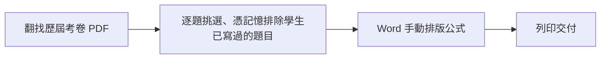

# 商業需求文件 (BRD) - 家教專用數理題庫系統

> **版本:** v1.0 | **更新:** 2026-08-25 | **狀態:** 活躍
> **Owner:** Ben（楊本顥）
> **語域:** L2（業務／需求）
> **實例:** 單例（整個系統一份）
> **定位:** 本文件回答「為何建置此系統、商業層要達成什麼、以何標準驗收」；不含功能規格與技術方案（前者見 [`srs.md`](./srs.md)，後者見 [`../03_architecture/adr/`](../03_architecture/adr/)）。

## 目錄

- [1. 商業背景 (Business Context)](#1-商業背景-business-context)
- [2. 現行流程 (As-Is)](#2-現行流程-as-is)
- [3. 未來流程 (To-Be)](#3-未來流程-to-be)
- [4. 業務規則：需求決策的商業層對應 (Business Rules)](#4-業務規則需求決策的商業層對應-business-rules)
- [5. 階段里程碑 (Milestones)](#5-階段里程碑-milestones)
- [6. 追溯](#6-追溯)

## 1. 商業背景 (Business Context)

| 項目 | 內容 |
| :--- | :--- |
| **業務單位與利害關係人** | 一對一數理家教老師（高中數學／物理）；本系統為單人使用、單人維運，使用者即決策者與 Owner（Ben） |
| **驅動因素** | 效率：出卷的行政損耗遠大於教學本身，一份客製特訓卷常花 **2 小時以上**（來源：根 README「問題背景與設計目標」）。複雜公式（直式分數、根式、幾何圖）於 Word 手動排版易跑位；題目散落於各份歷屆考卷 PDF，學生作答歷史無從追蹤，重複出題傷害練習效果 |
| **預期效益** | 出一份卷由 2 小時以上縮短至幾分鐘；全程零手動排版；同一學生保證不拿到已寫過的題目 |
| **附帶目標（階段 2 起）** | 在同一個實際運作的產品上，將多 Agent 協作與 RAG 檢索落實為可檢視、可量測、可逐行驗證的工程實作 |

## 2. 現行流程 (As-Is)

| 步驟 | 執行者 | 工具／系統 | 痛點 |
| :--- | :--- | :--- | :--- |
| 翻找與挑題 | 家教老師 | 檔案總管、PDF 閱讀器 | 題目散在各份考卷，無法依章節／難度篩選 |
| 排除已寫過的題目 | 家教老師 | 記憶、紙本紀錄 | 哪個學生寫過哪題無從追蹤，重複出題傷害練習效果 |
| 公式排版 | 家教老師 | Word 方程式編輯器 | 直式分數、根式、幾何圖手動排版易跑位，耗時最鉅 |
| 交付 | 家教老師 | 印表機 | 整體流程每卷 2 小時以上 |

## 3. 未來流程 (To-Be)

- 與 As-Is 的關鍵差異：拆題與入庫全自動（含分類、公式修復、獨立驗答、去重；有疑慮的題目進人工複核佇列而不阻塞其餘題目）；已作答排除由資料庫（attempts）取代人工記憶；公式排版由自製 LaTeX→OOXML 轉換取代手動操作。
- 過渡期並行策略：原型 `exam/` 封存（ARCHIVED）僅作重構對照，實際執行一律使用 `exam_pro/`；資料層由 MySQL 切換至 PostgreSQL 16 + pgvector，於 2026-08-21 依 `docs/archive/cutover-runbook.md` 切換上線並定義回滾界線。
- 成功標準：上傳 PDF → 自動拆題入庫 → 選學生一鍵組卷 → 匯出可直接列印的 Word，全程零手動排版；同一學生保證不會拿到寫過的題目（來源：根 README「成功標準」）。

## 4. 業務規則：需求決策的商業層對應 (Business Rules)

本專案不另立 BR-* 編號；商業規則直接以需求決策 DEC-* 表述，全列與核准狀態見 [`requirements_tracker.md`](./requirements_tracker.md) ①需求決策。

| ID | 商業層規則 | 商業動機 | 里程碑 |
| :--- | :--- | :--- | :--- |
| DEC-001 | 核心出卷流程（上傳 PDF→拆題入庫→組卷→匯出）全程零手動排版 | 消除每卷 2 小時以上的行政損耗 | 原型期 |
| DEC-002 | 交付物必須是 Word 原生方程式 `.docx`（直式分數，可用 Word 方程式編輯器開啟） | 學生端用紙本，公式須為直式而非斜線貼圖 | 重構 v1 |
| DEC-003 | 同一學生保證不拿到已寫過的題目（attempts 排除；組卷家族互斥） | 重複出題傷害練習效果 | 原型期→階段 1 資料化 |
| DEC-004 | 資料層遷移 PostgreSQL 16 + pgvector，向量與關聯條件同庫同查詢 | 「排除已作答」等關聯條件與相似檢索須於單一查詢完成，避免雙份資料同步成本 | 階段 1（2026-08-21 上線） |
| DEC-005 | 拆題採程式碼編排的多 Agent 管線：硬閘門、部分入庫、人工複核佇列 | 單一大型 prompt 曾致整批 400 失敗；一批 90 題中 3 題有疑慮時其餘 87 題仍應入庫 | 階段 2 |
| DEC-006 | RAG 落地為產品功能：相似題／變式題（檢索優先）／自然語言查題／學生弱點面板 | 檢索命中即不產生生成費用；題庫成長後立即可檢索、具可解釋性 | 階段 3 |
| DEC-007 | 產品收斂：草稿→確認出卷、批改輕量化、學生管理、對話式助教 | 日常流程矯正，降低每日操作成本 | 階段 4 |
| DEC-008 | AI 成本必須受控：限流、模型路由、RPM 節流、單 job 與每日成本上限 | 單人自用工具，AI 額度不得被無限消耗 | 重構 v1 起、階段 2 完備 |
| DEC-009 | 題庫屬私有資產：資料與驗證邏輯留本地，僅 LLM 呼叫對外；repo 不含題庫內容 | 私有資產不宜外流第三方平台；匯入內容著作權屬原權利人 | 全程 |

## 5. 階段里程碑 (Milestones)

| 階段 | 主題 | 商業層交付 | 狀態 |
| :--- | :--- | :--- | :--- |
| 原型 | `exam/` 單檔驗證 | 驗證「AI 拆題＋組卷＋匯出」核心流程可行 | ARCHIVED（保留當重構對照） |
| 重構 | `exam_pro/` v1 | 可對外部署的系統：白名單硬驗證、LaTeX→OOXML 公式引擎、認證、限流、交易 | ✅ |
| 階段 1 | 資料層（MySQL→PG16+pgvector） | 學生／作答正規化、hybrid 檢索、eval 體系；2026-08-21 切換上線 | ✅ |
| 階段 2 | Agent 管線 | 拆題全自動化：硬閘門、部分入庫、人工複核佇列、cassette | ✅ |
| 階段 3 | RAG 三落點 | 相似題、變式題、自然語言查題、學生弱點面板 | ✅ |
| 階段 4 | 產品收斂 | 草稿→確認出卷、批改輕量化、學生管理、對話式助教 | ✅（CI 全綠 @ 0ff47b4） |

四階段簽核證據見 [`requirements_tracker.md`](./requirements_tracker.md) ③Gate。

## 6. 追溯

- 上游：使用者痛點與目標之原始陳述——根 README「問題背景與設計目標」（repo 相對路徑 `README.md`）。
- 下游（DEC → 系統需求）：DEC-001～DEC-009 全列與沿革見 [`requirements_tracker.md`](./requirements_tracker.md) ①②；轉為 FR-001～FR-016 與 NFR-001～NFR-006 的規格見 [`srs.md`](./srs.md)。
- 下游（DEC → 架構決策）：DEC-004 → ADR-001、ADR-002；DEC-005 → ADR-003、ADR-005、ADR-006；DEC-002 → ADR-004；DEC-007 → ADR-007；決策檔於 [`../03_architecture/adr/`](../03_architecture/adr/)。
- 本文件之 DEC ID 於 SRS、追蹤簿與測試中引用，不重述內容。
