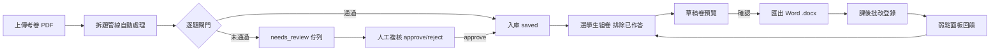

# UX 研究與使用者旅程 (UX Research & Journey) - 家教專用數理題庫系統

> **版本:** v1.0 | **更新:** 2026-08-25 | **狀態:** 活躍
> **Owner:** Ben（楊本顥）
> **語域:** L2（產品）
> **實例:** 單例（整個產品一份）
> **定位:** 本文件回答「使用者在什麼情境下、依什麼順序完成出卷與批改，哪裡曾經卡住」；不包含全站頁面層級與導航（歸各 `ui_spec-*.md`），亦不包含需求裁決本文（歸 `../01_requirements/requirements_tracker.md`）。

## 目錄

- [1. 研究計畫 (Research Plan)](#1-研究計畫-research-plan)
- [2. 研究發現 (Research Report)](#2-研究發現-research-report)
- [3. Persona](#3-persona)
- [4. 使用者旅程 (Journey Map)](#4-使用者旅程-journey-map)
- [5. User Flow / Task Flow](#5-user-flow--task-flow)
- [6. 可用性測試 (Usability Testing)](#6-可用性測試-usability-testing)
- [7. 追溯](#7-追溯)

## 1. 研究計畫 (Research Plan)

| 項目 | 內容 |
| :--- | :--- |
| **研究目標** | 確認出卷流程中行政損耗的來源與量級，據以決定自動化投資的優先序（拆題、排版、作答追蹤何者先做） |
| **對象與招募** | 單一使用者：作者本人（一對一高中數理家教老師）；無招募，屬第一手自用觀察 |
| **方法** | 自身日常出卷流程的實作觀察（dogfooding）：原型 `exam/` 驗證核心流程，`exam_pro/` 四階段依實際使用回饋逐步收斂 |
| **訪談題綱** | 不適用（單人自用）；痛點與決策沿革記錄於根 `README.md` 與 `docs/roadmap-plan.md` |

## 2. 研究發現 (Research Report)

| 發現 | 證據（來源座標） | 對產品的意義 |
| :--- | :--- | :--- |
| 一份特訓卷的行政作業常花 2 小時以上，遠大於教學本身 | 根 `README.md`「問題背景與設計目標」 | 全流程自動化為第一優先（DEC-001） |
| 複雜公式（直式分數、根式）在 Word 手動排版容易跑位；學生端用紙本，公式必須是直式而非斜線 | 根 `README.md`「關鍵約束」 | 交付物必須是 Word 原生方程式 `.docx`（DEC-002） |
| 題目散在各份考卷，哪個學生寫過哪題無從追蹤，重複出題傷害練習效果 | 根 `README.md`「問題背景與設計目標」 | 以 attempts 排除已作答題目（DEC-003） |
| 單一大型 prompt 拆題曾因一題格式錯誤導致整批 400 失敗 | 根 `README.md`「改造前的狀態」 | 改為多 Agent 管線＋部分入庫＋人工複核（DEC-005） |
| AI 拆題輸出格式不可控（章節名漂移使組卷抽不到題） | 根 `README.md`「設計決策 2」 | 伺服器端白名單硬驗證（NFR 面向，支撐 DEC-001） |
| 出卷後的批改與弱點回饋仍為手動，紀錄不回流題庫 | `docs/stage4-plan.md`（階段 4 動機） | 批改輕量化與弱點面板納入產品（DEC-006、DEC-007） |

## 3. Persona

| 項目 | Persona A（唯一） |
| :--- | :--- |
| **角色** | 一對一數理家教老師（高中數學／物理），作者本人；單人使用、單人維運 |
| **目標** | 出一份客製特訓卷從 2 小時以上縮短到幾分鐘，把心力留給一對一指導本身 |
| **痛點** | 公式手動排版跑位；題目散落各考卷難以檢索；同一學生重複拿到寫過的題目；AI 費用無上限的疑慮（DEC-008） |
| **使用情境／裝置** | 本機 Windows 環境，瀏覽器操作 `http://localhost:3000`；題庫屬私有資產，資料留本地（DEC-009） |

## 4. 使用者旅程 (Journey Map)

七個階段對應日常出卷週期；「痛點」欄為改造前狀態，「產品機會」欄為現行對策。

| 階段 | 使用者行為 | 情緒 | 痛點（改造前） | 產品機會（現行） | 對應 DEC / FR |
| :--- | :--- | :--- | :--- | :--- | :--- |
| 收到考卷 PDF | 取得歷屆考卷，上傳建立拆題 job | 期待 | 題目困在 PDF 內，無法檢索重用 | 非同步拆題 job，上傳後即可離開等待 | DEC-001／FR-001 |
| 拆題（自動） | 等待管線跑完，查看 job 進度 | 觀望 | 單一 prompt 一題錯即整批失敗 | 六個 sub-agent＋硬閘門＋部分入庫 | DEC-005／FR-001–FR-005 |
| 複核 | 處理 needs_review 佇列，逐題核准或退回 | 專注 | 錯誤無具體原因，只能整批重來 | 八種 needs_review 原因逐題呈現 | DEC-005／FR-006 |
| 選學生組卷 | 選學生與章節，產生草稿卷並確認 | 掌控 | 憑記憶避開寫過的題，仍會重複 | attempts 排除＋家族互斥，草稿→確認兩段式 | DEC-003、DEC-007／FR-008 |
| 匯出 | 下載 `.docx` 直接列印 | 放鬆 | Word 手動排版公式跑位，耗時最久 | 自製 LaTeX→OOXML，原生方程式零手動排版 | DEC-002／FR-009 |
| 批改 | 課後登錄每題對錯 | 例行 | 紙上批改結果不回流系統 | 批改輕量化介面，結果寫回作答歷史 | DEC-007／FR-015 |
| 回饋弱點 | 查看學生弱點面板，決定下次出題方向 | 洞察 | 弱點靠印象，無數據支撐 | 弱點面板＋相似題／變式題補強 | DEC-006／FR-010、FR-011、FR-013 |

## 5. User Flow / Task Flow

- 入口：主頁上傳區（`exam_pro/public/index.html`）；決策點：逐題閘門與草稿確認；例外路徑：needs_review 佇列（`exam_pro/public/js/review.js`）；完成的可觀察結果：可列印的 `.docx` 與寫回的作答紀錄。
- 批改→弱點→再組卷構成閉環：作答歷史即為下次排除與弱點統計的資料來源（FR-008、FR-013、FR-015 同源）。
- 全站各頁細節歸 [`ui_spec-main.md`](./ui_spec-main.md)、[`ui_spec-review.md`](./ui_spec-review.md)、[`ui_spec-students.md`](./ui_spec-students.md)。

## 6. 可用性測試 (Usability Testing)

單人自用專案未執行正式可用性測試，完成率**未量測**（無多受測者樣本，量測無意義）；以日常實際使用（dogfooding）與階段試用取代，下表僅記錄實際遭遇的卡點與對策。

| 任務 | 完成率 | 卡點（實際遭遇） | 改善項目 |
| :--- | :--- | :--- | :--- |
| 上傳 PDF 至入庫 | 未量測 | 一題格式錯誤導致整批失敗 | 部分入庫：90 題中 3 題有疑慮，其餘 87 題照常入庫（FR-006） |
| 組卷排除已寫過的題 | 未量測 | 組卷日期時區差一天（UTC 造成台灣早上 8 點前誤差） | 時區修正（見根 `README.md` 重構對照表） |
| 匯出 Word 公式 | 未量測 | 原型 temml 產出的 MathML 包裝 Word 不保證接受 | 改為 `docx` 原生 Math 物件（FR-009） |

## 7. 追溯

- 上游：DEC-001–DEC-009（`../01_requirements/requirements_tracker.md`）——本文件的痛點欄逐項對應其 VOC 來源。
- 下游：FR-001、FR-006、FR-008、FR-009、FR-010、FR-011、FR-013、FR-015 的頁面實作，見 [`ui_spec-main.md`](./ui_spec-main.md)、[`ui_spec-review.md`](./ui_spec-review.md)、[`ui_spec-students.md`](./ui_spec-students.md)、[`ui_spec-nlq.md`](./ui_spec-nlq.md)、[`ui_spec-variants.md`](./ui_spec-variants.md)、[`ui_spec-assistant.md`](./ui_spec-assistant.md)。
- User Flow 節點 → 驗收：組卷排除與家族互斥由 ACPT-008-*／TC-008-* 驗證（`../05_qa/qa_tracker.md`）。
