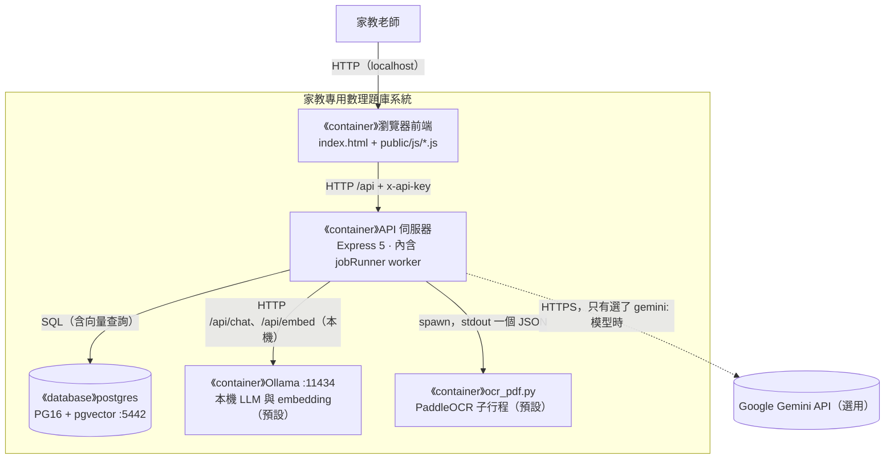
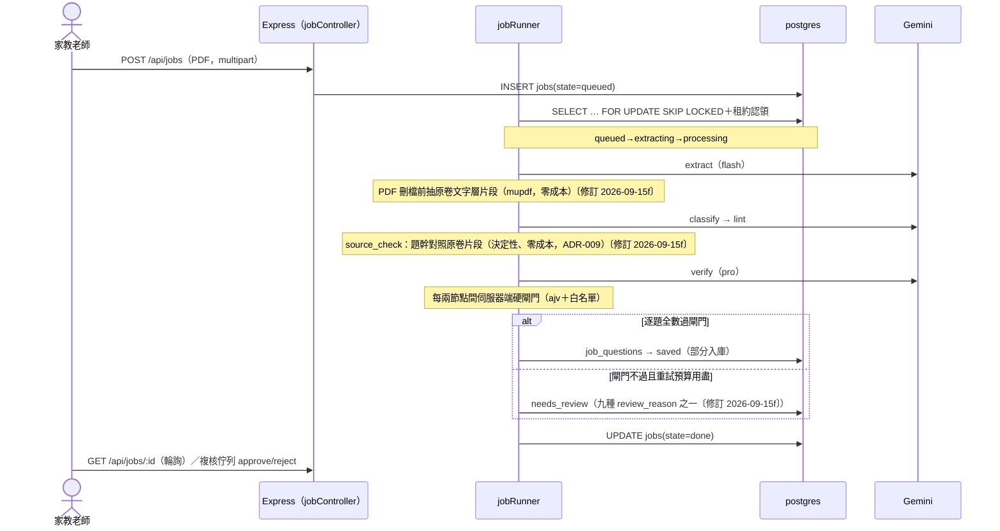
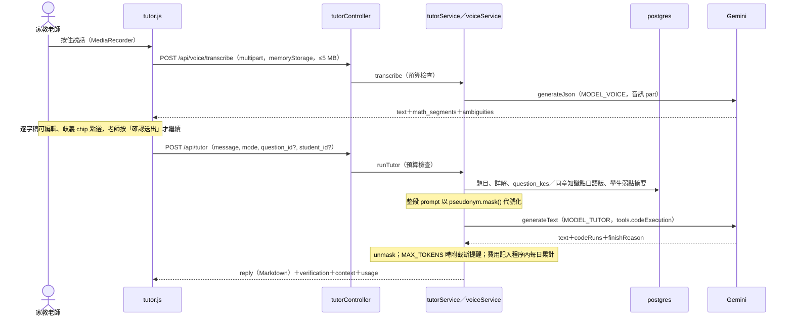

# 軟體架構文件 (SAD) - 家教專用數理題庫系統

> **版本:** v1.5 | **更新:** 2026-09-26 | **狀態:** 活躍
> **Owner:** Ben（楊本顥）
> **語域:** L3（工程）
> **實例:** 單例（系統架構契約只有一份）
>
> **定位**：系統級架構的單一真實來源——C4 L1–L3、分層、關鍵旅程與部署視圖。回答「系統由哪些 runtime 組成、邊界在哪、為什麼」；架構決策理由歸 [`adr/`](./adr/)（ADR-001～009〔修訂 2026-09-15f〕；ADR-010～015〔修訂 2026-09-24〕；ADR-016～017〔修訂 2026-09-26 本機模式〕），API／資料契約歸 `../04_design/`，Code 層細節歸 `../04_design/lld.md`。

> 🛠 **2026-09-15b 修訂**（feat/pseudonymize-student-names 程式碼同步）：§資料合規補學生姓名代號化。修改處以〔修訂 2026-09-15b〕行內標記。

> 🛠 **2026-08-29 修訂**（PR #3–#7 程式碼同步）：§1.3 textFormatter 補原生 OMML 二維矩陣、services 清單補 figureService；§5.2 download-word 流程補矩陣支援；§6 schema 演進清單補 0006_source_type；§7 整合測試數 259→260、§8 CI 證據 commit 0ff47b4→f8f6574（來源：commit f7a9c41 訊息實測、PR #7 merge）；§9 附圖裁切入庫由「待啟動」改為已完成（2026-08-27 實作合併，PR #3）。本輪所有修改處均以〔修訂 2026-08-29〕行內標記。
> 🛠 **2026-09-15d 修訂**（測試數同步）：部署視圖測試列 整合 260→262（main f2af3c2 實測，2026-09-15 晚間）。修改處以〔修訂 2026-09-15d〕行內標記。
> 🛠 **2026-09-15f 修訂**（feat/source-check，FR-020、ADR-009）：§1.3 services 補 sourceText／mupdf、agents 補 source_check；§2 逐題狀態加 source_checked、review_reason 八種→九種；§5.1 管線資料流插入原卷文字層比對節點；§6 schema 演進補 0007、0009；§7 整合測試 262→269；§10 追溯補 DEC-013／FR-020／ADR-009。修改處以〔修訂 2026-09-15f〕行內標記。
> 🛠 **2026-09-15 合併同步**（feat/follow-up-links 併入 feat/source-check）：部署視圖測試列整合數更新為 297（合併後實跑）；§5 schema 演進補 0008_follow_up。上列兩分支修訂列所載之各分支實測數與範圍為當時紀錄，保留不改。合併重算處以〔修訂 2026-09-15e〕〔修訂 2026-09-15f〕雙標記。
> 🛠 **2026-09-16b 修訂**（主線同步，PR #30–#33 合併後）：§部署視圖測試列整合數同步為 317（PR #30–#33 併入 main 後 CI 實測）。修改處以〔修訂 2026-09-16b〕行內標記。
> 🛠 **2026-09-24 修訂**（階段 5 整合回填，分支 `stage5/int-docs`；契約 `docs/interfaces-stage5.md`）：§1.1 外部呼叫補 code execution 與音訊輸入；§1.2 前端分頁；§1.3 新模組（kcService、kcTagService、tagKc agent、kcWeaknessService、remedialService、coverageService、tutorService、voiceService、`services/llm.generateText`、化學 `*_chem` agent 分支、`utils/chemFormula.js`、`utils/units.js`）與階段 5 旗標表；§2 術語；§3 技術選型補 ADR-010～015；§4 需求摘要補 FR-021～035、NFR-007～009；§5 新增 5.4 補救卷與 5.5 AI 家教旅程；§6 schema 演進補 0010–0012、資料合規補錄音與家教代號化；§7 測試數；§8、§9 補階段 5 的成本、安全與風險；§10 追溯。修改處以〔修訂 2026-09-24〕行內標記。
> 🛠 **2026-09-26 修訂**（本機模式與章節重整的架構回填，分支 `dec/x-readme-architecture`，基底 `local/integration` 的 `7b7065c`；契約 [`docs/local-mode.md`](../../docs/local-mode.md)、[ADR-017](./adr/ADR-017-local-first-inference.md)、[ADR-016](./adr/ADR-016-chapter-whitelist-restructure.md)）：§1.1 外部呼叫改為「預設無」、Gemini 降為選用；§1.2 補 Ollama 與 PaddleOCR 兩個 runtime；§1.3 補本機模式的模組；§2 review_reason 第十種；§3 補 ADR-016、ADR-017；§5.1 註明本機模式的拆題路徑；§6 schema 演進補 0013–0015；§7 新增 7.1「本機模式（預設）的部署視圖與取捨」；§8、§9 補本機模式的離線保證與風險；§10 追溯。修改處以〔修訂 2026-09-26 本機模式〕行內標記。

## 目錄

- [1. C4 架構視圖](#1-c4-架構視圖)
- [2. 邊界與分層](#2-邊界與分層)
- [3. 技術選型](#3-技術選型)
- [4. 需求摘要](#4-需求摘要)
- [5. 關鍵使用者旅程](#5-關鍵使用者旅程)
- [6. 資料架構](#6-資料架構)
- [7. 部署視圖](#7-部署視圖)
- [8. 跨領域考量](#8-跨領域考量)
- [9. 風險與演進](#9-風險與演進)
- [10. 追溯](#10-追溯)

## 1. C4 架構視圖

### 1.1 L1 — System Context

家教老師（唯一 Person，單人使用）以 HTTP 操作系統（上傳 PDF、組卷、批改、對話；階段 5 起另有審定知識點、出補救卷、問 AI 家教與按住說話〔修訂 2026-09-24〕）；系統唯一對外呼叫為 Google Gemini API（HTTPS：flash 拆題／分類、pro 驗答、`gemini-embedding-001`；階段 5 另有家教的 code execution 工具呼叫與語音轉寫的音訊輸入，仍是同一個供應商、同一條 `services/llm` 出口〔修訂 2026-09-24〕）。外部系統五類盤點：雲端服務＝Gemini（DEC-009）；資料源＝老師上傳之考卷 PDF（multipart，非系統）；交易、推送、備份系統＝無（備份為本機 `exam_pro/scripts/` 腳本，不構成外部系統）。

〔修訂 2026-09-26 本機模式〕上段是 Gemini 模式。**預設的本機模式（ADR-017）下，系統執行期沒有任何對外呼叫**：LLM 與 embedding 由同機的 Ollama 提供（`OLLAMA_HOST` 不是本機位址時啟動警告），OCR 由同機的 PaddleOCR 子行程提供，前端資產由 `/vendor/` 本機提供；Gemini 降為選用的外部系統，只有 `MODEL_*`／`EMBED_MODEL` 選了 Gemini 的模型時才會呼叫，語音轉寫與家教的 code execution 也只在這一路可用。

### 1.2 L2 — Container

| Container | 類型 | 技術 | 何時啟用 | L3 揭露 |
| :--- | :--- | :--- | :---: | :---: |
| 瀏覽器前端 | UI | 零打包器單頁 HTML + ES modules（`exam_pro/public/`） | 現在 | 表代圖（六頁見 `../02_ux_ui/` ui_spec；階段 5 另有知識點、AI 家教兩個頂層分頁與補救卷、覆蓋率兩個子區塊，見 `ui_spec-kc.md`／`ui_spec-tutor.md`／`ui_spec-remedial.md`〔修訂 2026-09-24〕） |
| API 伺服器（含 jobRunner worker） | process | Node.js 24 + Express 5 | 現在 | ✅ §1.3 |
| 開發資料庫 postgres | DB | PostgreSQL 16 + pgvector（埠 5442，volume） | 現在 | 表代圖（§6 ER） |
| 測試資料庫 postgres_test | DB | PostgreSQL 16 + pgvector（埠 5433，tmpfs） | 測試/CI | 略（schema 同上） |
| 本機推論伺服器 Ollama〔修訂 2026-09-26 本機模式〕 | process（第三方，同機） | Ollama，`127.0.0.1:11434`；`qwen3-vl:8b`／`qwen3:8b`／`qwen3-embedding:0.6b`，只用 CPU | 本機模式（預設） | 表代圖（§7.1） |
| 本機 OCR 子行程〔修訂 2026-09-26 本機模式〕 | process（按需啟動） | Python venv `exam_pro/ocr_service/.venv`＋`ocr_pdf.py`（PaddleOCR PP-StructureV3） | 本機模式、`OCR_ENGINE=paddle` | 表代圖（§7.1） |

jobRunner 與 Express 同一 Node process（一人維運不拆行程，ADR-003）；佇列以 PG `FOR UPDATE SKIP LOCKED`＋租約認領，行程重啟可斷點續跑（NFR-005），未來拆為獨立 worker 行程不需改 agent 合約。

### 1.3 L3 — Component（API 伺服器 Container）

| 模組（repo 路徑） | 職責 | 依賴方向 |
| :--- | :--- | :--- |
| `exam_pro/routes/index.js`、`middleware/` | /api 路由表（旗標控制掛載）、認證與限流 | → controllers |
| `exam_pro/controllers/` | HTTP 邊界：question／exam／studentAdmin／paper／review／job／assistant／word | → services、queries |
| `exam_pro/services/` | 用例邏輯：llm(gemini/fake/throttle)、retrieval、nlq、variant、weakness、assistant、embed、word、figure（附圖裁切）〔修訂 2026-08-29〕、sourceText（extract 階段抽原卷文字層片段）與 mupdf（共用 WASM 載入器）〔修訂 2026-09-15f〕 | → queries、utils、agents |
| `exam_pro/agents/`（+`schemas/`） | 七個 sub-agent 純函式（extract/classify/lint/source_check〔修訂 2026-09-15f〕/verify/dedup/generateVariant）＋輸出 JSON Schema | 僅收 ctx 注入，不碰 DB／env（NFR-003） |
| `exam_pro/workers/jobRunner.js` | 編排：SKIP LOCKED 認領、租約、重試預算、RPM 節流、成本上限 | → agents、pipeline |
| `exam_pro/pipeline/stateMachine.js` | jobs／job_questions 合法狀態轉移的唯一定義 | 被 workers 引用 |
| `exam_pro/queries/hybrid.js` | hybrid 檢索 SQL（pgvector＋jieba 全文，RRF；API 與 eval 共用） | → config/db |
| `exam_pro/utils/` | textFormatter(LaTeX→OOXML，含原生 OMML 二維矩陣：m:d>m:m>m:mr>m:e，10 種矩陣環境)〔修訂 2026-08-29〕、tokenize（全案唯一分詞，ADR-008）、shuffle、pickOnePerFamily、answerCompare 等 | 純函式 |
| `exam_pro/config/` | 單一真相：db、models、pricing、features、chapters | 被全體引用 |

〔修訂 2026-09-24〕階段 5 新增或擴充的模組（契約 `docs/interfaces-stage5.md` 第 4 條；各模組職責的權威文件見最右欄）：

| 模組（repo 路徑） | 職責 | 依賴方向 | 權威文件 |
| :--- | :--- | :--- | :--- |
| `exam_pro/config/errorTypes.js`、`config/studentProfile.js` | 錯因十碼白名單（代碼凍結、只增不改名）；學生檔案選項白名單 | 被 paper／studentAdmin／tutor 引用 | `docs/grading-and-profile.md` |
| `exam_pro/config/chemistryChapters.js`；`config/chapters.js`（擴充） | 化學 44 章（AI 草擬待定稿）；`VOLUMES` 三科、`LEGACY_SUBJECTS`／`LEGACY_CHAPTERS`（數學＋物理 66 章，餵既有 LLM 呼叫）、`SUBJECT_GROUPS` | 被全體引用 | `docs/chemistry.md` |
| `exam_pro/agents/*.js` 的化學分支（agent 名 `extract_chem`／`classify_chem`／`lint_chem`／`verify_chem`／`variant_chem`）、`agents/promptParts.js`（`resolveSubjectGroup`、`CHEM_LATEX_RULES`）、`agents/schemas/index.js`（`buildSchema(name, { group })`） | 卷別分流：化學走新模板與新 schema，數學／物理路徑逐字不變 | 同既有 agent（ctx 注入，不碰 DB／env） | ADR-010 |
| `exam_pro/utils/chemFormula.js`、`utils/units.js`（新）；`utils/answerCompare.js`、`utils/textFormatter.js`、`utils/tokenize.js`（擴充） | `\ce{…}` 子集→一般 LaTeX 再交既有 OMML 解析器；單位因次與換算；化學式比對；分詞詞典補化學名詞 | 純函式 | `docs/chemistry.md` |
| `exam_pro/agents/tagKc.js`（agent `kc_tag`） | 為一題在「該章知識點」中挑 1–3 個（動態 enum schema）；純函式合約 | ctx 注入 | ADR-011 |
| `exam_pro/services/kcService.js`、`services/kcTagService.js`、`controllers/kcController.js`；`utils/kcSeed.js`（擴充） | 知識點讀寫與種子檔載入（已審定不覆寫、全體環檢查）；`tagQuestion`（human 優先、信心門檻、預算煞車由 runner 掛鉤判斷） | → config/db、services/llm、agents/tagKc | `docs/knowledge-components.md` |
| `exam_pro/services/kcWeaknessService.js`、`services/remedialService.js`、`services/coverageService.js`、`controllers/remedialController.js`；`controllers/examController.js`（擴充） | 知識點弱點（Wilson 下界）；補救卷配額與目標（純函式 `buildPlan`）；覆蓋率；組卷候選池抽成 `buildCandidatePoolQuery`／`pickByQuotas` 供單章、blueprint、補救卷三路徑共用 | → config/db、examController | `docs/remedial.md`、ADR-014 |
| `exam_pro/services/llm/`（擴充：`index.js`、`gemini.js`、`fake.js`、`cassette.js`、`templates.js`） | 新增 `generateText`（自由文字＋code execution，回 `{text, codeRuns, finishReason, usage, latencyMs}`）；parts 支援音訊與圖片；`generateJson` 行為不變 | → Gemini SDK | `docs/tutor.md` §3.3、契約第 5.1 條 |
| `exam_pro/services/tutorService.js`、`services/voiceService.js`、`controllers/tutorController.js`；`config/models.js`（`MODEL_TUTOR`／`MODEL_VOICE`／`MODEL_KC_TAG` getter） | 家教脈絡組裝（題目、口語版、代號化學生摘要）、程序內每日預算；語音轉寫（memoryStorage、ajv 再驗） | → services/llm、config/db、utils/pseudonym | `docs/tutor.md`、ADR-012、ADR-013 |
| `exam_pro/workers/jobRunner.js`（擴充） | save 節點寫詳解（`buildSolutionFields`）；save COMMIT 後的知識點標註掛鉤（`runKcTagHook`，fire-and-forget、預算煞車）；`jobs.subject_group` 帶進 `ctx.job` | → agents、services | ADR-010、ADR-011、ADR-015 |
| `exam_pro/scripts/load_kc.js`、`backfill_kc.js`、`backfill_solutions.js`、`reindex_search_tsv.js` | `kc:load`／`kc:backfill`（呼叫 LLM）／`solution:backfill`（不呼叫 LLM）／`search:reindex`（分詞改變後重算 `search_tsv`，不呼叫 LLM） | → services | 各功能文件 |
| `exam_pro/public/js/kc.js`、`remedial.js`、`tutor.js`（新）；`students.js`、`variants.js`、`review.js`、`nlq.js`、`index.html`（最小掛鉤，標〔stage5 WS-X〕） | 知識點分頁、補救卷與覆蓋率、AI 家教與按住說話；批改卡錯因與學生檔案；「加入補救卷」按鈕；卷別選單 | → `/api` | `../02_ux_ui/` |

階段 5 旗標（`config/features.js`，預設全關；關閉時路由不掛載、前端整段不渲染）〔修訂 2026-09-24〕：

| 旗標 | 控制 | 相依 |
| :--- | :--- | :--- |
| `FEATURE_KC` | 知識點四支 API 與「知識點」分頁 | — |
| `FEATURE_KC_TAGGING` | 管線入庫後自動標知識點（呼叫 LLM）；不控制路由 | 需先載入知識點（FEATURE_KC 可不開） |
| `FEATURE_REMEDIAL` | 知識點弱點、補救卷、加題查詢、覆蓋率四支 API 與兩個子區塊 | 補救卷區塊在學生視圖，需 `FEATURE_STUDENTS`；「加入補救卷」按鈕另需 `FEATURE_VARIANTS`＋`FEATURE_SIMILAR` |
| `FEATURE_TUTOR` | `POST /api/tutor` 與「AI 家教」分頁 | — |
| `FEATURE_VOICE` | `POST /api/voice/transcribe` 與按住說話按鈕 | 需同時開 `FEATURE_TUTOR` |

WS-A（批改細節、學生檔案、詳解）與 WS-B（化學）屬既有核心流程的延伸，不另加旗標。

〔修訂 2026-09-26 本機模式〕本機模式新增或擴充的模組（凍結契約 `docs/local-mode.md` 第 3～6 條，裁決 LM-n 在第 9 條）。本機模式不是旗標，由 `MODEL_*`／`EMBED_MODEL` 的 `vendor:` 前綴決定；Gemini 路徑送出的 prompt、schema 與 cassette 鍵逐位元不變（契約第 1 條第 2 點）：

| 模組（repo 路徑） | 職責 | 依賴方向 | 權威文件 |
| :--- | :--- | :--- | :--- |
| `exam_pro/config/models.js`、`config/pricing.js` | `VENDORS` 加 `ollama`、本機預設模型、`MODEL_TEXT` getter（拆題模型是 `ollama` 時＝`MODEL_VERIFY`，否則＝`MODEL_EXTRACT`）；`ollama` 單價一律 0 | 被全體引用 | 契約第 2 條、LM-15 |
| `exam_pro/services/llm/ollama.js`（新）；`services/llm/index.js`、`throttle.js`、`fixture.js`（擴充） | Ollama 轉接：`generateJson`／`generateText`／`embed`，回傳形狀與 `gemini.js` 相同；依 vendor 分派；`ollama` 併發桶（預設 1，LLM 與 embedding 共用）；走 `node:http`，逾時由 `OLLAMA_TIMEOUT_MS` 控制 | → Ollama HTTP（預設本機；非本機位址啟動警告） | 契約第 3 條、LM-1、LM-10 |
| `exam_pro/services/ocr/`（新）、`exam_pro/ocr_service/`（新，Python） | `ocrPdf`：live 時呼叫 `ocr_pdf.py`（PP-StructureV3，公式轉 LaTeX，繁體中文，CPU）；record／replay 走 cassette（agent `ocr`，鍵含 `paddleocr@<版本>`，只存 Markdown 不存圖片），CI 不需要 Python | → Python 子行程 | 契約第 4 條、LM-16 |
| `exam_pro/agents/extract.js`（本機路徑）、`agents/extractCrossCheck.js`（新） | 拆題模型是 `ollama` 時：OCR → 視覺版（`extract_vision`）→ OCR 版（`extract_ocr`）→ 純函式交叉驗證（逐題對齊、題幹 bigram Jaccard ≥ 0.85 為一致、兩版都合格時採公式能過 `parseLatexStrict` 的一版）；每題帶 `cross_check` | ctx 注入 | 契約第 4 條、LM-4、LM-6 |
| `exam_pro/workers/jobRunner.js`（擴充） | `cross_check.status ≠ 'agree'` 的題走完後續節點後一律 `needs_review('extract_disagree')`；依供應商而定的塊大小（本機 2 頁）、節點逾時（本機 45 分）、工作併發（本機 1） | → agents | 契約第 4 條、LM-3、LM-5 |
| `exam_pro/public/`、`app.js`（擴充） | MathJax、Tailwind、GSAP、字型改由 `/vendor/` 本機提供；`check:html` 串 `scripts/check_html_offline.js` 鎖住 `public/` 不得出現外部資源網址；語音路由沒掛載時前端改顯示「本機模式不提供語音」 | → `/api`、`/vendor` | 契約第 5 條、LM-2、LM-13 |
| `exam_pro/eval/lib/localMode.js`、`eval/tools/rerecord_all.js`、`scripts/windows/*.bat` | 重錄前檢查（Ollama、模型、OCR 自我檢查、測試庫）、時間粗估取代費用估算；Windows 一鍵安裝（`setup_local_ai.bat`）與重錄（`record_local.bat`） | → services | 契約第 6 條、第 10 條 |

## 2. 邊界與分層

| 術語 | 定義 |
| :--- | :--- |
| job | 一次 PDF 拆題任務；`jobs` 表一列，狀態機 queued→extracting→processing→done/failed |
| job_question | job 內單題，逐題狀態 extracted→hashed→classified→linted→source_checked〔修訂 2026-09-15f〕→verified→deduped→saved／needs_review／rejected |
| 部分入庫 | 合格題入 `questions`，有疑慮題帶九種 `review_reason` 之一進複核佇列（FR-006；第九種 `transcription_mismatch` 為題幹與原卷不符，FR-020〔修訂 2026-09-15f〕；本機模式加第十種 `extract_disagree`＝拆題交叉驗證不一致，migration 0015、LM-3〔修訂 2026-09-26 本機模式〕） |
| 交叉驗證（cross_check）〔修訂 2026-09-26 本機模式〕 | 本機拆題時 PaddleOCR 版與視覺模型版逐題對齊比對的結果：`agree`／`disagree`／`vision_only`／`ocr_only`；只有 `agree` 可能自動入庫。反例：它不是「答案對不對」的檢查（那是 verify），只比兩版抄下來的題幹 |
| 變式家族 | `COALESCE(variant_of, id)` 同值題群；組卷每家族至多一題（FR-008） |
| hybrid 檢索 | 向量側＋全文側以 RRF(k=60) 融合的同一段 SQL，服務相似題／NLQ／變式檢索優先／kNN 分類四落點 |
| 卷別（subject_group）〔修訂 2026-09-24〕 | 上傳時指定 `math_physics` 或 `chemistry`；決定管線走凍結的數學／物理模板或化學模板（ADR-010）。反例：題目的「科目」是題目屬性，卷別是上傳批次屬性 |
| 知識點（KC）〔修訂 2026-09-24〕 | 比章節更細的診斷單位（每章 3–8 個），以 `code` 穩定識別；`status` draft（AI 草稿）／approved（Owner 審定）（ADR-011） |
| 口語版（spoken_text）〔修訂 2026-09-24〕 | 老師上課講給學生聽的說法（40–300 字、不含 LaTeX）；AI 家教優先沿用（ADR-012） |
| 掌握度下界（mastery_lb）〔修訂 2026-09-24〕 | 正確率的 Wilson 下界（z＝1.96），樣本少的單位被視為「還不確定」而優先補救（ADR-014） |
| 補救卷草稿〔修訂 2026-09-24〕 | 依弱點產生、只回不寫的題目清單（補救／先備／延伸三桶）；老師確認時才走既有 confirm-paper 寫 attempts |

邏輯分層（Clean Architecture 對應；C4 Container 是物理 runtime，兩者不混畫）：

| 層 | 程式碼位置 | 職責 |
| :--- | :--- | :--- |
| Domain | `exam_pro/agents/`、`exam_pro/utils/`、`exam_pro/pipeline/stateMachine.js` | 純函式業務規則：拆題判定、狀態轉移、公式轉換、比對 |
| Application | `exam_pro/controllers/`、`exam_pro/services/`、`exam_pro/workers/` | 用例編排、交易、預算與重試 |
| Infrastructure | `exam_pro/config/`、`exam_pro/queries/`、`exam_pro/middleware/`、`exam_pro/migrations/` | DB 連線與 SQL、LLM client、認證限流、schema 演進 |

## 3. 技術選型

| 分類 | 選用 | 理由（一句） | 備選（棄） | ADR |
| :--- | :--- | :--- | :--- | :--- |
| 後端 | Node.js 24 + Express 5 | 單人維運、零編譯期、與前端同語言 | —（承自原型） | — |
| DB＋向量 | PostgreSQL 16 + pgvector | 關聯條件（attempts 排除、家族互斥）與向量檢索必須同一查詢 | Pinecone／Milvus／FAISS | [ADR-001](./adr/ADR-001-pgvector-over-dedicated-vector-db.md) |
| 檢索融合 | jieba 應用層分詞＋RRF k=60 | 兩路分數量綱不可比，RRF 只看名次零校準 | 加權融合（保留備案） | [ADR-002](./adr/ADR-002-hybrid-retrieval-rrf.md) |
| Agent 編排 | 程式碼狀態機＋PG 佇列 | 流程確定性、LLM 只做單步智力活 | LangChain／LangGraph | [ADR-003](./adr/ADR-003-code-orchestrated-agent-pipeline.md) |
| Word 匯出 | 自製 LaTeX→OOXML 解析器 | docx 原生 Math 物件、零外部二進位相依 | Pandoc | [ADR-004](./adr/ADR-004-custom-latex-ooxml-over-pandoc.md) |
| LLM 驗證 | 伺服器端白名單硬驗證 | prompt 不是保證，兩層防線＋部分入庫 | 信任 responseSchema | [ADR-005](./adr/ADR-005-server-side-whitelist-validation.md) |
| 測試 | cassette record/replay | CI 零金鑰零網路確定性重播 | 每次真呼叫 | [ADR-006](./adr/ADR-006-cassette-record-replay.md) |
| 助教工具調用 | responseJsonSchema 決策迴圈 | 不依賴原生 function calling，args_json 字串傳參 | 原生 function calling | [ADR-007](./adr/ADR-007-assistant-no-native-function-calling.md) |
| 中文分詞 | `exam_pro/utils/tokenize.js` 全案唯一 | 寫入端與查詢端須用同一詞表，否則全文索引無聲失準 | PG 端 zhparser | [ADR-008](./adr/ADR-008-app-layer-chinese-tokenizer.md) |
| 化學併入〔修訂 2026-09-24〕 | 卷別分流：化學另立 agent 名、模板與 schema | 數學／物理的 prompt 與 enum 一改，全部 cassette 失效 | 把化學併進同一組 prompt／enum | [ADR-010](./adr/ADR-010-subject-group-routing-for-chemistry.md) |
| 知識點模型〔修訂 2026-09-24〕 | code 穩定識別、口語版、AI 與人工標註分權 | 自增 id 隨載入順序變；Owner 審定是最貴的內容，要受保護 | 以 id 對照、單一來源標註 | [ADR-011](./adr/ADR-011-knowledge-component-model.md) |
| AI 家教〔修訂 2026-09-24〕 | 獨立 `tutorService`＋Gemini code execution＋口語版為講法依據 | 助教「只根據工具結果」與家教「用模型知識講解」互斥；計算交給程式 | 擴充助教；自架 SymPy sidecar | [ADR-012](./adr/ADR-012-tutor-code-execution-spoken-text.md) |
| 語音輸入〔修訂 2026-09-24〕 | 按住說話＋逐字稿確認才送出、音訊不落地 | 口述數學式有結構歧義，確認這一步不能省 | 即時語音、直接送出、本機 ASR | [ADR-013](./adr/ADR-013-push-to-talk-teacher-confirm.md) |
| 補救卷選題〔修訂 2026-09-24〕 | Wilson 下界排序＋配額重用既有選題閘門 | 小樣本不等於精熟；另寫一套選題會與組卷漂移 | 原始錯誤率排序、BKT／IRT | [ADR-014](./adr/ADR-014-remedial-paper-wilson-quota.md) |
| 批改細節與詳解〔修訂 2026-09-24〕 | attempts 加欄＋伺服器端白名單；詳解分來源、以 verify 摘要零成本回填 | 錯因要讓診斷、補救卷、家教都讀得到；詳解素材已存在 | 另開錯因表、另叫 LLM 生成詳解 | [ADR-015](./adr/ADR-015-grading-detail-and-solution-provenance.md) |
| 章節白名單〔修訂 2026-09-26 本機模式〕 | 整份換成對齊 108 龍騰目錄（數學 52、物理 34 章），cassette 刻意失效一次重錄；舊題規則提議＋老師確認搬章 | 白名單是分類軸，錯位的軸讓下游統計一起錯 | 只在知識點層補齊；新舊兩套值域並存 | [ADR-016](./adr/ADR-016-chapter-whitelist-restructure.md) |
| 推論部署〔修訂 2026-09-26 本機模式〕 | 本機 Ollama＋PaddleOCR 為預設、Gemini 保留可切回；拆題 OCR／視覺雙路交叉驗證；CI 照舊 replay | 執行期不連外、零費用，且不動 Gemini 路徑與 CI 機制（§7.1） | 維持 Gemini 只控花費；其他雲端免費額度或遠端 GPU | [ADR-017](./adr/ADR-017-local-first-inference.md) |

## 4. 需求摘要

- FR-001～009：核心流程——PDF 拆題 job、分類、公式修復、獨立驗答、去重、複核、題庫 CRUD、組卷（草稿→確認）、Word 匯出（對應 DEC-001～005）。
- FR-010～016：RAG 與收斂——相似題、變式題、NLQ、弱點面板、學生管理、批改、對話式助教（對應 DEC-006～007）。全表與模組對應見 [`engineering_tracker.md`](./engineering_tracker.md)。
- FR-021～035〔修訂 2026-09-24〕：階段 5 教學診斷平台——批改細節與錯因分布、學生檔案、文字詳解與 Word 版本（FR-021～025，DEC-015／017）；化學入庫與排版（FR-026～027，DEC-019）；知識點與標註（FR-028～029，DEC-015）；知識點掌握度、補救卷、跨章配額、覆蓋率（FR-030～033，DEC-016）；AI 家教與按住說話（FR-034～035，DEC-018）。定義見 [`../01_requirements/srs.md`](../01_requirements/srs.md)。

| NFR | 需求 | 目標值／機制 |
| :--- | :--- | :--- |
| NFR-002 成本 | 單 job／每日成本上限 | 限流、RPM 節流、逐 token 計費 |
| NFR-004 品質 | eval ratchet 門檻 | saved_rate ≥0.87（實測 0.90）、Recall@5 hybrid 1.000；低於門檻 CI 轉紅 |
| NFR-005 可靠 | 斷點續跑 | SKIP LOCKED＋租約、逾時退避重試 |
| NFR-006 一致 | 組卷不重複 | 建卷與 attempts 同交易；migrations 只增不改 |
| NFR-007 成本〔修訂 2026-09-24〕 | 家教／語音／知識點標註的花費受控 | `TUTOR_DAILY_BUDGET_USD`（程序內按日）、tutor／voice 各 10/min；標註遇管線預算觸頂即不標；thinking 預算與輸出上限成對 |
| NFR-008 隱私〔修訂 2026-09-24〕 | 錄音不落地、姓名不出境 | memoryStorage、≤5 MB；家教 prompt 整段代號化 |
| NFR-009 相容〔修訂 2026-09-24〕 | 既有 cassette 不失效 | 數學／物理 agent 的 SYSTEM／模板／schema 逐字不變；新模板註冊字串含 SYSTEM |

## 5. 關鍵使用者旅程

### 5.1 拆題管線（FR-001～006；jobs 狀態機）

〔修訂 2026-09-26 本機模式〕上圖是 Gemini 模式（`G`＝Gemini，extract 直接送 PDF）。本機模式下 `G` 換成同機的 Ollama，extract 一塊（2 頁）內依序做：PaddleOCR 子行程 → 視覺版（`qwen3-vl:8b` 看頁面 PNG）→ OCR 版（`qwen3:8b` 把 OCR 的 Markdown 整理成同一份 schema）→ `extractCrossCheck` 合併；之後 classify、lint、verify 都走 `qwen3:8b`（LM-15），節點順序與閘門不變。`cross_check` 不是 `agree` 的題照樣走完，最後停在 `needs_review('extract_disagree')`。

### 5.2 組卷與 Word 匯出（FR-008／009）

1. `POST /api/generate-paper`（dry_run）：`NOT EXISTS` attempts 排除已作答＋`pickOnePerFamily` 家族互斥，回傳預覽（不寫庫，可 `exclude_ids` 換題）。
2. `POST /api/confirm-paper`（student_id, question_ids）：預覽仍有效則同一交易 INSERT `exam_papers`＋`attempts`（NFR-006）；預覽過期回 409。
3. `POST /api/download-word`：`textFormatter` 將 LaTeX 轉為 OOXML 原生 Math 物件（含 10 種矩陣環境的原生二維排版〔修訂 2026-08-29〕），`question_img` 為 `/figures/<檔名>` 的題由 `wordService` 讀 `data/figures/` 本機檔嵌入（路徑限制在附圖目錄內；讀不到放「（附圖遺失）」不中斷，FR-018，`docs/figures.md`）〔修訂 2026-09-16〕，回傳 `.docx`。

### 5.3 對話式助教迴圈（FR-016）

（本節描述對話式助教；階段 5 的 AI 家教是另一個服務，見 §5.5〔修訂 2026-09-24〕）`POST /api/assistant`（assistantController，10/min 限流）進入 ReAct 決策迴圈（responseJsonSchema，ADR-007）：主控 Gemini 每輪回傳決策 JSON（工具名＋`args_json` 字串），伺服器調用五個只讀工具之一（弱點／NLQ 搜題／相似題／出卷 dry-run 預覽），只讀 SQL 的結果（空結果亦為答案）餵回下一輪，直到產生最終回覆；回覆附完整工具調用軌跡，實際出卷仍由使用者確認（FR-016）。

### 5.4 批改→診斷→補救卷（FR-021、FR-030、FR-031；ADR-014、ADR-015）〔修訂 2026-09-24〕

1. `PATCH /api/papers/:id/results`：對錯＋錯因＋部分給分＋學生答案／註記，單一交易（`jsonb_to_recordset`＋`has_*` 旗標分辨「沒送」與「送 null」）。
2. `GET /api/students/:id/weakness/kc`：`attempts ⋈ question_kcs` 依 weight 加權，正確度 `COALESCE(score, result)`，Wilson 下界排序（`kcWeaknessService`）。
3. `POST /api/students/:id/remedial-paper`：`remedialService.buildPlan`（純函式）決定 basis、三桶配額與各目標難度區間 → `examController.pickByQuotas` 逐目標走與單章組卷**同一段**候選池 SQL 與 `pickPaperUnits`（家族互斥、承上組）→ 回草稿，不寫庫。
4. 老師在 `#remedial` 刪／加題（加題前 `GET …/remedial-paper/items` 取整組）→ 既有 `POST /api/confirm-paper` 同交易建卷＋attempts → `POST /api/download-word`。

### 5.5 AI 家教與按住說話（FR-034、FR-035；ADR-012、ADR-013）〔修訂 2026-09-24〕

## 6. 資料架構

關聯骨架：students 1—N attempts（作答紀錄）／exam_papers（出卷）；exam_papers 1—N attempts（同交易寫入）；questions 1—N attempts，並以 `variant_of` 自參照構成變式家族；jobs 1—N job_questions（逐題狀態）與 job_events（成本／延遲／token 帳）；job_questions saved 後入 questions。ER 全圖與欄位定義歸 [`../04_design/db_design.md`](../04_design/db_design.md)。

- schema 演進：`exam_pro/migrations/` 0001_init／0002_vector（768 維，embedding 欄）／0003_jobs（狀態以 DDL CHECK 寫死）／0004_origin_legacy／0005_text_hash_unique／0006_source_type（questions.source_type NOT NULL DEFAULT 'unknown'＋jobs.source_type，五值 CHECK）〔修訂 2026-08-29〕／0007_source_detail／0008_follow_up（questions.follows_question_id 自我參照 FK＋follows_src，承上題綁定）〔修訂 2026-09-15e〕／0009_source_check（job_questions.state、review_reason 與 job_events.error_class 三條 CHECK 各加一值）〔修訂 2026-09-15f〕／0010_attempt_detail_student_profile（attempts 批改細節四欄、students 檔案五欄）／0011_chemistry_solution_subject_group（questions.subject 加化學、solution_text／solution_src、jobs.subject_group）／0012_knowledge_components（knowledge_components、question_kcs、kc_prerequisites）〔修訂 2026-09-24〕／0013_teacher_edit_markers（`questions.solution_cleared_at`、`knowledge_components.edited_at`，S5-41、S5-43）／0014_chapter_migration_log（章節重整的搬章紀錄，ADR-016）／0015_extract_disagree（review_reason CHECK 加 `extract_disagree`，LM-3）〔修訂 2026-09-26 本機模式〕；只增不改（NFR-006）。本機模式換 embedding 模型但維度同為 768，`vector(768)` 欄位不改，只需 `embed:backfill` 重算向量。
- 一致性：組卷＋attempts、批改回填皆單一交易全有全無；其餘讀取為即時 SQL 聚合，無最終一致場景。
- 資料合規：題庫屬私有資產、repo 不含題庫內容（DEC-009）；學生僅存姓名與作答紀錄，本機單人使用。學生姓名不出境：NLQ 與助教送 LLM／embedding 前以 `exam_pro/utils/pseudonym.js` 換成「學生#<id>」代號，回覆後還原〔修訂 2026-09-15b〕；AI 家教組好整段 prompt 後一次遮罩（對全部學生），cassette 鍵只放遮罩後 prompt 的雜湊；語音錄音只在請求記憶體內、不落地，但錄音本身原樣送 Gemini 轉寫（姓名遮罩只作用在文字）〔修訂 2026-09-24〕。本機模式下 prompt、題目與向量計算都不離開本機，語音不提供；代號化照舊執行（切回 Gemini 時仍需要）〔修訂 2026-09-26 本機模式〕。

## 7. 部署視圖

單機拓撲：開發機（Windows 11／Docker Desktop WSL2 後端，無 scaling）上，Node.js 24 行程（API 伺服器＋jobRunner，:3000）連 Docker 內兩個 `pgvector/pgvector:pg16` 容器——postgres :5442（named volume，開發）與 postgres_test :5433（tmpfs，整合／e2e／eval）；僅 `LLM_MODE=live/record` 時以 HTTPS 對外連 Google Gemini API。〔修訂 2026-09-26 本機模式〕預設的本機模式下同一台電腦再多兩個 runtime（Ollama、PaddleOCR 子行程），執行期不對外連線；Gemini 只在選了 Gemini 模型時才連，見 §7.1。

| 環境 | Deployment 模式 | 資料庫 | 備份／監控 |
| :--- | :--- | :--- | :--- |
| 開發（唯一運行環境） | 本機 `npm start`＋`docker compose up` | postgres :5442（volume 持久化） | `exam_pro/scripts/` 備份腳本；`npm run report:jobs` 成本報表 |
| 測試（本機） | 同機，另指 TEST_DATABASE_URL | postgres_test :5433（tmpfs，`_test` 後綴強制） | 整合 317〔修訂 2026-09-16b〕／e2e 11，`--test-concurrency=1`；整合分支 stage5/integration：unit 2258、integration 481、e2e 11，五個 eval 全綠（主控合併後更新數字）〔修訂 2026-09-24〕；`local/integration`（`7b7065c`）2026-09-26 實跑：unit 2716（2 略過）、integration 503 全綠，e2e 11 項中 3 項與五個 eval 因缺本機模型的回放檔／向量檔紅燈（契約第 8 條的預期）；這些是 `7b7065c` 當時的數字，合併後由整合者更新〔修訂 2026-09-26 本機模式〕 |
| CI（GitHub Actions） | workflow 起 pg16 service | 臨時容器 | `LLM_MODE=replay`＋`EMBED_MODE=fixture`，零金鑰零網路；〔修訂 2026-09-26 本機模式〕`ci.yml` 明寫本機模型名（決定讀哪一組 cassette），不裝 Ollama、不裝 Python |

- 開發埠取 5442 而非 5432：開發機原生 PostgreSQL 17 服務占用 5432，同埠並存會產生誤導性的驗證失敗（`exam_pro/README.md` 安裝節）。
- 無 Staging／Production 分環境：單人本機自用（DEC-009）；對外部署須先改存取控制（見 §8 安全）。CI/CD 細節歸 [`../06_ops/deployment_and_operations.md`](../06_ops/deployment_and_operations.md)。

### 7.1 本機模式（預設）的部署視圖與取捨

〔修訂 2026-09-26 本機模式〕選項比較與決策見 [ADR-017](./adr/ADR-017-local-first-inference.md)（狀態：提議）；凍結介面、裁決 LM-1～LM-16、`.env` 範例、速度粗估與疑難排解見 [`docs/local-mode.md`](../../docs/local-mode.md)；上線順序見 [`deployment_and_operations.md`](../06_ops/deployment_and_operations.md) §3.5。本節只記架構層的形狀與取捨。

**硬體前提**（Owner 裁決，契約第 0 條）：Intel Core i5-8265U（4 核 8 緒）、16 GB RAM、沒有獨立顯卡、Windows。模型只能用 CPU 跑。

**拓撲**：同一台電腦上四個 runtime——Node 行程（API＋jobRunner）、Docker 內的 PostgreSQL、Ollama 服務（`127.0.0.1:11434`）、按需啟動的 PaddleOCR 子行程。模型呼叫仍只有 `services/llm` 一個出口（依 `vendor:` 前綴分派 `gemini.js`／`ollama.js`），OCR 只有 `services/ocr` 一個出口，兩者走同一套 record／replay（ADR-006 的鍵公式不變）。

| 工作 | 本機預設 | 設定（未設時的退路） |
| :--- | :--- | :--- |
| 拆題：看頁面圖片 | `qwen3-vl:8b` | `MODEL_EXTRACT` |
| 拆題：OCR 文字 → 題目 JSON | `qwen3:8b` | `MODEL_OCR_STRUCTURE`（→ `MODEL_VERIFY`） |
| 分類、公式 lint、知識點標註、對話式助教 | `qwen3:8b` | `MODEL_TEXT`（拆題模型是 `ollama` 時 → `MODEL_VERIFY`，否則 → `MODEL_EXTRACT`）；`MODEL_KC_TAG`、`MODEL_ASSISTANT` 未設時沿用它 |
| 驗算、出變式、AI 家教 | `qwen3:8b` | `MODEL_VERIFY`（`MODEL_VARIANT`、`MODEL_TUTOR` 未設時沿用） |
| 自然語言查題的 LLM 輔路徑 | `qwen3:8b` | `MODEL_NLQ`（LM-7）；執行期逾時仍是 4 秒，本機模型回不來，實際上只用規則 |
| 向量 | `qwen3-embedding:0.6b`，768 維 | `EMBED_MODEL`、`EMBED_DIM` |
| OCR | PaddleOCR 3.7.0（PP-StructureV3＋PP-FormulaNet_plus-M），PaddlePaddle 3.2.2 | `OCR_ENGINE`（`none`＝只用視覺模型，交叉驗證停用、所有題停在複核） |

**取捨一：拆題為什麼要 OCR＋視覺模型交叉驗證**

- 8B 視覺模型單獨抄題的錯字率預期明顯高於 Gemini，而系統的品質底線是「錯的題不自動入庫」（ADR-005、ADR-009）。只靠後面的節點擋不住：驗算只比答案，題幹抄錯時正確答案反而像錯的；原卷文字層比對（ADR-009）只在有文字層的 PDF 上有用，掃描檔沒有文字層可比、只能跳過。
- 兩條路徑的失誤來源不同：PaddleOCR 逐字元辨識、公式另走公式辨識模型；視覺模型直接看整頁圖片。預期兩者在同一處抄成同一種錯的機率較低（這是設計假設，尚未以本機資料量測），所以「兩版一致」當成自動入庫的必要條件，「不一致」就交給人。
- 合併規則寫成純函式（`agents/extractCrossCheck.js`，可單元測試）：依順序＋題幹相似度對齊（正規化後的字元 bigram Jaccard，≥ 0.85 為一致）；兩版都合格時採公式能通過 `parseLatexStrict` 的那一版，都通過則採視覺版；另一版題幹放進 payload 給複核頁對照。不一致或只有一版的題**照樣走完後續節點**，最後一律 `needs_review('extract_disagree')`。
- 代價：一塊內三步串行跑在同一顆 CPU 上（OCR → 視覺模型 → OCR 結果整理），拆題時間明顯比單路長；複核佇列變長；0.85 尚未以本機實測校準（LM-12 ③）；「兩版一致」不保證正確，例如一塊 2 頁切斷的跨頁題，兩個引擎可能一致地拆成殘缺的一題（LM-12 ①）。另一個要誠實說的點：OCR 版的整理與驗算同為 `qwen3:8b`，拆題與驗算仍是不同步驟、不同輸入（抄題 vs. 重新解題），但不再是 Gemini 時期「拆題 flash、驗算 pro」那種不同等級模型的互相制衡。

**取捨二：16 GB 只放得下一個 8B 模型 → `MODEL_TEXT`（LM-15）**

- 原本分類、lint、知識點標註、主控助教都沿用「拆題模型」。本機模式下拆題模型是視覺的 `qwen3-vl:8b`，而驗算是 `qwen3:8b`：一份考卷的每一題都會在兩個模型之間來回換載，每次換載 1～2 分鐘，記憶體也吃緊。
- 做法（Owner 選方案 A）：新增 `MODEL_TEXT` getter，拆題模型是 `ollama` 時預設＝`MODEL_VERIFY`，否則＝`MODEL_EXTRACT`。agent 讀 `ctx.config.models.text`，沒給就退回 `extract`。拆題之後的逐題節點因此都是 `qwen3:8b`，不必換載。搭配的併發設定：`OLLAMA_CONCURRENCY=1`（LLM 與 embedding 共用一個桶，LM-10）、`JOB_CONCURRENCY=1`（LM-5），建議 `OLLAMA_MAX_LOADED_MODELS=1`。
- 為什麼這樣設計預設值：Gemini 模式下 `MODEL_TEXT` 等於原本的 `MODEL_EXTRACT`，cassette 的鍵與費用一字不差；本機的分類／lint cassette 本來就要重錄（LM-14），所以這次改動不浪費任何錄製。
- 代價：分類與驗算同一個模型，分類不是驗算的獨立檢查。拆題階段每一塊仍會在兩個模型之間換載（視覺版 `qwen3-vl:8b` ↔ OCR 版 `qwen3:8b`），LM-15 省下的是拆題之後逐題節點的換載。

**取捨三：PaddlePaddle 版本釘選（LM-16）**

- `ocr_service/requirements.txt` 的四個套件全部釘死版本。第一次在 Owner 的 Windows 實機執行 `setup_local_ai.bat` 時，PaddlePaddle 3.3.x 在 CPU＋oneDNN 路徑辨識第一頁就丟 `NotImplementedError: ConvertPirAttribute2RuntimeAttribute not support …`（上游已知問題；2026-09-25 時修正尚未發布到 PyPI）。
- 決定：`paddlepaddle==3.2.2`（上游建議的版本），保留 oneDNN 的速度；不採「關掉 oneDNN」，因為 CPU 上會慢很多。`paddleocr`／`paddlex` 版本不變，所以 OCR cassette 的鍵（`paddleocr@3.7.0`）不變、不必重錄。
- 架構上的意義：OCR 引擎版本是 cassette 鍵的一部分（`services/ocr` 從 `requirements.txt` 讀版本號），升級 PaddleOCR 會刻意讓既有的 OCR cassette 失效——與「換 LLM 模型就重錄」同一條規則。PyPI 出了含修正的版本再評估升級。

**取捨四：CI 不跟著本機化；慢是預期的**

- CI 的價值是確定性，而 cassette 已經把「模型的回答」凍結成檔案。`ci.yml` 只把模型名換成本機的，由 Owner 在自己的電腦上以本機模型重錄；runner 不裝 Ollama、不裝 Python。重錄之前 e2e 與五個 eval 只會因缺 cassette／缺向量紅燈（契約第 8 條）。本機重錄後量到低於門檻的，門檻數字不動（LM-14），由 Owner 裁決。
- 逾時、租約與併發依供應商調整：拆題模型是 `ollama` 時一塊 2 頁、節點逾時 45 分、單次呼叫逾時 30 分；Node 內建 `fetch` 在 300 秒沒有回應標頭就放棄，所以 Ollama 轉接改用 `node:http`（LM-1）。明寫在 `.env` 的值一律優先，所以舊 `.env` 留著 Gemini 時期的 `JOB_PDF_CHUNK_PAGES=20`／`JOB_NODE_TIMEOUT_MS=120000` 會讓本機拆題逾時（使用說明第 10.3 條）。

**已知限制**（完整清單見 LM-12 與使用說明第 10.5 條）：速度只有依規格推算的粗估、尚未在 Owner 電腦上實測；語音提問不掛載；AI 家教不做程式驗算（回答不得宣稱驗算過，LM-11）；換 embedding 模型後正式庫要 `embed:backfill` 全部題目再 `search:reindex`。

## 8. 跨領域考量

| 維度 | 方案 | 狀態 |
| :--- | :--- | :--- |
| 日誌／指標 | `job_events` 逐步記成本、延遲、token；eval 報表含完整量測環境（模型 ID、cassette、golden） | 已實作 |
| 安全 | x-api-key（timing-safe）、CORS 白名單、防 SSRF（isSafeImageUrl）、參數化 SQL、production 不外洩錯誤細節；API_KEY 注入前端，僅適用本機自用（NFR-001） | 已實作，能力邊界已文件化 |
| 成本 | 模型路由（flash 拆題／pro 驗答）、閘門依成本排序、kNN 短路、單 job $0.50／每日 $5 上限（NFR-002）；階段 5：家教＋語音每日 $1（程序內）、標註遇管線預算觸頂即略過、`kc:backfill` 先印預估（NFR-007）〔修訂 2026-09-24〕 | 已實作；家教與語音的實際花費未實測（依價目表估算） |
| 前端注入〔修訂 2026-09-24〕 | 家教回覆的受限 Markdown 先整段 escape 再轉換；伺服器文字一律 textContent。MathJax 載入 `ui/safe`（過濾 `\class`、`\style`、`\cssId`），並設 `safeOptions.allow.URLs = 'none'`：數學式裡不產生任何連結（受 LLM 影響的文字會進 `renderMath`） | 已處理，尚待瀏覽器實測（裁決 S5-35；URLs 為最終審查修正） |
| 可測試性 | agent 純函式合約（ctx 注入）、cassette、五個 eval suite＋ratchet；replay miss 於 main 視為錯誤（NFR-003／004） | 已實作，CI 全綠 @ f8f6574〔修訂 2026-08-29〕 |
| 執行期零外連〔修訂 2026-09-26 本機模式〕 | 本機模式下所有模型呼叫預設只到 `127.0.0.1` 的 Ollama（`OLLAMA_HOST` 不是本機位址時啟動警告）；NLQ 未設模型時預設本機（LM-7）；前端資產由 `/vendor/` 提供，`check:html` 鎖住 `public/` 不得出現外部資源網址；PaddleOCR 的模型在安裝時下載（`--warmup`），執行期不下載；`ollama` 單價一律 0，成本上限機制保留給 Gemini | 已實作並有單元測試（`publicOffline`、`llmOllama*`、`localMode*` 等）；整份考卷的本機拆題速度與品質尚未實測 |

## 9. 風險與演進

| 風險 | 可能性 | 影響 | 緩解 |
| :--- | :--- | :--- | :--- |
| RRF 稀釋 MRR（hybrid 0.824 vs 純向量 0.9575） | 已發生（已知代價） | 正確題偶爾掉到第 2–3 名 | 場景要 recall 非 top-1；私有 golden 量過再決定是否切加權（ADR-002） |
| 換分詞器／embedding 模型致索引失準 | 低 | 全文側或向量欄整批失效 | tokenize.js 凍結；模型 ID 進 cassette 鍵；`exam_pro/scripts/backfill_embeddings.js` 重灌 |
| 對外部署誤用 API_KEY 當存取控制 | 低（單人自用） | 金鑰隨首頁外洩 | README 明文能力邊界；部署前置反向代理或登入機制 |
| jobRunner 與 API 同行程互相干擾 | 低 | 高負載時互搶資源 | 併發 2 槽＋節流；agent 合約允許無痛拆行程 |
| 化學路徑沒有任何 cassette〔修訂 2026-09-24〕 | 已存在 | CI 量不到化學拆題與分類品質 | `eval:classify-chem` 已備妥（24 題），待 Owner 錄製後量測；化學章節表、例句、別名皆待定稿 |
| 家教、語音、`kc_tag` 從未呼叫真 Gemini〔修訂 2026-09-24〕 | 已存在 | 提示效果、驗算覆蓋率、webm 相容性、thinking 預算是否足夠皆未知 | 功能旗標預設關；Owner live 試用後再錄 cassette、做 eval |
| 分詞詞典改變使既有 `search_tsv` 過期〔修訂 2026-09-24〕 | 已發生（化學詞彙） | 部分既有數理題的關鍵字檢索查不到 | 上線步驟必跑 `npm run search:reindex`（不呼叫 LLM）；之後改詞典或章名都要再跑 |
| 家教每日預算只在程序內〔修訂 2026-09-24〕 | 中 | 重啟歸零、多實例不共享；最後一次呼叫可能略超 | 單機單人可接受；要跨重啟累計需新表（預留 0017 未用） |
| 知識點與口語版為 AI 草擬〔修訂 2026-09-24〕 | 已存在 | 內容錯誤會直接進家教講法 | 審查已修正一輪數理化錯誤；draft 在 prompt 內標明「僅供參考」；Owner 逐章審定 |
| 本機模型的量測低於門檻〔修訂 2026-09-26 本機模式〕 | 已發生 | 2026-09-25 在 Owner 電腦上以本機模型（`ollama:qwen3:8b`）重錄 classify 與 nlq（報表 `eval/reports/classify-2026-09-25-7b7065c.json`、`nlq-2026-09-25-7b7065c.json`，不在 repo）：classify accuracy 0.8370（77/92，門檻 0.87）、macro-F1 0.7419（門檻 0.8956），兩項未達；nlq LLM 輔路徑 filters_exact 0.6250（門檻 0.72）、recall@10 0.7500（門檻 0.845），兩項未達；nlq 規則路徑 rule_coverage 0.84、filters_exact 1、recall@10 1，都達標。retrieval、pipeline、variant 待補。本機回放檔進版控後，CI 的 eval 會因這四項維持紅燈 | `thresholds.json` 的數字不動（LM-14），Owner 決定不放寬門檻、改善後重量；之後會依 CR-9（`docs/chapter-restructure.md`）與 NLQ LLM 輔路徑的改善重錄，數字會更新。注意這些數字與 Gemini 時期的差距同時包含換模型與章節重整（ADR-016）兩個因素 |
| CPU 推論速度未實測〔修訂 2026-09-26 本機模式〕 | 中 | 一份考卷可能超過一夜、長節點逾時 | 逾時與租約依供應商調整、`JOB_NODE_TIMEOUT_MS`／`OLLAMA_TIMEOUT_MS` 可調（LM-12 ②）；Owner 實測後更新使用說明，若無法接受即觸發 ADR-017 的重新評估 |
| 交叉驗證的門檻與盲點〔修訂 2026-09-26 本機模式〕 | 已存在 | 0.85 未校準，複核比例可能偏高；跨頁題可能兩版一致地殘缺而自動入庫 | 本機重錄後依實測校準（LM-12 ③）；複核時留意跨頁題，之後可加一頁前瞻（LM-12 ①） |
| PaddlePaddle／PaddleOCR 上游版本問題〔修訂 2026-09-26 本機模式〕 | 已發生（LM-16） | 安裝後辨識第一頁即失敗 | 版本全部釘死、錯誤訊息附處理方式；升級 PaddleOCR＝OCR cassette 失效要重錄 |

演進路線：階段 1 資料層（2026-08-21 上線）→ 階段 2 Agent 管線 → 階段 3 RAG 三落點 → 階段 4 產品收斂＋助教，四階段均已完成。〔修訂 2026-09-26 本機模式〕階段 5 已於 2026-09-25 併入 main（PR #38）；章節重整（ADR-016）與本機模式（ADR-017）在 `local/integration`，尚未併入 main。〔修訂 2026-08-29〕附圖裁切入庫已於 2026-08-27 實作合併（PR #3）：`exam_pro/services/figureService.js`（mupdf 2x 渲染＋sharp 裁圖，存 `data/figures/<jobId>-<idx>.png`）、`app.js` 掛載 `/figures` 靜態目錄、`agents/extract.js` 回傳 figure_page/figure_box＋框幾何驗證、`workers/jobRunner.js` attachFigureImages 寫回 `question_img`；cassette 已重錄（4af4647）。待啟動：P-16 參數化模板（2026-08-25 核准重啟，未動工）；擱置區（私有 golden、A-T16/A-T17）隨時可重啟——狀態登錄於 [`../01_requirements/prd.md`](../01_requirements/prd.md) §5。

## 10. 追溯

| 項目 | ID／連結 |
| :--- | :--- |
| 上游 | DEC-001～009、DEC-013〔修訂 2026-09-15f〕、DEC-014～019〔修訂 2026-09-24〕、FR-001～016、FR-020〔修訂 2026-09-15f〕、FR-021～035〔修訂 2026-09-24〕、NFR-001～009〔修訂 2026-09-24〕（[`../01_requirements/requirements_tracker.md`](../01_requirements/requirements_tracker.md)） |
| 決策 | ADR-001～009（[`adr/`](./adr/)；ADR-009 原卷文字層比對〔修訂 2026-09-15f〕）；ADR-010～015（階段 5：化學卷別分流、知識點模型、AI 家教、語音、補救卷、批改細節與詳解）〔修訂 2026-09-24〕；ADR-016（章節白名單重整）、ADR-017（本機優先推論，提議）〔修訂 2026-09-26 本機模式〕 |
| 契約與裁決〔修訂 2026-09-26 本機模式〕 | [`docs/local-mode.md`](../../docs/local-mode.md)（第 0～8 條凍結介面、第 9 條 LM-1～LM-16、第 10 條使用說明）；[`docs/chapter-restructure.md`](../../docs/chapter-restructure.md)（CR-1～CR-8） |
| 下游 | `../04_design/lld.md`（Code 層）、`../04_design/api_spec.md`／`db_design.md`（契約）、[`engineering_tracker.md`](./engineering_tracker.md)、`../06_ops/`（runbook 四份） |

本文件是架構契約：模組未在此出現即視為不存在；他文件提及而本文未載者，屬本文件之缺陷。
