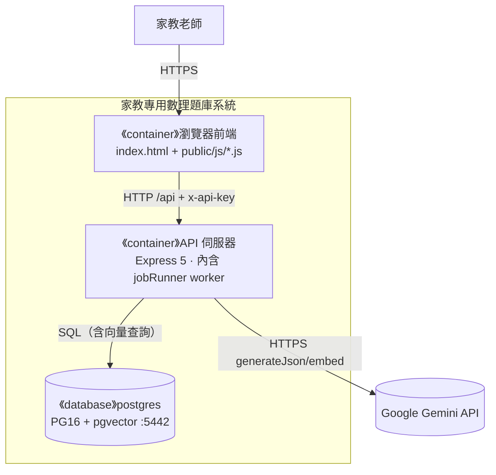
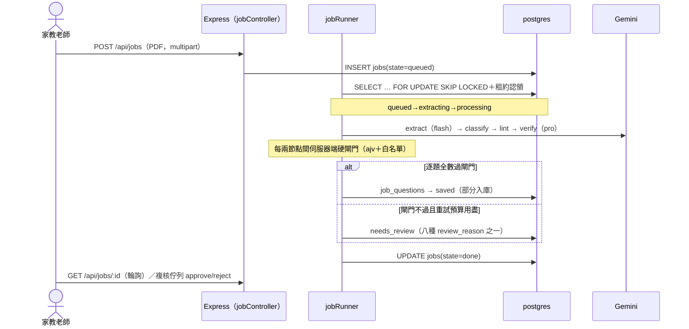

# 軟體架構文件 (SAD) - 家教專用數理題庫系統

> **版本:** v1.0 | **更新:** 2026-08-25 | **狀態:** 活躍
> **Owner:** Ben（楊本顥）
> **語域:** L3（工程）
> **實例:** 單例（系統架構契約只有一份）
>
> **定位**：系統級架構的單一真實來源——C4 L1–L3、分層、關鍵旅程與部署視圖。回答「系統由哪些 runtime 組成、邊界在哪、為什麼」；架構決策理由歸 [`adr/`](./adr/)（ADR-001～008），API／資料契約歸 `../04_design/`，Code 層細節歸 `../04_design/lld.md`。

## 目錄

- [1. C4 架構視圖](#1-c4-架構視圖)
- [2. 邊界與分層](#2-邊界與分層)
- [3. 技術選型](#3-技術選型)
- [4. 需求摘要](#4-需求摘要)
- [5. 關鍵使用者旅程](#5-關鍵使用者旅程)
- [6. 資料架構](#6-資料架構)
- [7. 部署視圖](#7-部署視圖)
- [8. 跨領域考量](#8-跨領域考量)
- [9. 風險與演進](#9-風險與演進)
- [10. 追溯](#10-追溯)

## 1. C4 架構視圖

### 1.1 L1 — System Context

家教老師（唯一 Person，單人使用）以 HTTP 操作系統（上傳 PDF、組卷、批改、對話）；系統唯一對外呼叫為 Google Gemini API（HTTPS：flash 拆題／分類、pro 驗答、`gemini-embedding-001`）。外部系統五類盤點：雲端服務＝Gemini（DEC-009）；資料源＝老師上傳之考卷 PDF（multipart，非系統）；交易、推送、備份系統＝無（備份為本機 `exam_pro/scripts/` 腳本，不構成外部系統）。

### 1.2 L2 — Container

| Container | 類型 | 技術 | 何時啟用 | L3 揭露 |
| :--- | :--- | :--- | :---: | :---: |
| 瀏覽器前端 | UI | 零打包器單頁 HTML + ES modules（`exam_pro/public/`） | 現在 | 表代圖（六頁見 `../02_ux_ui/` ui_spec） |
| API 伺服器（含 jobRunner worker） | process | Node.js 24 + Express 5 | 現在 | ✅ §1.3 |
| 開發資料庫 postgres | DB | PostgreSQL 16 + pgvector（埠 5442，volume） | 現在 | 表代圖（§6 ER） |
| 測試資料庫 postgres_test | DB | PostgreSQL 16 + pgvector（埠 5433，tmpfs） | 測試/CI | 略（schema 同上） |

jobRunner 與 Express 同一 Node process（一人維運不拆行程，ADR-003）；佇列以 PG `FOR UPDATE SKIP LOCKED`＋租約認領，行程重啟可斷點續跑（NFR-005），未來拆為獨立 worker 行程不需改 agent 合約。

### 1.3 L3 — Component（API 伺服器 Container）

| 模組（repo 路徑） | 職責 | 依賴方向 |
| :--- | :--- | :--- |
| `exam_pro/routes/index.js`、`middleware/` | /api 路由表（旗標控制掛載）、認證與限流 | → controllers |
| `exam_pro/controllers/` | HTTP 邊界：question／exam／studentAdmin／paper／review／job／assistant／word | → services、queries |
| `exam_pro/services/` | 用例邏輯：llm(gemini/fake/throttle)、retrieval、nlq、variant、weakness、assistant、embed、word | → queries、utils、agents |
| `exam_pro/agents/`（+`schemas/`） | 六個 sub-agent 純函式（extract/classify/lint/verify/dedup/generateVariant）＋輸出 JSON Schema | 僅收 ctx 注入，不碰 DB／env（NFR-003） |
| `exam_pro/workers/jobRunner.js` | 編排：SKIP LOCKED 認領、租約、重試預算、RPM 節流、成本上限 | → agents、pipeline |
| `exam_pro/pipeline/stateMachine.js` | jobs／job_questions 合法狀態轉移的唯一定義 | 被 workers 引用 |
| `exam_pro/queries/hybrid.js` | hybrid 檢索 SQL（pgvector＋jieba 全文，RRF；API 與 eval 共用） | → config/db |
| `exam_pro/utils/` | textFormatter(LaTeX→OOXML)、tokenize（全案唯一分詞，ADR-008）、shuffle、pickOnePerFamily、answerCompare 等 | 純函式 |
| `exam_pro/config/` | 單一真相：db、models、pricing、features、chapters | 被全體引用 |

## 2. 邊界與分層

| 術語 | 定義 |
| :--- | :--- |
| job | 一次 PDF 拆題任務；`jobs` 表一列，狀態機 queued→extracting→processing→done/failed |
| job_question | job 內單題，逐題狀態 extracted→hashed→classified→linted→verified→deduped→saved／needs_review／rejected |
| 部分入庫 | 合格題入 `questions`，有疑慮題帶八種 `review_reason` 之一進複核佇列（FR-006） |
| 變式家族 | `COALESCE(variant_of, id)` 同值題群；組卷每家族至多一題（FR-008） |
| hybrid 檢索 | 向量側＋全文側以 RRF(k=60) 融合的同一段 SQL，服務相似題／NLQ／變式檢索優先／kNN 分類四落點 |

邏輯分層（Clean Architecture 對應；C4 Container 是物理 runtime，兩者不混畫）：

| 層 | 程式碼位置 | 職責 |
| :--- | :--- | :--- |
| Domain | `exam_pro/agents/`、`exam_pro/utils/`、`exam_pro/pipeline/stateMachine.js` | 純函式業務規則：拆題判定、狀態轉移、公式轉換、比對 |
| Application | `exam_pro/controllers/`、`exam_pro/services/`、`exam_pro/workers/` | 用例編排、交易、預算與重試 |
| Infrastructure | `exam_pro/config/`、`exam_pro/queries/`、`exam_pro/middleware/`、`exam_pro/migrations/` | DB 連線與 SQL、LLM client、認證限流、schema 演進 |

## 3. 技術選型

| 分類 | 選用 | 理由（一句） | 備選（棄） | ADR |
| :--- | :--- | :--- | :--- | :--- |
| 後端 | Node.js 24 + Express 5 | 單人維運、零編譯期、與前端同語言 | —（承自原型） | — |
| DB＋向量 | PostgreSQL 16 + pgvector | 關聯條件（attempts 排除、家族互斥）與向量檢索必須同一查詢 | Pinecone／Milvus／FAISS | [ADR-001](./adr/ADR-001-pgvector-over-dedicated-vector-db.md) |
| 檢索融合 | jieba 應用層分詞＋RRF k=60 | 兩路分數量綱不可比，RRF 只看名次零校準 | 加權融合（保留備案） | [ADR-002](./adr/ADR-002-hybrid-retrieval-rrf.md) |
| Agent 編排 | 程式碼狀態機＋PG 佇列 | 流程確定性、LLM 只做單步智力活 | LangChain／LangGraph | [ADR-003](./adr/ADR-003-code-orchestrated-agent-pipeline.md) |
| Word 匯出 | 自製 LaTeX→OOXML 解析器 | docx 原生 Math 物件、零外部二進位相依 | Pandoc | [ADR-004](./adr/ADR-004-custom-latex-ooxml-over-pandoc.md) |
| LLM 驗證 | 伺服器端白名單硬驗證 | prompt 不是保證，兩層防線＋部分入庫 | 信任 responseSchema | [ADR-005](./adr/ADR-005-server-side-whitelist-validation.md) |
| 測試 | cassette record/replay | CI 零金鑰零網路確定性重播 | 每次真呼叫 | [ADR-006](./adr/ADR-006-cassette-record-replay.md) |
| 助教工具調用 | responseJsonSchema 決策迴圈 | 不依賴原生 function calling，args_json 字串傳參 | 原生 function calling | [ADR-007](./adr/ADR-007-assistant-no-native-function-calling.md) |
| 中文分詞 | `exam_pro/utils/tokenize.js` 全案唯一 | 寫入端與查詢端須用同一詞表，否則全文索引無聲失準 | PG 端 zhparser | [ADR-008](./adr/ADR-008-app-layer-chinese-tokenizer.md) |

## 4. 需求摘要

- FR-001～009：核心流程——PDF 拆題 job、分類、公式修復、獨立驗答、去重、複核、題庫 CRUD、組卷（草稿→確認）、Word 匯出（對應 DEC-001～005）。
- FR-010～016：RAG 與收斂——相似題、變式題、NLQ、弱點面板、學生管理、批改、對話式助教（對應 DEC-006～007）。全表與模組對應見 [`engineering_tracker.md`](./engineering_tracker.md)。

| NFR | 需求 | 目標值／機制 |
| :--- | :--- | :--- |
| NFR-002 成本 | 單 job／每日成本上限 | 限流、RPM 節流、逐 token 計費 |
| NFR-004 品質 | eval ratchet 門檻 | saved_rate ≥0.87（實測 0.90）、Recall@5 hybrid 1.000；低於門檻 CI 轉紅 |
| NFR-005 可靠 | 斷點續跑 | SKIP LOCKED＋租約、逾時退避重試 |
| NFR-006 一致 | 組卷不重複 | 建卷與 attempts 同交易；migrations 只增不改 |

## 5. 關鍵使用者旅程

### 5.1 拆題管線（FR-001～006；jobs 狀態機）

### 5.2 組卷與 Word 匯出（FR-008／009）

1. `POST /api/generate-paper`（dry_run）：`NOT EXISTS` attempts 排除已作答＋`pickOnePerFamily` 家族互斥，回傳預覽（不寫庫，可 `exclude_ids` 換題）。
2. `POST /api/confirm-paper`（student_id, question_ids）：預覽仍有效則同一交易 INSERT `exam_papers`＋`attempts`（NFR-006）；預覽過期回 409。
3. `POST /api/download-word`：`textFormatter` 將 LaTeX 轉為 OOXML 原生 Math 物件，回傳 `.docx`。

### 5.3 對話式助教迴圈（FR-016）

`POST /api/assistant`（assistantController，10/min 限流）進入 ReAct 決策迴圈（responseJsonSchema，ADR-007）：主控 Gemini 每輪回傳決策 JSON（工具名＋`args_json` 字串），伺服器調用五個只讀工具之一（弱點／NLQ 搜題／相似題／出卷 dry-run 預覽），只讀 SQL 的結果（空結果亦為答案）餵回下一輪，直到產生最終回覆；回覆附完整工具調用軌跡，實際出卷仍由使用者確認（FR-016）。

## 6. 資料架構

關聯骨架：students 1—N attempts（作答紀錄）／exam_papers（出卷）；exam_papers 1—N attempts（同交易寫入）；questions 1—N attempts，並以 `variant_of` 自參照構成變式家族；jobs 1—N job_questions（逐題狀態）與 job_events（成本／延遲／token 帳）；job_questions saved 後入 questions。ER 全圖與欄位定義歸 [`../04_design/db_design.md`](../04_design/db_design.md)。

- schema 演進：`exam_pro/migrations/` 0001_init／0002_vector（768 維，embedding 欄）／0003_jobs（狀態以 DDL CHECK 寫死）／0004_origin_legacy／0005_text_hash_unique；只增不改（NFR-006）。
- 一致性：組卷＋attempts、批改回填皆單一交易全有全無；其餘讀取為即時 SQL 聚合，無最終一致場景。
- 資料合規：題庫屬私有資產、repo 不含題庫內容（DEC-009）；學生僅存姓名與作答紀錄，本機單人使用，無對外傳輸。

## 7. 部署視圖

單機拓撲：開發機（Windows 11／Docker Desktop WSL2 後端，無 scaling）上，Node.js 24 行程（API 伺服器＋jobRunner，:3000）連 Docker 內兩個 `pgvector/pgvector:pg16` 容器——postgres :5442（named volume，開發）與 postgres_test :5433（tmpfs，整合／e2e／eval）；僅 `LLM_MODE=live/record` 時以 HTTPS 對外連 Google Gemini API。

| 環境 | Deployment 模式 | 資料庫 | 備份／監控 |
| :--- | :--- | :--- | :--- |
| 開發（唯一運行環境） | 本機 `npm start`＋`docker compose up` | postgres :5442（volume 持久化） | `exam_pro/scripts/` 備份腳本；`npm run report:jobs` 成本報表 |
| 測試（本機） | 同機，另指 TEST_DATABASE_URL | postgres_test :5433（tmpfs，`_test` 後綴強制） | 整合 259／e2e 11，`--test-concurrency=1` |
| CI（GitHub Actions） | workflow 起 pg16 service | 臨時容器 | `LLM_MODE=replay`＋`EMBED_MODE=fixture`，零金鑰零網路 |

- 開發埠取 5442 而非 5432：開發機原生 PostgreSQL 17 服務占用 5432，同埠並存會產生誤導性的驗證失敗（`exam_pro/README.md` 安裝節）。
- 無 Staging／Production 分環境：單人本機自用（DEC-009）；對外部署須先改存取控制（見 §8 安全）。CI/CD 細節歸 [`../06_ops/deployment_and_operations.md`](../06_ops/deployment_and_operations.md)。

## 8. 跨領域考量

| 維度 | 方案 | 狀態 |
| :--- | :--- | :--- |
| 日誌／指標 | `job_events` 逐步記成本、延遲、token；eval 報表含完整量測環境（模型 ID、cassette、golden） | 已實作 |
| 安全 | x-api-key（timing-safe）、CORS 白名單、防 SSRF（isSafeImageUrl）、參數化 SQL、production 不外洩錯誤細節；API_KEY 注入前端，僅適用本機自用（NFR-001） | 已實作，能力邊界已文件化 |
| 成本 | 模型路由（flash 拆題／pro 驗答）、閘門依成本排序、kNN 短路、單 job $0.50／每日 $5 上限（NFR-002） | 已實作 |
| 可測試性 | agent 純函式合約（ctx 注入）、cassette、五個 eval suite＋ratchet；replay miss 於 main 視為錯誤（NFR-003／004） | 已實作，CI 全綠 @ 0ff47b4 |

## 9. 風險與演進

| 風險 | 可能性 | 影響 | 緩解 |
| :--- | :--- | :--- | :--- |
| RRF 稀釋 MRR（hybrid 0.824 vs 純向量 0.9575） | 已發生（已知代價） | 正確題偶爾掉到第 2–3 名 | 場景要 recall 非 top-1；私有 golden 量過再決定是否切加權（ADR-002） |
| 換分詞器／embedding 模型致索引失準 | 低 | 全文側或向量欄整批失效 | tokenize.js 凍結；模型 ID 進 cassette 鍵；`exam_pro/scripts/backfill_embeddings.js` 重灌 |
| 對外部署誤用 API_KEY 當存取控制 | 低（單人自用） | 金鑰隨首頁外洩 | README 明文能力邊界；部署前置反向代理或登入機制 |
| jobRunner 與 API 同行程互相干擾 | 低 | 高負載時互搶資源 | 併發 2 槽＋節流；agent 合約允許無痛拆行程 |

演進路線：階段 1 資料層（2026-08-21 上線）→ 階段 2 Agent 管線 → 階段 3 RAG 三落點 → 階段 4 產品收斂＋助教，四階段均已完成。待啟動：附圖裁切入庫（extract 回 bbox＋裁圖存 `question_img`，2026-08-25 定案未動工，動 extract 需重錄 cassette）、P-16 參數化模板（2026-08-25 核准重啟，未動工）；擱置區（私有 golden、A-T16/A-T17）隨時可重啟——狀態登錄於 [`../01_requirements/prd.md`](../01_requirements/prd.md) §5。

## 10. 追溯

| 項目 | ID／連結 |
| :--- | :--- |
| 上游 | DEC-001～009、FR-001～016、NFR-001～006（[`../01_requirements/requirements_tracker.md`](../01_requirements/requirements_tracker.md)） |
| 決策 | ADR-001～008（[`adr/`](./adr/)） |
| 下游 | `../04_design/lld.md`（Code 層）、`../04_design/api_spec.md`／`db_design.md`（契約）、[`engineering_tracker.md`](./engineering_tracker.md)、`../06_ops/`（runbook 四份） |

本文件是架構契約：模組未在此出現即視為不存在；他文件提及而本文未載者，屬本文件之缺陷。
