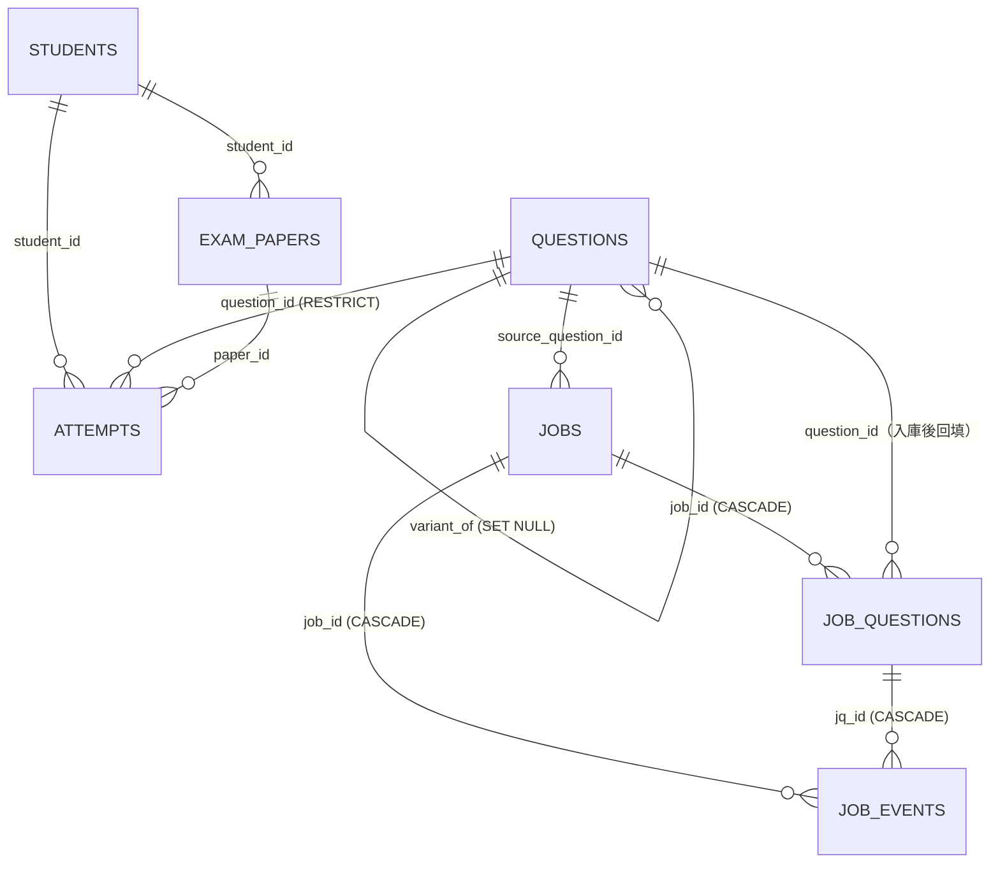

# 資料庫設計 (DB Design) - 家教專用數理題庫系統

> **版本:** v1.0 | **更新:** 2026-08-25 | **狀態:** 活躍
> **Owner:** Ben（楊本顥）
> **語域:** L3（工程）
> **實例:** 單例（全系統一個 PostgreSQL 16 + pgvector 資料庫）
> **定位:** 本文件記錄全部資料表的欄位、約束、索引與 migration 沿革；欄位級真相以 `exam_pro/migrations/0001`–`0005` 為準。狀態機轉移邏輯歸 [lld.md](./lld.md)，API 資料模型歸 [api_spec.md](./api_spec.md)。

## 目錄

- [1. ERD](#1-erd)
- [2. 表格定義](#2-表格定義)
- [3. 資料字典 (Data Dictionary)](#3-資料字典-data-dictionary)
- [4. 索引與效能](#4-索引與效能)
- [5. 資料保留與遷移](#5-資料保留與遷移)
- [6. 追溯](#6-追溯)

## 1. ERD

另有兩個唯讀檢視表：`questions_math`、`questions_physics`（0001 建立，過濾 `archived_at IS NULL`，取代已退役的 setup_index_views.js）。

## 2. 表格定義

### 2.1 `questions`（0001 建立；0002 加檢索欄、0003 加 text_hash、0004 改 origin CHECK）

| 欄位 | 型態 | 約束 | 說明 |
| :--- | :--- | :--- | :--- |
| `id` | INT IDENTITY | PK | GENERATED ALWAYS；匯入舊資料用 OVERRIDING SYSTEM VALUE |
| `subject` | TEXT | NOT NULL, CHECK IN ('數學','物理') | |
| `chapter` | TEXT | NOT NULL | 精細白名單由 `exam_pro/config/chapters.js` 後端驗證（FR-002） |
| `question_type` | TEXT | NOT NULL, DEFAULT '填空', CHECK IN ('單選','多選','填空','計算','證明') | |
| `difficulty` | SMALLINT | NOT NULL, DEFAULT 3, CHECK 1–5 | |
| `question_text` / `question_img` / `answer_text` / `solution_img` | TEXT | answer_text NOT NULL | |
| `origin` | TEXT | NOT NULL, DEFAULT 'pdf', CHECK IN ('pdf','manual','seed','variant','legacy') | 'legacy' 由 0004 追加（裁決 13）：MySQL 遷入的來源未知舊題 |
| `variant_of` | INT | FK → questions(id) ON DELETE SET NULL | 永遠指向變式家族根節點（FR-008 pickOnePerFamily 依據） |
| `chapter_src` | TEXT | NOT NULL, DEFAULT 'ai', CHECK IN ('ai','human','knn') | |
| `archived_at` | TIMESTAMPTZ | NULL | 軟刪除；所有候選池一律加 `archived_at IS NULL` |
| `concept_summary` / `keywords` / `embed_text` | TEXT / TEXT[] / TEXT | NULL | 0002；embed_text 為實際送 embedding 的可重現文本 |
| `embed_hash` | CHAR(64) | NULL | sha256(embed_text)，內容變更即重算 |
| `embedding` | vector(768) | NULL | EMBED_DIM=768 釘死；改維度＝換模型＝新 migration 全量重算 |
| `embedding_model` / `embedded_at` | TEXT / TIMESTAMPTZ | NULL | |
| `search_tsv` | TSVECTOR | NULL | 應用層 jieba 分詞後 to_tsvector('simple', ...)（ADR-008） |
| `text_hash` | CHAR(64) | NULL；0005 起部分唯一 | sha256(normalizeStem(question_text))，L0 去重（FR-005） |

### 2.2 `students`、`exam_papers`、`attempts`（0001）

| 表.欄位 | 型態 | 約束 | 說明 |
| :--- | :--- | :--- | :--- |
| `students.id` / `name` / `note` | INT IDENTITY / TEXT / TEXT | PK；name NOT NULL UNIQUE | UNIQUE 只擋完全相同字串；同名不同人靠 note 與選人 UI（FR-014） |
| `exam_papers.id` / `title` | INT IDENTITY / TEXT | PK；NOT NULL | |
| `exam_papers.student_id` | INT | NOT NULL, FK → students | 不保留 student_name（roadmap-plan §1.5 裁決） |
| `exam_papers.question_ids` | INT[] | NOT NULL | 保留出題順序，與前端／Word 下載相容（FR-009） |
| `attempts.id` | BIGINT IDENTITY | PK | |
| `attempts.student_id` / `question_id` / `paper_id` | INT | NOT NULL FK；question_id ON DELETE RESTRICT | 作答紀錄是弱點面板基底，不可隨題目消失（FR-013） |
| `attempts.assigned_at` | DATE | NOT NULL, DEFAULT CURRENT_DATE | |
| `attempts.result` / `graded_at` | SMALLINT / TIMESTAMPTZ | CHECK result IN (0,1)；NULL＝未批改 | 批改（FR-015） |
| `attempts` 複合約束 | — | UNIQUE (student_id, question_id) | 「不重複出題」伺服器端硬閘門（DEC-003／FR-008） |

### 2.3 `jobs`（0003）

| 欄位 | 型態 | 約束 | 說明 |
| :--- | :--- | :--- | :--- |
| `id` | BIGINT IDENTITY | PK | |
| `kind` | TEXT | NOT NULL, DEFAULT 'pdf', CHECK IN ('pdf','variant') | |
| `pdf_sha256` | CHAR(64) | 可 NULL | 冪等依據；kind='variant' 時無 PDF |
| `pdf_path` | TEXT | 可 NULL | data/jobs/<job_id>.pdf；拆題完成後刪檔並清成 NULL |
| `source_question_id` | INT | FK → questions | kind='variant' 時必填（FR-011） |
| `state` | TEXT | NOT NULL, DEFAULT 'queued', CHECK IN ('queued','extracting','processing','done','failed') | FR-001 狀態機 |
| `token_in` / `token_out` | INT | NOT NULL DEFAULT 0 | token_out 含 thinking tokens |
| `cost_usd` / `budget_usd` | NUMERIC(10,6) | NOT NULL；budget 建立時複製 JOB_COST_BUDGET_USD | NFR-002 |
| `locked_until` | TIMESTAMPTZ | NULL | 認領租約 JOB_LEASE_MS（NFR-005） |
| `jobs_kind_payload` | — | CHECK：pdf→pdf_sha256 NOT NULL；variant→source_question_id NOT NULL | 兩種 kind 的必填互斥保證 |

### 2.4 `job_questions`、`job_events`（0003）

| 表.欄位 | 型態 | 約束 | 說明 |
| :--- | :--- | :--- | :--- |
| `job_questions.job_id` | BIGINT | NOT NULL, FK → jobs ON DELETE CASCADE | |
| `job_questions.idx` | INT | NOT NULL；UNIQUE (job_id, idx) | chunk_no × 1000 ＋ 題序 |
| `job_questions.state` | TEXT | NOT NULL, DEFAULT 'extracted', CHECK IN ('extracted','hashed','classified','linted','verified','deduped','saved','needs_review','rejected') | 逐題九狀態 |
| `job_questions.review_reason` | TEXT | CHECK IN ('chapter_invalid','formula_unparsable','answer_mismatch','duplicate','budget_exceeded','provider_error','schema_invalid','awaiting_approval') | needs_review 八種原因（FR-006） |
| `job_questions.payload` / `retries` | JSONB | NOT NULL DEFAULT '{}' | payload 六鍵由各節點各自寫（interfaces-stage2 第 3 條） |
| `job_questions.question_id` | INT | FK → questions（不設 ON DELETE） | 入庫後回填；題目刪不掉時走封存 |
| `job_events.job_id` / `jq_id` | BIGINT | FK ON DELETE CASCADE；jq_id 可 NULL | 整份拆題層級事件 jq_id 為 NULL |
| `job_events.node` | TEXT | NOT NULL，**刻意不加 CHECK** | 新增節點不應需要 migration；合法值清單在 interfaces-stage2 第 7 條 |
| `job_events.outcome` | TEXT | NOT NULL, CHECK IN ('pass','fail','error','skipped') | |
| `job_events.error_class` | TEXT | CHECK IN ('schema_invalid','chapter_invalid','formula_unparsable','answer_mismatch','duplicate','provider_error','rate_limited','timeout','budget_exceeded') | 四條 workstream 共同語彙 |
| `job_events` 其餘 | token_in/out/thinking/cached INT、cost_usd NUMERIC(10,6)、cost_estimated BOOLEAN、latency_ms INT NOT NULL、detail JSONB | — | 只追加不更新；成本稽核唯一事實來源（NFR-002） |

## 3. 資料字典 (Data Dictionary)

| 欄位 | 業務語意 | 來源 | 敏感等級 |
| :--- | :--- | :--- | :--- |
| `questions.*`（題幹／答案） | 私有題庫資產 | FR-007 | 私有（DEC-009：repo 不含題庫內容，僅留本地） |
| `students.name` / `note` | 學生姓名與備註 | FR-014 | 個資：留本地資料庫，不對外傳輸（DEC-009） |
| `attempts.result` | 0=錯、1=對、NULL=未批改 | FR-015 | 個資（學習紀錄） |
| `jobs.cost_usd` / `job_events.*` | LLM 逐 token 計費紀錄 | NFR-002 | 一般 |

## 4. 索引與效能

| 索引 | 欄位／型式 | 支撐的查詢 | 依據 |
| :--- | :--- | :--- | :--- |
| `idx_questions_subject_chapter` / `idx_questions_active`（partial） | (subject, chapter)；後者 WHERE archived_at IS NULL | 題庫列表、組卷候選池 | FR-007/008 |
| `idx_questions_embedding` | HNSW (vector_cosine_ops, m=16, ef_construction=64) | 向量相似檢索；建在空表上（萬題內逐筆維護成本可忽略） | FR-010、ADR-001 |
| `idx_questions_tsv` / `idx_questions_text_trgm` | GIN (search_tsv)；GIN (question_text gin_trgm_ops) | hybrid(RRF) 全文半邊、模糊比對 | ADR-002 |
| `uq_questions_text_hash_active`（0005） | UNIQUE (text_hash) WHERE text_hash IS NOT NULL AND archived_at IS NULL | save／approve／createQuestion 的最後一道去重硬閘門 | FR-005、NFR-006 |
| `idx_jobs_state` / `idx_jq_state` | (state, locked_until) | worker 認領：FOR UPDATE SKIP LOCKED＋租約 | NFR-005 |
| `idx_jobs_pdf_sha256`（partial） | (pdf_sha256) WHERE NOT NULL | POST /api/jobs 冪等查詢 | FR-001 |
| `idx_jq_review`（partial） | (review_reason, id) WHERE state='needs_review' | GET /api/review 跨 job 待複核佇列 | FR-006 |
| `idx_job_events_job` / `idx_job_events_time` | (job_id, id)；(created_at, node) | report:jobs、DAILY_COST_BUDGET_USD 當日累計 | NFR-002 |
| `idx_attempts_student_date` / `idx_attempts_question` | (student_id, assigned_at)；(question_id) | 弱點面板、NOT EXISTS 排除已作答 | FR-008/013 |

## 5. 資料保留與遷移

| 項目 | 政策 |
| :--- | :--- |
| **Migration 策略** | 只增不改（NFR-006）：0001–0005 逐一凍結，任何欄位變更一律新開 migration 檔；ENUM 一律以 TEXT+CHECK 實作（改值域走 DROP/ADD CONSTRAINT，如 0004） |
| **唯一約束沿革（0005）** | 0003 先建非唯一 `idx_questions_text_hash`（舊題回填必有碰撞）→ scripts/backfill_text_hash.js 印碰撞清單 → 2026-08-23 人工確認 #2/#3、#5/#38 為真重複，attempts 併到保留題、#3/#38 封存 → 0005 建部分唯一索引（封存題與 NULL 不受限）（裁決 S2-30） |
| **刪除策略** | 題目軟刪除（archived_at）；attempts ON DELETE RESTRICT；jobs 子表 CASCADE；job_events 只追加不更新 |
| **保留期限** | 單人自用系統，無法規要求；PDF 原檔於拆題完成後刪除（pdf_path 清成 NULL），其餘資料無限期保留 |
| **舊庫遷移** | MySQL→PG 由 migrate/import_pg.js 執行（2026-08-21 切換上線，DEC-004）；舊題 origin 一律寫 'legacy'，僅與 seed_questions.js 題幹全同的 30 題寫 'seed'＋chapter_src='human' |
| **種子資料** | `exam_pro/seed_questions.js` 自製示範題 30 題（repo 不含真實題庫，DEC-009） |

## 6. 追溯

- 上游：DEC-003、DEC-004、DEC-009；FR-001、FR-002、FR-005、FR-006、FR-007、FR-008、FR-010、FR-011、FR-013、FR-014、FR-015；NFR-002、NFR-005、NFR-006；ADR-001、ADR-002、ADR-008
- 實作真相：`exam_pro/migrations/0001_init.sql`–`0005_text_hash_unique.sql`
- 下游：[api_spec.md](./api_spec.md)（欄位命名對齊）、[lld.md](./lld.md)（jobs/job_questions 狀態機轉移）、[../03_architecture/engineering_tracker.md](../03_architecture/engineering_tracker.md)、[../06_ops/runbook-job-stuck.md](../06_ops/runbook-job-stuck.md)（locked_until 租約）
