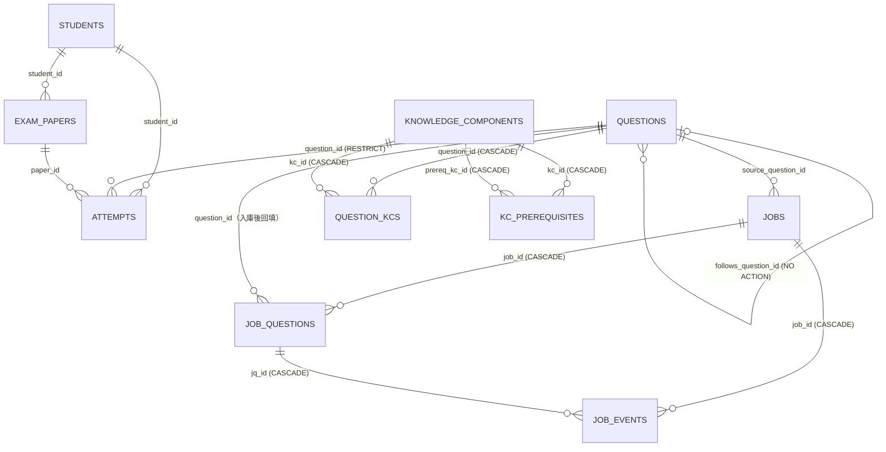

# 資料庫設計 (DB Design) - 家教專用數理題庫系統

> **版本:** v1.4 | **更新:** 2026-09-24 | **狀態:** 活躍
> **Owner:** Ben（楊本顥）
> **語域:** L3（工程）
> **實例:** 單例（全系統一個 PostgreSQL 16 + pgvector 資料庫）
> **定位:** 本文件記錄全部資料表的欄位、約束、索引與 migration 沿革；欄位級真相以 `exam_pro/migrations/0001`–`0009`〔修訂 2026-09-15e〕〔修訂 2026-09-15f〕、`0010`–`0012`〔修訂 2026-09-24〕為準。〔修訂 2026-08-29b〕狀態機轉移邏輯歸 [lld.md](./lld.md)，API 資料模型歸 [api_spec.md](./api_spec.md)。

> 🛠 **2026-08-29 修訂**（PR #6/#7 程式碼同步）：migration 範圍 0001–0005 → 0001–0006；§2.1 `questions` 與 §2.3 `jobs` 各補 `source_type` 欄（0006 追加，著作權管理／組卷過濾，FR-017）；§5 Migration 策略與 §6 追溯的範圍與 ID 同步。本輪所有修改處均以〔修訂 2026-08-29〕行內標記。
> 🛠 **2026-09-15b 修訂**（feat/pseudonymize-student-names 程式碼同步）：§3 資料分類 `students.name` 補姓名代號化實作。修改處以〔修訂 2026-09-15b〕行內標記。
> 🛠 **2026-09-15e 修訂**（feat/follow-up-links 程式碼同步）：0008_follow_up.sql 為 questions 追加 `follows_question_id`（自我參照 FK，NO ACTION）與 `follows_src`，承上題綁定（DEC-012／FR-019）；§1 ERD、§2.1、§4 索引、§5／§6 同步。修改處以〔修訂 2026-09-15e〕行內標記。

> 🛠 **2026-08-29 修訂之二**（feat/source-detail，同日使用者核准）：0007_source_detail.sql 為 questions／jobs 追加 `source_detail`（自由文字來源註記，學校＋年份等；FR-017 延伸）；§2.1／§2.3／§5／§6 同步。標記〔修訂 2026-08-29b〕。
> 🛠 **2026-09-15f 修訂**（feat/source-check，FR-020、ADR-009）：0009_source_check.sql 重建三條 CHECK——`job_questions.state` 加 `source_checked`、`review_reason` 加 `transcription_mismatch`、`job_events.error_class` 加 `transcription_mismatch`；payload 加 `extract.source_text`（原卷片段 ≤1500 字）與 `source_check` 鍵；§2.4／§5／§6 同步。0008 預留給承上題綁定分支。修改處以〔修訂 2026-09-15f〕行內標記。
> 🛠 **2026-09-15 合併同步**（feat/follow-up-links 併入 feat/source-check）：定位行、§5 Migration 策略、§6 追溯之 migration 範圍合為 0001–0009 共 9 份，0008 已存在、不再記為預留。上列兩分支修訂列所載之各分支實測數與範圍為當時紀錄，保留不改。合併重算處以〔修訂 2026-09-15e〕〔修訂 2026-09-15f〕雙標記。
> 🛠 **2026-09-24 修訂**（階段 5 整合回填，分支 `stage5/int-docs`；契約 `docs/interfaces-stage5.md` 第 2 條）：migrations 0010–0012（`stage5/base` 預建、各 WS 不得再改；預留的 0013–0017 五條 WS 皆未使用）——0010 attempts 批改細節與 students 檔案欄位、0011 questions 化學與文字詳解、jobs 卷別、0012 知識點三表。§1 ERD 補三表、§2.1～2.3 補欄位與寫入者、新增 §2.5 知識點三表、§3 資料字典、§4 索引、§5 migration 策略、§6 追溯同步。修改處以〔修訂 2026-09-24〕行內標記。

## 目錄

- [1. ERD](#1-erd)
- [2. 表格定義](#2-表格定義)
- [3. 資料字典 (Data Dictionary)](#3-資料字典-data-dictionary)
- [4. 索引與效能](#4-索引與效能)
- [5. 資料保留與遷移](#5-資料保留與遷移)
- [6. 追溯](#6-追溯)

## 1. ERD

〔修訂 2026-09-24〕0012 的三張表（`knowledge_components`、`question_kcs`、`kc_prerequisites`）見 §2.5；`question_kcs` 隨題目 CASCADE，`attempts` 對題目仍是 RESTRICT（不變）。

另有兩個唯讀檢視表：`questions_math`、`questions_physics`（0001 建立，過濾 `archived_at IS NULL`，取代已退役的 setup_index_views.js）。

## 2. 表格定義

### 2.1 `questions`（0001 建立；0002 加檢索欄、0003 加 text_hash、0004 改 origin CHECK、0006 加 source_type〔修訂 2026-08-29〕、0007 加 source_detail〔修訂 2026-08-29b〕、0008 加 follows_question_id／follows_src〔修訂 2026-09-15e〕、0011 subject 加化學與 solution_text／solution_src〔修訂 2026-09-24〕）

| 欄位 | 型態 | 約束 | 說明 |
| :--- | :--- | :--- | :--- |
| `id` | INT IDENTITY | PK | GENERATED ALWAYS；匯入舊資料用 OVERRIDING SYSTEM VALUE |
| `subject` | TEXT | NOT NULL, CHECK IN ('數學','物理','化學')（約束名 `questions_subject_check`，0011 以 DROP／ADD 重建完整值域）〔修訂 2026-09-24〕 | 0001 原為兩科；化學由 WS-B 寫入（管線 save、手動新增、複核 approve），章節白名單仍在後端驗證（FR-026） |
| `chapter` | TEXT | NOT NULL | 精細白名單由 `exam_pro/config/chapters.js` 後端驗證（FR-002） |
| `question_type` | TEXT | NOT NULL, DEFAULT '填空', CHECK IN ('單選','多選','填空','計算','證明') | |
| `difficulty` | SMALLINT | NOT NULL, DEFAULT 3, CHECK 1–5 | |
| `question_text` / `question_img` / `answer_text` / `solution_img` | TEXT | answer_text NOT NULL | |
| `origin` | TEXT | NOT NULL, DEFAULT 'pdf', CHECK IN ('pdf','manual','seed','variant','legacy') | 'legacy' 由 0004 追加（裁決 13）：MySQL 遷入的來源未知舊題 |
| `variant_of` | INT | FK → questions(id) ON DELETE SET NULL | 永遠指向變式家族根節點（FR-008 pickOnePerFamily 依據） |
| `chapter_src` | TEXT | NOT NULL, DEFAULT 'ai', CHECK IN ('ai','human','knn') | |
| `archived_at` | TIMESTAMPTZ | NULL | 軟刪除；所有候選池一律加 `archived_at IS NULL` |
| `concept_summary` / `keywords` / `embed_text` | TEXT / TEXT[] / TEXT | NULL | 0002；embed_text 為實際送 embedding 的可重現文本 |
| `embed_hash` | CHAR(64) | NULL | sha256(embed_text)，內容變更即重算 |
| `embedding` | vector(768) | NULL | EMBED_DIM=768 釘死；改維度＝換模型＝新 migration 全量重算 |
| `embedding_model` / `embedded_at` | TEXT / TIMESTAMPTZ | NULL | |
| `search_tsv` | TSVECTOR | NULL | 應用層 jieba 分詞後 to_tsvector('simple', ...)（ADR-008） |
| `text_hash` | CHAR(64) | NULL；0005 起部分唯一 | sha256(normalizeStem(question_text))，L0 去重（FR-005） |
| `source_type` | TEXT | NOT NULL, DEFAULT 'unknown', CHECK IN ('official','school','publisher','self','unknown') | 0006 追加（FR-017）：題目來源標記（著作權管理），組卷可過濾乾淨題源；值域程式真相 `config/chapters.js` SOURCE_TYPES〔修訂 2026-08-29〕 |
| `source_detail` | TEXT | 可 NULL, CHECK char_length ≤ 100 | 0007 追加（FR-017 延伸）：自由文字來源註記（例「北一女 2024 段考」）；trim 後空值落 NULL，程式真相 `config/chapters.js` normalizeSourceDetail；不參與 search_tsv／embedding〔修訂 2026-08-29b〕 |
| `follows_question_id` | INT | 可 NULL, FK → questions(id)（**不寫 ON DELETE**＝NO ACTION）；CHECK `questions_follows_self_check`（不得指向自己） | 0008 追加（FR-019）：承上題指向前題。NO ACTION 於語句結束時檢查，允許同一句刪整組、擋「刪前題留子題」；RESTRICT 逐列立即檢查會讓整組刪除與測試清表失敗。「缺前題」不另存欄位，由 `utils/followUp.js` isFollowUp(question_text) 且本欄為 NULL 即時算〔修訂 2026-09-15e〕 |
| `follows_src` | TEXT | 可 NULL, CHECK IN ('pipeline','review','backfill','human')；CHECK `questions_follows_src_pair_check`（與 follows_question_id 同為 NULL 或同非 NULL） | 0008 追加（FR-019）：綁定來源——runner 終態後重算／人工複核後重算／回填腳本／人工指定；自動流程一律不覆寫 'human'（寫入端 `services/followUpLinker.js`）〔修訂 2026-09-15e〕 |
| `solution_text` | TEXT | 可 NULL, CHECK char_length ≤ 4000 | 0011 追加（FR-024）〔修訂 2026-09-24〕：文字詳解（公式用 `$…$`）。**寫入者**：管線 save 節點（`workers/jobRunner.js` buildSolutionFields：`payload.verify.compare = 'agree'` 且 `steps_summary` trim 後非空、≤4000 字才寫；超長不截斷）、`POST`／`PUT /api/questions`（`controllers/questionController.js`，老師）、`scripts/backfill_solutions.js`（只補 `IS NULL` 的題、略過入庫後題幹或答案被改過者）。複核 approve 與 batch-save 不寫。舊欄 `solution_img` 保留不動 |
| `solution_src` | TEXT | 可 NULL, CHECK IN ('verify','teacher','ai')；CHECK `questions_solution_pair_check`（與 solution_text 同為 NULL 或同非 NULL） | 0011 追加（FR-024）〔修訂 2026-09-24〕：詳解來源——verify＝管線驗算摘要（未經人工審閱）、teacher＝老師撰寫或修改、ai＝保留給之後的 AI 生成（目前無寫入者）。PUT 帶與現值 trim 後相同的文字時保留原來源 |

### 2.2 `students`、`exam_papers`、`attempts`（0001）

| 表.欄位 | 型態 | 約束 | 說明 |
| :--- | :--- | :--- | :--- |
| `students.id` / `name` / `note` | INT IDENTITY / TEXT / TEXT | PK；name NOT NULL UNIQUE | UNIQUE 只擋完全相同字串；同名不同人靠 note 與選人 UI（FR-014） |
| `exam_papers.id` / `title` | INT IDENTITY / TEXT | PK；NOT NULL | |
| `exam_papers.student_id` | INT | NOT NULL, FK → students | 不保留 student_name（roadmap-plan §1.5 裁決） |
| `exam_papers.question_ids` | INT[] | NOT NULL | 保留出題順序，與前端／Word 下載相容（FR-009） |
| `attempts.id` | BIGINT IDENTITY | PK | |
| `attempts.student_id` / `question_id` / `paper_id` | INT | NOT NULL FK；question_id ON DELETE RESTRICT | 作答紀錄是弱點面板基底，不可隨題目消失（FR-013） |
| `attempts.assigned_at` | DATE | NOT NULL, DEFAULT CURRENT_DATE | |
| `attempts.result` / `graded_at` | SMALLINT / TIMESTAMPTZ | CHECK result IN (0,1)；NULL＝未批改 | 批改（FR-015） |
| `attempts` 複合約束 | — | UNIQUE (student_id, question_id) | 「不重複出題」伺服器端硬閘門（DEC-003／FR-008）；階段 5 未改（DEC-003 例外條款的「派題／作答拆表」尚未實作）〔修訂 2026-09-24〕 |
| `attempts.score`〔修訂 2026-09-24〕 | NUMERIC(3,2) | 可 NULL, CHECK 0 ≤ score ≤ 1 | 0010（FR-021）：部分給分；NULL＝沒給分，由 `result` 決定對錯。**寫入者**：`PATCH /api/papers/:id/results`（`controllers/paperController.js`，最多兩位小數、只能搭配 result 0／1；`result: null` 時清空）。讀取者：WS-D 以 `COALESCE(score, result)` 當正確度 |
| `attempts.error_types`〔修訂 2026-09-24〕 | TEXT[] | NOT NULL DEFAULT '{}'；**合法值不寫 CHECK** | 0010（FR-021、FR-022）：錯因代碼，白名單在 `config/errorTypes.js` 由伺服器驗證（代碼只增不改名）；未作答＝`result = 0` 且含 `blank`。**寫入者**：同上 PATCH（不重複、≤5、依白名單順序存；`result ≠ 0` 時一律清成 `{}`）。讀取者：弱點 `by_error_type`（另加 `result = 0` 條件）、AI 家教學生摘要 |
| `attempts.response` / `teacher_note`〔修訂 2026-09-24〕 | TEXT / TEXT | 可 NULL, 各 CHECK char_length ≤ 500 | 0010（FR-021）：學生實際答案、老師逐題註記。**寫入者**：同上 PATCH（API 鍵名 `response`、`note`；trim、空字串＝NULL；取消批改時保留） |
| `students.grade`〔修訂 2026-09-24〕 | SMALLINT | 可 NULL, CHECK IN (10, 11, 12) | 0010（FR-023）：年級。**寫入者**：`POST`／`PATCH /api/students`（`controllers/studentAdminController.js`，白名單 `config/studentProfile.js`） |
| `students.track` / `textbook_version`〔修訂 2026-09-24〕 | TEXT / TEXT | 可 NULL, 各 CHECK char_length ≤ 20 | 0010（FR-023）：類組、教材版本；合法值（自然組／社會組／未分組；龍騰…其他）只在 controller 驗證。寫入者同上 |
| `students.target_exams`〔修訂 2026-09-24〕 | TEXT[] | NOT NULL DEFAULT '{}' | 0010（FR-023）：目標考試（學測、分科、統測、段考、其他的子集，存成白名單順序）。寫入者同上 |
| `students.school`〔修訂 2026-09-24〕 | TEXT | 可 NULL, CHECK char_length ≤ 50 | 0010（FR-023）。`students.note`（0001 既有欄）自階段 5 起才有 API 寫入端（≤500 字，controller 驗證）。學生合併時保留目標學生的檔案，來源學生的檔案捨棄（已知，見 `docs/HANDOFF.md`） |

### 2.3 `jobs`（0003 建立；0006 加 source_type〔修訂 2026-08-29〕、0007 加 source_detail〔修訂 2026-08-29b〕、0011 加 subject_group〔修訂 2026-09-24〕）

| 欄位 | 型態 | 約束 | 說明 |
| :--- | :--- | :--- | :--- |
| `id` | BIGINT IDENTITY | PK | |
| `kind` | TEXT | NOT NULL, DEFAULT 'pdf', CHECK IN ('pdf','variant') | |
| `pdf_sha256` | CHAR(64) | 可 NULL | 冪等依據；kind='variant' 時無 PDF |
| `pdf_path` | TEXT | 可 NULL | data/jobs/<job_id>.pdf；拆題完成後刪檔並清成 NULL |
| `source_question_id` | INT | FK → questions | kind='variant' 時必填（FR-011） |
| `state` | TEXT | NOT NULL, DEFAULT 'queued', CHECK IN ('queued','extracting','processing','done','failed') | FR-001 狀態機 |
| `token_in` / `token_out` | INT | NOT NULL DEFAULT 0 | token_out 含 thinking tokens |
| `cost_usd` / `budget_usd` | NUMERIC(10,6) | NOT NULL；budget 建立時複製 JOB_COST_BUDGET_USD | NFR-002 |
| `locked_until` | TIMESTAMPTZ | NULL | 認領租約 JOB_LEASE_MS（NFR-005） |
| `source_type` | TEXT | 可 NULL, CHECK IN ('official','school','publisher','self','unknown') | 0006 追加（FR-017）：上傳時標一次，該 job 入庫的題沿用；variant job 建立時複製藍本題標記；NULL（舊 job／未標）入庫時以 'unknown' 落地〔修訂 2026-08-29〕 |
| `source_detail` | TEXT | 可 NULL, CHECK char_length ≤ 100 | 0007 追加（FR-017 延伸）：上傳時註記一次、入庫沿用；variant job **不**繼承藍本註記（改寫後非原卷之題）〔修訂 2026-08-29b〕 |
| `jobs_kind_payload` | — | CHECK：pdf→pdf_sha256 NOT NULL；variant→source_question_id NOT NULL | 兩種 kind 的必填互斥保證 |
| `subject_group`〔修訂 2026-09-24〕 | TEXT | NOT NULL DEFAULT 'math_physics', CHECK IN ('math_physics','chemistry') | 0011（FR-026）：上傳時指定的卷別，決定管線走數學／物理的凍結模板或化學模板（ADR-010）。**寫入者**：`POST /api/jobs`（`controllers/jobController.js`；冪等查詢多加 `subject_group = $2` 條件，即冪等鍵為 `(pdf_sha256, subject_group)`）、`services/variantService.createVariantJob`（化學藍本 → chemistry，其餘 → math_physics）。`workers/jobRunner.js` 帶進 `ctx.job` |

### 2.4 `job_questions`、`job_events`（0003；0009 重建三條 CHECK〔修訂 2026-09-15f〕）

| 表.欄位 | 型態 | 約束 | 說明 |
| :--- | :--- | :--- | :--- |
| `job_questions.job_id` | BIGINT | NOT NULL, FK → jobs ON DELETE CASCADE | |
| `job_questions.idx` | INT | NOT NULL；UNIQUE (job_id, idx) | chunk_no × 1000 ＋ 題序 |
| `job_questions.state` | TEXT | NOT NULL, DEFAULT 'extracted', CHECK IN ('extracted','hashed','classified','linted','source_checked','verified','deduped','saved','needs_review','rejected') | 逐題十狀態（`source_checked` 由 0009 加入，FR-020）〔修訂 2026-09-15f〕 |
| `job_questions.review_reason` | TEXT | CHECK IN ('chapter_invalid','formula_unparsable','answer_mismatch','duplicate','budget_exceeded','provider_error','schema_invalid','awaiting_approval','transcription_mismatch') | needs_review 九種原因（FR-006；`transcription_mismatch` 由 0009 加入，FR-020）〔修訂 2026-09-15f〕 |
| `job_questions.payload` / `retries` | JSONB | NOT NULL DEFAULT '{}' | payload 七鍵由各節點各自寫（interfaces-stage2 第 3 條）；`extract.source_text` 為 extract 階段抽的原卷片段（≤1500 字、不存整頁）〔修訂 2026-09-15f〕 |
| `job_questions.question_id` | INT | FK → questions（不設 ON DELETE） | 入庫後回填；題目刪不掉時走封存 |
| `job_events.job_id` / `jq_id` | BIGINT | FK ON DELETE CASCADE；jq_id 可 NULL | 整份拆題層級事件 jq_id 為 NULL |
| `job_events.node` | TEXT | NOT NULL，**刻意不加 CHECK** | 新增節點不應需要 migration；合法值清單在 interfaces-stage2 第 7 條 |
| `job_events.outcome` | TEXT | NOT NULL, CHECK IN ('pass','fail','error','skipped') | |
| `job_events.error_class` | TEXT | CHECK IN ('schema_invalid','chapter_invalid','formula_unparsable','answer_mismatch','duplicate','provider_error','rate_limited','timeout','budget_exceeded','transcription_mismatch') | 四條 workstream 共同語彙（0009 加 `transcription_mismatch`〔修訂 2026-09-15f〕） |
| `job_events` 其餘 | token_in/out/thinking/cached INT、cost_usd NUMERIC(10,6)、cost_estimated BOOLEAN、latency_ms INT NOT NULL、detail JSONB | — | 只追加不更新；成本稽核唯一事實來源（NFR-002） |

### 2.5 知識點三表：`knowledge_components`、`question_kcs`、`kc_prerequisites`（0012）〔修訂 2026-09-24〕

設計取捨與分權見 [ADR-011](../03_architecture/adr/ADR-011-knowledge-component-model.md)；載入規則與 API 見 `docs/knowledge-components.md`。

| 表.欄位 | 型態 | 約束 | 寫入者 | 說明 |
| :--- | :--- | :--- | :--- | :--- |
| `knowledge_components.id` | INT IDENTITY | PK | — | 只出現在 API 回應；會因載入順序而不同，種子檔、先備、AI 標註一律以 `code` 對照 |
| `knowledge_components.code` | TEXT | NOT NULL UNIQUE, CHECK char_length ≤ 80 | `scripts/load_kc.js`（`npm run kc:load`） | 穩定識別碼 `MATH\|PHYS\|CHEM.<章名>.<兩位序號>`（格式由 `utils/kcSeed.js` validateSeeds 強制，DB 不擋格式） |
| `knowledge_components.subject` / `chapter` | TEXT / TEXT | subject CHECK IN ('數學','物理','化學')；chapter NOT NULL | 同上 | chapter 須在該科章節白名單內（應用層驗證） |
| `knowledge_components.name` | TEXT | NOT NULL, CHECK ≤ 60；`UNIQUE (subject, chapter, name)` | 載入腳本；`PATCH /api/kc/:id`（`services/kcService.js`） | 應用層上限 30 字（`utils/kcSeed.js` LIMITS，比 DB 嚴） |
| `knowledge_components.curriculum_code` | TEXT | 可 NULL, CHECK ≤ 40 | 同上 | 108 課綱學習內容代碼；三科種子檔目前全為 NULL（不編造） |
| `knowledge_components.description` | TEXT | 可 NULL, CHECK ≤ 400 | 同上 | 課綱式精確敘述；應用層 1–200 字 |
| `knowledge_components.spoken_text` | TEXT | 可 NULL, CHECK ≤ 600 | 同上 | 口語版；應用層 40–300 字、不得含 LaTeX（`LATEX_RE`） |
| `knowledge_components.status` | TEXT | NOT NULL DEFAULT 'draft', CHECK IN ('draft','approved') | 載入腳本（AI 草稿一律 draft）；`PATCH /api/kc/:id`（Owner 審定） | approved 列載入腳本不覆寫內容（`--force` 除外）；讀現有列時 `SELECT … ORDER BY id FOR UPDATE`，避免與審定 PATCH 交錯 |
| `knowledge_components.sort` / `created_at` / `updated_at` | SMALLINT / TIMESTAMPTZ ×2 | sort NOT NULL DEFAULT 0 | 同上（PATCH 更新 updated_at） | sort＝章內教學順序（從 1 起） |
| `question_kcs.question_id` | INT | NOT NULL, FK → questions **ON DELETE CASCADE**；PK (question_id, kc_id) | — | 題目刪除時標註一起刪（`attempts` 仍 RESTRICT） |
| `question_kcs.kc_id` | INT | NOT NULL, FK → knowledge_components ON DELETE CASCADE | — | |
| `question_kcs.weight` | REAL | NOT NULL DEFAULT 1, CHECK 0 < weight ≤ 1 | `PUT /api/questions/:id/kcs`（人工，未指定＝1）；`services/kcTagService.tagQuestion`（AI 一律 1） | 「這題有多少成分在考這個知識點」；WS-D 的知識點弱點以它加權 |
| `question_kcs.src` | TEXT | NOT NULL DEFAULT 'ai', CHECK IN ('ai','human') | 人工 PUT 寫 human（取代該題全部列）；AI 標註寫 ai（只刪換自己的 ai 列，遇 human 不動） | 分權規則見 ADR-011 |
| `question_kcs.confidence` | REAL | 可 NULL, CHECK 0–1 | AI 標註（信心 ≥ `KC_TAG_MIN_CONFIDENCE` 才寫） | 只有 AI 標註才有；與 weight 分開 |
| `question_kcs.created_at` | TIMESTAMPTZ | NOT NULL DEFAULT now() | — | |
| `kc_prerequisites.kc_id` / `prereq_kc_id` | INT / INT | 皆 FK → knowledge_components ON DELETE CASCADE；PK (kc_id, prereq_kc_id)；CHECK kc_id <> prereq_kc_id | 載入腳本（`src='ai'`；未受保護知識點的本批未列 ai 先備會移除，human／curriculum 不動） | 可跨科；**不得成環**——DB 無法以約束表達，由載入腳本寫完後對全體先備做 DFS，成環整批回滾 |
| `kc_prerequisites.strength` / `src` | REAL / TEXT | strength NOT NULL DEFAULT 1, CHECK 0 < s ≤ 1；src NOT NULL DEFAULT 'ai', CHECK IN ('ai','human','curriculum') | 同上 | 補救卷先備桶依 strength 高→低挑選（WS-D） |

## 3. 資料字典 (Data Dictionary)

| 欄位 | 業務語意 | 來源 | 敏感等級 |
| :--- | :--- | :--- | :--- |
| `questions.*`（題幹／答案） | 私有題庫資產 | FR-007 | 私有（DEC-009：repo 不含題庫內容，僅留本地） |
| `students.name` / `note` | 學生姓名與備註 | FR-014 | 個資：留本地資料庫；學生姓名不出境：NLQ 與助教送 LLM／embedding 前以 `exam_pro/utils/pseudonym.js` 換成「學生#<id>」代號，回覆後還原（DEC-009）〔修訂 2026-09-15b〕 |
| `attempts.result` | 0=錯、1=對、NULL=未批改 | FR-015 | 個資（學習紀錄） |
| `jobs.cost_usd` / `job_events.*` | LLM 逐 token 計費紀錄 | NFR-002 | 一般 |
| `attempts.score` / `error_types` / `response` / `teacher_note`〔修訂 2026-09-24〕 | 部分給分、錯因、學生實際答案、老師註記 | FR-021、FR-022 | 個資（學習紀錄）；送 AI 家教前隨學生摘要代號化，只帶錯因統計、不帶學生答案原文 |
| `students.grade` / `track` / `target_exams` / `school` / `textbook_version` / `note`〔修訂 2026-09-24〕 | 學生檔案 | FR-023 | 個資（學校、年級）；留本地資料庫 |
| `questions.solution_text` / `solution_src`〔修訂 2026-09-24〕 | 文字詳解與來源 | FR-024、FR-025 | 私有（題庫衍生）；verify 來源為模型摘要、未經人工審閱，給學生前應先讀過 |
| `jobs.subject_group`〔修訂 2026-09-24〕 | 上傳卷別（數學／物理、化學） | FR-026 | 一般 |
| `knowledge_components.*` / `kc_prerequisites.*`〔修訂 2026-09-24〕 | 知識點與先備（AI 依 108 課綱草擬、Owner 審定） | FR-028 | 一般（教學內容；種子檔 `config/kc/*.json` 進版控） |
| `question_kcs.*`〔修訂 2026-09-24〕 | 題目—知識點標註 | FR-029、FR-030 | 私有（題庫衍生） |

## 4. 索引與效能

| 索引 | 欄位／型式 | 支撐的查詢 | 依據 |
| :--- | :--- | :--- | :--- |
| `idx_questions_subject_chapter` / `idx_questions_active`（partial） | (subject, chapter)；後者 WHERE archived_at IS NULL | 題庫列表、組卷候選池 | FR-007/008 |
| `idx_questions_embedding` | HNSW (vector_cosine_ops, m=16, ef_construction=64) | 向量相似檢索；建在空表上（萬題內逐筆維護成本可忽略） | FR-010、ADR-001 |
| `idx_questions_tsv` / `idx_questions_text_trgm` | GIN (search_tsv)；GIN (question_text gin_trgm_ops) | hybrid(RRF) 全文半邊、模糊比對 | ADR-002 |
| `uq_questions_text_hash_active`（0005） | UNIQUE (text_hash) WHERE text_hash IS NOT NULL AND archived_at IS NULL | save／approve／createQuestion 的最後一道去重硬閘門 | FR-005、NFR-006 |
| `idx_questions_follows`（0008，partial）〔修訂 2026-09-15e〕 | (follows_question_id) WHERE follows_question_id IS NOT NULL | 反查「誰承接這一題」：FK NO ACTION 檢查、後續整組抽題與刪除保護；只索引有綁定的少數列 | FR-019 |
| `idx_jobs_state` / `idx_jq_state` | (state, locked_until) | worker 認領：FOR UPDATE SKIP LOCKED＋租約 | NFR-005 |
| `idx_jobs_pdf_sha256`（partial） | (pdf_sha256) WHERE NOT NULL | POST /api/jobs 冪等查詢 | FR-001 |
| `idx_jq_review`（partial） | (review_reason, id) WHERE state='needs_review' | GET /api/review 跨 job 待複核佇列 | FR-006 |
| `idx_job_events_job` / `idx_job_events_time` | (job_id, id)；(created_at, node) | report:jobs、DAILY_COST_BUDGET_USD 當日累計 | NFR-002 |
| `idx_attempts_student_date` / `idx_attempts_question` | (student_id, assigned_at)；(question_id) | 弱點面板、NOT EXISTS 排除已作答 | FR-008/013 |
| `idx_attempts_error_types`（0010，partial）〔修訂 2026-09-24〕 | GIN (error_types) WHERE cardinality(error_types) > 0 | 錯因聚合（弱點 `by_error_type`、家教學生摘要）只看有標錯因的列 | FR-022 |
| `idx_kc_subject_chapter`（0012）〔修訂 2026-09-24〕 | (subject, chapter, sort)；另有 `code` UNIQUE、`(subject, chapter, name)` UNIQUE | 知識點分頁依科目／章瀏覽、該章知識點清單（自動標註的 enum、補救卷、家教退回同章） | FR-028、FR-029 |
| `idx_question_kcs_kc`（0012）〔修訂 2026-09-24〕 | (kc_id)；PK (question_id, kc_id) 支撐「題目→知識點」 | 反查「知識點掛了哪些題」：`question_count`、知識點弱點、補救卷候選池、覆蓋率 `kc_rows` | FR-028、FR-030、FR-031、FR-033 |
| `idx_kc_prereq_prereq`（0012）〔修訂 2026-09-24〕 | (prereq_kc_id)；PK (kc_id, prereq_kc_id) | 反查「誰以此為先備」、環檢查、FK CASCADE | FR-028、FR-031 |

## 5. 資料保留與遷移

| 項目 | 政策 |
| :--- | :--- |
| **Migration 策略** | 只增不改（NFR-006）：0001–0009 逐一凍結〔修訂 2026-09-15e〕〔修訂 2026-09-15f〕，任何欄位變更一律新開 migration 檔；ENUM 一律以 TEXT+CHECK 實作（改值域走 DROP/ADD CONSTRAINT，如 0004）；0006_source_type.sql（2026-08-28 核准）為 questions／jobs 追加 source_type〔修訂 2026-08-29〕；0007_source_detail.sql（2026-08-29 核准）為兩表追加 source_detail〔修訂 2026-08-29b〕；0008_follow_up.sql（2026-09-15 核准）為 questions 追加 follows_question_id／follows_src 與兩條具名 CHECK、部分索引〔修訂 2026-09-15e〕；0009_source_check.sql 以 DROP／ADD 重建 job_questions.state、review_reason 與 job_events.error_class 三條 CHECK（約束名以 pg_constraint 查證；0008 與 0009 由兩條分支平行開發、編號開工前預先分配，migrate.js 依檔名排序逐支判斷，先套過 0009 的環境補上 0008 亦照常套用；之後再改這三條約束須以含 0009 新值的完整值域重建）〔修訂 2026-09-15f〕；〔修訂 2026-09-24〕階段 5 三支由 `stage5/base` 預建並凍結（五條 WS 平行開發只讀 schema、不改這三支）：`0010_attempt_detail_student_profile.sql`（attempts 四欄＋部分 GIN 索引、students 五欄）、`0011_chemistry_solution_subject_group.sql`（`questions_subject_check` DROP／ADD 加化學、solution 兩欄＋`questions_solution_pair_check`、jobs.subject_group）、`0012_knowledge_components.sql`（三表＋三索引）；預留給 WS-A～E 的 `0013`–`0017` 皆未使用。錯因、學生檔案選項與知識點代碼格式的合法值刻意不寫 CHECK，由 `config/` 白名單在伺服器端驗證（改值域不需 migration） |
| **唯一約束沿革（0005）** | 0003 先建非唯一 `idx_questions_text_hash`（舊題回填必有碰撞）→ scripts/backfill_text_hash.js 印碰撞清單 → 2026-08-23 人工確認 #2/#3、#5/#38 為真重複，attempts 併到保留題、#3/#38 封存 → 0005 建部分唯一索引（封存題與 NULL 不受限）（裁決 S2-30） |
| **刪除策略** | 題目軟刪除（archived_at）；attempts ON DELETE RESTRICT；jobs 子表 CASCADE；job_events 只追加不更新 |
| **保留期限** | 單人自用系統，無法規要求；PDF 原檔於拆題完成後刪除（pdf_path 清成 NULL），其餘資料無限期保留 |
| **舊庫遷移** | MySQL→PG 由 migrate/import_pg.js 執行（2026-08-21 切換上線，DEC-004）；舊題 origin 一律寫 'legacy'，僅與 seed_questions.js 題幹全同的 30 題寫 'seed'＋chapter_src='human' |
| **種子資料** | `exam_pro/seed_questions.js` 自製示範題 30 題（repo 不含真實題庫，DEC-009） |

## 6. 追溯

- 上游：DEC-003、DEC-004、DEC-009、DEC-012〔修訂 2026-09-15e〕、DEC-013〔修訂 2026-09-15f〕、DEC-015、DEC-017、DEC-019〔修訂 2026-09-24〕；FR-001、FR-002、FR-005、FR-006、FR-007、FR-008、FR-010、FR-011、FR-013、FR-014、FR-015、FR-017〔修訂 2026-08-29〕、FR-019〔修訂 2026-09-15e〕、FR-020〔修訂 2026-09-15f〕、FR-021～FR-031、FR-033〔修訂 2026-09-24〕；NFR-002、NFR-005、NFR-006；ADR-001、ADR-002、ADR-008、ADR-009〔修訂 2026-09-15f〕、ADR-010、ADR-011、ADR-015〔修訂 2026-09-24〕
- 實作真相：`exam_pro/migrations/0001_init.sql`–`0009_source_check.sql`〔修訂 2026-09-15e〕〔修訂 2026-09-15f〕、`0010_attempt_detail_student_profile.sql`–`0012_knowledge_components.sql`〔修訂 2026-09-24〕
- 下游：[api_spec.md](./api_spec.md)（欄位命名對齊）、[lld.md](./lld.md)（jobs/job_questions 狀態機轉移）、[../03_architecture/engineering_tracker.md](../03_architecture/engineering_tracker.md)、[../06_ops/runbook-job-stuck.md](../06_ops/runbook-job-stuck.md)（locked_until 租約）
