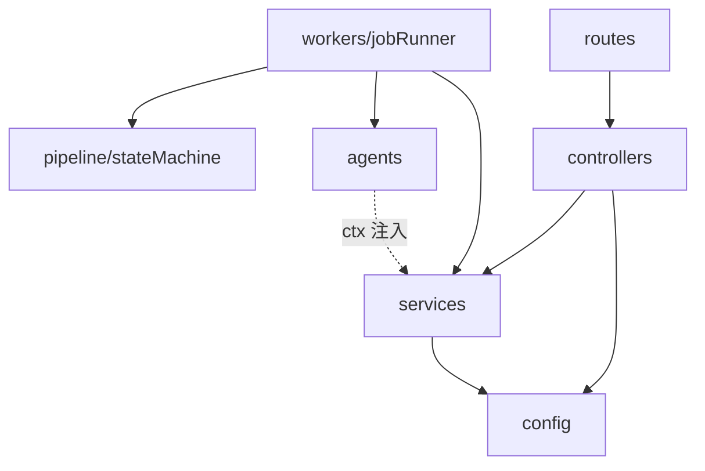
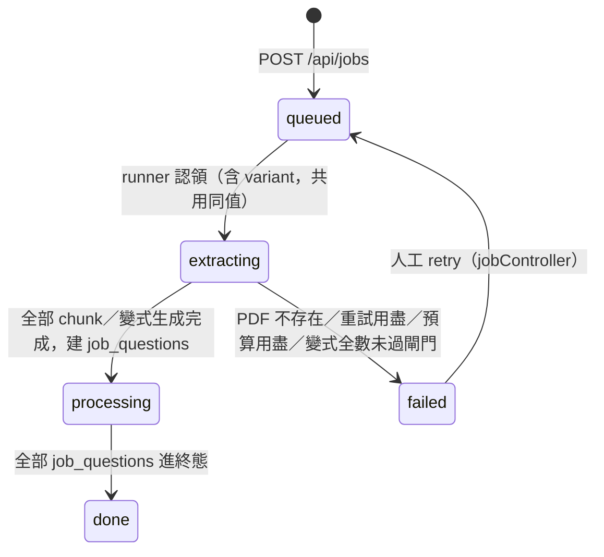
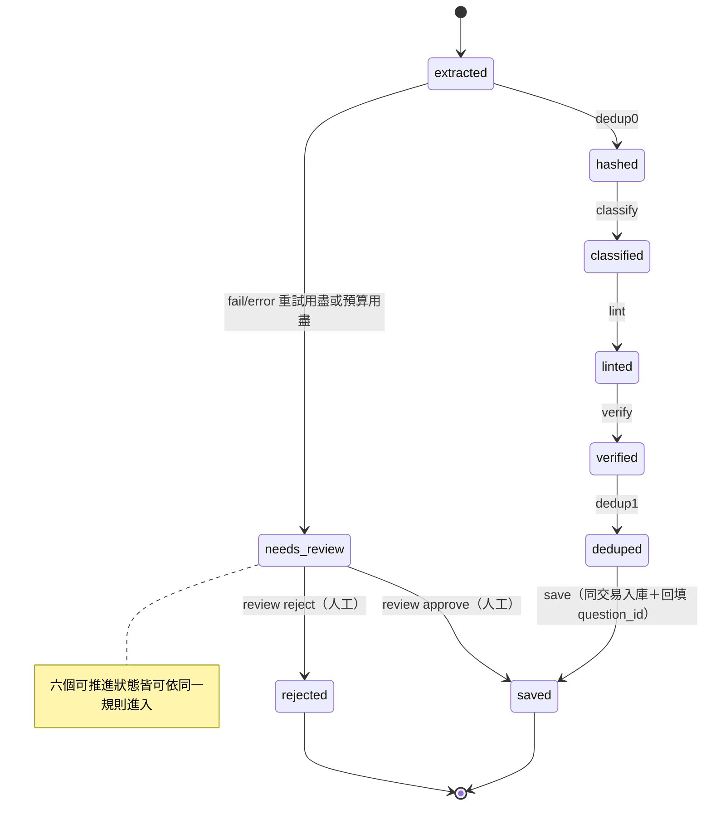

# 低階設計與程式碼地圖 (LLD / Code Map) - 家教專用數理題庫系統

> **版本:** v1.0 | **更新:** 2026-08-25 | **狀態:** 活躍
> **Owner:** Ben（楊本顥）
> **語域:** L3（工程）
> **實例:** 單檔；§5 狀態機每個 Aggregate 一節
>
> **定位**：C4 Code 層——模組結構、兩個 Aggregate（jobs、job_questions）的狀態機、jobRunner 認領演算法、助教 ReAct 迴圈。回答「模組如何組成、狀態如何合法轉移」。
> 系統級架構歸 [`../03_architecture/sad.md`](../03_architecture/sad.md)；API 契約歸 [`api_spec.md`](./api_spec.md)；資料 schema 歸 [`db_design.md`](./db_design.md)。狀態轉移合法性以 `exam_pro/pipeline/stateMachine.js` 為單一權威。

## 目錄

- [1. 生成資訊](#1-生成資訊)
- [2. 模組結構](#2-模組結構)
- [3. 模組依賴圖](#3-模組依賴圖)
- [4. 關鍵控制流](#4-關鍵控制流)
- [5. 狀態機（設計契約）](#5-狀態機設計契約)
- [6. 追溯](#6-追溯)

## 1. 生成資訊

§2–§4 描述程式碼現況（AS-BUILT），過期即重掃；§5 為人工核准的設計契約。

| 項目 | 值 |
| :--- | :--- |
| 生成時間 | 2026-08-25 |
| 對應 commit | `0ff47b4` |
| 生成方式 | AI 掃 code（jobRunner.js／stateMachine.js／assistantService.js 全讀，其餘依 require 追蹤） |

## 2. 模組結構

```text
exam_pro/
├── routes/       # API 全表（index.js：核心區＋各階段 append-only 區塊，旗標控制掛載）
├── controllers/  # HTTP 層：驗參、交易、回應（jobController、reviewController、examController…）
├── services/     # 業務服務：llm/（adapter＋throttle＋cassette）、assistantService、variantService…
├── agents/       # 管線節點純函式：extract/classify/lint/verify/dedup/generate（不碰 DB、ctx 注入）
├── pipeline/     # stateMachine.js：job_questions 推進規則（純函式）
├── workers/      # jobRunner.js：DB-polling worker，唯一改 job_questions.state 與寫 job_events 之處
├── config/       # db／models（模型 ID 單一真相）／features／pricing／chapters
├── queries/      # hybrid 檢索 SQL
└── utils/        # tokenize（全案唯一分詞）、questionValidation（save 白名單驗證）
```

## 3. 模組依賴圖

箭頭語意＝require。`agents/` 依合約（NFR-003）不得 require `config/db` 與 `process.env`，僅收 ctx。



已知分層違規：無（`agents/` 對 DB／env 的隔離由單元測試逐條斷言）。

## 4. 關鍵控制流

### 4.1 jobRunner 認領演算法（exam_pro/workers/jobRunner.js）

| 機制 | 實作 | 參數（預設） |
| :--- | :--- | :--- |
| 認領 | 同一交易兩句：`SELECT id … WHERE state 可推進 AND (locked_until IS NULL OR locked_until < now()) ORDER BY id LIMIT 1 FOR UPDATE SKIP LOCKED` → `UPDATE … SET locked_until = now() + lease`；兩個槽不會搶到同一列 | `JOB_CONCURRENCY=2` 槽 |
| 租約 | 認領時設 `locked_until`；呼叫進行中每 30 秒續租；完成時清 NULL；崩潰後租約過期即可被重新認領（斷點續跑，NFR-005） | `JOB_LEASE_MS=180000`、續租 30s |
| 認領優先序 | 每 tick 先清在途 `job_questions`（使已產生成本的 job 優先完結）→ 再認領 `kind='pdf'` 的 jobs → 最後 `kind='variant'` | `JOB_POLL_MS=2000` |
| 重試預算 | fail：extract／generate 整包重試 1 次（`EXTRACT_MAX_RETRIES=1`）；節點層見 §5.2。error：獨立計數器，退避 1s→2s→4s… 封頂 60s，睡眠由 runner 做、狀態機只計數 | `maxErrorRetries=3` |
| 節點逾時 | `Promise.race` ＋ AbortController，逾時歸類 `error:timeout` | `JOB_NODE_TIMEOUT_MS=120000` |
| RPM 節流 | 不在 runner：所有 `ctx.llm` 呼叫經 `exam_pro/services/llm/throttle.js` 的每供應商雙桶（RPM 滑動 60 秒視窗＋併發槽） | `<VENDOR>_RPM=60` |
| 單 job 成本上限 | 呼叫前檢查 `budget_usd − cost_usd`，餘額不足即不發出呼叫；轉為 `needs_review('budget_exceeded')` | `JOB_COST_BUDGET_USD=0.5` |
| 每日成本上限 | tick 起手查 `job_events` 當日 `SUM(cost_usd)`；超過即只認領零成本節點（dedup0／dedup1／save）對應的狀態、不開新 job | `DAILY_COST_BUDGET_USD=5` |
| 重跑冪等 | `job_questions` UNIQUE `(job_id, idx)` ＋ `ON CONFLICT DO NOTHING`：extract／generate 重跑不重複建列 | — |

### 4.2 助教 ReAct 迴圈（exam_pro/services/assistantService.js，ADR-007）

| 機制 | 實作 | 參數（預設） |
| :--- | :--- | :--- |
| 受限 JSON | 每步輸出被 responseJsonSchema 鎖成 `{action:'call_tool'\|'final', tool, args_json, reply}`，不從自由文字撈指令；工具參數以 JSON 字串（`args_json`）傳遞、伺服器端 parse＋validate（因應 gemini structured output 對無 properties 物件回傳空 `{}` 的限制） | `DECISION_SCHEMA` |
| 步數上限 | 每輪最多 N 次工具呼叫，達上限回覆 `truncated: true` 並附部分結果 | `ASSISTANT_MAX_STEPS=5`（1–10） |
| 輸入上限 | 單則訊息 500 字、歷史保留最近 8 則 | `MAX_MESSAGE_LEN`、`MAX_HISTORY` |
| 工具（全只讀） | `list_students`／`get_student_weakness`／`search_questions`／`find_similar`／`preview_paper`（僅 dry-run 選題，不寫入；確認出卷由人在 UI 執行） | 註冊表 `TOOLS` |
| 錯誤回饋 | 不認識的工具、壞參數、工具 throw 一律轉成錯誤結果餵回主控（迴圈續行），不成為例外 | — |
| 模型 | `MODEL_ASSISTANT` 未設時退回 `MODEL_EXTRACT`（gemini-3.5-flash）；走 `generateJson`，cassette 與節流機制一併沿用 | `exam_pro/config/models.js` |

## 5. 狀態機（設計契約）

enum 合法值與轉移規則在此定義，`db_design.md` 與 `api_spec.md` 引用不重複。job_questions 的轉移合法性以 `exam_pro/pipeline/stateMachine.js` 的 `transition()`（純函式、全函式、不改入參）為準；jobs 的轉移分散於 jobRunner 與 jobController，此處為其契約彙整。

### 5.1 jobs（拆題／變式 job，五值不增）



| 目前狀態 | 事件 | 下一狀態 | 副作用 |
| :--- | :--- | :--- | :--- |
| queued／extracting | claim（第二句 UPDATE） | extracting | 設 locked_until 租約 |
| extracting | 全部 chunk 拆完 | processing | 刪 PDF、pdf_path=NULL |
| extracting | failJob | failed | 寫 jobs.error、清租約 |
| processing | maybeFinishJob（NOT EXISTS 非終態列） | done | 清租約 |
| failed | 人工 retry | queued／processing | 卡住列退回複核前狀態、清該節點重試計數 |

### 5.2 job_questions（逐題管線）

六個可推進狀態各對應一個節點（`NODE_FOR_STATE`）；三個終態 runner 不認領，`transition()` 收到即丟錯。



| 規則 | 條件 | 結果 |
| :--- | :--- | :--- |
| 1–2 | 終態／未知狀態、未知 `outcome.kind` | throw（視為程式錯誤，不予吞沒） |
| 3 | `budgetLeft ≤ 0` 且非 pass/skipped | `needs_review('budget_exceeded')`；pass/skipped 照常前進（成本已發生，保留既有成果） |
| 4 | pass／skipped | 前進一格（`NEXT_STATE`） |
| 5 | fail 且該節點重試未用盡（classify 2／lint 2／verify 1／其餘 0；變式 job 的 lint 由 `VARIANT_LINT_RETRIES` 覆寫） | 原地重跑，`retries[node]+1`，feedback 由 runner 寫回 payload |
| 5' | fail 且重試用盡 | `needs_review(REVIEW_REASON_FOR_FAIL)`；未知 reason 落到 `awaiting_approval`（全函式，不違反 DDL CHECK 約束） |
| 6 | error（獨立計數器 `<node>:error` ≤ 3） | 原地重跑＋runner 退避；用盡則 `needs_review`，rate_limited／timeout／provider_error 收斂為 `provider_error` |
| 政策停等 | 變式 job 於 deduped 且 `VARIANT_AUTO_APPROVE=false` | 直接寫 `needs_review('awaiting_approval')`，全管線唯一不經 `transition()` 的變更（裁決 S3-11） |

## 6. 追溯

| 項目 | ID／連結 |
| :--- | :--- |
| 上游 | FR-001、FR-006、FR-011、FR-016；NFR-002、NFR-003、NFR-005、NFR-006；DEC-005、DEC-007、DEC-008；[`../03_architecture/adr/ADR-003-code-orchestrated-agent-pipeline.md`](../03_architecture/adr/ADR-003-code-orchestrated-agent-pipeline.md)、[`../03_architecture/adr/ADR-007-assistant-no-native-function-calling.md`](../03_architecture/adr/ADR-007-assistant-no-native-function-calling.md) |
| 下游 | [`db_design.md`](./db_design.md)（jobs.state／job_questions.state／review_reason／error_class 的 enum 引用）、[`api_spec.md`](./api_spec.md)（FR-001／FR-016 端點行為）、[`../05_qa/qa_tracker.md`](../05_qa/qa_tracker.md)（TC-001-*、TC-016-*） |
