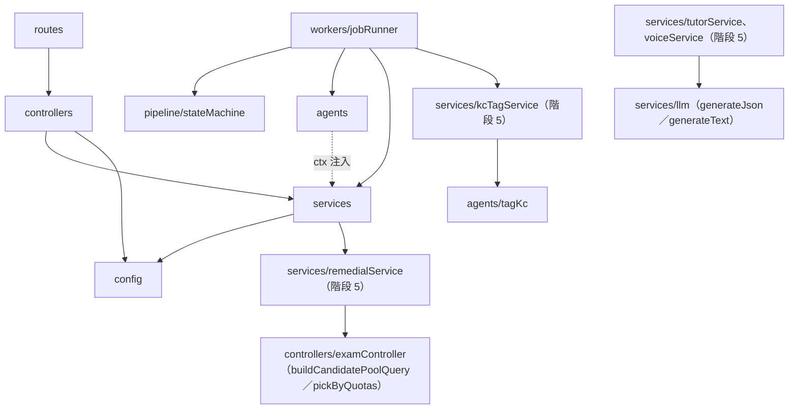
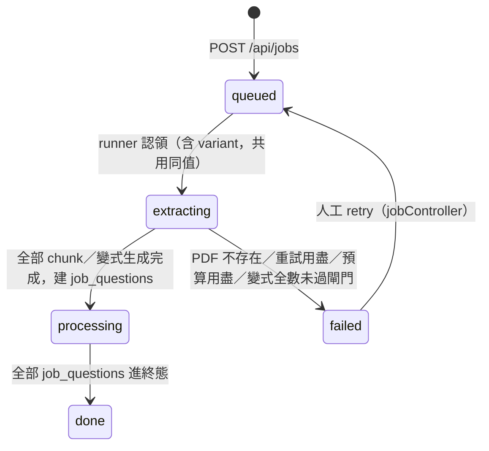
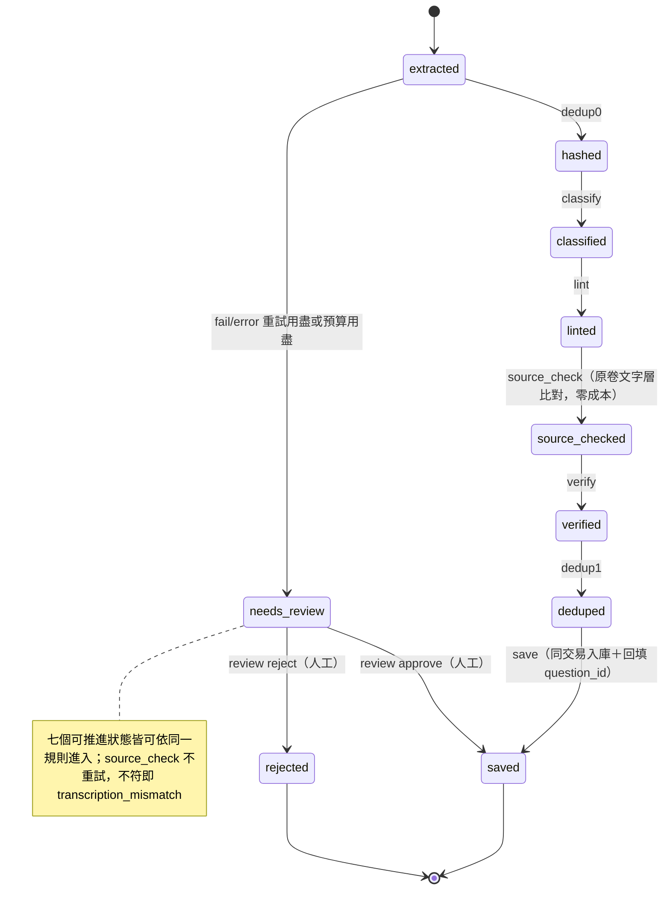

# 低階設計與程式碼地圖 (LLD / Code Map) - 家教專用數理題庫系統

> **版本:** v1.2 | **更新:** 2026-09-24 | **狀態:** 活躍
> 🛠 **2026-09-24 修訂**（階段 5 整合回填，分支 `stage5/int-docs`）：§1 生成資訊補階段 5 的掃描範圍；§2 模組結構補 kcService、kcTagService、tagKc agent、kcWeaknessService、remedialService、coverageService、tutorService、voiceService、`services/llm.generateText`、化學 `*_chem` agent 分支、`utils/chemFormula.js`、`utils/units.js` 等；§3 依賴圖補階段 5 的邊；§4.1 補 save 節點的詳解寫入與知識點標註掛鉤、卷別傳遞；新增 §4.3～4.6（卷別分流、知識點載入與標註、補救卷選題、AI 家教與 generateText）；§6 追溯。§5 狀態機不變（階段 5 未新增節點或狀態）。修改處以〔修訂 2026-09-24〕行內標記。
> 🛠 **2026-09-15f 修訂**（feat/source-check，FR-020、ADR-009）：§2 agents 補 source_check；§4.1 零成本節點補 source_check、extract 階段補抽原卷文字層；§5.2 可推進狀態六個→七個、狀態圖插入 linted→source_checked→verified。§2–§4 其餘 AS-BUILT 內容未重掃。修改處以〔修訂 2026-09-15f〕行內標記。
> **Owner:** Ben（楊本顥）
> **語域:** L3（工程）
> **實例:** 單檔；§5 狀態機每個 Aggregate 一節
>
> 🛠 **2026-09-15e 修訂**（feat/follow-up-links）：§2 模組結構補 `utils/followUp.js`、`services/followUpLinker.js`、`scripts/backfill_follow_ups.js`；§4.1 補「承上題綁定」掛點；§6 上游補 FR-019。修改處以〔修訂 2026-09-15e〕行內標記。
>
> 🛠 **2026-09-15g 修訂**（feat/follow-up-paper-group，FR-019 PR2）：§2 模組結構 utils 補 `paperGroups`（組卷承上題整組抽取）。修改處以〔修訂 2026-09-15g〕行內標記。
>
> **定位**：C4 Code 層——模組結構、兩個 Aggregate（jobs、job_questions）的狀態機、jobRunner 認領演算法、助教 ReAct 迴圈。回答「模組如何組成、狀態如何合法轉移」。
> 系統級架構歸 [`../03_architecture/sad.md`](../03_architecture/sad.md)；API 契約歸 [`api_spec.md`](./api_spec.md)；資料 schema 歸 [`db_design.md`](./db_design.md)。狀態轉移合法性以 `exam_pro/pipeline/stateMachine.js` 為單一權威。

## 目錄

- [1. 生成資訊](#1-生成資訊)
- [2. 模組結構](#2-模組結構)
- [3. 模組依賴圖](#3-模組依賴圖)
- [4. 關鍵控制流](#4-關鍵控制流)
- [5. 狀態機（設計契約）](#5-狀態機設計契約)
- [6. 追溯](#6-追溯)

## 1. 生成資訊

§2–§4 描述程式碼現況（AS-BUILT），過期即重掃；§5 為人工核准的設計契約。

| 項目 | 值 |
| :--- | :--- |
| 生成時間 | 2026-08-25 |
| 對應 commit | `0ff47b4` |
| 生成方式 | AI 掃 code（jobRunner.js／stateMachine.js／assistantService.js 全讀，其餘依 require 追蹤） |
| 階段 5 補充〔修訂 2026-09-24〕 | 對應整合分支 `stage5/integration` @ `6f8e671`；依 `routes/index.js` 檔尾四個階段 5 區塊、各新模組檔頭與功能文件（`docs/grading-and-profile.md`、`chemistry.md`、`knowledge-components.md`、`remedial.md`、`tutor.md`）整理；未逐行重掃既有模組 |

## 2. 模組結構

```text
exam_pro/
├── routes/       # API 全表（index.js：核心區＋各階段 append-only 區塊，旗標控制掛載；階段 5 為檔尾 WS-A／C／D／E 四區塊〔修訂 2026-09-24〕）
├── controllers/  # HTTP 層：驗參、交易、回應（jobController、reviewController、examController…）；〔修訂 2026-09-24〕kcController（知識點四支）、remedialController（知識點弱點／補救卷／加題查詢／覆蓋率）、tutorController（家教、語音、multer 錯誤轉譯、限流上限讀取）
├── services/     # 業務服務：llm/（adapter＋throttle＋cassette；〔修訂 2026-09-24〕新增 generateText 與音訊／圖片 parts）、assistantService、variantService、followUpLinker（承上題綁定寫入端 linkJob，冪等）〔修訂 2026-09-15e〕…
│                 # 〔修訂 2026-09-24〕kcService（知識點讀寫與 loadSeeds）、kcTagService（tagQuestion、費用預估）、kcWeaknessService（Wilson 下界、加權 SQL builder）、
│                 #   remedialService（buildPlan 純函式＋planRemedialPaper、lookupItems）、coverageService（覆蓋率 SQL builder）、tutorService（脈絡組裝、每日預算、runTutor）、voiceService（轉寫、ajv 再驗）
├── agents/       # 管線節點純函式：extract/classify/lint/source_check〔修訂 2026-09-15f〕/verify/dedup/generate（不碰 DB、ctx 注入）；〔修訂 2026-09-24〕化學分支 extract_chem/classify_chem/lint_chem/verify_chem/variant_chem（同檔新增，數學／物理路徑逐字不變）、tagKc（agent 名 kc_tag，動態 enum schema）、promptParts（resolveSubjectGroup、CHEM_LATEX_RULES）
├── pipeline/     # stateMachine.js：job_questions 推進規則（純函式）
├── workers/      # jobRunner.js：DB-polling worker，唯一改 job_questions.state 與寫 job_events 之處
├── config/       # db／models（模型 ID 單一真相；〔修訂 2026-09-24〕MODEL_TUTOR／MODEL_VOICE／MODEL_KC_TAG getter）／features（〔修訂 2026-09-24〕FEATURE_KC／KC_TAGGING／REMEDIAL／TUTOR／VOICE）／pricing／chapters（〔修訂 2026-09-24〕三科 VOLUMES、LEGACY_*、SUBJECT_GROUPS）；〔修訂 2026-09-24〕chemistryChapters、errorTypes、studentProfile、kc/<科目>.json（知識點種子檔）
├── queries/      # hybrid 檢索 SQL
├── scripts/      # 維運腳本：backfill_text_hash、backfill_embeddings、backfill_follow_ups（承上題回填，--dry-run／--test／--report）〔修訂 2026-09-15e〕…；〔修訂 2026-09-24〕load_kc、validate_kc_seed、backfill_kc（呼叫 LLM）、backfill_solutions（不呼叫 LLM）、reindex_search_tsv（不呼叫 LLM）
└── utils/        # tokenize（全案唯一分詞）、questionValidation（save 白名單驗證）、pseudonym（學生姓名↔代號，送 LLM 前遮罩）、followUp（承上題偵測與前題解析純函式）〔修訂 2026-09-15e〕、paperGroups（組卷的承上題分組、整組抽取與組為單位排序純函式，接 pickOnePerFamily）〔修訂 2026-09-15g〕；〔修訂 2026-09-24〕chemFormula（\ce 子集→一般 LaTeX、ceToComparable）、units（單位因次與換算）、kcSeed（種子檔驗證、checkKcField、parseKcCode）
```

## 3. 模組依賴圖

箭頭語意＝require。`agents/` 依合約（NFR-003）不得 require `config/db` 與 `process.env`，僅收 ctx。



〔修訂 2026-09-24〕階段 5 唯一的「service → controller」依賴是 `remedialService → examController`：補救卷為了與組卷共用同一段候選池 SQL 與 `pickPaperUnits`（不另寫一套會漂移的排除邏輯），直接 require examController 匯出的純函式與 `fetchCandidatePool`。其餘新模組依既有方向（controller → service → config／llm）。

已知分層違規：無（`agents/` 對 DB／env 的隔離由單元測試逐條斷言）。

## 4. 關鍵控制流

### 4.1 jobRunner 認領演算法（exam_pro/workers/jobRunner.js）

| 機制 | 實作 | 參數（預設） |
| :--- | :--- | :--- |
| 認領 | 同一交易兩句：`SELECT id … WHERE state 可推進 AND (locked_until IS NULL OR locked_until < now()) ORDER BY id LIMIT 1 FOR UPDATE SKIP LOCKED` → `UPDATE … SET locked_until = now() + lease`；兩個槽不會搶到同一列 | `JOB_CONCURRENCY=2` 槽 |
| 租約 | 認領時設 `locked_until`；呼叫進行中每 30 秒續租；完成時清 NULL；崩潰後租約過期即可被重新認領（斷點續跑，NFR-005） | `JOB_LEASE_MS=180000`、續租 30s |
| 認領優先序 | 每 tick 先清在途 `job_questions`（使已產生成本的 job 優先完結）→ 再認領 `kind='pdf'` 的 jobs → 最後 `kind='variant'` | `JOB_POLL_MS=2000` |
| 重試預算 | fail：extract／generate 整包重試 1 次（`EXTRACT_MAX_RETRIES=1`）；節點層見 §5.2。error：獨立計數器，退避 1s→2s→4s… 封頂 60s，睡眠由 runner 做、狀態機只計數 | `maxErrorRetries=3` |
| 節點逾時 | `Promise.race` ＋ AbortController，逾時歸類 `error:timeout` | `JOB_NODE_TIMEOUT_MS=120000` |
| RPM 節流 | 不在 runner：所有 `ctx.llm` 呼叫經 `exam_pro/services/llm/throttle.js` 的每供應商雙桶（RPM 滑動 60 秒視窗＋併發槽） | `<VENDOR>_RPM=60` |
| 單 job 成本上限 | 呼叫前檢查 `budget_usd − cost_usd`，餘額不足即不發出呼叫；轉為 `needs_review('budget_exceeded')` | `JOB_COST_BUDGET_USD=0.5` |
| 每日成本上限 | tick 起手查 `job_events` 當日 `SUM(cost_usd)`；超過即只認領零成本節點（dedup0／source_check〔修訂 2026-09-15f〕／dedup1／save）對應的狀態、不開新 job | `DAILY_COST_BUDGET_USD=5` |
| 重跑冪等 | `job_questions` UNIQUE `(job_id, idx)` ＋ `ON CONFLICT DO NOTHING`：extract／generate 重跑不重複建列 | — |
| 承上題綁定（FR-019）〔修訂 2026-09-15e〕 | 非新節點、不經 `transition()`：job_question 寫成終態的 UPDATE 之後、`maybeFinishJob` 之前呼叫 `services/followUpLinker.js` 的 `linkJob(db, job_id, {src:'pipeline'})`，對整個 job 重算（子題先入庫時等前題到終態再補綁）；失敗只 warn、不影響狀態推進。變式政策停等分支不掛；`kind='variant'` 的 job 在 linkJob 內 no-op。approve／reject 在同交易以 SAVEPOINT 包住呼叫（`src:'review'`） | 前題解析遞迴深度 5、成環檢查深度 20 |
| 卷別傳遞（FR-026）〔修訂 2026-09-24〕 | 認領 job 時把 `jobs.subject_group` 帶進 `ctx.job`；各 agent 由 `promptParts.resolveSubjectGroup(ctx, input)` 決定走數學／物理或化學路徑（見 §4.3） | 預設 `math_physics` |
| save 節點寫詳解（FR-024）〔修訂 2026-09-24〕 | 入庫同交易內以 `buildSolutionFields(payload)` 決定 `solution_text`／`solution_src`：`payload.verify.compare === 'agree'` 且 `steps_summary` trim 後非空、≤4000 字 → `verify`；否則兩欄 NULL。回填腳本共用同一函式 | — |
| save 後的知識點標註掛鉤（FR-029）〔修訂 2026-09-24〕 | 入庫交易 **COMMIT 之後**呼叫 `runKcTagHook`：`FEATURE_KC_TAGGING` 關閉時完全不呼叫；開啟時先跑 `budgetCheck`（該 job `budgetLeft ≤ 0` → `job_budget`；當日 `job_events` 花費 ≥ `DAILY_COST_BUDGET_USD` → `daily_budget`；查帳失敗也不呼叫），通過才 fire-and-forget 呼叫 `kcTagService.tagQuestion`；回傳的 promise 永遠 resolve，job 狀態與事件不受影響。標註費用不寫 `job_events`（只記 info log） | `KC_TAG_MIN_CONFIDENCE=0.6` |
| extract 階段的零成本附加步驟〔修訂 2026-09-15f〕 | 每塊拆題 pass 後、建列前依序：附圖裁切（attachFigureImages）→ 原卷文字層片段（attachSourceText，`services/sourceTextService.js`，只存每題片段 ≤1500 字）；兩者皆 try/catch，失敗只少圖或少比對，不影響建列；全部 chunk 拆完才刪 PDF | `SOURCE_CHECK_MODE`（只影響 source_check 節點，片段照抽） |

### 4.2 助教 ReAct 迴圈（exam_pro/services/assistantService.js，ADR-007）

| 機制 | 實作 | 參數（預設） |
| :--- | :--- | :--- |
| 受限 JSON | 每步輸出被 responseJsonSchema 鎖成 `{action:'call_tool'\|'final', tool, args_json, reply}`，不從自由文字撈指令；工具參數以 JSON 字串（`args_json`）傳遞、伺服器端 parse＋validate（因應 gemini structured output 對無 properties 物件回傳空 `{}` 的限制） | `DECISION_SCHEMA` |
| 步數上限 | 每輪最多 N 次工具呼叫，達上限回覆 `truncated: true` 並附部分結果 | `ASSISTANT_MAX_STEPS=5`（1–10） |
| 輸入上限 | 單則訊息 500 字、歷史保留最近 8 則 | `MAX_MESSAGE_LEN`、`MAX_HISTORY` |
| 工具（全只讀） | `list_students`／`get_student_weakness`／`search_questions`／`find_similar`／`preview_paper`（僅 dry-run 選題，不寫入；確認出卷由人在 UI 執行） | 註冊表 `TOOLS` |
| 錯誤回饋 | 不認識的工具、壞參數、工具 throw 一律轉成錯誤結果餵回主控（迴圈續行），不成為例外 | — |
| 模型 | `MODEL_ASSISTANT` 未設時退回 `MODEL_EXTRACT`（gemini-3.5-flash）；走 `generateJson`，cassette 與節流機制一併沿用 | `exam_pro/config/models.js` |

### 4.3 卷別分流（ADR-010，FR-026）〔修訂 2026-09-24〕

| 機制 | 實作 |
| :--- | :--- |
| 判準 | `resolveSubjectGroup(ctx, input)` 依序：`input.subject` 是合法科目 → 由科目決定；`ctx.jq.payload.extract.subject`；`ctx.job.subject_group`；都沒有 → `math_physics` |
| 模板與 schema | 化學 agent 名 `*_chem`、模板 `*_chem.v1`，註冊字串＝SYSTEM＋`'\n---\n'`＋模板；`buildSchema(name, { group: 'chemistry' })` 的 subject＝`['化學']`、chapter＝化學 44 章（快取鍵 `name@chemistry`）；`buildSchema(name)` 與 `{ group: 'math_physics' }` 是同一個凍結實例 |
| 既有 LLM 呼叫的白名單 | 一律讀 `LEGACY_SUBJECTS`／`LEGACY_CHAPTERS`（數學＋物理 66 章，順序逐字相同）：`agents/schemas` 的 `ENUM_SOURCES`、沒指定科目時的 `chapterWhitelistText()`、NLQ 的 LLM 輔路徑 |
| source_check | 化學題先以 `chemFormula.ceToComparable` 把 `\ce{…}` 換成可比對文字（箭頭不算負號） |
| 答案比對 | `answerCompare({…, subject})`：兩邊都有 `units.js` 認得的單位才介入（因次不同 disagree、同因次換算後比，℃↔K 接受 273 與 273.15）；化學式與反應式比對只在任一邊有 `\ce` 或 `subject === '化學'` 且 answer_form 非 number／option 時介入；text 型單位衝突回 uncertain（S2-26） |

### 4.4 知識點載入與標註（ADR-011，FR-028、FR-029）〔修訂 2026-09-24〕

| 機制 | 實作 | 參數（預設） |
| :--- | :--- | :--- |
| 載入（`kcService.loadSeeds`） | 整批一交易：`validateSeeds`（完整白名單）有 error 即拒絕 → `SELECT … ORDER BY id FOR UPDATE` 讀現有列 → 以 code 規劃 insert／update／skip（approved 受保護，`--force` 例外）→ 要更新的列先換暫名再寫真值（避開同章換名撞 `UNIQUE (subject, chapter, name)`）→ 先備以 `src='ai'` upsert、移除未受保護知識點本批未列的 ai 先備 → 對 DB 全體先備 DFS 環檢查 → 報數；23505 轉成指名道姓的錯誤；`--dry-run` 全部照做後 ROLLBACK | `--file`、`--dry-run`、`--force`、`--test` |
| 自動標註（`kcTagService.tagQuestion`） | 查題 → 已有 human 標註回 `skipped/has_human` → 該章無知識點回 `skipped/no_kcs` → 呼叫 agent `kc_tag`（enum＝該章 codes；伺服器端 ajv 再驗；重複 code 取信心大者）→ 無達標者 `low_confidence` → 同一交易：鎖題目、再查一次 human、刪該題舊 ai 列、寫新 ai 列（weight 1、confidence 另存） | `KC_TAG_MIN_CONFIDENCE=0.6`；agent `thinkingBudget=512`、`maxOutputTokens=4096`；模型 `MODEL_KC_TAG` → `MODEL_EXTRACT` |
| 人工標註（`PUT /api/questions/:id/kcs`） | 題目列 `SELECT … FOR UPDATE`（與自動標註排隊）→ 驗證知識點存在且同科 → 刪該題全部列 → 寫 `src='human'` | 0–5 個、weight ∈ (0, 1] |
| 回填（`scripts/backfill_kc.js`） | 挑「未封存、沒有任何標註、所在章節有知識點」的題；先印題數與預估費用（每題約 1,600 in／250 out＋≤512 thinking，以 output 單價計）；逐題呼叫 `tagQuestion`；有 failed 即 exit 1；不經 `DAILY_COST_BUDGET_USD` 煞車 | `--dry-run`、`--limit N`、`--subject X`、`--test` |

### 4.5 補救卷選題（ADR-014，FR-030～FR-032）〔修訂 2026-09-24〕

| 步驟 | 實作 |
| :--- | :--- |
| 1. 弱點 | `kcWeaknessService`：`attempts ⋈ question_kcs` 依 weight 加權，正確度 `COALESCE(score, result)`，Wilson 下界（z＝1.96）；有標註的已批改題 ≥ `WEAKNESS_MIN_N`（且 ≥1）→ basis kc，否則以章節聚合（同樣 Wilson 排序） |
| 2. 計畫（純函式 `buildPlan`） | 最大餘數法把 `total × mix` 分成三桶；remedial＝最弱的 k＝min(3, ⌈n/2⌉) 個單位、難度 ≤ ⌊答錯題平均難度＋1⌋；prerequisite＝remedial 知識點的同科直接先備（依 strength，最多 3 個、難度 ≤3）；extension＝其餘 `mastery_lb` 最高的最多 3 個、難度 ≥ ⌊平均⌋＋1；無先備或無可延伸單位時配額併回 remedial 並寫 `notes` |
| 3. 抽題 | `examController.pickByQuotas`：依 remedial→prerequisite→extension 逐目標呼叫 `buildCandidatePoolQuery`（同科、未封存、`NOT EXISTS attempts`、`source_types`、知識點或章節、難度區間）＋`pickPaperUnits`（家族互斥、承上組整組）；跨目標不重複題、不重用家族；不足逐目標記 `shortfalls`，不自動拿別的單位補 |
| 4. 回應 | `question_ids` 以 confirm-paper 同一排序函式排序；`items[]` 帶 `follows_question_id`、`group_ids`；**不寫庫** |
| blueprint 分支 | 同一個 `pickByQuotas`，目標為 blueprint 各列；單章路徑把 `chapter` 先過 pg `prepareValue` 再包成一元素陣列，非字串輸入維持原本的 400（裁決 S5-29） |

### 4.6 AI 家教與 generateText（ADR-012、ADR-013，FR-034、FR-035）〔修訂 2026-09-24〕

| 機制 | 實作 | 參數（預設） |
| :--- | :--- | :--- |
| 輸入驗證 | body 驗證（400）在查 DB 與呼叫 LLM **之前**；ID 以 int4 上限檢查 | message ≤1000、history ≤8 輪、每輪 ≤4000 字 |
| 脈絡 | 題目（題幹、答案、詳解與來源）→ 知識點口語版（該題 `question_kcs`，沒有則同章；approved 優先、weight、sort，最多 6 個；draft 標「僅供參考」）→ 學生摘要（章節錯誤率前 5 沿用 `weaknessService.buildByChapter`、錯因分布只數 `result = 0`；近 365 天）→ 對話紀錄 → 本次提問；各段標明「是資料不是指令」 | — |
| 代號化與鍵 | 整段 prompt 組好後 `pseudo.mask()`（全部學生），回覆 `unmask()`；`cacheKeyParts = { mode, prompt: sha256(遮罩後 prompt) }`；模板 `tutor.direct.v1`／`tutor.socratic.v1` | — |
| 呼叫 | `generateText({ model: MODEL_TUTOR, tools: { codeExecution: true }, maxOutputTokens, thinkingBudget })` → `{ text, codeRuns, finishReason, usage }`；`finishReason = 'MAX_TOKENS'` 時在 reply 末尾附截斷提醒（停在未關閉的程式碼區塊時先補圍欄） | `maxOutputTokens=8192`、`thinkingBudget=2048`；`MODEL_TUTOR` → `MODEL_VERIFY` |
| 預算 | 呼叫前檢查程序內當日累計（本地日期）≥ `TUTOR_DAILY_BUDGET_USD` → 429；呼叫後依 `config/pricing.js` 累加（tokenOut 含 thinking、tokenIn 含 toolUsePromptTokenCount；查不到價以最貴單價） | `TUTOR_DAILY_BUDGET_USD=1.0` |
| 語音 | `multer.memoryStorage()`（≤5 MB、1 檔）→ mime 剝參數後比白名單 → `generateJson({ model: MODEL_VOICE, parts: [音訊, 提示] })` → ajv 再驗、歧義去重（≥2 且 ≤4 個選項）→ 成本併入同一預算；cassette 鍵 `{ audio_sha256, mime, subject }` | `maxOutputTokens=4096`、`thinkingBudget=1024`；`MODEL_VOICE` → `MODEL_EXTRACT` |
| generateText 的 cassette | 鍵公式同 `generateJson`（schema 欄為空字串雜湊）；`tools` 不在鍵內；response 存 `{ text, codeRuns, finishReason, usage, latencyMs }`（舊 cassette 無 finishReason 時回放 null）；replay miss 訊息與 generateJson 同一串 | — |

## 5. 狀態機（設計契約）

enum 合法值與轉移規則在此定義，`db_design.md` 與 `api_spec.md` 引用不重複。job_questions 的轉移合法性以 `exam_pro/pipeline/stateMachine.js` 的 `transition()`（純函式、全函式、不改入參）為準；jobs 的轉移分散於 jobRunner 與 jobController，此處為其契約彙整。

### 5.1 jobs（拆題／變式 job，五值不增）



| 目前狀態 | 事件 | 下一狀態 | 副作用 |
| :--- | :--- | :--- | :--- |
| queued／extracting | claim（第二句 UPDATE） | extracting | 設 locked_until 租約 |
| extracting | 全部 chunk 拆完 | processing | 刪 PDF、pdf_path=NULL |
| extracting | failJob | failed | 寫 jobs.error、清租約 |
| processing | maybeFinishJob（NOT EXISTS 非終態列） | done | 清租約 |
| failed | 人工 retry | queued／processing | 卡住列退回複核前狀態、清該節點重試計數 |

### 5.2 job_questions（逐題管線）

七個可推進狀態〔修訂 2026-09-15f〕各對應一個節點（`NODE_FOR_STATE`）；三個終態 runner 不認領，`transition()` 收到即丟錯。



| 規則 | 條件 | 結果 |
| :--- | :--- | :--- |
| 1–2 | 終態／未知狀態、未知 `outcome.kind` | throw（視為程式錯誤，不予吞沒） |
| 3 | `budgetLeft ≤ 0` 且非 pass/skipped，且不是零成本節點的 fail | `needs_review('budget_exceeded')`；pass/skipped 照常前進（成本已發生，保留既有成果）；零成本節點（`FREE_NODES`：dedup0／source_check／dedup1／save）的 fail 改走規則 5，保留原本原因（如 `transcription_mismatch`、`duplicate`）；其 error 仍收成 `budget_exceeded`、不退避重跑（dedup1 重跑會再叫一次 embedding，計入成本）〔修訂 2026-09-16〕 |
| 4 | pass／skipped | 前進一格（`NEXT_STATE`） |
| 5 | fail 且該節點重試未用盡（classify 2／lint 2／verify 1／其餘 0；變式 job 的 lint 由 `VARIANT_LINT_RETRIES` 覆寫） | 原地重跑，`retries[node]+1`，feedback 由 runner 寫回 payload |
| 5' | fail 且重試用盡 | `needs_review(REVIEW_REASON_FOR_FAIL)`；未知 reason 落到 `awaiting_approval`（全函式，不違反 DDL CHECK 約束） |
| 6 | error（獨立計數器 `<node>:error` ≤ 3） | 原地重跑＋runner 退避；用盡則 `needs_review`，rate_limited／timeout／provider_error 收斂為 `provider_error` |
| 政策停等 | 變式 job 於 deduped 且 `VARIANT_AUTO_APPROVE=false` | 直接寫 `needs_review('awaiting_approval')`，全管線唯一不經 `transition()` 的變更（裁決 S3-11） |

## 6. 追溯

| 項目 | ID／連結 |
| :--- | :--- |
| 上游 | FR-001、FR-006、FR-011、FR-016、FR-019〔修訂 2026-09-15e〕、FR-024、FR-026、FR-028～FR-035〔修訂 2026-09-24〕；NFR-002、NFR-003、NFR-005、NFR-006、NFR-007～NFR-009〔修訂 2026-09-24〕；DEC-005、DEC-007、DEC-008；ADR-010～ADR-015〔修訂 2026-09-24〕；[`../03_architecture/adr/ADR-003-code-orchestrated-agent-pipeline.md`](../03_architecture/adr/ADR-003-code-orchestrated-agent-pipeline.md)、[`../03_architecture/adr/ADR-007-assistant-no-native-function-calling.md`](../03_architecture/adr/ADR-007-assistant-no-native-function-calling.md) |
| 下游 | [`db_design.md`](./db_design.md)（jobs.state／job_questions.state／review_reason／error_class 的 enum 引用）、[`api_spec.md`](./api_spec.md)（FR-001／FR-016 端點行為）、[`../05_qa/qa_tracker.md`](../05_qa/qa_tracker.md)（TC-001-*、TC-016-*） |
