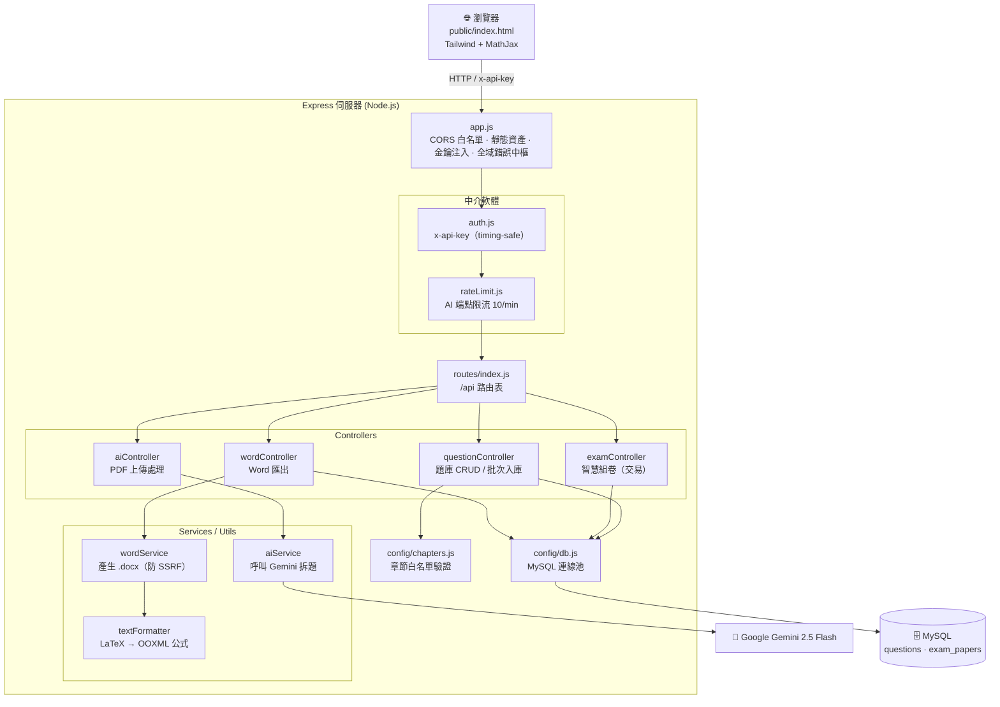

# 家教專用數學物理題庫系統（企業級重構版）

以 **Node.js + Express + MySQL + Google Gemini** 打造的家教題庫與智慧組卷後端。
支援上傳考卷 PDF 由 AI 自動拆題入庫、依學生作答歷史智慧組卷、並匯出含數學公式排版的 Word 考卷。

---

## ✨ 功能特色

| 功能 | 說明 |
|------|------|
| 📄 **PDF 智慧解題** | 上傳考卷 PDF，Gemini 2.5 Flash 自動拆解題目、判斷學科／章節／難度，並將公式轉為 LaTeX |
| ✍️ **題庫管理** | 題目新增／編輯／刪除／搜尋／分頁，後端以「章節白名單」嚴格驗證 |
| 🧠 **智慧組卷** | 依「學生 × 章節」抽題，自動記錄作答歷史，避免重複出題（交易確保一致性）|
| 📥 **匯出 Word** | 依題型與難度排序，產生 `.docx` 考卷，內建 LaTeX → Word 數學公式轉換 |
| 🌱 **一鍵種子題庫** | `seed_questions.js` 內建 30 題自製示範題，空題庫也能立即跑完整流程 |
| 🔒 **安全設計** | 參數化 SQL、CORS 白名單、圖片下載防 SSRF、可選 API Key 認證（timing-safe；能力邊界見[安全注意事項](#-安全注意事項)）|

---

## 🗂 專案結構

```
exam_pro/
├─ server.js              # 進入點：啟動 HTTP server
├─ app.js                 # Express 設定：CORS、靜態檔、金鑰注入、全域錯誤中樞
├─ config/
│   ├─ db.js              # MySQL 連線池
│   └─ chapters.js        # 數學/物理精細章節白名單 + 驗證函式
├─ middleware/
│   ├─ auth.js            # 可選的 x-api-key 認證（timingSafeEqual）
│   └─ rateLimit.js       # 記憶體型速率限制器（保護 AI 端點）
├─ routes/index.js        # API 路由表
├─ public/
│   └─ index.html         # 前端單頁介面（唯一對外靜態資產）
├─ controllers/           # 請求處理：question / exam / ai / word
├─ services/
│   ├─ aiService.js       # 呼叫 Gemini 解析 PDF
│   └─ wordService.js     # 產生 Word 考卷（含防 SSRF 圖片下載）
├─ utils/textFormatter.js # LaTeX → OOXML 數學公式解析器
├─ schema.sql             # 資料表定義（questions / exam_papers）
├─ seed_questions.js      # 種子題庫：30 題自製示範題
├─ test/                  # 單元測試（node:test，無額外相依）
└─ *.bat / *_formulas.js  # 題庫維運工具（見下方）
```

---

## 🏗 系統架構



**兩條主要資料流**

1. **AI 拆題入庫**：瀏覽器上傳 PDF → `aiController` → `aiService` 呼叫 Gemini 回傳 JSON → `questionController.batchSaveQuestions` 經**章節白名單**驗證後寫入 `questions`。
2. **智慧組卷 + 匯出**：`examController` 依「學生 × 章節」濾掉寫過的題、抽題並以**交易**記錄作答歷史 → `wordController` / `wordService` 用 `textFormatter` 把 LaTeX 轉成 Word 數學公式，輸出 `.docx`。

---

## 🚀 安裝與啟動

### 1. 前置需求
- Node.js 18+
- MySQL 8.0.16+（`CHECK` 約束與 JSON 函式需要）
- 一組 [Google Gemini API 金鑰](https://aistudio.google.com/apikey)

### 2. 安裝相依套件
```bash
cd exam_pro
npm install
```

### 3. 設定環境變數
複製範本並填入實際值：
```bash
cp .env.example .env
```
| 變數 | 說明 | 預設 |
|------|------|------|
| `PORT` | 服務埠 | `3000` |
| `GEMINI_API_KEY` | Google Gemini 金鑰（**必填**）| — |
| `DB_HOST` / `DB_USER` / `DB_PASSWORD` / `DB_NAME` | MySQL 連線 | localhost / root / — / tutor_exam_bank |
| `API_KEY` | 後端存取金鑰；留空則**停用**認證。⚠️ 此金鑰會被注入前端頁面，僅適用本機自用，**不可作為對外部署的存取控制**（見[安全注意事項](#-安全注意事項)）| 空 |
| `ALLOWED_ORIGINS` | 允許的前端來源（逗號分隔）| `http://localhost:3000` |
| `IMAGE_HOST_ALLOWLIST` | Word 匯圖時允許的圖片網域（逗號分隔，選填）| 空 |
| `NODE_ENV` | `production` 時錯誤不外洩細節 | `development` |

### 4. 建立資料庫
```bash
mysql -u root -p < schema.sql
```

### 5. 啟動
```bash
npm start      # 正式
npm run dev    # 開發（nodemon 熱重載）
```
啟動後開啟 <http://localhost:3000>。

---

## 🧪 測試

```bash
npm test        # 29 個測試，使用 Node 18+ 內建的 node:test，無額外相依套件
```

測試集中在 **`utils/textFormatter.js`**（LaTeX → Word OOXML 解析器）——它是本專案唯一手寫的解析器，且有兩個特性讓它最需要防線：

1. **輸入不可控**：題目文字來自 Gemini 的自由輸出，未知指令、不成對的 `$`、中英數混排都可能出現。
2. **會靜默失敗**：解析失敗時走 `try/catch` 降級成純文字而**不丟例外**，症狀只會在 Word 開起來時顯現為公式跑位。沒有測試就完全看不見退化。

涵蓋的契約：

| 分類 | 驗證內容 |
|---|---|
| 結構對應 | `\frac`→`m:f`、`x^2`→`m:sSup`、`\sqrt`→`m:rad`、`\sum`/`\int`→`m:nary`、`\lim`→`m:limLow`、巢狀分數 |
| 符號轉換 | 希臘字母、運算關係符號、函數名不被拆成單一變數、`\vec` 重音 |
| 中英混排 | 中文留在 `w:r`、公式進 `m:oMath`，**中文不得被吞進公式**（否則 Word 會用數學斜體排中文）|
| 健壯性 | 未知指令降級、不成對 `$`、未閉合 `{`、空參數、emoji 與控制字元清除、真實題目格式 |

---

## 🔌 API 一覽

所有路由掛在 `/api` 之下；若設定了 `API_KEY`，需帶 `x-api-key` 標頭。

| 方法 | 路徑 | 說明 |
|------|------|------|
| GET | `/api/questions` | 題庫列表（支援 `subject/chapter/question_type/q/page/limit` 篩選分頁）|
| POST | `/api/questions` | 新增單題 |
| PUT | `/api/questions/:id` | 更新題目 |
| DELETE | `/api/questions/:id` | 刪除題目 |
| POST | `/api/batch-save-questions` | 批次入庫（AI 解析結果）|
| GET | `/api/chapters` | 題庫中實際存在的章節 |
| GET | `/api/chapter-whitelist` | 完整章節白名單（前端下拉選單）|
| POST | `/api/generate-paper` | 智慧組卷（`student_name/subject/chapter/count`）|
| POST | `/api/analyze-pdf` | 上傳 PDF（`multipart/form-data`, 欄位 `pdf`）解析題目 |
| POST | `/api/download-word` | 依 `question_ids` 產生 Word 考卷 |

---

## 🛠 題庫維運工具（Windows `.bat`）

雙擊即可執行，修正類工具含「先預覽、再套用」雙段流程並自動備份：

| 批次檔 | 作用 |
|--------|------|
| `執行公式健檢.bat` | 掃描題庫公式問題 → 產生 `公式健檢報告.html` |
| `預覽公式修正.bat` / `套用公式修正.bat` | 公式自動修正（套用前備份為 `formulas_backup_*.json`）|
| `建立索引與檢視表.bat` | 建立資料庫索引與檢視表 |

灌入示範題（題庫為空時）：

```bash
node seed_questions.js          # 預覽：只列清單，不寫入
node seed_questions.js --apply  # 實際寫入（交易保護；同題幹已存在則跳過）
```

> ⚠️ `*_backup_*.json` 與 `公式*.html` 產物內含題庫資料，已在 `.gitignore` 排除，請勿外流。

---

## 🔐 安全注意事項

- **`.env` 內含真實金鑰，切勿進版控或分享**（已由 `.gitignore` 排除）。若金鑰曾外流，請至 Google AI Studio **重新產生**。
- 對外部署時務必設定 `ALLOWED_ORIGINS`，並將 `NODE_ENV=production`。
- 資料庫帳號建議改用最小權限帳號，勿用 root。
- 匯入的題目著作權屬原著作權人，請確認已取得合法權源，詳見專案根目錄 [`NOTICE`](../NOTICE)。

### ⚠️ `API_KEY` 的能力邊界（請務必理解）

為了讓同源前端能自動帶上 `x-api-key`，`app.js` 會在回應首頁時把金鑰**直接注入 HTML**：

```js
// app.js — serveIndex()
const key = process.env.API_KEY || '';
res.type('html').send(html.replace('__API_KEY__', key));
```

這代表**任何能開啟 `/` 的人，都會直接取得 `API_KEY`**。

因此 `API_KEY` 只擋得住「未載入首頁就直接打 API」的存取，**不等同真正的存取控制**。
在「單人、本機、`localhost` 自用」的前提下這是合理的取捨；但若要**對外公開部署**，必須改用下列任一方式，不可依賴 `API_KEY`：

- 置於反向代理之後，由代理層負責驗證（Basic Auth / OAuth / IP 白名單）
- 導入真正的使用者登入與 session／JWT 機制
- 或至少改為「金鑰不注入前端、由使用者手動輸入並存於 `sessionStorage`」
